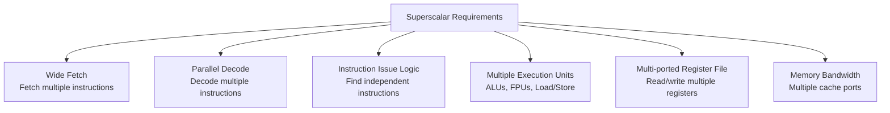

# Superscalar Architecture

## Overview

A **superscalar** processor can issue and execute **multiple instructions per clock cycle** by having multiple copies of execution units (ALUs, load/store units, etc.). While a scalar pipeline achieves CPI=1, a superscalar processor aims for CPI < 1 (or equivalently, IPC > 1). This is the primary method modern CPUs use to achieve high performance.

## Detailed Explanation

### Scalar vs Superscalar


```
Scalar pipeline:
  CC1   CC2   CC3   CC4   CC5   CC6
  I1:   IF    ID    EX    MEM   WB
  I2:         IF    ID    EX    MEM   WB
  Throughput: 1 instruction/cycle

2-wide superscalar:
  CC1   CC2   CC3   CC4   CC5   CC6
  I1:   IF    ID    EX    MEM   WB
  I2:   IF    ID    EX    MEM   WB
  I3:         IF    ID    EX    MEM   WB
  I4:         IF    ID    EX    MEM   WB
  Throughput: 2 instructions/cycle (ideal)
```

### Requirements for Superscalar



### Issue Width vs Pipeline Depth

```
Pipeline depth (stages): Affects latency and branch penalty
Issue width (instructions/cycle): Affects throughput

Modern CPUs balance both:
  Intel Skylake:    4-wide issue, ~14-19 stages
  AMD Zen 4:        4-wide issue, ~19-22 stages
  Apple M2:         8-wide issue, ~13 stages
  ARM Cortex-X3:    6-wide issue, ~11+ stages
```

### Instruction-Level Parallelism (ILP)

Superscalar execution is limited by available parallelism:

```
Sequential code (no ILP):
  ADD R1, R2, R3
  SUB R4, R1, R5    ← depends on R1
  AND R6, R4, R7    ← depends on R4
  Only 1 instruction can execute per cycle (ILP = 1)

Parallel code (high ILP):
  ADD R1, R2, R3
  SUB R4, R5, R6    ← independent
  AND R7, R8, R9    ← independent
  OR  R10, R11, R12 ← independent
  All 4 can execute simultaneously (ILP = 4)
```

**Amdahl's Law applies**: If 50% of code is sequential, a 4-wide CPU can only achieve ~2× speedup, not 4×.

### Superscalar Issue Policies

| Policy | Description | Complexity |
|--------|-------------|------------|
| **In-order issue, in-order complete** | Issue in program order, complete in order | Simplest |
| **In-order issue, out-of-order complete** | Issue in order, but instructions complete as ready | Moderate |
| **Out-of-order issue, out-of-order complete** | Issue instructions as operands ready | Most complex |

### Dependency Checking in Superscalar

When issuing multiple instructions, must check dependencies between them:

```
I1: ADD R1, R2, R3
I2: SUB R4, R1, R5    ← depends on I1 (R1)
I3: AND R6, R7, R8    ← independent
I4: OR  R9, R1, R10   ← depends on I1 (R1)

2-wide superscalar issue:
  Cycle 1: Issue I1 and I3 (both independent)
  Cycle 2: Issue I2 and I4 (I1's result now available via forwarding)

  Without dependency checking: I2 would read stale R1 value!
```

### Register File Design

Superscalar requires a heavily multi-ported register file:

```
4-wide superscalar:
  Each instruction needs 2 reads + 1 write
  4 instructions = 8 read ports + 4 write ports = 12 ports total

  Physical implementation:
    - Large port count → big, slow, power-hungry register file
    - Solution: Register file banking, hierarchical design
    - Modern CPUs use register renaming with physical register files
```

### Superscalar vs Superpipeline

| Aspect | Superscalar | Superpipeline |
|--------|-------------|---------------|
| **Goal** | Multiple instructions per cycle | Higher clock frequency |
| **Method** | Multiple execution units | Deeper pipeline (more stages) |
| **Benefit** | Higher IPC | Higher clock speed |
| **Challenge** | Finding parallelism | Branch penalty, hazards |
| **Modern CPUs** | Both! Superscalar + deep pipeline |

## Examples

### Example 1: 2-Wide Superscalar Execution

```asm
ADD R1, R2, R3      # ALU instruction
SUB R4, R5, R6      # ALU instruction (independent)
MUL R7, R8, R9      # Multiply (may need separate unit)
LOAD R10, [R11]     # Memory instruction
```

```
  CC1   CC2   CC3   CC4   CC5
  ADD:  IF    ID    EX    MEM   WB
  SUB:  IF    ID    EX    MEM   WB    ← issued same cycle!
  MUL:        IF    ID    EX    MEM   WB
  LOAD:       IF    ID    EX    MEM   WB ← issued same cycle as MUL

  If ADD and SUB share an ALU, they can't issue together.
  Need 2 ALUs for 2-wide integer issue.
```

### Example 2: Limited Parallelism

```asm
# Sequential dependency chain
ADD R1, R2, R3      # Cycle 1
SUB R4, R1, R5      # Cycle 2 (depends on R1)
AND R6, R4, R7      # Cycle 3 (depends on R4)
OR  R8, R6, R9      # Cycle 4 (depends on R6)

# Even with 4-wide superscalar, this takes 4 cycles!
# The dependency chain limits ILP to 1.
```

### Example 3: Instruction Scheduling for Superscalar

```asm
# Poorly scheduled (dependencies limit parallelism):
ADD R1, R2, R3
SUB R4, R1, R5      # Depends on ADD
MUL R6, R7, R8
DIV R9, R6, R10     # Depends on MUL

# Well scheduled (maximize parallelism):
ADD R1, R2, R3
MUL R6, R7, R8      # Independent of ADD
SUB R4, R1, R5      # Now ADD has completed (forwarding)
DIV R9, R6, R10     # Now MUL has completed (forwarding)

# 2-wide superscalar:
# Poor: 4 cycles (dependencies)
# Good: 2 cycles (parallel pairs)
```

### Example 4: Modern Superscalar CPUs

```
Intel Skylake (2015):
  - 4-wide decode
  - 4 integer ALUs
  - 2 load units, 1 store unit
  - 2 FP/SIMD units
  - 224-entry ROB (Reorder Buffer)
  - ~14-19 stage pipeline

Apple M2 (2022):
  - 8-wide decode
  - 6 integer ALUs
  - 3 load units, 2 store units
  - 4 FP/SIMD units
  - ~600+ entry ROB
  - ~13 stage pipeline (shorter but wider)

AMD Zen 4 (2022):
  - 4-wide decode
  - 4 integer ALUs
  - 3 load units, 2 store units
  - 2 FP/SIMD units
  - 320-entry ROB
```

## Interview Questions

### Q1: What is a superscalar processor?
**Answer**: A superscalar processor can issue and execute multiple instructions per clock cycle by having multiple execution units (ALUs, load/store units, etc.). It exploits instruction-level parallelism (ILP) to achieve IPC > 1, going beyond the 1 instruction/cycle limit of a scalar pipeline.

### Q2: What limits superscalar performance?
**Answer**: (1) **Limited ILP** — dependencies between instructions reduce available parallelism; (2) **Branch mispredictions** — all speculative work is wasted; (3) **Cache misses** — memory latency stalls execution; (4) **Resource conflicts** — structural hazards when multiple instructions need the same unit; (5) **Dependency checking complexity** — checking N instructions for dependencies is O(N²).

### Q3: What's the difference between superscalar and VLIW?
**Answer**: In superscalar, the hardware dynamically finds parallel instructions at runtime. In VLIW (Very Long Instruction Word), the compiler statically groups parallel instructions at compile time. Superscalar is more flexible but more complex; VLIW shifts complexity to the compiler but can't adapt to runtime conditions.

### Q4: Why don't we just make CPUs 16-wide?
**Answer**: Diminishing returns. Most code has limited ILP (typically 2-4 independent instructions available). Beyond 4-8 wide, the additional hardware (more ALUs, more register ports, more complex dependency checking) doesn't yield proportional performance gains. Power consumption also increases dramatically.

### Q5: How does register renaming support superscalar execution?
**Answer**: Register renaming eliminates false dependencies (WAR, WAW) that would prevent multiple instructions from issuing simultaneously. By mapping architectural registers to a larger set of physical registers, instructions that write to the same architectural register can execute in parallel using different physical registers.

## Common Mistakes

1. **Thinking wider is always better** — Beyond 4-8 wide, performance gains diminish due to limited ILP. Power and complexity costs increase without proportional benefit.
2. **Confusing superscalar with superpipeline** — Superscalar = multiple instructions per cycle (wider). Superpipeline = more pipeline stages (deeper). Modern CPUs are both.
3. **Ignoring the compiler's role** — The compiler's instruction scheduling significantly affects how much ILP a superscalar CPU can extract. Poorly scheduled code wastes the CPU's width.
4. **Forgetting about dependency checking** — Issuing 4 instructions requires checking 6 pairs for dependencies (C(4,2) = 6). This is a significant hardware cost.

## Summary

| Aspect | Detail |
|--------|--------|
| **What** | Execute multiple instructions per cycle |
| **How** | Multiple execution units, wide issue, dependency checking |
| **Limitation** | ILP in code, branch prediction, cache misses |
| **Modern Range** | 4-8 wide decode, 4-8 ALUs |
| **Key Hardware** | Multi-ported register file, multiple ALUs, issue logic |
| **Combined With** | Out-of-order execution, branch prediction, speculation |

## Cross-References

- [Classic Pipeline](./classic.md) — The scalar pipeline that superscalar extends
- [Out-of-Order Execution](./ooo.md) — Complementary technique to superscalar
- [Data Hazards](./data-hazards.md) — Dependencies that limit ILP
- [Structural Hazards](./structural-hazards.md) — Resource conflicts in superscalar
- [Registers](../cpu/registers.md) — Multi-ported register file design
