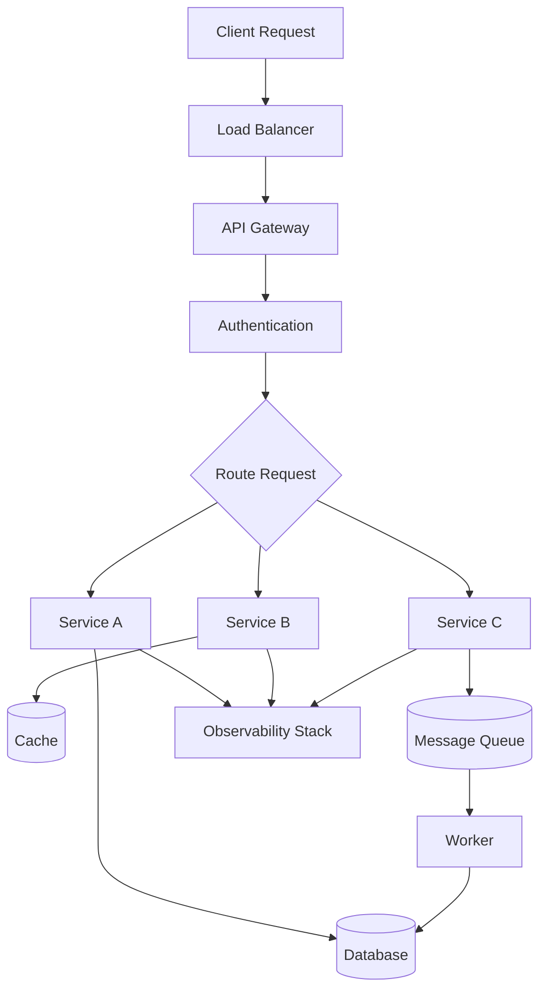
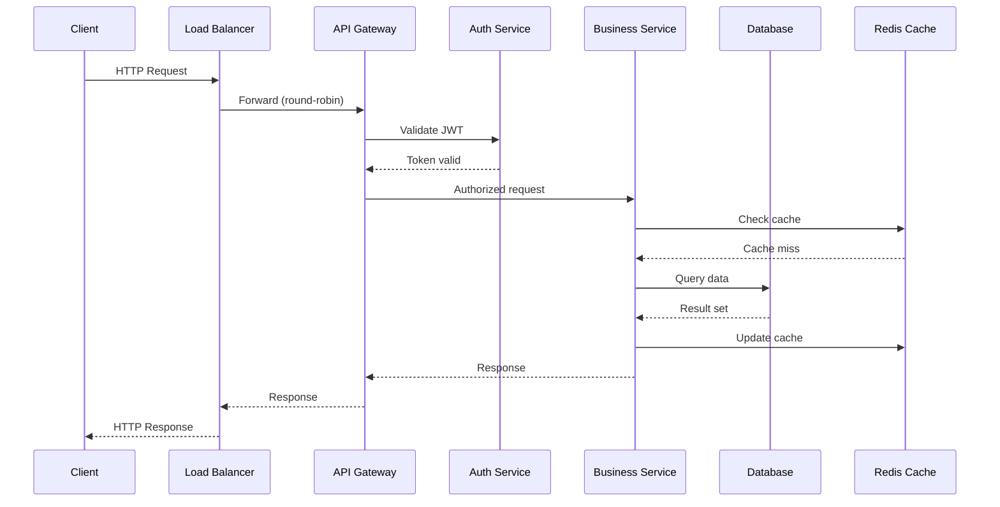
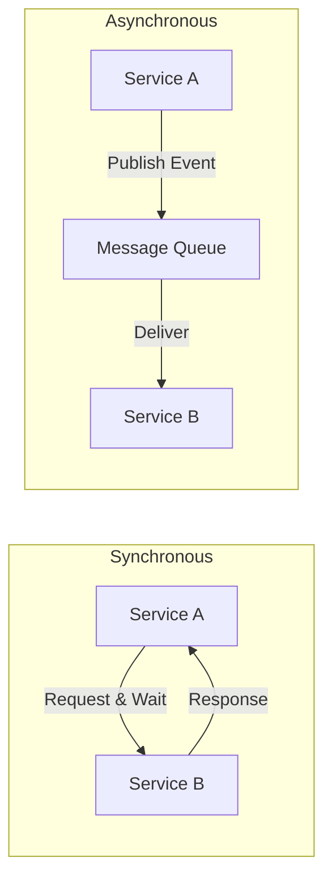

# Backend Engineering

Backend engineering is the backbone of modern software systems. This section covers the essential topics every backend engineer needs to master — from designing APIs and managing data flows to deploying and monitoring production systems.

## Why Backend Engineering?

Every application that serves users at scale needs a robust backend. Backend engineers design systems that:

- Handle millions of concurrent requests
- Ensure data consistency and durability
- Scale horizontally across regions
- Maintain high availability (99.99%+ uptime)
- Secure sensitive data and user privacy

## The Backend Engineer's Mental Model



Every backend request follows a similar path: the request enters through a load balancer, passes through authentication, gets routed to the appropriate service, interacts with data stores, and produces a response. Understanding this flow is the foundation of backend engineering.

## Topics Covered

| Area | Topics |
|------|--------|
| **[API Design](./api/README.md)** | REST, gRPC, GraphQL, API Gateways |
| **[Messaging](./messaging/README.md)** | Kafka, RabbitMQ, Redis, NATS |
| **[Containers](./containers/README.md)** | Docker, Kubernetes, Service Mesh |
| **[Authentication](./auth/README.md)** | OAuth 2.0, JWT, Session Management |
| **[Observability](./observability/README.md)** | Logging, Monitoring, Distributed Tracing |
| **[CI/CD](./cicd/README.md)** | GitHub Actions, GitOps |
| **[Design Patterns](./patterns/README.md)** | Microservices, Event-Driven, Distributed Transactions |

## Core Backend Concepts

### 1. Request-Response Lifecycle



### 2. Horizontal vs Vertical Scaling

| Aspect | Vertical (Scale Up) | Horizontal (Scale Out) |
|--------|---------------------|----------------------|
| **Approach** | Bigger machine | More machines |
| **Limit** | Hardware ceiling | Practically unlimited |
| **Cost** | Exponential | Linear |
| **Complexity** | Simple | Requires distributed design |
| **Fault tolerance** | Single point of failure | Built-in redundancy |
| **Example** | Upgrade to 64-core server | Add 10 behind a load balancer |

### 3. Stateful vs Stateless Services

```
Stateless Service                    Stateful Service
┌─────────────────┐                 ┌─────────────────┐
│ Request → Response│                │ Request → Response│
│ No memory between │                │ Remembers client  │
│ requests          │                │ state between     │
│ Easy to scale     │                │ requests          │
└─────────────────┘                 │ Harder to scale   │
                                    └─────────────────┘

Examples:                            Examples:
- REST APIs                          - WebSocket servers
- Lambda functions                   - Database connections
- Static content servers             - Game servers
```

**Best practice**: Make services stateless wherever possible. Store state in external stores (databases, caches, session stores) so any instance can handle any request.

### 4. Synchronous vs Asynchronous Communication



| Aspect | Synchronous | Asynchronous |
|--------|-------------|--------------|
| **Coupling** | Tight | Loose |
| **Latency** | Caller blocks | Fire-and-forget |
| **Error handling** | Immediate | Retry / DLQ |
| **Use case** | Real-time queries | Event processing |
| **Scaling** | Limited by slowest | Independent scaling |

### 5. The Twelve-Factor App

The [12-Factor App](https://12factor.net/) methodology defines best practices for building modern, scalable backend services:

| Factor | Principle | Implementation |
|--------|-----------|----------------|
| I. Codebase | One codebase in version control | Git repo per service |
| II. Dependencies | Explicitly declare dependencies | `package.json`, `go.mod`, `requirements.txt` |
| III. Config | Store config in environment | `ENV` variables, not config files |
| IV. Backing services | Treat as attached resources | Connection strings via config |
| V. Build, release, run | Strictly separate stages | CI/CD pipelines |
| VI. Processes | Stateless, share-nothing | No in-memory sessions |
| VII. Port binding | Self-contained | Service exports HTTP on its own port |
| VIII. Concurrency | Scale via process model | Multiple workers / replicas |
| IX. Disposability | Fast startup, graceful shutdown | Handle `SIGTERM` |
| X. Dev/prod parity | Keep environments similar | Docker for consistency |
| XI. Logs | Treat as event streams | Write to stdout, aggregate externally |
| XII. Admin tasks | Run as one-off processes | Migrations, scripts |

## How to Use This Section

Each topic includes:

- **Overview** — What it is and why it matters
- **Core Concepts** — Detailed technical explanations
- **Architecture Diagrams** — Visual representations using Mermaid
- **Code Examples** — Real-world configurations and snippets
- **Interview Questions** — Minimum 10 per topic with answers
- **Best Practices** — Production-ready guidance
- **Common Mistakes** — Pitfalls to avoid

## Interview Questions

### Fundamentals

1. **Q: What's the difference between a monolith and microservices?**
   A: A monolith is a single deployable unit containing all business logic. Microservices split functionality into independently deployable services communicating over a network. Monoliths are simpler to develop and deploy initially; microservices offer independent scaling, technology diversity, and team autonomy, but add operational complexity.

2. **Q: How would you design a URL shortener's backend?**
   A: API Gateway → URL Service → Database (key-value store). Use base62 encoding of an auto-increment ID or hash. Cache popular URLs in Redis. Use 301 redirects. Handle collisions with retry logic. Scale horizontally with consistent hashing for shard routing.

3. **Q: What is an API Gateway and why use one?**
   A: An API Gateway is a single entry point for all client requests. It handles routing, authentication, rate limiting, request/response transformation, and load balancing. Benefits: centralized cross-cutting concerns, simplified client integration, protocol translation (REST → gRPC internally).

4. **Q: Explain the CAP theorem and its practical implications.**
   A: In a distributed system, you can only guarantee two of three: Consistency (all nodes see the same data), Availability (every request gets a response), and Partition Tolerance (system works despite network failures). Since partitions are unavoidable, the real choice is between CP (consistent but may reject requests) and AP (available but may serve stale data).

5. **Q: What is idempotency and why is it important?**
   A: An operation is idempotent if performing it multiple times has the same effect as performing it once. Critical for distributed systems where retries are common. GET and PUT are naturally idempotent; POST is not. Use idempotency keys to make POST requests safe for retries.

6. **Q: How do you handle database migrations in production?**
   A: Use backward-compatible migrations: (1) Add new column (nullable or with default), (2) Deploy code that writes to both old and new columns, (3) Backfill existing data, (4) Switch reads to new column, (5) Remove old column. Tools: Flyway, Alembic, golang-migrate.

7. **Q: What's the difference between authentication and authorization?**
   A: Authentication verifies *who* the user is (identity). Authorization determines *what* they can do (permissions). AuthN = login with credentials; AuthZ = checking if the user has access to a specific resource. OAuth 2.0 handles authorization; OpenID Connect adds authentication.

8. **Q: How would you implement rate limiting?**
   A: Common algorithms: (1) Token bucket — tokens added at fixed rate, each request consumes a token. (2) Sliding window — count requests in a rolling time window. (3) Fixed window — count per time slot (simpler but has burst edge cases). Use Redis for distributed rate limiting with atomic operations.

9. **Q: What is circuit breaking and when would you use it?**
   A: Circuit breaker prevents cascading failures by stopping calls to a failing service. States: Closed (normal), Open (failing, fast-fail), Half-Open (testing recovery). If error rate exceeds threshold, circuit opens. After a timeout, allow a test request. Libraries: Hystrix (Java), resilience4j, Polly (.NET).

10. **Q: Explain eventual consistency with a real-world example.**
    A: Eventual consistency guarantees that, given no new updates, all replicas will eventually converge to the same value. Example: DNS propagation — when you update a DNS record, some users see the new IP immediately while others see the old one for up to TTL hours. All users eventually see the new record.

## Best Practices Checklist

- [ ] Design APIs before implementation (contract-first)
- [ ] Use structured logging with correlation IDs
- [ ] Implement health checks and readiness probes
- [ ] Set up proper monitoring and alerting
- [ ] Use connection pooling for database connections
- [ ] Implement graceful shutdown handling
- [ ] Version your APIs from day one
- [ ] Use environment-specific configuration
- [ ] Write integration tests alongside unit tests
- [ ] Document error codes and API contracts

## References

- [Designing Data-Intensive Applications](https://dataintensive.net/) — Martin Kleppmann
- [System Design Interview](https://www.amazon.com/System-Design-Interview-insiders-Second/dp/B08CMF2CQF) — Alex Xu
- [12-Factor App](https://12factor.net/) — Heroku methodology
- [Backend Engineering Handbook](https://www.enjoyalgorithms.com/) — EnjoyAlgorithms
- [High Scalability](http://highscalability.com/) — Real-world architecture case studies
