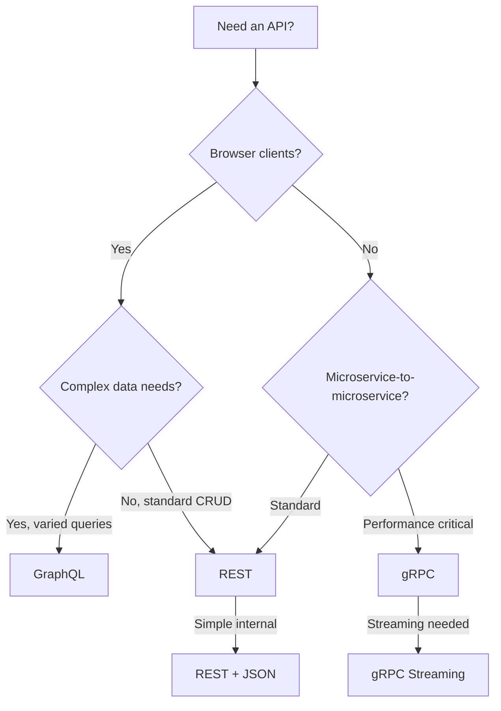
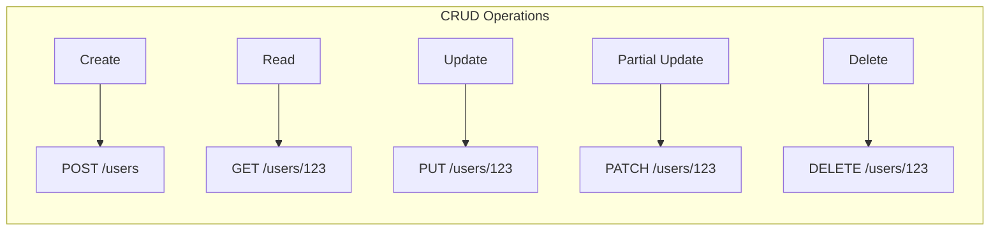
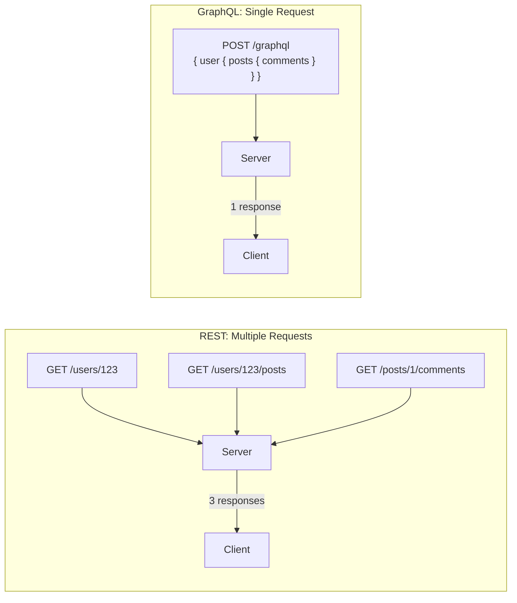
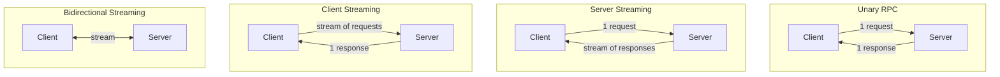
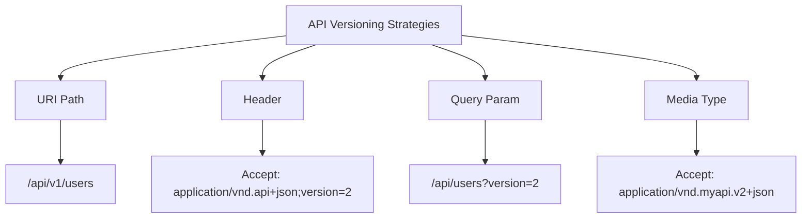
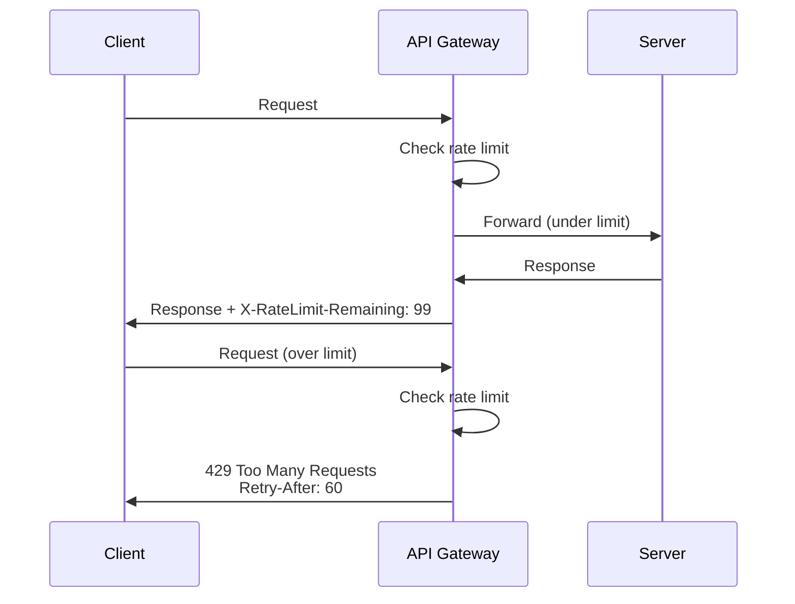

# API Design

APIs (Application Programming Interfaces) are contracts between services. Good API design is critical for system scalability, developer experience, and long-term maintainability. This section covers the major API paradigms and how to choose between them.

## In This Section

- [REST](./rest.md) — Representational State Transfer principles and best practices
- [gRPC](./grpc.md) — High-performance RPC with Protocol Buffers
- [GraphQL](./graphql.md) — Flexible query language for APIs
- [API Gateway](./api-gateway.md) — Centralized entry point for microservices

## Choosing an API Style



## REST (Representational State Transfer)

REST is an architectural style for designing networked applications, based on resources identified by URIs and manipulated using standard HTTP methods.

### REST Principles

| Principle | Description | Example |
|-----------|-------------|---------|
| **Resource-Based** | Everything is a resource with a URI | `/users/123`, `/orders/456` |
| **Stateless** | Each request contains all needed info | Auth token in every request |
| **Uniform Interface** | Standard HTTP methods | GET, POST, PUT, DELETE |
| **Cacheable** | Responses declare cacheability | `Cache-Control: max-age=3600` |
| **Client-Server** | Separation of concerns | Frontend and backend independent |
| **Layered System** | Intermediaries (load balancers, proxies) | Client doesn't know server count |

### HTTP Methods



| Method | Idempotent? | Safe? | Purpose | Example |
|--------|-------------|-------|---------|---------|
| **GET** | Yes | Yes | Read resource | `GET /api/users/123` |
| **POST** | No | No | Create resource | `POST /api/users` |
| **PUT** | Yes | No | Replace resource | `PUT /api/users/123` |
| **PATCH** | No* | No | Partial update | `PATCH /api/users/123` |
| **DELETE** | Yes | No | Delete resource | `DELETE /api/users/123` |

*PATCH can be designed to be idempotent.

### REST Response Status Codes

```
2xx Success
  200 OK                  — Successful GET, PUT, PATCH
  201 Created             — Successful POST (include Location header)
  204 No Content          — Successful DELETE

3xx Redirection
  301 Moved Permanently   — Resource moved
  304 Not Modified        — Cache still valid

4xx Client Error
  400 Bad Request         — Invalid input
  401 Unauthorized        — Missing/invalid auth
  403 Forbidden           — Authenticated but not authorized
  404 Not Found           — Resource doesn't exist
  409 Conflict            — State conflict (e.g., duplicate)
  422 Unprocessable       — Validation errors
  429 Too Many Requests   — Rate limited

5xx Server Error
  500 Internal Server Error — Unhandled exception
  502 Bad Gateway          — Upstream service down
  503 Service Unavailable  — Overloaded/maintenance
```

### REST API Design Best Practices

```yaml
# Good: Resource-oriented URLs
GET    /api/v1/users              # List users
GET    /api/v1/users/123          # Get user
POST   /api/v1/users              # Create user
PUT    /api/v1/users/123          # Update user
DELETE /api/v1/users/123          # Delete user
GET    /api/v1/users/123/orders   # Get user's orders

# Bad: Action-oriented URLs (RPC-style)
POST /api/getUser
POST /api/createUser
POST /api/deleteUser
```

**Filtering, Sorting, Pagination:**
```
GET /api/v1/users?status=active&role=admin  # Filter
GET /api/v1/users?sort=-created_at          # Sort (desc)
GET /api/v1/users?page=2&per_page=20        # Pagination
GET /api/v1/users?fields=id,name,email      # Sparse fields
```

## GraphQL

GraphQL is a query language for APIs developed by Facebook in 2012 (open-sourced 2015). It allows clients to request exactly the data they need in a single request.

### GraphQL Schema

```graphql
type User {
  id: ID!
  name: String!
  email: String!
  posts: [Post!]!
  createdAt: DateTime!
}

type Post {
  id: ID!
  title: String!
  content: String!
  author: User!
  comments: [Comment!]!
}

type Query {
  user(id: ID!): User
  users(limit: Int, offset: Int): [User!]!
  post(id: ID!): Post
}

type Mutation {
  createUser(input: CreateUserInput!): User!
  updateUser(id: ID!, input: UpdateUserInput!): User!
  deleteUser(id: ID!): Boolean!
}
```

### GraphQL Query Example

```graphql
# Client asks for exactly what it needs
query {
  user(id: "123") {
    name
    email
    posts(limit: 5) {
      title
      comments {
        content
        author {
          name
        }
      }
    }
  }
}
```

```json
{
  "data": {
    "user": {
      "name": "Alice",
      "email": "alice@example.com",
      "posts": [
        {
          "title": "GraphQL is great",
          "comments": [
            {
              "content": "Agreed!",
              "author": { "name": "Bob" }
            }
          ]
        }
      ]
    }
  }
}
```

### REST vs GraphQL



| Aspect | REST | GraphQL |
|--------|------|---------|
| **Endpoints** | Multiple URLs | Single endpoint |
| **Data fetching** | Fixed structure | Client specifies shape |
| **Over-fetching** | Common (returns all fields) | Eliminated |
| **Under-fetching** | Common (multiple requests) | Eliminated |
| **Caching** | HTTP caching easy | Complex (query-based) |
| **File uploads** | Native | Multipart spec |
| **Real-time** | WebSockets/SSE | Subscriptions |
| **Error handling** | HTTP status codes | Always 200, errors in body |
| **Learning curve** | Low | Medium |

### GraphQL Pros and Cons

**Pros:**
- No over-fetching or under-fetching
- Single round trip for complex data
- Strongly typed schema
- Introspection (self-documenting)
- Great for mobile (bandwidth savings)

**Cons:**
- Complex caching (no HTTP caching)
- N+1 query problem (solved by DataLoader)
- File upload complexity
- Security concerns (query depth/complexity attacks)
- Server-side complexity

## gRPC

gRPC is a high-performance RPC framework developed by Google, using Protocol Buffers (Protobuf) for serialization and HTTP/2 for transport.

### Protocol Buffers

```protobuf
syntax = "proto3";

service UserService {
  rpc GetUser (GetUserRequest) returns (User);
  rpc ListUsers (ListUsersRequest) returns (stream User);
  rpc CreateUser (CreateUserRequest) returns (User);
  rpc Chat (stream ChatMessage) returns (stream ChatMessage);
}

message User {
  int64 id = 1;
  string name = 2;
  string email = 3;
  repeated string roles = 4;
}

message GetUserRequest {
  int64 id = 1;
}

message ListUsersRequest {
  int32 page_size = 1;
  string page_token = 2;
}

message CreateUserRequest {
  string name = 1;
  string email = 2;
}

message ChatMessage {
  string user = 1;
  string content = 2;
  int64 timestamp = 3;
}
```

### gRPC Communication Patterns



| Pattern | Description | Use Case |
|---------|-------------|----------|
| **Unary** | Request-response | Standard API calls |
| **Server Streaming** | Server sends multiple responses | Real-time data feed |
| **Client Streaming** | Client sends multiple requests | File upload, batch insert |
| **Bidirectional** | Both stream simultaneously | Chat, real-time collaboration |

### gRPC vs REST

| Aspect | gRPC | REST |
|--------|------|------|
| **Protocol** | HTTP/2 | HTTP/1.1 (or HTTP/2) |
| **Serialization** | Protobuf (binary) | JSON (text) |
| **Performance** | 2-10x faster | Standard |
| **Streaming** | Native (4 patterns) | Limited (SSE, WebSocket) |
| **Browser** | Needs gRPC-Web proxy | Native |
| **Schema** | `.proto` files | OpenAPI/Swagger |
| **Code generation** | Built-in | Third-party |
| **Debugging** | Harder (binary) | Easy (JSON readable) |

### Real-World gRPC Usage

| Company | Usage |
|---------|-------|
| **Google** | All internal microservices |
| **Netflix** | Internal service communication |
| **Square** | Payment processing APIs |
| **Uber** | Mobile-to-backend communication |
| **Dropbox** | Synchronization between client and server |

## API Versioning



| Strategy | Example | Pros | Cons |
|----------|---------|------|------|
| **URI Path** | `/api/v1/users` | Simple, explicit | URL changes break clients |
| **Header** | `X-API-Version: 2` | Clean URLs | Harder to test in browser |
| **Query Param** | `?version=2` | Easy to test | Pollutes URL |
| **Media Type** | `Accept: application/vnd.api.v2+json` | RESTful | Complex |

### Versioning Best Practices

1. **Use URI path** (`/v1/`) for public APIs—most intuitive
2. **Support at least 2 versions** simultaneously
3. **Deprecation headers**: `Sunset: Sat, 01 Jan 2025 00:00:00 GMT`
4. **Communicate breaking changes**: Changelog, migration guides
5. **Avoid breaking changes**: Add fields, don't remove them

## Rate Limiting



### Rate Limiting Algorithms

| Algorithm | Description | Use Case |
|-----------|-------------|----------|
| **Token Bucket** | Tokens added at fixed rate, consumed per request | Most common (AWS, GCP) |
| **Leaky Bucket** | Requests processed at fixed rate | Smooth traffic |
| **Fixed Window** | Count requests per time window | Simple implementation |
| **Sliding Window** | Rolling window count | More accurate |

### Rate Limit Headers

```
X-RateLimit-Limit: 100        # Max requests per window
X-RateLimit-Remaining: 42     # Requests remaining
X-RateLimit-Reset: 1699999999 # Window reset (Unix timestamp)
Retry-After: 60               # Seconds until retry (on 429)
```

## Interview Questions

1. **What are the REST principles?**
   - Resource-based URIs, stateless communication, uniform interface (HTTP methods), cacheable responses, client-server separation, layered system. Resources are nouns (`/users`), not verbs (`/getUser`).

2. **When would you choose GraphQL over REST?**
   - When clients need flexible data shapes (mobile vs web), when over-fetching/under-fetching is a problem, when you want a single request for related data, when the API serves many different client types. Avoid when you need HTTP caching or simple CRUD.

3. **What are the advantages of gRPC over REST?**
   - Binary serialization (Protobuf) is 2-10x faster, HTTP/2 multiplexing, native streaming (4 patterns), automatic code generation, strongly typed contracts via `.proto` files. Trade-off: harder debugging, needs proxy for browser.

4. **How do you version an API?**
   - URI path (`/v1/`) for public APIs, header-based for internal. Support at least 2 versions, add fields without breaking, communicate deprecation with `Sunset` headers. Always prefer additive changes over breaking ones.

5. **How does rate limiting work?**
   - Algorithms: token bucket (most common), leaky bucket, sliding window. Applied at API gateway or per-service. Return 429 with `Retry-After` header. Implement per-user, per-IP, and global limits.

## Common Mistakes

- Using verbs in REST URLs (`/getUser`) instead of nouns (`/GET /users/123`)
- Returning 200 for errors in REST (use proper status codes)
- Not handling pagination (returning all records at once)
- Over-complicating GraphQL schemas (start simple)
- Using gRPC for browser-facing APIs without a proxy
- Not versioning APIs from day one
- Ignoring rate limiting until abuse happens

## Summary

| Style | Best For | Performance | Learning Curve |
|-------|----------|-------------|----------------|
| **REST** | Public APIs, CRUD, broad compatibility | Good | Low |
| **GraphQL** | Varied clients, complex data needs | Good | Medium |
| **gRPC** | Internal microservices, streaming | Excellent | Medium |

## Cross-References

- [REST](./rest.md) — REST deep dive
- [gRPC](./grpc.md) — gRPC deep dive
- [GraphQL](./graphql.md) — GraphQL deep dive
- [API Gateway](./api-gateway.md) — Centralized API management
- [Circuit Breaker](../patterns/README.md) — Resilience patterns
- [Rate Limiting](../patterns/README.md) — Traffic management
- [OAuth 2.0](../auth/README.md) — API authentication
