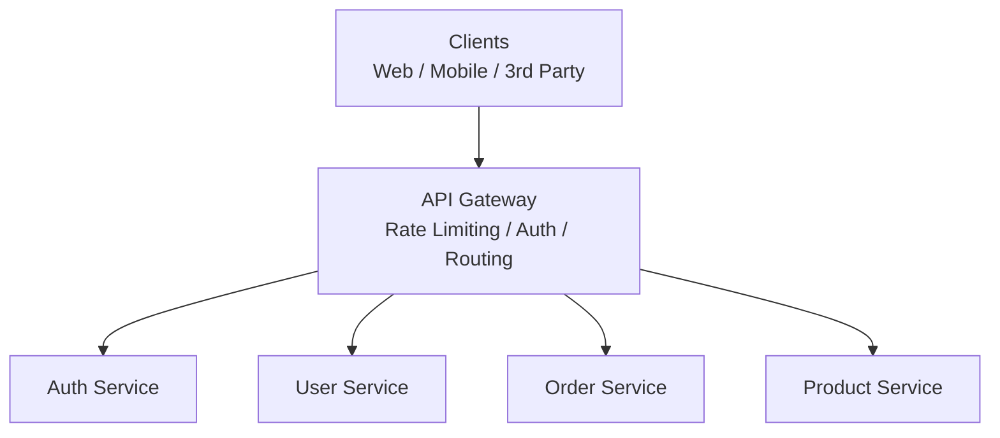
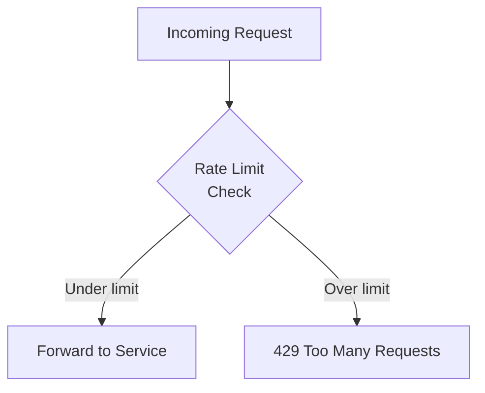
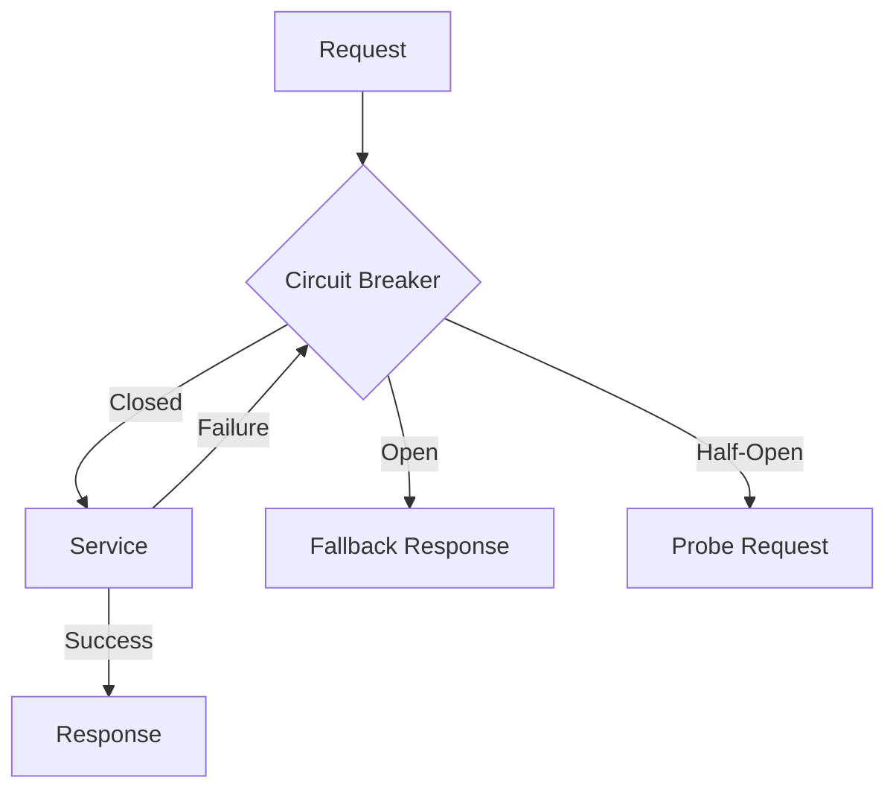
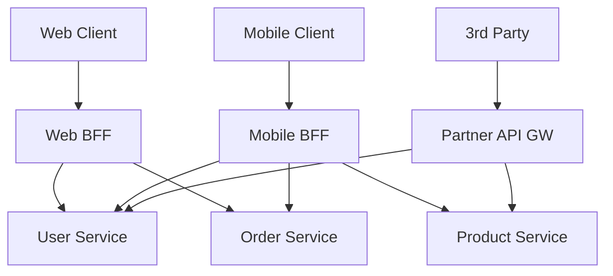
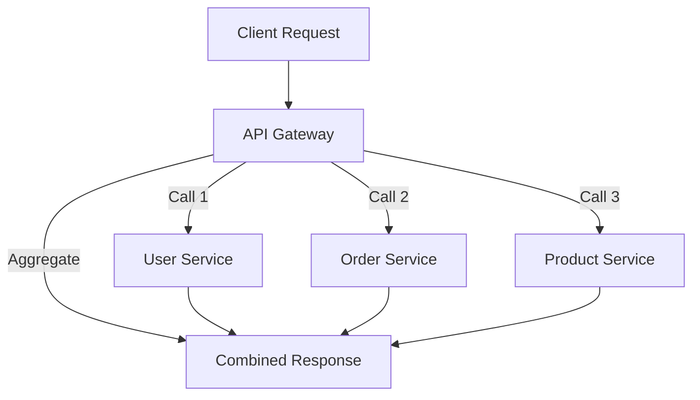

# API Gateway

An API Gateway is a centralized entry point for all client requests in a microservices architecture. It handles cross-cutting concerns like authentication, rate limiting, and routing, so individual services can focus on business logic.

## Overview



### Why an API Gateway?

- **Single Entry Point** — Simplifies client integration
- **Cross-Cutting Concerns** — Auth, rate limiting, logging in one place
- **Request Routing** — Map external URLs to internal services
- **Protocol Translation** — REST to gRPC, HTTP to WebSocket
- **Request Aggregation** — Combine multiple service calls (BFF pattern)

## Core Responsibilities

### 1. Request Routing

Route incoming requests to the appropriate backend service based on URL path, headers, or other criteria.

```yaml
# Kong route configuration
routes:
  - name: user-service
    paths: ["/api/v1/users"]
    service: user-service
    methods: ["GET", "POST", "PUT", "DELETE"]

  - name: order-service
    paths: ["/api/v1/orders"]
    service: order-service
    methods: ["GET", "POST"]

  - name: product-service
    paths: ["/api/v1/products"]
    service: product-service
    methods: ["GET"]
```

### 2. Rate Limiting

Protect backend services from abuse by limiting request rates.



#### Rate Limiting Algorithms

| Algorithm | Description | Pros | Cons |
|-----------|-------------|------|------|
| Token Bucket | Tokens added at fixed rate | Smooth, allows bursts | Memory per user |
| Leaky Bucket | Fixed outflow rate | Very smooth | No burst allowance |
| Fixed Window | Count per time window | Simple | Boundary burst issue |
| Sliding Window | Rolling time window | No boundary issue | More complex |
| Sliding Window Log | Store timestamps | Most accurate | Memory intensive |

```nginx
# NGINX rate limiting
limit_req_zone $binary_remote_addr zone=api:10m rate=100r/s;

server {
    location /api/ {
        limit_req zone=api burst=200 nodelay;
        proxy_pass http://backend;
    }
}
```

```yaml
# Kong rate limiting plugin
plugins:
  - name: rate-limiting
    config:
      minute: 100
      hour: 5000
      policy: redis
      redis_host: redis.internal
```

### 3. Authentication and Authorization

Verify identity and check permissions before forwarding requests.

```yaml
# Kong JWT plugin
plugins:
  - name: jwt
    config:
      claims_to_verify:
        - exp
        - iss
      key_claim_name: iss

# Kong ACL plugin
plugins:
  - name: acl
    config:
      allow:
        - admin
        - premium-user
```

### 4. Request and Response Transformation

Modify headers, body, or parameters before forwarding.

```yaml
# Kong request transformer
plugins:
  - name: request-transformer
    config:
      add:
        headers:
          - "X-Request-ID: $(uuid)"
          - "X-Forwarded-For: $(client_ip)"
      remove:
        headers:
          - "X-Internal-Token"
```

### 5. Load Balancing

Distribute traffic across multiple service instances.

```yaml
# Kong upstream configuration
upstreams:
  - name: user-service
    algorithm: round-robin
    targets:
      - target: user-svc-1:8080
        weight: 100
      - target: user-svc-2:8080
        weight: 100
      - target: user-svc-3:8080
        weight: 50
    healthchecks:
      active:
        http_path: /health
        healthy:
          interval: 5
          successes: 3
        unhealthy:
          interval: 5
          failures: 3
```

### 6. Circuit Breaking

Prevent cascading failures when downstream services are unhealthy.



### 7. Response Caching

Cache responses to reduce backend load.

```yaml
# Kong proxy cache
plugins:
  - name: proxy-cache
    config:
      response_code:
        - 200
      request_method:
        - GET
      content_type:
        - application/json
      cache_ttl: 300
      strategy: memory
```

## API Gateway Comparison

| Feature | Kong | Envoy | AWS API Gateway | Nginx |
|---------|------|-------|-----------------|-------|
| Type | Software | Sidecar/Proxy | Managed | Software |
| Config | Declarative/DB | xDS/API | Console/IaC | File-based |
| Plugins | Rich ecosystem | Filters | Lambda authorizers | Modules |
| Service Mesh | No | Yes (Istio) | No | No |
| gRPC Support | Yes | Excellent | Limited | Basic |
| Rate Limiting | Plugin | Filter | Built-in | Module |
| License | Apache 2.0 | Apache 2.0 | Proprietary | BSD |
| Best For | General API GW | Service mesh / Envoy | AWS-native | Simple proxy |

## Backend for Frontend (BFF)

A BFF pattern creates separate API gateways for each client type.



Benefits: Each BFF is optimized for its client's needs (different response shapes, different caching strategies).

## Kong Configuration Example

```yaml
# docker-compose.yml for Kong
version: '3.8'
services:
  kong:
    image: kong:3.4
    environment:
      KONG_DATABASE: postgres
      KONG_PG_HOST: kong-db
      KONG_PG_DATABASE: kong
      KONG_PROXY_ACCESS_LOG: /dev/stdout
      KONG_ADMIN_ACCESS_LOG: /dev/stdout
      KONG_PROXY_ERROR_LOG: /dev/stderr
      KONG_ADMIN_ERROR_LOG: /dev/stderr
      KONG_ADMIN_LISTEN: 0.0.0.0:8001
    ports:
      - "8000:8000"  # Proxy
      - "8443:8443"  # Proxy SSL
      - "8001:8001"  # Admin API
```

## Envoy Configuration Example

```yaml
# envoy.yaml
static_resources:
  listeners:
    - name: listener_0
      address:
        socket_address:
          address: 0.0.0.0
          port_value: 8080
      filter_chains:
        - filters:
            - name: envoy.filters.network.http_connection_manager
              typed_config:
                "@type": type.googleapis.com/envoy.extensions.filters.network.http_connection_manager.v3.HttpConnectionManager
                stat_prefix: ingress_http
                route_config:
                  virtual_hosts:
                    - name: backend
                      domains: ["*"]
                      routes:
                        - match:
                            prefix: "/api/users"
                          route:
                            cluster: user_service
                        - match:
                            prefix: "/api/orders"
                          route:
                            cluster: order_service
                http_filters:
                  - name: envoy.filters.http.ratelimit
                  - name: envoy.filters.http.jwt_authn
                  - name: envoy.filters.http.router

  clusters:
    - name: user_service
      type: STRICT_DNS
      lb_policy: ROUND_ROBIN
      load_assignment:
        cluster_name: user_service
        endpoints:
          - lb_endpoints:
              - endpoint:
                  address:
                    socket_address:
                      address: user-svc
                      port_value: 8080
```

## AWS API Gateway

```yaml
# AWS CDK example
api = apigateway.RestApi(self, "MyApi",
    rest_api_name="My Service",
    deploy_options=apigateway.StageOptions(stage_name="prod")
)

users = api.root.add_resource("users")
users.add_method("GET",
    apigateway.LambdaIntegration(get_users_handler),
    authorization_type=apigateway.AuthorizationType.COGNITO,
    authorizer=cognito_authorizer
)
users.add_method("POST",
    apigateway.LambdaIntegration(create_user_handler)
)

# Usage plan with rate limiting
plan = api.add_usage_plan("BasicPlan",
    throttle=apigateway.ThrottleSettings(
        rate_limit=100,
        burst_limit=200
    )
)
```

## Common API Gateway Patterns

### Request Aggregation



### Canary Deployment

Route a percentage of traffic to a new version for gradual rollout.

```yaml
# Envoy weighted routing
routes:
  - match: { prefix: "/api" }
    route:
      weighted_clusters:
        clusters:
          - name: v1
            weight: 90
          - name: v2
            weight: 10
```

## Common Mistakes

1. **Too much logic in the gateway** — Keep it thin; business logic belongs in services
2. **Single point of failure** — Not deploying gateway in HA mode
3. **No circuit breaking** — Cascading failures when a service goes down
4. **Ignoring timeouts** — Gateway hanging on slow backend calls
5. **Not logging requests** — Can't debug issues without request logs
6. **Hardcoding service URLs** — Use service discovery
7. **No caching** — Missing easy performance wins
8. **Missing rate limiting** — Vulnerable to abuse
9. **Tight coupling** — Gateway knowing too much about service internals
10. **No versioning strategy** — Breaking changes affect all clients

## Production Best Practices

- **Deploy for high availability** — Multiple instances behind a load balancer
- **Implement circuit breakers** — Fail fast, return degraded responses
- **Use health checks** — Remove unhealthy instances from rotation
- **Log everything** — Request/response, latency, status codes
- **Monitor key metrics** — Latency p50/p95/p99, error rate, request volume
- **Implement request timeouts** — Don't let slow services block the gateway
- **Use connection pooling** — Reuse connections to backend services
- **Enable compression** — gzip/brotli for responses
- **Version your API** — Support multiple versions simultaneously
- **Automate configuration** — Use IaC (Terraform, CDK) for gateway config

## Interview Questions

### 1. What is an API Gateway and why do you need one?

**Answer:** An API Gateway is a centralized entry point that handles cross-cutting concerns for microservices: routing, authentication, rate limiting, logging, and request transformation. Without it, each service must implement these concerns independently, leading to duplication and inconsistency. It also provides a unified interface for clients, hiding the complexity of the internal service topology.

### 2. Compare API Gateway vs Service Mesh.

**Answer:** An API Gateway handles north-south traffic (external clients to services) and focuses on client-facing concerns (auth, rate limiting, API versioning). A Service Mesh handles east-west traffic (service-to-service) and focuses on internal concerns (mTLS, retries, circuit breaking). They're complementary — a typical architecture uses both.

### 3. How does rate limiting work in an API Gateway?

**Answer:** The gateway tracks request counts per client (identified by API key, IP, or user ID) using algorithms like token bucket or sliding window. When the limit is exceeded, the gateway returns 429 Too Many Requests with `Retry-After` header. Limits can be per-second, per-minute, or per-hour. In distributed deployments, a shared store (Redis) synchronizes counters across gateway instances.

### 4. What is the BFF (Backend for Frontend) pattern?

**Answer:** BFF creates separate API gateway instances optimized for each client type. A web BFF might return full page data, while a mobile BFF returns compressed payloads with fewer fields. This avoids the one-size-fits-all problem of a single gateway. Each BFF is maintained by the team that owns the client.

### 5. How do you handle authentication at the API Gateway?

**Answer:** The gateway validates credentials (JWT, OAuth tokens) before forwarding requests. It can: (1) validate tokens directly using the signing key, (2) call an auth service for validation, (3) use a plugin (Kong JWT, Envoy JWT filter). After validation, the gateway adds user context headers (`X-User-ID`, `X-User-Role`) for downstream services.

### 6. Explain the circuit breaker pattern in an API Gateway.

**Answer:** The circuit breaker monitors failures to a downstream service. In the closed state, requests flow normally. When failures exceed a threshold, the circuit opens and requests immediately get a fallback response. After a timeout, the circuit enters half-open state and allows a few probe requests. If they succeed, the circuit closes; if they fail, it opens again.

### 7. How would you implement canary deployments with an API Gateway?

**Answer:** Configure weighted routing: 95% of traffic goes to v1 (stable), 5% to v2 (canary). Monitor v2's error rate, latency, and business metrics. If healthy, gradually increase v2's weight. If issues detected, route 100% back to v1. This can be done via Envoy's weighted clusters, Kong's canary plugin, or AWS API Gateway's canary deployment feature.

### 8. How do you handle request aggregation at the gateway?

**Answer:** For complex pages needing data from multiple services, the gateway can make parallel requests to services and combine results before responding to the client. This is the "API composition" or "BFF aggregation" pattern. It reduces client-side complexity but adds load to the gateway. GraphQL is an alternative that handles aggregation at the query level.

### 9. What happens when the API Gateway itself becomes a bottleneck?

**Answer:** Solutions: (1) Horizontal scaling — add more gateway instances behind a load balancer. (2) Caching — cache responses at the gateway to reduce backend calls. (3) Connection pooling — reuse connections to backend services. (4) Async processing — use message queues for non-critical operations. (5) Edge computing — move some logic to CDN edge nodes.

### 10. How do you version APIs at the gateway level?

**Answer:** The gateway can: (1) Route by URL path (`/v1/users` → service-v1, `/v2/users` → service-v2). (2) Route by header (`X-API-Version: 2`). (3) Transform requests between versions. (4) Run multiple service versions simultaneously. The gateway handles version negotiation so individual services don't need to.

### 11. How do you secure an API Gateway?

**Answer:** (1) TLS termination — handle HTTPS at the gateway. (2) DDoS protection — rate limiting and IP blocking. (3) Input validation — reject malformed requests early. (4) WAF integration — SQL injection, XSS prevention. (5) mTLS — for service-to-gateway communication. (6) API keys — for client identification. (7) CORS — proper cross-origin configuration.

### 12. Explain the difference between synchronous and asynchronous API Gateway patterns.

**Answer:** Synchronous: client sends request, gateway forwards to service, returns response. Client waits. Asynchronous: gateway accepts request, puts it on a message queue, returns 202 Accepted with a status URL. Client polls for completion or receives a webhook notification. Async is better for long-running operations (report generation, video processing) to avoid timeout issues.
