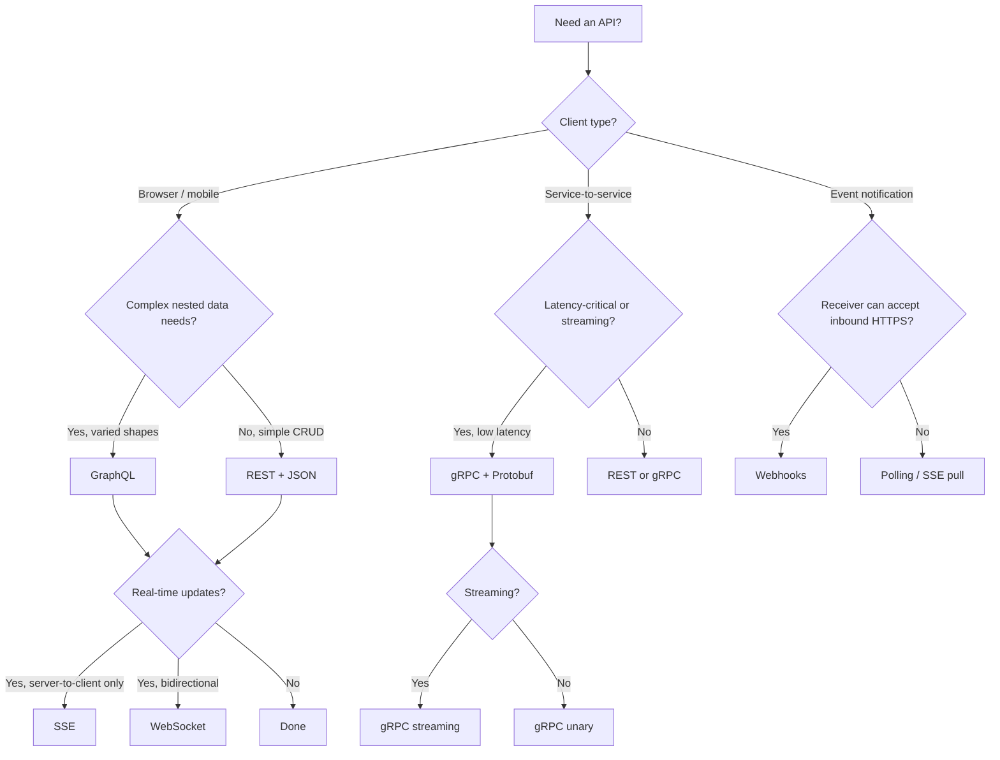
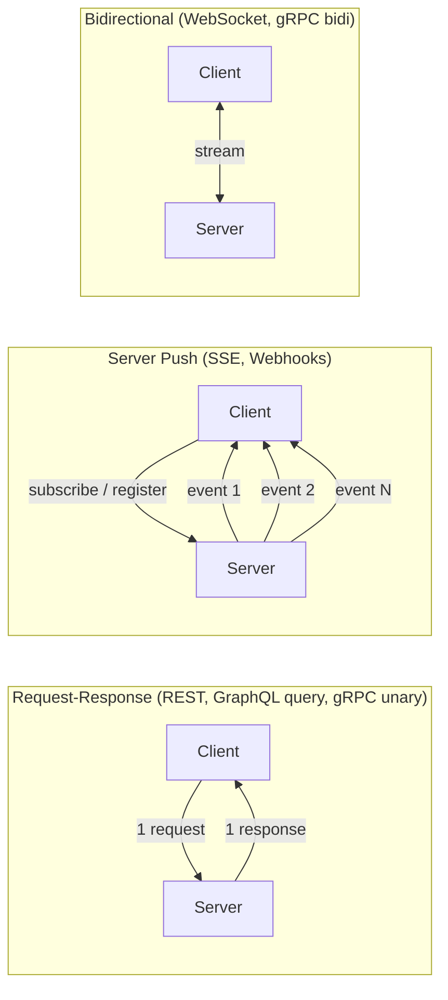
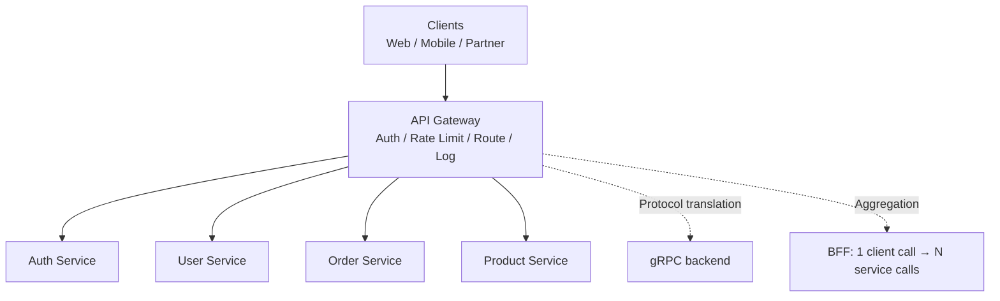
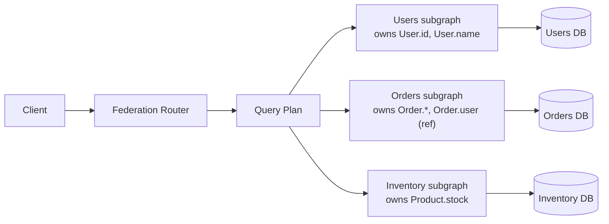

# API / Protocol Design

APIs are contracts. Every endpoint, message field, status code, and header is a promise that other code — written by other teams, deployed on different cadences, sometimes years apart — depends on. Designing an API is therefore not just "picking REST" or "picking gRPC"; it is choosing the **contract shape** (request-response, streaming, push, async), the **encoding** (JSON, Protobuf, Avro), the **evolution strategy** (versioning, additive change, schema registry), and the **security model** (mTLS, JWT, OAuth2) that fit the workload. This page is the consolidated deep dive that stitches the topic-specific pages together; it does not replace them.

> Related: [REST](./rest.md), [gRPC](./grpc.md), [GraphQL](./graphql.md), [GraphQL Federation](./graphql-federation.md), [API Gateway](./api-gateway.md), [API Versioning](./versioning.md), [Rate Limiting](./rate-limiting.md), [Webhooks](./webhooks.md), [Connection Pools](./connection-pools.md), [Serialization](../serialization.md), [Idempotency](../patterns/idempotency.md), [JWT](../auth/jwt.md), [OAuth 2.0](../auth/oauth.md)

## The Design Landscape

Four questions drive every API decision:

1. **Who are the clients?** Browsers, mobile apps, partner systems, or other internal services? Browsers favor REST/GraphQL; internal services favor gRPC; partner integrations favor REST + webhooks.
2. **What interaction model?** Request-response (REST, gRPC unary, GraphQL queries), server push (SSE, webhooks), bidirectional (WebSocket, gRPC bidi), or async messaging (Kafka, RabbitMQ — covered in [messaging](../messaging/README.md))?
3. **What evolution cadence?** If breaking changes are weekly, you need Stripe-style date pinning; if rare, URI path versioning suffices; if internal-only with controlled clients, additive evolution may eliminate explicit versioning.
4. **What performance budget?** Mobile over cellular needs few round trips (GraphQL, gRPC-Web); service-to-service at 100k QPS needs binary serialization (gRPC, Thrift); CRUD admin tools are fine with JSON.

## REST Constraints (Fielding)

REST was defined by Roy Fielding in his 2000 doctoral dissertation, ["Architectural Styles and the Design of Network-Based Software Architectures"](https://www.ics.uci.edu/~fielding/pubs/dissertation/top.htm), Chapter 5. REST is an architectural style — a set of constraints — not a protocol. A system that satisfies all six constraints is "RESTful"; most production "REST" APIs are actually "HTTP APIs" that satisfy only some.

| Constraint | What it requires | Failure symptom |
|------------|------------------|-----------------|
| **Client–Server** | UI concerns separated from data storage | Server templating HTML inline |
| **Stateless** | Each request contains all context; no server-side session | `GET /users/123` returns different data per session |
| **Cacheable** | Responses declare cacheability (`Cache-Control`, `ETag`) | Every GET re-executes on origin |
| **Uniform Interface** | Four sub-constraints (below) | Verbs in URLs (`/getUser`) |
| **Layered System** | Client cannot tell if intermediaries exist | Client couples to specific server node |
| **Code-on-Demand** (optional) | Server ships executable code (JS, applets) | — |

The **uniform interface** has four sub-constraints (Fielding §5.1.2):

- **Identification of resources** — resources are named by URIs (`/orders/123`).
- **Manipulation of resources through representations** — clients exchange representations (JSON, XML, HTML), not raw data; the server maps representations to internal state.
- **Self-descriptive messages** — each message carries enough metadata to be understood in isolation: `Content-Type`, `Content-Length`, `Cache-Control`, HTTP method semantics.
- **HATEOAS** (Hypermedia As The Engine Of Application State) — responses include links to next actions, so clients follow links rather than hardcoding URLs. This is what Richardson Maturity Model calls Level 3 (see [rest.md](./rest.md)).

Statelessness is the constraint most often violated in practice. Once a server stores per-client session state, horizontal scaling requires shared session stores (Redis), and a failed node drops sessions. Stateless APIs let any node serve any request, which is why JWT-based auth displaced server sessions for distributed REST.

## Choosing an API Style



The diagram is a starting heuristic, not a verdict. Real systems often combine styles: a public REST API for partners, GraphQL for the web client, gRPC for internal services, webhooks for async notifications, and SSE for live dashboards — all backed by the same business logic.

## API Style Comparison

| Aspect | REST | gRPC | GraphQL | WebSocket | SSE | Webhooks |
|--------|------|------|---------|-----------|-----|----------|
| **Transport** | HTTP/1.1 or HTTP/2 | HTTP/2 | HTTP (POST) | HTTP upgrade → TCP | HTTP | HTTP POST |
| **Direction** | Request–response | Request–response (4 patterns) | Request–response | Bidirectional, full-duplex | Server → client only | Server → client push |
| **Encoding** | JSON (typically) | Protobuf (binary) | JSON | Text frames or binary | `text/event-stream` | JSON / form |
| **Schema** | OpenAPI (optional) | `.proto` (required) | SDL (required) | App-defined | App-defined | App-defined |
| **Caching** | HTTP caching native | No (POST binary) | Complex (query-based) | None | Event-ID based | None |
| **Browser support** | Native | Needs gRPC-Web proxy | Native | Native | Native (EventSource) | N/A (server push) |
| **Streaming** | Limited (chunked) | Native (4 patterns) | Subscriptions over WS/SSE | Native | One-way native | N/A |
| **Best for** | Public APIs, CRUD | Internal microservices | Varied client data needs | Chat, multiplayer | Live updates, dashboards | Async event delivery |
| **Code generation** | OpenAPI generators | Built-in (`protoc`) | Built-in | Custom | Custom | Custom |

## RPC Family

**RPC** (Remote Procedure Call) is the idea that calling a remote function should look like calling a local one. The history:

- **XML-RPC** (1998, UserLand) — XML over HTTP, fixed set of types. Predates SOAP; verbose, slow.
- **SOAP** (1999, Microsoft) — XML-RPC's enterprise successor, with WSDL contracts, WS-* standards (WS-Security, WS-ReliableMessaging). Powerful but heavy; rarely chosen for greenfield today.
- **JSON-RPC** (2005) — JSON payloads, transport-agnostic. Stateless, lightweight, popular in crypto/Ethereum nodes and internal tooling.
- **gRPC** (2015, Google) — HTTP/2 + Protobuf, four streaming patterns, code generation across 11 languages. The dominant modern RPC for internal services.

```json
// JSON-RPC 2.0 request
{"jsonrpc": "2.0", "method": "subtract", "params": [42, 23], "id": 1}

// JSON-RPC 2.0 response
{"jsonrpc": "2.0", "result": 19, "id": 1}

// Notification (no response expected, no id)
{"jsonrpc": "2.0", "method": "update", "params": [42]}
```

JSON-RPC is batchable: a single request body can carry an array of calls, returning an array of responses. This reduces round trips when clients need many small operations.

The core critique of RPC (raised by REST advocates) is that RPC couples clients to **method names** (`getUser`, `createOrder`), while REST couples them to **resources** (`/users/123`). Method-name coupling means every new capability is a new endpoint; resource coupling means new capabilities are new representations or sub-resources, and existing clients keep working. In practice, gRPC mitigates this by versioning the `.proto` and generating clients per service, so coupling is bounded and explicit.

For a deep dive on gRPC's four communication patterns (unary, server streaming, client streaming, bidirectional), Protobuf wire format, and HTTP/2 multiplexing, see [grpc.md](./grpc.md).

## GraphQL in One Screen

GraphQL is a query language for APIs and a runtime for executing those queries against a typed schema. It was developed at Facebook (2012, internal; 2015, open-source) and is now governed by the [GraphQL Foundation](https://graphql.org/).

- **Schema** — strongly typed SDL: `type`, `input`, `enum`, `interface`, `union`, scalar types (`String`, `Int`, `Float`, `Boolean`, `ID`, custom).
- **Queries** — read operations; client specifies shape, server returns exactly that shape. No over- or under-fetching.
- **Mutations** — write operations, executed sequentially (queries run in parallel).
- **Subscriptions** — long-lived streams over WebSocket (`graphql-ws` protocol) or SSE; server pushes updates when underlying data changes.
- **Federation** — multiple subgraphs compose into one supergraph served by a router; each subgraph owned by a different team. See [graphql-federation.md](./graphql-federation.md).
- **Introspection** — clients can query the schema itself (`__schema`, `__type`), enabling tooling like GraphiQL and Apollo Explorer.

GraphQL's killer feature is **shape flexibility**: the same endpoint serves a thin mobile view (just `id`, `name`) and a rich web view (`id`, `name`, `posts { comments { author } }`). Its cost is server complexity — the N+1 problem (solved by DataLoader batching), query-depth/complexity limits (DoS protection), and the loss of HTTP caching (queries are POST with bodies; caching must move to a persisted-query layer).

For schema examples, query patterns, and the REST-vs-GraphQL trade matrix, see [graphql.md](./graphql.md).

## WebSockets (RFC 6455)

[WebSocket](https://www.rfc-editor.org/rfc/rfc6455) is a protocol providing **full-duplex, bidirectional** communication over a single TCP connection, after an HTTP Upgrade handshake. Defined in RFC 6455 (2011).

```http
GET /chat HTTP/1.1
Host: server.example.com
Upgrade: websocket
Connection: Upgrade
Sec-WebSocket-Key: dGhlIHNhbXBsZSBub25jZQ==
Sec-WebSocket-Version: 13
```

The server responds `101 Switching Protocols`, and the TCP connection is then governed by the WebSocket framing protocol, not HTTP. Each frame has:

| Field | Bits | Purpose |
|-------|------|---------|
| `FIN` | 1 | Final fragment of a message |
| `RSV1–3` | 3 | Reserved for extensions (compression, permessage-deflate) |
| `opcode` | 4 | `0x1` text, `0x2` binary, `0x8` close, `0x9` ping, `0xA` pong |
| `masked` | 1 | Client→server frames must be masked (XOR with 4-byte key) to prevent cache-poisoning by intermediaries |
| `payload-len` | 7/16/64 | Length, with extended length encoding for large frames |
| `mask-key` | 32 | Masking key (client frames only) |

WebSocket's strengths: low latency (one TCP connection, no per-message handshake), bidirectional (server can push any time, client can send any time), and binary-friendly (subprotocols like `graphql-ws`, STOMP, WAMP). Weaknesses: no built-in caching, no built-in auth (must do at handshake or first message), no built-in reconnect (clients must implement), and intermediaries (proxies, load balancers) may close idle connections — keep-alive pings are mandatory.

For browser-deep WebSocket coverage (EventSource comparison, heartbeats, reconnection, subprotocols), see the [networks/http/websocket.md](../../networks/http/websocket.md) and [web-development/websockets.md](../../web-development/websockets.md) pages.

## Server-Sent Events (SSE)

SSE is **one-way server → client** streaming over vanilla HTTP, using the `text/event-stream` media type. The browser API is `EventSource`. Defined in the [HTML spec](https://html.spec.whatwg.org/multipage/server-sent-events.html).

```
GET /events HTTP/1.1
Accept: text/event-stream

---

HTTP/1.1 200 OK
Content-Type: text/event-stream

data: {"user":"alice","event":"login"}

event: order-created
data: {"id":"o_123","total":42.00}
id: 42

data: {"user":"bob","event":"login"}
```

Key properties:

- **Auto-reconnect** — `EventSource` reconnects automatically on disconnect; the server can include an `id:` field and the browser will send `Last-Event-ID` on reconnect, allowing the server to resume from where the client left off.
- **One connection, many events** — a single long-lived HTTP/1.1 stream carries many events. Over HTTP/2, multiple SSE streams multiplex on one connection.
- **Text only** — SSE is text (`\n\n` delimited). Binary data must be base64-encoded.
- **No client → server** — clients cannot send messages back over the SSE stream; they must use a separate HTTP request.

SSE is the right choice when the data flow is naturally one-way (live scores, dashboards, log tails, telemetry) and you want HTTP semantics (caching, TLS, proxy-friendly) without WebSocket's connection-management overhead.

## Webhooks

A webhook is an HTTP callback: the server pushes a POST to a client-registered URL when an event occurs. Webhooks invert the polling model — instead of the client asking "any new orders?" every minute, the server says "new order, here it is" when one arrives.

| Concern | Rule |
|---------|------|
| **Delivery** | At-least-once; consumers must be idempotent (dedup by event ID) |
| **Acknowledge** | Return `2xx` fast (before heavy work); process async via queue |
| **Signature** | HMAC-SHA256 with shared secret; verify with constant-time compare |
| **Replay protection** | Signed timestamp; reject events older than a window (e.g., 5 min) |
| **Retries** | Exponential backoff + jitter; cap (Stripe retries up to 3 days) |
| **Replay API** | Expose `GET /events?after=<id>` so consumers can backfill missed events |
| **TLS** | Always HTTPS; block SSRF to private IP ranges on registered URLs |

For full coverage of consumer/provider design, signature schemes, and the polling/webhook/SSE/WebSocket trade matrix, see [webhooks.md](./webhooks.md).

## Request–Response vs Streaming



The right model depends on three axes: **direction** (one-way vs two-way), **cardinality** (one response vs many), and **latency profile** (request-bound vs event-bound). Chat is bidirectional and event-bound → WebSocket. Live scores are one-way and event-bound → SSE. CRUD is one-request/one-response → REST. Telemetry ingestion is one-way, high-throughput, and bursty → client streaming gRPC or Kafka. Mixing these up — using polling for chat, or WebSocket for a one-shot read — wastes engineering effort and infrastructure.

## Pagination

Any endpoint that returns a collection must paginate. Returning all records is a denial-of-service vector and a memory hazard. Three approaches dominate:

| Method | Request shape | Pros | Cons | Use when |
|--------|---------------|------|------|----------|
| **Offset** | `?page=2&per_page=20` | Simple, supports random access, easy caching | Slow on large offsets (`OFFSET 100000` scans all skipped rows); unstable under inserts (items shift) | Admin UIs, small collections |
| **Cursor** | `?cursor=eyJpZCI6MTIzfQ&limit=20` | Stable under inserts, constant-time per page | No random access (can only go forward), opaque cursor | News feeds, activity logs, infinite scroll |
| **Keyset** | `?after_id=123&limit=20` | Stable, constant-time, index-friendly | Requires a monotonic sort key; no random access | Time-series, append-only logs |

Cursor and keyset are essentially the same idea — encode "where you stopped" rather than "how many you skipped" — but keyset uses a raw field value while cursor wraps it (often base64-encoded JSON with a sort key and optional filter hash) so the server can change its internal pagination strategy without breaking clients.

```json
// Cursor-paginated response
{
  "data": [ /* 20 items */ ],
  "pagination": {
    "next_cursor": "eyJpZCI6MTQzfQ",
    "has_more": true
  }
}
```

The Google AIP-158 standard encodes this pattern: `page_size` + `page_token` (opaque) + `next_page_token` in the response. The token is the cursor; clients treat it as opaque.

## Protocol Versioning

| Strategy | Example | Pros | Cons | Best for |
|----------|---------|------|------|----------|
| **URI path** | `/api/v1/users` | Simple, cacheable (URL varies), curl-friendly | URL changes break clients; "v1" leaks into resource identity | Public APIs (default) |
| **Query param** | `/api/users?v=1` | Easy retro-fit | Pollutes URL; breaks caching unless `Vary: ?v` | Quick migration escape hatch |
| **Custom header** | `X-API-Version: 1` | Clean URLs | Not visible in browser; `Vary` needed for caching | Internal microservices |
| **Accept / media type** | `Accept: application/vnd.acme.v2+json` | REST-purist (URL = resource, header = representation) | Tooling struggles; hard to test in browser | Enterprise, strict contracts |
| **Date-based (Stripe)** | `Stripe-Version: 2026-01-15` | Zero breaking changes for existing accounts; additive-only | Requires compat layer translating old ↔ new | Frequent releases, many integrators |
| **No versioning** | `/api/users` (additive only) | Simplest | Requires discipline (no breaking changes ever) | Internal, rarely-changing |

See [versioning.md](./versioning.md) for the decision flow, Stripe-style compatibility layers, and deprecation headers (`Sunset`, `Deprecation`).

## Backward & Forward Compatibility

Two orthogonal properties define how an API can evolve:

- **Backward compatibility** — new server code can read data/requests written by old clients. Achieved by making changes **additive**: new optional fields, new endpoints, new enum values (with a default for unknown). Old clients ignore the new fields.
- **Forward compatibility** — old server code can read data/requests written by new clients. Achieved by making servers **tolerant readers** (Postel's law: "be liberal in what you accept"): ignore unknown fields, default missing ones, don't reject on unexpected enum values.

A change is **breaking** if it requires coordinated deploy of producer and consumer. Breaking changes: removing a field, renaming a field, changing a type (`int` → `string`), narrowing a value domain, changing auth semantics, changing pagination. Most other changes can be additive.

Schema-evolution rules depend on the encoding format:

| Format | Add field (optional) | Remove field | Change type | Enum add value |
|--------|----------------------|--------------|-------------|----------------|
| **JSON / JSON Schema** | Always safe | Always safe (tolerant reader) | Safe if backward-compatible cast | Safe with tolerant reader |
| **Protobuf** | Safe (new tag, `optional`) | `reserved` the tag; never reuse | Risky (wire-type must match) | Safe (`unknown` enum default) |
| **Avro** | Safe with default value | Safe (reader/writer schema resolution) | Safe with union types | N/A (Avro enums are stricter) |
| **Thrift** | Safe with `optional` + default | Safe (field id reserved) | Risky | Safe with default |

For the full schema-evolution story — including Protobuf wire types, Avro's reader/writer schema resolution, and zero-copy formats — see [serialization.md](../serialization.md).

## Schema Definition Languages

| IDL / Schema | Origin | Used by | Strengths | Weaknesses |
|--------------|--------|---------|-----------|------------|
| **Protobuf** (`.proto`) | Google, 2001 | gRPC, Envoy xDS, Spanner | Compact binary, code-gen across 11 languages, strict evolution rules | Binary (not human-readable on wire); requires code generation |
| **Avro** (`.avsc`) | Hadoop, 2009 | Kafka, Hadoop, Parquet | Schema embedded in data; reader/writer resolution; compact | Schema must accompany data; no random field access |
| **Thrift** (`.thrift`) | Facebook, 2007 | Internal FB services, Cassandra | Binary + compact + JSON protocols; mature | Less active community than Protobuf |
| **JSON Schema** | Community, draft 2020-12 | REST APIs, config validation | Self-describing, no code-gen required | Verbose; no wire format (validation only) |
| **OpenAPI** (formerly Swagger) | Smartbear / Linux Foundation | REST API contracts | Tooling ecosystem (codegen, docs, mock servers, Postman import) | REST-only; verbose |
| **AsyncAPI** | AsyncAPI Initiative | Event-driven / messaging APIs | Describes Kafka, AMQP, WebSocket, MQTT channels | Smaller ecosystem than OpenAPI |
| **GraphQL SDL** | Facebook, 2015 | GraphQL APIs | Strongly typed, introspectable, single endpoint | Query language overhead; caching hard |

## Idempotency

An operation is **idempotent** if calling it N times has the same effect as calling it once. Idempotency matters because distributed systems retry: network timeouts, transient 5xxs, and at-least-once delivery all mean the same logical request can arrive multiple times.

| HTTP method | Naturally idempotent? | Why |
|-------------|------------------------|-----|
| `GET` | Yes | Read-only, no side effects |
| `PUT` | Yes | Replaces the resource with a fixed state |
| `DELETE` | Yes | Second delete is a no-op (200 → 404) |
| `POST` | No | Creates a new resource each call |
| `PATCH` | Depends | Merge PATCH is not; JSON Patch can be |

`POST` is the dangerous case. To make POST idempotent, clients attach an **`Idempotency-Key`** header (UUID); the server stores the key + response for a TTL (24h is typical) and replays the same response on duplicate keys. Stripe's `Idempotency-Key` header is the canonical reference implementation.

For full coverage (natural vs synthetic idempotency, key storage, replay windows, partial-failure handling), see [idempotency.md](../patterns/idempotency.md).

## Rate Limiting

Rate limiting protects the API from abuse (intentional or accidental) and enforces fair-share among tenants. The four canonical algorithms:

| Algorithm | Mechanism | Burst tolerance | Memory | Best for |
|-----------|-----------|------------------|--------|----------|
| **Token bucket** | Bucket holds `b` tokens, refilled at rate `r`; each request consumes 1 | Yes (up to `b`) | O(1) per key | Most APIs (AWS, GCP, Stripe) |
| **Leaky bucket** | Queue with constant drain rate; overflows if full | No (smoothed) | O(queue size) | Traffic shaping |
| **Fixed window** | Counter resets every `window` | Yes, but bursts at window edges | O(1) per key | Simple quotas |
| **Sliding window** | Weighted average of current + previous window | Smoothed | O(1) per key | Accurate throttling |

Token bucket is the most common. A bucket with capacity \\(b\\) and refill rate \\(r\\) tokens/sec serves up to \\(r\\) requests/sec sustained, with bursts up to \\(b\\). The state is `(tokens, last_refill_time)`, updated atomically (Redis `INCRBYFLOAT` with a Lua script, or an in-memory atomic in each node).

Standard response headers (RFC drafts and de facto industry standard):

```
X-RateLimit-Limit: 100            # Max requests per window
X-RateLimit-Remaining: 42         # Requests remaining in current window
X-RateLimit-Reset: 1699999999     # Window reset (Unix timestamp)
Retry-After: 60                   # Seconds until retry (on 429)
```

For deep coverage (distributed rate limiting with Redis, sliding-window log vs counter, GCRA, and per-tenant vs global limits), see [rate-limiting.md](./rate-limiting.md) and the [rate-limiter machine-coding](../../machine-coding/rate-limiter.md) page.

## API Gateways

An API gateway is a centralized ingress that handles cross-cutting concerns — auth, rate limiting, routing, observability, protocol translation, request aggregation — so individual services can focus on business logic.



Gateway responsibilities (per [api-gateway.md](./api-gateway.md)):

- **Routing** — map external URL paths to internal services; support path, header, method matching.
- **AuthN / AuthZ** — verify JWT signatures, check scopes, forward identity headers (`X-User-Id`).
- **Rate limiting & quotas** — per-tenant, per-IP, per-endpoint.
- **Observability** — structured access logs, metrics (latency, error rate), distributed tracing (W3C `traceparent`).
- **Protocol translation** — REST ↔ gRPC (Envoy gRPC-JSON transcoder), HTTP ↔ WebSocket.
- **Request aggregation** (BFF pattern) — fan out one client call into N backend calls, return a single composed response.
- **Resilience** — circuit breakers, retries with jitter, timeouts, bulkheads (see [microservices.md](../patterns/microservices.md)).
- **TLS termination** — centralize cert management.

Popular gateways: Kong, Envoy + Istio, AWS API Gateway, NGINX, Apigee, Tyk, Traefik. Service meshes (Istio, Linkerd) push some of these concerns to a sidecar per service, blurring the line between gateway and mesh.

## Service-to-Service Authentication

| Mechanism | How it works | Pros | Cons | Best for |
|-----------|--------------|------|------|----------|
| **mTLS** (mutual TLS) | Both sides present X.509 certs signed by an internal CA; TLS handshake authenticates both | Strongest; no tokens to leak; transparent to app code | Cert rotation & distribution (SPIFFE/SPIRE, cert-manager); PKI ops | Zero-trust service meshes (Istio, Linkerd) |
| **JWT (service account)** | Service signs a JWT with a shared secret or private key; sends as `Authorization: Bearer` | Stateless; self-contained claims; standard libraries | Short TTL + rotation needed; revocation is hard (no server-side state) | Internal APIs, stateless services |
| **OAuth2 client credentials** | Service authenticates to an authorization server with `client_id` + `client_secret`, receives an access token | Standardized (RFC 6749 §4.4); central token issuer; scopes; rotation | Extra hop to AS; token caching required; complexity | Cross-org, partner APIs; centralized policy |
| **API key / shared secret** | Static key in header (`X-API-Key`) | Simplest | No identity beyond the key; rotation painful; leakage catastrophic | Internal tools, low-stakes |
| **AWS SigV4** | Sign request with HMAC of (method, path, headers, body) using secret key | Works for AWS APIs; region-scoped | AWS-specific; complex signing | AWS-native services |

mTLS is the gold standard for service-to-service inside a zero-trust network: every connection is mutually authenticated at the TLS layer, identity is bound to a SPIFFE ID (`spiffe://acme.com/payments-service`), and authorization policy (Istio `AuthorizationPolicy`) can decide allow/deny per call. JWT and OAuth2 client credentials dominate when services cross trust boundaries (e.g., a partner service calling your API) or when a service mesh is not deployed.

For OAuth2 flows, JWT structure, and session management, see [oauth.md](../auth/oauth.md), [jwt.md](../auth/jwt.md), and [session-management.md](../auth/session-management.md).

## GraphQL Federation

When a single GraphQL schema grows beyond one team, **federation** splits it into independently owned **subgraphs**, composed by a **router** into a single supergraph. The router plans query execution across subgraphs, fetching entity representations from one and passing them to another for field resolution.



Key concepts (per [graphql-federation.md](./graphql-federation.md)):

- **Entity** — a type shared across subgraphs, identified by a `@key` field set. Each subgraph resolves the fields it owns; the router joins them.
- **`@external`** — a field declared by another subgraph; the current subgraph references it but does not own it.
- **`@provides`** — a subgraph guarantees it can resolve certain fields for a particular query path, allowing the router to skip a hop.
- **`@requires`** — a subgraph needs certain external fields to compute a computed field (e.g., `reviewCount` requires `reviews`).
- **Composition** — the build step that merges subgraphs into a supergraph; runs in CI before publication. A subgraph can be individually valid but fail composition (e.g., two subgraphs disagree on a field's type).

The router's query plan is the core innovation: rather than the client knowing which subgraph to call, the router decides — fetch `User.id` and `User.name` from the users subgraph, then pass the `id` to the orders subgraph to resolve `User.orders`, etc. This is what lets teams own domains independently while clients see one unified graph.

## Interview Questions

### Q1: What are the six REST constraints, and which one is most often violated?

The six (Fielding, 2000): client–server, stateless, cacheable, uniform interface, layered system, and code-on-demand (optional). The uniform interface has four sub-constraints: resource identification via URIs, manipulation through representations, self-descriptive messages, and HATEOAS. **Statelessness** is the most violated — once a server stores per-client session state, horizontal scaling requires a shared session store and a node failure drops the session. **HATEOAS** is the most *under*-adopted: most "REST" APIs return data without hypermedia links, so clients hardcode URL patterns. Fielding himself [has said](https://roy.gbiv.com/untangled/2008/rest-apis-must-be-hypertext-driven) that an API without HATEOAS is not REST — it's "HTTP with POX."

### Q2: When would you choose gRPC over REST, and what are the trade-offs?

Choose gRPC for internal service-to-service communication where latency and throughput matter: Protobuf serialization is 5–10× faster than JSON, HTTP/2 multiplexing avoids head-of-line blocking, and native streaming (4 patterns) handles real-time flows. Code generation across 11 languages means contracts are explicit and type-safe. Trade-offs: browsers need a gRPC-Web proxy (Envoy); binary payloads are hard to debug with curl; load balancers must understand HTTP/2 (most modern ones do); and the .proto file becomes a coupling point that requires careful evolution (never reuse field numbers, `reserved` removed ones).

### Q3: How does GraphQL solve over-fetching and under-fetching, and what does it cost?

Over-fetching is when a `/users/123` endpoint returns 20 fields but the client needs 3. Under-fetching is when a `/users/123` endpoint doesn't include orders, so the client makes a second `/users/123/orders` call. GraphQL lets the client specify exactly which fields it wants in a single request — `user(id:123) { name posts { title } }` — eliminating both. The cost: server complexity (resolver composition, N+1 mitigation via DataLoader), loss of HTTP caching (queries are POSTs with bodies; you need persisted queries for CDN cacheability), and DoS surface (query depth and complexity must be capped). Use GraphQL when clients have genuinely different data needs (mobile vs web vs partner); use REST when the data shape is stable and HTTP caching matters.

### Q4: When are WebSockets preferred over SSE, and vice versa?

Use WebSockets when you need **bidirectional** communication: chat, multiplayer games, collaborative editing, real-time trading. The full-duplex TCP stream lets either side send any time, with low per-message overhead. Use SSE when the data flow is **one-way server → client**: live dashboards, log tails, telemetry, push notifications. SSE is simpler (vanilla HTTP, `EventSource` API, auto-reconnect with `Last-Event-ID`, friendly to proxies and HTTP/2 multiplexing) and should be the default for one-way push — don't pay the WebSocket handshake and connection-management cost for a one-way stream. Use webhooks when the receiver isn't online continuously and the delivery model is event-driven (Stripe, GitHub, Slack integrations).

### Q5: How do you evolve a Protobuf schema without breaking consumers?

Protobuf's evolution rules: (1) **add fields** with new tag numbers and mark `optional` so the default is preserved — old readers ignore the new field, new readers get the default for old data. (2) **remove fields** by `reserved`-ing the tag number and name — never reuse the number for a different field, or old clients will misinterpret it. (3) **change types** only between wire-compatible types (e.g., `int32` → `int64`); changing a `string` to an `int32` is a breaking wire change. (4) **rename fields** freely (the wire format uses tag numbers, not names), though generated code changes. (5) **add enum values** safely if clients default unknown values to a sentinel (`_UNSPECIFIED = 0`); removing values is breaking. The golden rule: never reuse a tag number, never change a wire type.

### Q6: What is the difference between backward and forward compatibility, and which is harder to achieve?

Backward compatibility means new code can read old data — e.g., a new server can process requests from old clients. Achieved by making changes additive (new optional fields, new endpoints, defaults for missing fields). Forward compatibility means old code can read new data — old server processes requests from new clients. Achieved by being a tolerant reader (Postel's law): ignore unknown fields, default missing ones, accept unknown enum values. Forward compat is harder because the old code has already shipped and cannot be updated; you must anticipate, at design time, that future fields will arrive. Avro's reader/writer schema resolution is the most explicit form: the writer's schema travels with the data, and the reader applies a resolution algorithm to map it. Protobuf's wire format gives forward compat for free (unknown tags are skipped). JSON gives forward compat only if the consumer doesn't reject unknown fields — which many strict validators do by default, breaking it.

### Q7: When would you use mTLS vs JWT vs OAuth2 client credentials for service-to-service auth?

**mTLS** when you control the network and want zero-trust: every service presents a cert signed by an internal CA, identity is a SPIFFE ID, and Istio/Linkerd enforce policy. Strongest option, no tokens to leak, transparent to app code — but requires cert rotation infrastructure (cert-manager, SPIFFE/SPIRE). **JWT** when services are stateless and you want to avoid an auth hop on every call: the calling service signs a short-lived JWT with a private key, the receiving service verifies with the public key. Trade-off: revocation is hard (no server-side state), so keep TTLs short (minutes). **OAuth2 client credentials** when crossing trust boundaries or when a central authorization server should decide policy: the caller gets a token from the AS, presents it to the receiver. Trade-off: extra hop to the AS, must cache tokens. mTLS for internal zero-trust; JWT for stateless internal APIs without a mesh; OAuth2 client credentials for partner / cross-org / centralized-policy scenarios.

### Q8: How do you make a POST endpoint idempotent, and why does it matter?

POST is not naturally idempotent — calling `POST /charges` twice creates two charges. To make it idempotent, the client attaches an `Idempotency-Key` header (UUID) to each logical request; the server stores `(key, request_hash, response)` for a TTL (24h typical). On a duplicate key, the server returns the stored response without re-executing the side effect. This matters because distributed systems retry: a network timeout after the server created the charge but before the response reached the client means the client will retry — without idempotency, that's a double charge (the canonical Stripe problem). The key insight: **idempotency is the client's responsibility to provide and the server's responsibility to enforce**. The server must also handle the case where the same key arrives with a *different* request body — that's a client bug, return 422. And the storage must be atomic with the side effect, or you can still double-execute under concurrency.

## Common Mistakes

- **No versioning from day one** — retrofitting versioning is painful; start with `/v1/` even if you never need `/v2/`.
- **Verbs in REST URLs** (`/getUser`, `/createOrder`) — REST is resource-oriented; use `GET /users/123`, `POST /orders`.
- **Returning 200 for errors** — use proper status codes (4xx for client errors, 5xx for server errors); don't bury errors in a 200 response body.
- **No pagination on collection endpoints** — returning all records is a DoS vector and a memory hazard.
- **Tight Protobuf evolution** — reusing field numbers, not `reserved`-ing removed fields, or changing wire types — all cause silent data corruption.
- **gRPC for browser-facing APIs without a proxy** — browsers can't speak HTTP/2 trailers; you need gRPC-Web + Envoy.
- **Webhook consumers that aren't idempotent** — at-least-once delivery means duplicates will arrive; dedup by event ID.
- **Rate limiting only at the edge** — a single abusive client inside the mesh can starve others; per-service limits are also needed.
- **Long-lived JWTs without rotation** — a leaked JWT is valid until expiry; keep TTLs short (15 min) and use refresh tokens.
- **No `Sunset` / `Deprecation` headers** — silent breaking changes break partners without warning.

## Summary

| Decision | Default | Switch when |
|----------|---------|-------------|
| **Public API style** | REST + JSON | Client needs vary wildly → GraphQL; partner needs events → webhooks |
| **Internal API style** | gRPC + Protobuf | Browser-facing → REST or gRPC-Web; very simple CRUD → REST + JSON |
| **Versioning** | URI path `/v1/` | Frequent breaking → date-based (Stripe); internal controlled → header |
| **Pagination** | Cursor (opaque token) | Random access needed → offset; time-series → keyset |
| **Auth (edge)** | OAuth2 + JWT bearer | Cross-org → mTLS; partner B2B → OAuth2 client credentials |
| **Auth (service-to-service)** | mTLS (with mesh) | No mesh → JWT; cross-org → OAuth2 client credentials |
| **Real-time** | SSE (one-way) | Bidirectional → WebSocket; performance-critical → gRPC streaming |
| **Async events** | Webhooks (push to partners) | Internal → Kafka/RabbitMQ; cross-service → event bus |

## References

- Roy T. Fielding, ["Architectural Styles and the Design of Network-Based Software Architectures"](https://www.ics.uci.edu/~fielding/pubs/dissertation/top.htm), Chapter 5 — REST (2000)
- [gRPC documentation](https://grpc.io/docs/) — Protocol, wire format, four communication patterns
- [GraphQL specification](https://spec.graphql.org/) — June 2018 working draft and October 2021 spec
- [RFC 6455 — The WebSocket Protocol](https://www.rfc-editor.org/rfc/rfc6455) — Fette & Melnikov, IETF (2011)
- [HTML Living Standard — Server-Sent Events](https://html.spec.whatwg.org/multipage/server-sent-events.html) — WHATWG
- Martin Kleppmann, ["Designing Data-Intensive Applications"](https://dataintensive.net/), Chapter 4 (Encoding and Evolution) — O'Reilly (2017)
- JJ Geewax, ["API Design Patterns"](https://www.manning.com/books/api-design-patterns) — Manning (2021)
- Leonard Richardson, ["RESTful Web Services"](http://oreilly.com/catalog/9780596529260) — Richardson Maturity Model (O'Reilly, 2007)
- [RFC 6749 — OAuth 2.0 Authorization Framework](https://www.rfc-editor.org/rfc/rfc6749) — client credentials grant, §4.4
- [RFC 9110 — HTTP Semantics](https://www.rfc-editor.org/rfc/rfc9110) — methods, status codes, content negotiation
- [Stripe API Design](https://stripe.com/blog/api-versioning) and [Idempotent Requests](https://docs.stripe.com/api/idempotent_requests) — date-based versioning, idempotency keys
- [Google AIP-158 — Pagination](https://google.aip.dev/158) — `page_size` / `page_token` / `next_page_token`
- [JSON-RPC 2.0 Specification](https://www.jsonrpc.org/specification)
- [AsyncAPI Specification](https://www.asyncapi.com/docs/specifications/latest)
- [SPIFFE / SPIRE](https://spiffe.io/) — service identity for zero-trust mTLS

## Cross-References

- [REST](./rest.md) — REST constraints, Richardson Maturity Model, HATEOAS
- [gRPC](./grpc.md) — Protobuf wire format, four streaming patterns, HTTP/2
- [GraphQL](./graphql.md) — schema, queries, mutations, subscriptions
- [GraphQL Federation](./graphql-federation.md) — subgraphs, entities, query planning
- [API Gateway](./api-gateway.md) — gateway responsibilities, BFF, protocol translation
- [API Versioning](./versioning.md) — URI vs header vs date-based, Stripe pinning
- [Rate Limiting](./rate-limiting.md) — token bucket, GCRA, distributed limits
- [Webhooks](./webhooks.md) — signatures, retries, consumer design
- [Connection Pools](./connection-pools.md) — TCP/HTTP connection reuse
- [Serialization](../serialization.md) — Protobuf, Avro, Thrift, schema evolution
- [Idempotency](../patterns/idempotency.md) — `Idempotency-Key`, replay, at-least-once
- [Microservices](../patterns/microservices.md) — circuit breakers, bulkheads, retries
- [JWT](../auth/jwt.md) — structure, signing, rotation
- [OAuth 2.0](../auth/oauth.md) — flows, client credentials, scopes
- [Session Management](../auth/session-management.md) — stateful vs stateless auth
- [WebSocket (networks)](../../networks/http/websocket.md) — frame protocol deep dive
- [WebSocket (web-dev)](../../web-development/websockets.md) — browser API, reconnection
- [HTTP/1.1 vs HTTP/2 vs HTTP/3](../../networks/http/README.md) — transport effects on API design
