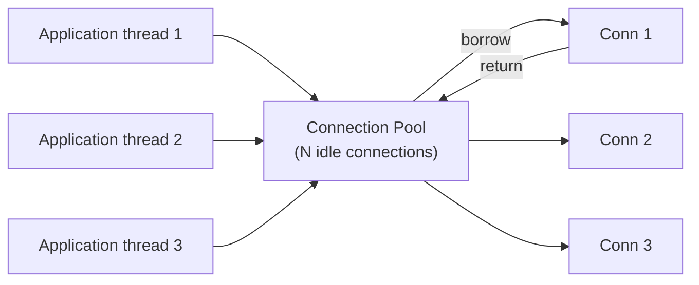
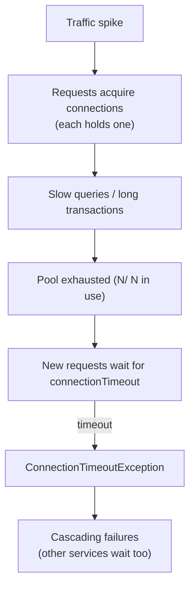

# Connection Pools

## Overview

A **connection pool** is a cache of pre-established network/database connections reused across requests. Opening a connection is expensive (TCP handshake, TLS, auth, allocating server resources), so production clients don't open one per request — they borrow a warm connection from a pool, use it, and return it.

Pools are used everywhere: **database clients** (JDBC/HikariCP, psycopg2/pgBouncer, node-postgres), **HTTP clients** (keep-alive connections, axios/undici pools), and **infrastructure** (gRPC channels, Redis clients).

## Why Pool?

| Per-request connection | Pooled connection |
|---|---|
| TCP + TLS handshake every time | Handshake once, reused |
| Server spawns session/auth each time | Session reused |
| High latency, high CPU | Low latency |
| Server hits connection limits under load | Controlled concurrency |

Creating a PostgreSQL connection involves TCP handshake + auth + possibly TLS — on the order of milliseconds to tens of ms. Under high QPS, that overhead is decisive, and the DB server's `max_connections` (often 100–500) becomes a hard ceiling if clients open unbounded connections.

## Key Parameters

| Parameter | Meaning | Default intuition |
|---|---|---|
| `maxPoolSize` / `maximumPoolSize` | Max connections in the pool | CPU cores × 2–4 for DB pools |
| `minIdle` | Connections kept warm | ≥ 1 to avoid cold starts |
| `connectionTimeout` | Max time to wait for a connection | 30 s (HikariCP default) |
| `idleTimeout` | Close connections idle too long | 10 min |
| `maxLifetime` | Hard cap on a connection's life | 30 min (must be < server-side limits) |
| `validationTimeout` | Validate borrowed connections | — |

**Sizing rule of thumb**: `maxPoolSize = cores × 2 + effective_spindle_count` (HikariCP guidance). Too large a pool causes context-switching and DB-side contention — adding connections beyond a point *reduces* throughput.

## Common Pitfalls

1. **Connection leaks** — borrowed connections never returned (e.g., exception path misses `close()`); pool drains → timeouts. Mitigate with try/finally, `with` blocks, or automatic return.
2. **Pool too large** — more connections than the DB can serve in parallel; threads queue on locks instead of completing.
3. **Stale connections** — DB restarts, firewalls kill idle connections; the pool hands out dead connections. Mitigate with validation queries, `maxLifetime` shorter than server idle timeout, and health checks.
4. **Pool exhaustion** — every request needs a connection but transactions hold them long; increase pool, or reduce transaction scope.
5. **Hidden cost of pooling middleware** — external poolers (PgBouncer, ProxySQL) add a hop and their own config; in-process pools are simpler when the app is the only consumer.

## Pool Exhaustion Scenario

This is a classic interview scenario: **pool exhaustion under a slow-query incident turns a DB slowdown into an app-wide outage**. Mitigations: circuit breakers on the client, timeouts on queries, queue depth limits, and monitoring pool utilization.

## Connection Pools vs Other Techniques

| Technique | Relation |
|---|---|
| **Keep-alive** (HTTP) | The HTTP equivalent — reuse sockets across requests |
| **Multiplexing** (HTTP/2, gRPC) | Many logical streams over one connection — reduces pool size needs |
| **Pgbouncer / ProxySQL** | External poolers sitting between app and DB (transaction/session pooling modes) |
| **Connection pooling in serverless** | Cold starts mean pools are per-execution-environment; keep clients module-level and pool warm via provisioned concurrency |

## Interview Questions

### Q: How do you size a connection pool?

Rule of thumb: `maxPoolSize ≈ cores × 2 + disks`. The deeper point: pools are about *concurrency*, not connections — the DB can only execute a few queries truly in parallel; beyond that, extra connections just add contention. Watch `time spent waiting for a connection` and average query time; the pool should be sized so wait time stays near zero during normal load.

### Q: What happens when a pool is exhausted and how do you handle it?

New requests block up to `connectionTimeout`, then throw. Handling: (1) fail fast with a clear error, (2) use circuit breakers to shed load, (3) cap request queue depth, (4) monitor pool utilization and alert before saturation, (5) investigate the underlying cause (slow queries, leaks, long transactions).

### Q: Why do database connections need validation?

Networks and servers recycle idle connections (firewalls, `wait_timeout`); a pooled connection can be dead while the app doesn't know. `maxLifetime` shorter than server-side idle timeouts, plus a cheap validation query (e.g., `SELECT 1`) on borrow, keep pools from handing out broken connections.

## References

- HikariCP (JDBC pool) documentation — https://github.com/brettwooldridge/HikariCP
- HikariCP: *Down the Rabbit Hole* (pool sizing) — https://github.com/brettwooldridge/HikariCP/wiki/About-Pool-Sizing
- PgBouncer documentation — https://www.pgbouncer.org/
- PostgreSQL: connection management and `max_connections` — https://www.postgresql.org/docs/current/runtime-config-connection.html

## Related Topics

- [REST](./rest.md) — HTTP client behavior and keep-alive
- [gRPC](./grpc.md) — connection multiplexing over HTTP/2
- [Rate Limiting](../api/api-gateway.md) — controlling request concurrency
- [Circuit Breakers](../../distributed/microservices/circuit-breakers.md) — protecting pools from slow dependencies
- [Buffer Management](../../dbms/storage/buffer-management.md) — the DB-side analog (page pool)
- [CI/CD](../cicd/README.md) — validating pool sizing under staged load
