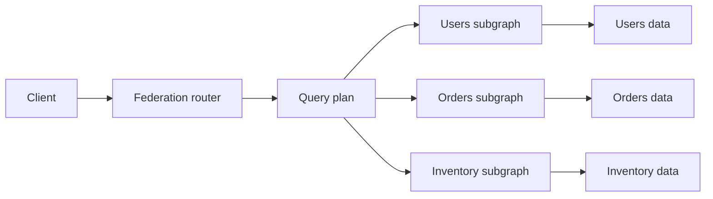
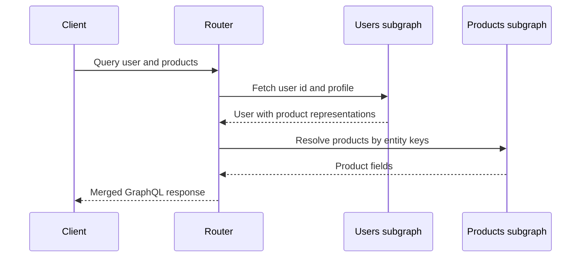

# GraphQL Federation

**GraphQL Federation** composes independently owned subgraph schemas into one
supergraph that a router can plan and execute. It lets teams own domains such
as users, products, and orders while clients query one graph.

Federation is not just schema stitching. Composition records which subgraph
resolves each field, which fields identify an entity, and which fields the
router must fetch before resolving a dependent field.

## The composed graph



- **Subgraph schema:** a team-owned schema and resolver implementation.
- **Supergraph schema:** the composed public schema plus routing metadata.
- **Router:** validates and plans the client operation, then merges subgraph
  responses.
- **Entity:** a type that can be identified and resolved across subgraphs.
- **Value type:** a type whose fields are composed by value rather than by a
  cross-subgraph identity.

Composition should run in CI before publication. A schema can be individually
valid and still fail composition because fields, directives, keys, or value
types disagree across subgraphs.

## Entities and keys

An entity has a key field set that identifies the object:

```graphql
# products subgraph
 type Product @key(fields: "id") {
   id: ID!
   name: String!
   price: Money!
 }
```

Another subgraph can extend the entity and resolve fields it owns:

```graphql
# inventory subgraph
 extend type Product @key(fields: "id") {
   id: ID! @external
   inStock: Boolean!
   quantity: Int!
 }
```

The router can first fetch `Product.id` from one subgraph, then send an entity
representation to the other subgraph. A composite key such as
`@key(fields: "tenant { id } sku")` is useful when an ID is only unique within
a tenant, but complex keys increase coupling and query-plan cost.

### Entity resolver contract

A subgraph that contributes fields to an entity needs a reference resolver. The
router sends representations containing the type name and key fields. The
subgraph must return the corresponding entity objects without trusting client
input as authorization.

## Federation directives

| Directive | Purpose |
|---|---|
| `@key` | Declares an entity identity field set |
| `@external` | Uses a field resolved by another subgraph |
| `@requires` | Requests external fields needed to compute a field |
| `@provides` | Declares fields available from a returned entity path |
| `@shareable` | Allows multiple subgraphs to resolve the same field when compatible |
| `@override` | Moves field ownership from one subgraph to another |
| `@inaccessible` | Keeps a definition available for composition but hides it from clients |
| `@interfaceObject` | Contributes fields to all entities implementing an interface |

Directive availability depends on Federation version and router support. Import
only the directives a subgraph uses and pin the federation spec URL with
`@link` where required.

## Query planning

A router turns a client operation into a plan:

1. Fetch root fields from the owning subgraph.
2. Extract entity keys from the result.
3. Batch representations and fetch fields from another subgraph.
4. Apply `@requires` dependencies before the dependent resolver.
5. Merge the response into the client shape.



The plan may fan out across subgraphs. Avoid accidental N+1 entity calls by
batching representations, selecting bounded fields, and measuring subgraph
latency separately from router overhead.

## Value types and shared fields

A value type without identity is composed by matching its definitions. If two
subgraphs define the same value type inconsistently, composition may fail or
produce a type whose fields cannot be resolved reliably.

`@shareable` can allow multiple subgraphs to resolve a field, but both resolvers
must return compatible semantics. It is not a license for two services to
silently disagree about authorization, freshness, or calculation.

Use `@inaccessible` to roll out a field across subgraphs before exposing it in
the public API. Use `@override` for an ownership migration, and remove the old
resolver only after traffic and composition checks prove the migration safe.

## Schema governance

Federation makes schema changes distributed changes. A production workflow
should include:

- Local composition checks with the same federation/router version as CI.
- Registry checks against the published supergraph and active client usage.
- Contract variants for different consumers or deployment stages.
- Breaking-change checks before removing fields or changing nullability.
- Ownership rules for entities, keys, directives, and shared value types.
- Deprecation windows and an explicit removal process.
- Query-plan and subgraph performance tests for high-fanout operations.

Composition success is necessary but not sufficient. A query can compose while
still being too expensive, under-authorized, or sensitive to one subgraph's
availability.

## Failure modes

- **Missing key:** the router cannot jump from one subgraph to another.
- **Unresolvable field:** a subgraph contributes a field but cannot resolve the
  required representation.
- **Inconsistent value type:** definitions differ across subgraphs.
- **Circular `@requires`:** fields form a dependency cycle.
- **Over-fetching:** a broad entity key or selection creates high fan-out.
- **Partial failure:** one subgraph times out; decide whether the field is
  nullable, cached, degraded, or an operation-level failure.
- **Security confusion:** authentication at the router does not replace
  authorization in every subgraph.
- **Schema drift:** a registered schema differs from what is deployed.

## Interview questions

**Federation versus a single GraphQL schema?**

A single schema has centralized ownership and simpler composition. Federation
splits ownership and deployment while preserving one client graph, but adds
composition, routing, entity resolution, and governance complexity.

**What does `@requires` do?**

It tells the router to fetch fields from an owning subgraph before calling a
resolver that depends on those fields, even when the client did not request
them directly.

**Why is `@shareable` dangerous?**

Two subgraphs can return different values for a field depending on route,
freshness, authorization, or rollout. Shared fields need identical semantics
and compatible nullability/types.

**How do you migrate a field between subgraphs?**

Introduce the new owner, mark the old field for override according to the
federation version, run composition and usage checks, observe both paths, and
remove the old owner only after the migration is complete.

## Cross-references

- [GraphQL](./graphql.md)
- [API Design](./README.md)
- [Service Mesh xDS](../containers/xds-protocol.md)
- [OpenTelemetry](../observability/opentelemetry.md)
- [Distributed Systems](../../distributed/overview.md)
- [Rate Limiting](./rate-limiting.md)

## References

- [Apollo: Federated schemas](https://www.apollographql.com/docs/graphos/schema-design/federated-schemas/schema-types)
- [Apollo: Schema composition](https://www.apollographql.com/docs/graphos/schema-design/federated-schemas/composition)
- [Apollo: Federation directives](https://www.apollographql.com/docs/graphos/schema-design/federated-schemas/reference/directives)
- [Apollo: Value types and shared fields](https://www.apollographql.com/docs/graphos/schema-design/federated-schemas/sharing-types)
- [Apollo: Composition hints](https://www.apollographql.com/docs/graphos/schema-design/federated-schemas/composition)
- [GraphQL specification](https://spec.graphql.org/)
