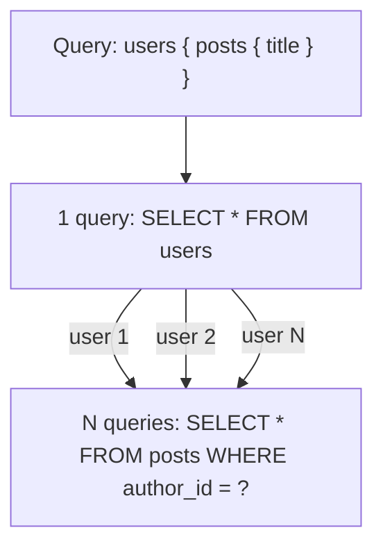
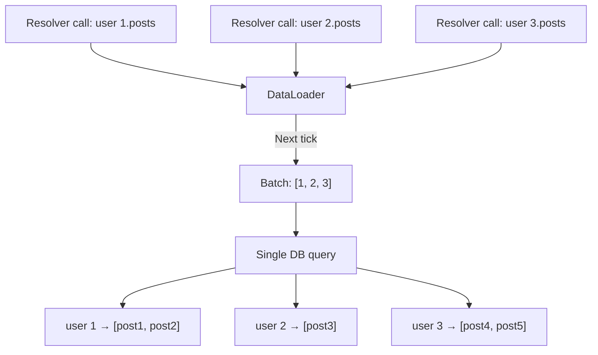
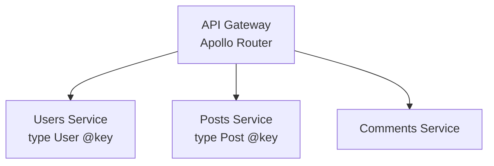

# GraphQL

GraphQL is a query language for APIs and a runtime for fulfilling those queries with your existing data. It gives clients the power to ask for exactly what they need — nothing more, nothing less.

## Overview

GraphQL was developed by Facebook in 2012 and open-sourced in 2015. Unlike REST where the server defines the response shape, GraphQL lets the client specify exactly which fields it wants.

### Why GraphQL?

- **No over-fetching** — Clients get exactly the fields they request
- **No under-fetching** — Related data in a single request
- **Strong typing** — Schema defines the API contract
- **Introspection** — Clients can discover the API schema
- **Single endpoint** — One URL for all operations

## Schema Definition Language (SDL)

```graphql
type Query {
  user(id: ID!): User
  users(limit: Int, offset: Int): UserConnection!
  post(id: ID!): Post
}

type Mutation {
  createUser(input: CreateUserInput!): User!
  updateUser(id: ID!, input: UpdateUserInput!): User!
  deleteUser(id: ID!): Boolean!
}

type Subscription {
  postCreated: Post!
  userStatusChanged(userId: ID!): User!
}

type User {
  id: ID!
  name: String!
  email: String!
  posts: [Post!]!
  followers: [User!]!
  createdAt: DateTime!
}

type Post {
  id: ID!
  title: String!
  content: String!
  author: User!
  comments: [Comment!]!
  likes: Int!
}

input CreateUserInput {
  name: String!
  email: String!
}

type UserConnection {
  edges: [UserEdge!]!
  pageInfo: PageInfo!
  totalCount: Int!
}

type UserEdge {
  node: User!
  cursor: String!
}

type PageInfo {
  hasNextPage: Boolean!
  endCursor: String
}
```

## Scalar Types

| Type | Description |
|------|-------------|
| `Int` | 32-bit integer |
| `Float` | Double-precision floating point |
| `String` | UTF-8 string |
| `Boolean` | true or false |
| `ID` | Unique identifier (serialized as String) |

Custom scalars: `DateTime`, `URL`, `JSON`, `Email`

## Queries

```graphql
# Simple query
query {
  user(id: "123") {
    name
    email
  }
}

# Query with arguments
query {
  users(limit: 10, offset: 0) {
    edges {
      node {
        id
        name
        posts {
          title
        }
      }
    }
    pageInfo {
      hasNextPage
      endCursor
    }
  }
}

# Fragments for reusable field sets
fragment UserFields on User {
  id
  name
  email
  createdAt
}

query {
  user(id: "123") {
    ...UserFields
    posts {
      title
    }
  }
}
```

## Mutations

```graphql
mutation {
  createUser(input: { name: "Alice", email: "alice@example.com" }) {
    id
    name
    email
  }
}

# Multiple mutations in one request
mutation {
  user: updateUser(id: "123", input: { name: "Bob" }) {
    id
    name
  }
  post: createPost(input: { title: "Hello", authorId: "123" }) {
    id
    title
  }
}
```

## Subscriptions

```graphql
subscription OnNewPost {
  postCreated {
    id
    title
    author {
      name
    }
  }
}
```

Subscriptions use WebSockets (typically the `graphql-ws` protocol) to push real-time updates to clients.

## Resolvers

Resolvers are functions that fetch data for each field in the schema.

```javascript
const resolvers = {
  Query: {
    user: async (parent, { id }, context) => {
      return context.dataSources.userAPI.getUser(id);
    },
    users: async (parent, { limit, offset }, context) => {
      return context.dataSources.userAPI.getUsers(limit, offset);
    },
  },

  User: {
    posts: async (user, args, context) => {
      return context.dataSources.postAPI.getPostsByAuthor(user.id);
    },
    followers: async (user, args, context) => {
      return context.dataSources.userAPI.getFollowers(user.id);
    },
  },

  Mutation: {
    createUser: async (parent, { input }, context) => {
      return context.dataSources.userAPI.createUser(input);
    },
  },
};
```

## The N+1 Problem

The N+1 problem is GraphQL's biggest performance challenge. When querying a list of users with their posts, naive resolvers make N+1 database queries.



### Without DataLoader

```
Query: users(limit: 10) { posts { title } }

1 query:  SELECT * FROM users LIMIT 10
10 queries: SELECT * FROM posts WHERE author_id = 1
            SELECT * FROM posts WHERE author_id = 2
            ...
            SELECT * FROM posts WHERE author_id = 10

Total: 11 queries
```

### With DataLoader

```javascript
const DataLoader = require('dataloader');

// Batch function
const postsByAuthorLoader = new DataLoader(async (authorIds) => {
  const posts = await db.posts.findAll({
    where: { authorId: { [Op.in]: authorIds } }
  });

  // Return posts grouped by authorId in the same order
  return authorIds.map(id =>
    posts.filter(post => post.authorId === id)
  );
});

// Resolver
const resolvers = {
  User: {
    posts: (user, args, context) => {
      return context.loaders.postsByAuthor.load(user.id);
    },
  },
};
```

```
With DataLoader:
1 query: SELECT * FROM users LIMIT 10
1 query: SELECT * FROM posts WHERE author_id IN (1, 2, ..., 10)

Total: 2 queries
```

### DataLoader Batching Window



## Authentication and Authorization

```javascript
// Context setup — runs for every request
const server = new ApolloServer({
  typeDefs,
  resolvers,
  context: async ({ req }) => {
    const token = req.headers.authorization?.replace('Bearer ', '');
    const user = token ? await verifyToken(token) : null;
    return { user, loaders: createLoaders() };
  },
});

// Field-level authorization directive
const resolvers = {
  Query: {
    users: withAuth(['admin'], async (parent, args, context) => {
      return context.dataSources.userAPI.getUsers();
    }),
  },
  User: {
    email: (user, args, context) => {
      // Only return email if it's the user's own profile or admin
      if (context.user?.id === user.id || context.user?.role === 'admin') {
        return user.email;
      }
      return null;
    },
  },
};
```

## Error Handling

```json
{
  "data": {
    "user": null
  },
  "errors": [
    {
      "message": "User not found",
      "locations": [{ "line": 2, "column": 3 }],
      "path": ["user"],
      "extensions": {
        "code": "NOT_FOUND",
        "userId": "123"
      }
    }
  ]
}
```

### Partial Data

GraphQL returns partial data when possible — if one field errors, others still resolve:

```json
{
  "data": {
    "user": {
      "name": "Alice",
      "posts": null
    }
  },
  "errors": [
    {
      "message": "Failed to fetch posts",
      "path": ["user", "posts"]
    }
  ]
}
```

## Federation

Apollo Federation lets you compose multiple GraphQL services into a single graph.



```graphql
# Users Service
type User @key(fields: "id") {
  id: ID!
  name: String!
  email: String!
}

# Posts Service
type Post @key(fields: "id") {
  id: ID!
  title: String!
  author: User!
}

extend type User @key(fields: "id") {
  id: ID! @external
  posts: [Post!]!
}
```

## GraphQL vs REST vs gRPC

| Aspect | GraphQL | REST | gRPC |
|--------|---------|------|------|
| Data fetching | Client specifies fields | Server defines shape | Server defines shape |
| Over-fetching | None | Common | Common |
| Under-fetching | None | Common | Common |
| Endpoint | Single | Multiple | Per-service |
| Caching | Complex | HTTP caching | Manual |
| File upload | Multipart spec | Native | Streaming |
| Real-time | Subscriptions | SSE/WebSockets | Streaming |
| Tooling | Excellent (Apollo, Relay) | Excellent | Good |
| Learning curve | Medium | Low | Medium |

## Persisted Queries

Instead of sending the full query string every time, send a hash:

```json
{
  "id": "hash_of_query_string",
  "variables": { "id": "123" }
}
```

Benefits: Reduced bandwidth, allowlisting (only registered queries execute), better caching.

## Common Mistakes

1. **Not using DataLoader** — N+1 queries kill performance
2. **Returning everything** — Exposing sensitive fields without access control
3. **No query complexity limits** — Clients can craft expensive queries
4. **Ignoring HTTP caching** — GraphQL POST requests don't cache by default
5. **No pagination** — Returning unbounded lists
6. **Putting business logic in resolvers** — Resolvers should be thin
7. **No error handling** — Letting internal errors leak to clients
8. **Monolithic schema** — Not using federation for large teams
9. **No rate limiting** — GraphQL queries can be arbitrarily complex
10. **Not using fragments** — Duplicating field selections

## Production Best Practices

- **Use DataLoader** for every relationship resolver
- **Set query depth limits** — Prevent deeply nested queries
- **Implement query complexity analysis** — Assign costs to fields
- **Use persisted queries** — Reduce bandwidth and enable allowlisting
- **Cache at the resolver level** — Use Redis for expensive lookups
- **Monitor with tracing** — Track resolver execution time
- **Use fragments** for reusable field sets
- **Implement proper error handling** — Use error codes, not stack traces
- **Version via schema evolution** — Deprecate fields, don't version the endpoint
- **Use federation** for team scalability

## Interview Questions

### 1. What is the N+1 problem in GraphQL and how do you solve it?

**Answer:** When querying a list of items with related data, naive resolvers make 1 query for the list + N queries for each item's relations. DataLoader solves this by batching and caching: it collects all IDs requested in a single tick, makes one batched query (`WHERE id IN (...)`), and distributes results back to each resolver.

### 2. How does GraphQL differ from REST?

**Answer:** REST has multiple endpoints with server-defined response shapes; GraphQL has one endpoint where clients specify exactly what fields they need. GraphQL eliminates over-fetching and under-fetching. REST benefits from HTTP caching; GraphQL requires different caching strategies. GraphQL has a stronger type system via its schema definition language.

### 3. What are GraphQL subscriptions?

**Answer:** Subscriptions are a real-time communication pattern where the server pushes data to clients when events occur. They use WebSockets (graphql-ws protocol). The client subscribes to an event (e.g., `postCreated`), and the server pushes updates whenever new posts are created. Useful for chat, notifications, and live dashboards.

### 4. How do you handle authentication in GraphQL?

**Answer:** Authentication happens in the context creation function, which runs before resolvers. Extract the token from the Authorization header, verify it, and attach the user to the context. Authorization can be implemented at the resolver level (check `context.user` permissions), via directives (`@auth(role: ADMIN)`), or with middleware/shield libraries.

### 5. Explain Apollo Federation.

**Answer:** Federation lets multiple teams own different parts of a single GraphQL schema. Each team has their own service (subgraph) with their portion of the schema. An Apollo Router (or Gateway) composes these subgraphs into a supergraph. Entities (types with `@key`) can be extended across services — the Users service defines `User` and the Posts service extends it with `posts`.

### 6. What are persisted queries and why use them?

**Answer:** Instead of sending the full query string, the client sends a hash (ID) of the query. Benefits: (1) Reduced network payload, (2) Security — only pre-registered queries can execute (allowlisting), (3) Better CDN caching. Apollo supports Automatic Persisted Queries (APQ) where the client first sends the hash; if the server doesn't recognize it, the client re-sends with the full query.

### 7. How do you paginate in GraphQL?

**Answer:** Two approaches: (1) Offset-based — `users(limit: 10, offset: 20)`, simple but unstable with concurrent changes. (2) Cursor-based (Relay specification) — `users(first: 10, after: "cursor")` returning edges with cursors and `PageInfo` (hasNextPage, endCursor). Cursor-based is preferred for its stability with large datasets.

### 8. What is query complexity analysis?

**Answer:** Each field is assigned a cost based on its complexity (list fields get multiplied by their estimated size). Before execution, the query's total cost is calculated and compared against a threshold. If it exceeds the limit, the query is rejected. This prevents clients from crafting expensive queries that could DoS the server.

### 9. How do you handle file uploads in GraphQL?

**Answer:** GraphQL doesn't natively support file uploads. Common approaches: (1) Multipart request specification (graphql-multipart-request-spec) — encode files as multipart form data alongside the GraphQL operation. (2) Pre-signed URL — mutation returns a pre-signed S3 URL, client uploads directly, then confirms. The second approach is more scalable.

### 10. What is the difference between fragments and inline fragments?

**Answer:** Named fragments (`fragment UserFields on User { ... }`) are reusable selections that can be referenced with `...UserFields`. Inline fragments (`... on Admin { permissions }`) are used inline for type conditions in unions/interfaces. Named fragments promote reuse; inline fragments handle polymorphism.

### 11. How would you design a GraphQL schema for a social media app?

**Answer:** Core types: `User`, `Post`, `Comment`, `Like`. Use connections (Relay-style) for paginated lists. Define mutations for CRUD operations with input types. Add subscriptions for real-time features (new posts, messages). Use federation to split into services: Users, Posts, Feed, Notifications. Implement DataLoader for all relationships.

### 12. How does GraphQL handle errors differently from REST?

**Answer:** GraphQL always returns HTTP 200 (unless the server crashes). Errors are included in the `errors` array alongside partial `data`. Each error has a message, path, and extensions (with error code). This allows partial success — some fields resolve while others error. REST uses HTTP status codes, which makes the entire request a success or failure.
