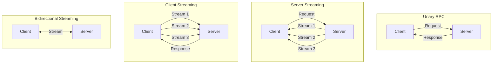
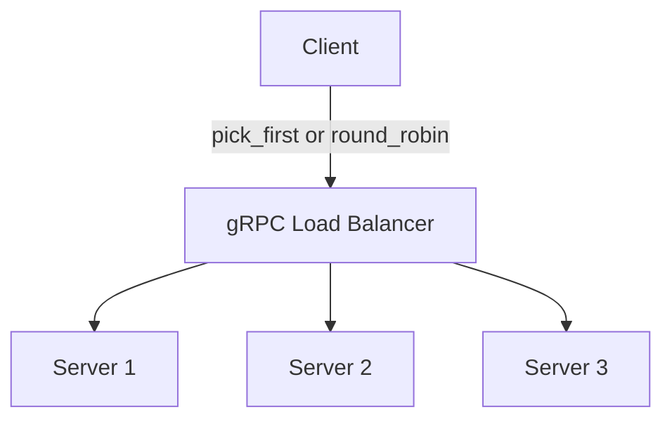

# gRPC (Google Remote Procedure Call)

gRPC is a high-performance, open-source RPC framework that uses Protocol Buffers for serialization and HTTP/2 for transport. It's designed for low-latency, high-throughput communication between microservices.

## Overview

gRPC was originally developed by Google and is now a CNCF graduated project. It excels in service-to-service communication where performance matters.

### Why gRPC?

- **Performance** — Binary serialization (Protobuf) is 5-10x faster than JSON
- **HTTP/2** — Multiplexing, header compression, bidirectional streaming
- **Code Generation** — Auto-generate client/server stubs in multiple languages
- **Strong Typing** — Schema-first design with Protocol Buffers
- **Streaming** — Four communication patterns beyond simple request-response

## Protocol Buffers (Protobuf)

Protocol Buffers are Google's language-neutral, platform-neutral mechanism for serializing structured data.

### Message Definition

```protobuf
syntax = "proto3";

package userservice;

import "google/protobuf/timestamp.proto";

message User {
  string id = 1;
  string name = 2;
  string email = 3;
  UserRole role = 4;
  google.protobuf.Timestamp created_at = 5;
  repeated string tags = 6;
  map<string, string> metadata = 7;
}

enum UserRole {
  USER_ROLE_UNSPECIFIED = 0;
  USER_ROLE_MEMBER = 1;
  USER_ROLE_ADMIN = 2;
}
```

### Field Numbering Rules

| Rule | Description |
|------|-------------|
| Numbers 1-15 | Use 1 byte for encoding (use for frequent fields) |
| Numbers 16-2047 | Use 2 bytes |
| Never reuse field numbers | Causes data corruption in production |
| Reserve removed fields | `reserved 2, 15, 9 to 11;` |

### Wire Types

| Type | Wire Type | Used For |
|------|-----------|----------|
| Varint | 0 | int32, int64, bool, enum |
| 64-bit | 1 | fixed64, double |
| Length-delimited | 2 | string, bytes, embedded messages |
| 32-bit | 5 | fixed32, float |

## Service Definition

```protobuf
service UserService {
  // Unary RPC
  rpc GetUser(GetUserRequest) returns (User);

  // Server streaming
  rpc ListUsers(ListUsersRequest) returns (stream User);

  // Client streaming
  rpc CreateUsers(stream CreateUserRequest) returns (CreateUsersResponse);

  // Bidirectional streaming
  rpc Chat(stream ChatMessage) returns (stream ChatMessage);
}

message GetUserRequest {
  string user_id = 1;
}

message ListUsersRequest {
  int32 page_size = 1;
  string page_token = 2;
}

message CreateUserRequest {
  string name = 1;
  string email = 2;
}
```

## Four Communication Patterns



### 1. Unary RPC

One request, one response. The simplest pattern.

```go
// Server
func (s *server) GetUser(ctx context.Context, req *pb.GetUserRequest) (*pb.User, error) {
    user, err := s.userStore.Get(req.UserId)
    if err != nil {
        return nil, status.Errorf(codes.NotFound, "user %s not found", req.UserId)
    }
    return user, nil
}

// Client
user, err := client.GetUser(ctx, &pb.GetUserRequest{UserId: "123"})
```

### 2. Server Streaming

Client sends one request, server sends a stream of responses.

```go
// Server
func (s *server) ListUsers(req *pb.ListUsersRequest, stream pb.UserService_ListUsersServer) error {
    users := s.userStore.List(req.PageSize)
    for _, user := range users {
        if err := stream.Send(user); err != nil {
            return err
        }
    }
    return nil
}

// Client
stream, err := client.ListUsers(ctx, &pb.ListUsersRequest{PageSize: 100})
for {
    user, err := stream.Recv()
    if err == io.EOF {
        break
    }
    // process user
}
```

### 3. Client Streaming

Client sends a stream of requests, server sends one response.

```go
// Server
func (s *server) CreateUsers(stream pb.UserService_CreateUsersServer) error {
    count := 0
    for {
        req, err := stream.Recv()
        if err == io.EOF {
            return stream.SendAndClose(&pb.CreateUsersResponse{Created: int32(count)})
        }
        s.userStore.Create(req)
        count++
    }
}

// Client
stream, err := client.CreateUsers(ctx)
for _, userData := range users {
    stream.Send(&pb.CreateUserRequest{Name: userData.Name})
}
resp, err := stream.CloseAndRecv()
```

### 4. Bidirectional Streaming

Both client and server send streams independently.

```go
// Server
func (s *server) Chat(stream pb.UserService_ChatServer) error {
    for {
        msg, err := stream.Recv()
        if err == io.EOF {
            return nil
        }
        // Echo back with modification
        stream.Send(&pb.ChatMessage{Content: "Echo: " + msg.Content})
    }
}
```

## gRPC vs REST

| Aspect | gRPC | REST |
|--------|------|------|
| Protocol | HTTP/2 | HTTP/1.1 (typically) |
| Format | Protobuf (binary) | JSON (text) |
| Performance | ~10x faster | Baseline |
| Streaming | Full bidirectional | Limited (SSE, WebSocket) |
| Browser Support | Via gRPC-Web proxy | Native |
| Code Generation | Built-in | Optional (OpenAPI) |
| Schema | .proto files | OpenAPI/Swagger |
| Human Readable | No (binary) | Yes (JSON) |
| Latency | Lower | Higher |

## Error Handling

gRPC uses status codes instead of HTTP status codes.

### Status Codes

| Code | Name | Description |
|------|------|-------------|
| 0 | OK | Success |
| 1 | CANCELLED | Client cancelled |
| 2 | UNKNOWN | Unknown error |
| 3 | INVALID_ARGUMENT | Bad request |
| 4 | DEADLINE_EXCEEDED | Timeout |
| 5 | NOT_FOUND | Resource not found |
| 6 | ALREADY_EXISTS | Conflict |
| 7 | PERMISSION_DENIED | Authz failure |
| 8 | RESOURCE_EXHAUSTED | Rate limit / quota |
| 9 | FAILED_PRECONDITION | Precondition failed |
| 10 | ABORTED | Operation aborted |
| 11 | OUT_OF_RANGE | Out of range |
| 12 | UNIMPLEMENTED | Not implemented |
| 13 | INTERNAL | Internal error |
| 14 | UNAVAILABLE | Service down |
| 15 | DATA_LOSS | Unrecoverable data loss |
| 16 | UNAUTHENTICATED | Authn failure |

### Rich Error Model

```protobuf
import "google/rpc/error_details.proto";

// Server returns structured errors
st := status.New(codes.InvalidArgument, "invalid email")
st, _ = st.WithDetails(&errdetails.BadRequest_FieldViolation{
    Field:       "email",
    Description: "must be a valid email address",
})
return nil, st.Err()
```

## Interceptors

Interceptors are middleware for gRPC — they run before/after each RPC.

### Unary Interceptor

```go
func loggingInterceptor(
    ctx context.Context,
    req interface{},
    info *grpc.UnaryServerInfo,
    handler grpc.UnaryHandler,
) (interface{}, error) {
    start := time.Now()
    resp, err := handler(ctx, req)
    log.Printf("method=%s duration=%s err=%v", info.FullMethod, time.Since(start), err)
    return resp, err
}

server := grpc.NewServer(
    grpc.UnaryInterceptor(loggingInterceptor),
)
```

### Chaining Interceptors

```go
import "google.golang.org/grpc/middleware"

server := grpc.NewServer(
    grpc.ChainUnaryInterceptor(
        loggingInterceptor,
        authInterceptor,
        rateLimitInterceptor,
    ),
)
```

## Metadata and Context

```go
// Client sends metadata
md := metadata.Pairs("authorization", "Bearer token123")
ctx := metadata.NewOutgoingContext(context.Background(), md)
resp, err := client.GetUser(ctx, req)

// Server reads metadata
md, ok := metadata.FromIncomingContext(ctx)
token := md.Get("authorization")
```

## Deadlines and Timeouts

```go
// Client sets deadline
ctx, cancel := context.WithTimeout(context.Background(), 5*time.Second)
defer cancel()
resp, err := client.GetUser(ctx, req)

// Server checks deadline
if ctx.Err() == context.DeadlineExceeded {
    return nil, status.Error(codes.Deadline_EXCEEDED, "deadline exceeded")
}
```

## Load Balancing



| Strategy | Behavior |
|----------|----------|
| `pick_first` | Connect to first address, use it for all RPCs |
| `round_robin` | Distribute RPCs across all connected servers |
| Custom | Implement `balancer.Builder` interface |

gRPC uses client-side load balancing by default. For Kubernetes, use headless services with round-robin.

## Common Mistakes

1. **Reusing field numbers in Protobuf** — Causes data corruption
2. **Not setting deadlines** — RPCs hang forever
3. **Blocking in handlers** — Use goroutines for long operations
4. **Not handling `io.EOF` in streams** — Causes infinite loops
5. **Using gRPC for browser clients** — Use gRPC-Web or REST gateway
6. **Not using interceptors** — Duplicating cross-cutting logic
7. **Ignoring error codes** — Treating all errors as `INTERNAL`
8. **Not reserving removed fields** — Future conflicts
9. **Sending too-large messages** — Default max is 4MB
10. **Not using connection pooling** — Creating new connections per request

## Production Best Practices

- **Always set deadlines** — Every client call should have a timeout
- **Use interceptors** for cross-cutting concerns (logging, auth, tracing)
- **Implement health checking** — Use `grpc.health.v1.Health` service
- **Use graceful shutdown** — `server.GracefulStop()` instead of `server.Stop()`
- **Compress large messages** — Enable gzip compression
- **Use connection pooling** — Reuse `grpc.ClientConn`
- **Implement retry policies** — Use `grpc.WithDefaultServiceConfig`
- **Monitor with Prometheus** — Track latency, errors, request counts
- **Use streaming for large datasets** — Don't send 10MB+ unary responses
- **Version your protos** — Use package versioning (`userservice.v2`)

## Interview Questions

### 1. What is gRPC and when would you choose it over REST?

**Answer:** gRPC is a high-performance RPC framework using Protocol Buffers and HTTP/2. Choose it over REST when: (1) you need low-latency service-to-service communication, (2) you want strong typing with code generation, (3) you need bidirectional streaming, or (4) you're in a polyglot microservices environment. Stick with REST for browser-facing APIs or when human readability matters.

### 2. Explain the four gRPC communication patterns.

**Answer:** (1) Unary — one request, one response, like a regular function call. (2) Server streaming — client sends one request, server sends multiple responses (e.g., live feeds). (3) Client streaming — client sends multiple requests, server sends one response (e.g., file upload). (4) Bidirectional streaming — both sides send streams independently (e.g., chat).

### 3. How does gRPC achieve better performance than REST?

**Answer:** Three key factors: (1) Protocol Buffers use binary serialization which is 5-10x smaller and faster than JSON parsing. (2) HTTP/2 multiplexing allows multiple requests over a single TCP connection without head-of-line blocking. (3) HTTP/2 header compression (HPACK) reduces overhead on repeated headers.

### 4. What are Protocol Buffer field numbers and why do they matter?

**Answer:** Field numbers are identifiers used in the binary wire format, not field names. Numbers 1-15 use 1 byte (optimized for frequent fields). Once a field number is published, it must never be reused even if the field is removed — use `reserved` to prevent reuse. Reusing numbers causes data corruption as old encoded data would be misinterpreted.

### 5. How do you handle errors in gRPC?

**Answer:** gRPC has 16 status codes mapped to common scenarios. Use `status.New()` to create errors with codes and messages. For structured errors, use `st.WithDetails()` to attach `errdetails` like `BadRequest`, `RetryInfo`, or `DebugInfo`. Clients extract details via `status.FromError()`.

### 6. What are gRPC interceptors?

**Answer:** Interceptors are middleware that execute before/after RPC handlers. Unary interceptors handle request-response calls; stream interceptors handle streaming calls. Common uses: logging, authentication, rate limiting, metrics collection, error handling. They can be chained using `grpc.ChainUnaryInterceptor()`.

### 7. How do you implement streaming in gRPC?

**Answer:** For server streaming, the handler takes a stream object and calls `stream.Send()` for each response. For client streaming, the handler calls `stream.Recv()` in a loop until `io.EOF`. For bidirectional, both sides send and receive concurrently, typically using goroutines. Always handle `io.EOF` to detect stream completion.

### 8. How does gRPC handle load balancing?

**Answer:** gRPC uses client-side load balancing by default. The client maintains connections to multiple servers and distributes RPCs using a balancing strategy (round-robin, pick-first, or custom). This differs from REST where a traditional load balancer distributes HTTP requests. For Kubernetes, use headless services so the client gets all pod IPs.

### 9. What is gRPC-Web and when do you need it?

**Answer:** gRPC-Web is a JavaScript client library that lets browser-based apps communicate with gRPC services. Browsers can't make HTTP/2 requests with full gRPC framing, so gRPC-Web uses a modified protocol. You need a proxy (Envoy, grpc-web-proxy) to translate between gRPC-Web and standard gRPC.

### 10. How do you version a gRPC API?

**Answer:** Use package versioning in proto files: `package userservice.v2;`. This generates different Go/Java/Python packages for each version. Alternatively, add version to the service name: `UserServiceV2`. Keep old versions running in parallel and deprecate on a schedule. Never change existing message definitions — add new fields or create new messages.

### 11. Explain deadlines in gRPC.

**Answer:** Deadlines specify how long a client is willing to wait for an RPC to complete. They propagate across service calls — if service A calls B with a 5s deadline, and A already used 3s, B gets a 2s deadline. Servers should check `ctx.Err()` and return `DEADLINE_EXCEEDED` if expired. Always set deadlines on the client side to prevent cascading failures.

### 12. What is the maximum message size in gRPC and how do you handle large payloads?

**Answer:** Default max is 4MB for both request and response. For large payloads: (1) Increase limits with `grpc.MaxRecvMsgSize()`, (2) Use streaming to send data in chunks, (3) Store large data in object storage (S3) and send references, (4) Enable compression. Streaming is the preferred approach for large datasets.
