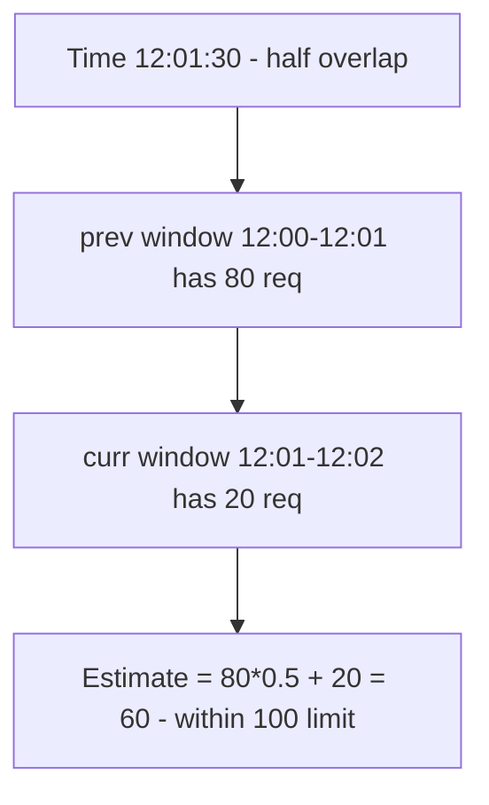
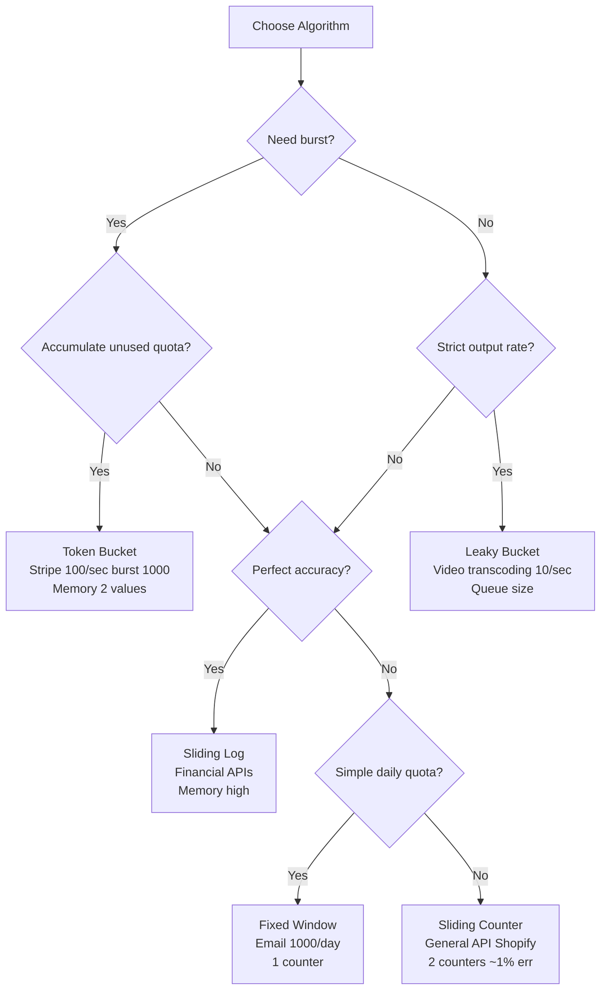

# Rate Limiting Algorithms — Token Bucket, Leaky Bucket, Sliding Window

## Overview

Rate limiting protects services from abuse, overload, and noisy neighbors. In interviews you must choose algorithm based on **burst tolerance, accuracy, memory, and distributed needs**. All 5 algorithms are implemented in Redis via Lua for atomicity.

> Related: [API Gateway](./api-gateway.md) (enforces at edge), [Load Balancing](../../networks/load-balancing/README.md), [Redis](../messaging/redis.md) (central counter store), [Probabilistic Data Structures](../../interview/system-design/probabilistic-data-structures.md) (Count-Min for heavy hitters)

## The 5 Algorithms

### 1. Fixed Window

Simple counter per window: `INCR key; EXPIRE key window`.

- **Pros**: 1 key memory, low CPU
- **Cons**: Boundary burst — allows 2× at window edges (e.g., 100 req/min: 100 at 12:00:59 + 100 at 12:01:00 → 200 in 2 seconds)

```
12:00:00 |--- 80 req ---|
12:01:00 |--- 80 req ---| → Still within 100/min per window, but 160 in 60s sliding
```

### 2. Sliding Window Log

Store timestamp of each request in sorted set; count in last window.

- **Accuracy**: Exact — no boundary burst
- **Memory**: O(n) per client (100 req → 100 timestamps)
- **Best**: Low-volume sensitive (financial APIs, login)

### 3. Sliding Window Counter — Best Balance

Hybrid: two fixed windows blended by overlap.

Estimate = `prev_window_count * overlap% + curr_window_count`.

- **Memory**: 2 keys
- **Accuracy**: ~1-2% error, smooths boundary bursts
- **Best**: General-purpose API limiting (Shopify, Twitter)



### 4. Token Bucket — Burst Tolerant (Stripe Model)

Bucket capacity `B`, refill rate `R` tokens/sec. Each request consumes 1 token; if empty → reject. Tokens accumulate when idle up to `B`.

- **Allows bursts**: up to `B` at once, then average `R`
- **Memory**: 1 hash with 2 fields (tokens, last_refill)
- **Best**: Public APIs needing burst tolerance (Stripe: 100/sec, burst 1000)

```
Bucket capacity 100, refill 100/min
Idle 1 min → bucket full 100
Burst 80 req in 1 sec → 20 tokens left → allow
Next 1 min refill 100 → allows another burst
```

### 5. Leaky Bucket — Strict Output Rate (Smooth)

Queue: requests enter bucket, work leaves at constant rate. If bucket full → reject (policing) or queue + delay (shaping).

Dual of token bucket: token bucket starts full and spends, leaky starts empty and fills.

- **No bursts**: smooths traffic, protects fragile downstream (video transcoding: 10 jobs/sec steady)
- **Memory**: queue size
- **Implementation**: shaping (delay) vs policing (drop)

## Comparison

| Algorithm | Redis Type | Memory/client | Accuracy | Burst | Best For |
|-----------|------------|---------------|----------|-------|----------|
| Fixed Window | STRING + Lua INCR/EXPIRE | 1 key | Approximate (boundary burst) | Allows 2× at edges | Simple quotas, login throttling |
| Sliding Log | SORTED SET + Lua | O(n) entries | Exact | No bursts | High-value audit, low volume |
| Sliding Counter | STRING×2 + Lua | 2 keys | Near-exact ~1% err | Smoothed | General API limiting (default) |
| Token Bucket | HASH (tokens, last_refill) + Lua | 1 key 2 fields | Exact | Allows controlled bursts | Bursty traffic, Stripe model |
| Leaky Bucket | HASH/QUEUE + Lua | 1 key | Exact | No bursts, steady | Fragile downstream, shaping |

Source: Redis tutorials — Build 5 Rate Limiters with Redis [redis.io] and AlgoMaster rate limiting [algomaster.io], Layrs.me decision tree [layrs.me]

## Distributed Rate Limiting

Single node token bucket not enough — need shared state.

### Centralized Redis

All app instances `INCR` + `EXPIRE` or Lua script for atomic read-modify-write.

```lua
-- Token bucket Lua (atomic)
local tokens_key = KEYS[1]
local timestamp_key = KEYS[2]
local rate = tonumber(ARGV[1])
local capacity = tonumber(ARGV[2])
local now = tonumber(ARGV[3])
local requested = tonumber(ARGV[4])

local last_tokens = tonumber(redis.call("get", tokens_key) or capacity)
local last_refreshed = tonumber(redis.call("get", timestamp_key) or 0)
local delta = math.max(0, now - last_refreshed)
local filled = math.min(capacity, last_tokens + delta * rate)
local allowed = filled >= requested
local new_tokens = filled
if allowed then new_tokens = filled - requested end

redis.call("set", tokens_key, new_tokens)
redis.call("set", timestamp_key, now)
return { allowed, new_tokens }
```

Trade-offs: extra network RTT per request (+1-2ms), availability — if Redis down, fail open (allow) vs fail closed (reject) decision.

### Local + Sync (Hybrid)

Each node has local token bucket, syncs periodically with central store (e.g., every second). Better latency, less accurate (over-limit by #nodes × window).

### Gateway Enforcement

API Gateway (Kong, Envoy RateLimitService, AWS API Gateway) enforces at edge, returns `429 Too Many Requests` with `Retry-After`, `X-RateLimit-Limit`, `X-RateLimit-Remaining`, `X-RateLimit-Reset`.

Envoy's `local_ratelimit` filter + `ratelimit` service using token bucket.

## Interview Decision Tree



Default rule: token bucket for per-user API keys, sliding counter when boundary bursts problem, sliding log for sensitive low-volume, fixed window for simple quotas, leaky bucket for fragile downstream.

## Implementations

### Redis (Recommended for Interviews)

All 5 algorithms implemented with TypeScript + Lua in Redis tutorial [redis.io]. Choose sliding counter for best balance.

### Go — Standard Library + Tools

```go
// Token bucket via golang.org/x/time/rate
lim := rate.NewLimiter(100, 1000) // 100/sec, burst 1000
if !lim.Allow() { http.Error(w, "429", 429) }

// Leaky bucket shaping via buffered channel + ticker
```

## Cross-References

- [API Gateway](./api-gateway.md) — central rate limiting at edge, Envoy RateLimitService
- [Redis](../messaging/redis.md) — INCR/EXPIRE, Lua atomicity, sorted sets for sliding log
- [Load Balancing](../../networks/load-balancing/README.md) — protects backends
- [Token Bucket vs Leaky Bucket Duality](https://en.wikipedia.org/wiki/Token_bucket) — mathematical duals
- [Probabilistic Data Structures](../../interview/system-design/probabilistic-data-structures.md) — Count-Min for heavy hitters detection to apply stricter limits

## References

- Redis Official Tutorial: Build 5 Rate Limiters with Redis — Fixed Window STRING+Lua 1 key approx, Sliding Log SORTED SET O(n) exact, Sliding Counter 2 keys near-exact, Token Bucket HASH 2 fields exact burst, Leaky Bucket HASH exact no burst [redis.io]
- AlgoMaster — Rate Limiting Algorithms: Leaky bucket small queue smooths, sliding counter blends overlap 80*overlap+20, token bucket capacity 100 refill 100/min [algomaster.io]
- Layrs.me — Rate Limiting: Token Bucket for APIs needing burst (Stripe 100/sec burst 1000), Leaky for strict output (video), Fixed for simple quotas (Twitter 300/3hrs), Sliding for precise (Shopify prevents boundary gaming) [layrs.me]
