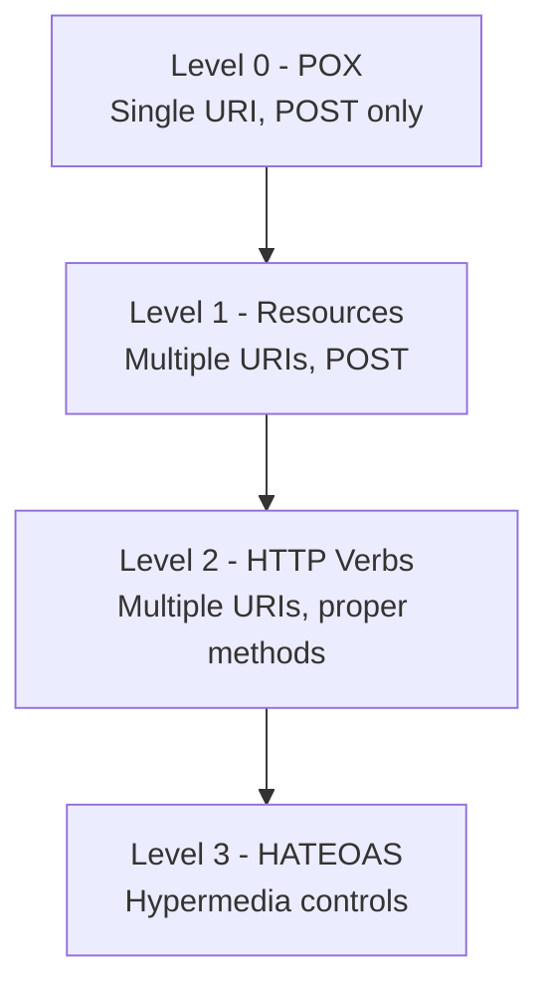
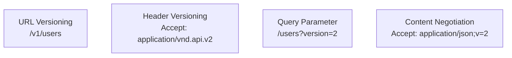

# REST (Representational State Transfer)

REST is an architectural style for designing networked applications. It relies on stateless, client-server communication using HTTP methods and resource-based URLs. REST is the most widely adopted API paradigm in modern web development.

## Overview

REST was defined by Roy Fielding in his 2000 doctoral dissertation. It is not a protocol but a set of constraints that, when applied, produce scalable, maintainable, and performant web services.

### Why REST?

- **Simplicity** — Uses standard HTTP methods and status codes
- **Scalability** — Statelessness enables horizontal scaling
- **Cacheability** — HTTP caching reduces server load
- **Interoperability** — Any HTTP client can consume REST APIs
- **Discoverability** — HATEOAS enables self-describing APIs

## REST Constraints

| Constraint | Description |
|-----------|-------------|
| **Client-Server** | Separation of concerns between UI and data storage |
| **Stateless** | Each request contains all information needed to process it |
| **Cacheable** | Responses must define themselves as cacheable or not |
| **Uniform Interface** | Standardized way to interact with resources |
| **Layered System** | Client cannot tell if it's connected directly to the server |
| **Code on Demand** (optional) | Server can extend client functionality |

## Richardson Maturity Model

Leonard Richardson defined four levels of REST maturity:



### Level 0 — The Swamp of POX

One endpoint, one HTTP method (usually POST), using XML or JSON as a tunnel for remote procedure calls.

```
POST /api
{
  "action": "getOrder",
  "orderId": "123"
}
```

### Level 1 — Resources

Introduce distinct URIs for each resource, but still use POST for everything.

```
POST /orders/123
{
  "action": "get"
}
```

### Level 2 — HTTP Verbs

Use proper HTTP methods (GET, POST, PUT, DELETE) and status codes.

```
GET /orders/123
→ 200 OK
{ "id": 123, "status": "shipped" }
```

### Level 3 — HATEOAS

Responses include hypermedia links that tell the client what actions are available next.

```json
{
  "id": 123,
  "status": "shipped",
  "links": [
    { "rel": "self", "href": "/orders/123", "method": "GET" },
    { "rel": "cancel", "href": "/orders/123/cancel", "method": "POST" },
    { "rel": "tracking", "href": "/orders/123/tracking", "method": "GET" }
  ]
}
```

## Resource Naming Best Practices

| Rule | Good | Bad |
|------|------|-----|
| Use nouns | `/users` | `/getUsers` |
| Plural collections | `/orders` | `/order` |
| Nested for relationships | `/users/123/orders` | `/getUserOrders` |
| Lowercase with hyphens | `/order-items` | `/OrderItems` |
| No file extensions | `/users/123` | `/users/123.json` |
| Consistent naming | `/users`, `/orders` | `/users`, `/fetch-orders` |

### URL Structure

```
/{version}/{resource}              → Collection
/{version}/{resource}/{id}         → Single resource
/{version}/{resource}/{id}/{sub}   → Sub-resource

GET    /v1/users          → List users
POST   /v1/users          → Create user
GET    /v1/users/123      → Get user 123
PUT    /v1/users/123      → Update user 123
PATCH  /v1/users/123      → Partial update
DELETE /v1/users/123      → Delete user 123
GET    /v1/users/123/orders → User's orders
```

## HTTP Methods and Idempotency

| Method | Purpose | Idempotent | Safe | Request Body |
|--------|---------|------------|------|-------------|
| GET | Retrieve resource | ✅ | ✅ | No |
| POST | Create resource | ❌ | ❌ | Yes |
| PUT | Replace resource | ✅ | ❌ | Yes |
| PATCH | Partial update | ❌* | ❌ | Yes |
| DELETE | Remove resource | ✅ | ❌ | Optional |
| HEAD | GET without body | ✅ | ✅ | No |
| OPTIONS | Allowed methods | ✅ | ✅ | No |

*PATCH can be made idempotent with JSON Merge Patch.

## HTTP Status Codes

### Success (2xx)

| Code | Meaning | When to Use |
|------|---------|-------------|
| 200 | OK | Successful GET, PUT, PATCH |
| 201 | Created | Successful POST that creates a resource |
| 202 | Accepted | Request accepted for async processing |
| 204 | No Content | Successful DELETE, no response body |

### Redirection (3xx)

| Code | Meaning | When to Use |
|------|---------|-------------|
| 301 | Moved Permanently | Resource URL changed permanently |
| 302 | Found | Temporary redirect |
| 304 | Not Modified | Cache is still valid |

### Client Error (4xx)

| Code | Meaning | When to Use |
|------|---------|-------------|
| 400 | Bad Request | Invalid request syntax or data |
| 401 | Unauthorized | Missing or invalid authentication |
| 403 | Forbidden | Authenticated but not authorized |
| 404 | Not Found | Resource doesn't exist |
| 405 | Method Not Allowed | HTTP method not supported |
| 409 | Conflict | Resource state conflict |
| 422 | Unprocessable Entity | Validation errors |
| 429 | Too Many Requests | Rate limit exceeded |

### Server Error (5xx)

| Code | Meaning | When to Use |
|------|---------|-------------|
| 500 | Internal Server Error | Unexpected server error |
| 502 | Bad Gateway | Upstream service failure |
| 503 | Service Unavailable | Server overloaded or down |
| 504 | Gateway Timeout | Upstream timeout |

## Versioning Strategies



| Strategy | Example | Pros | Cons |
|----------|---------|------|------|
| URL Path | `/v1/users` | Simple, explicit | URL pollution |
| Header | `X-API-Version: 2` | Clean URLs | Hard to test in browser |
| Query Param | `/users?v=2` | Easy to default | Caching issues |
| Content Negotiation | `Accept: application/vnd.api.v2+json` | RESTful | Complex |

## HATEOAS (Hypermedia as the Engine of Application State)

HATEOAS is the most mature level of REST. The API response includes links that tell the client what actions are available.

### Benefits

- **Discoverability** — Clients navigate the API dynamically
- **Decoupling** — Server can change URLs without breaking clients
- **Self-documenting** — Responses describe available actions

### Example Response

```json
{
  "order": {
    "id": "ORD-2024-001",
    "status": "pending_payment",
    "total": 99.99,
    "links": [
      {
        "rel": "self",
        "href": "/v1/orders/ORD-2024-001",
        "method": "GET"
      },
      {
        "rel": "payment",
        "href": "/v1/orders/ORD-2024-001/payment",
        "method": "POST"
      },
      {
        "rel": "cancel",
        "href": "/v1/orders/ORD-2024-001/cancel",
        "method": "POST"
      }
    ]
  }
}
```

### Link Relation Types

| Relation | Meaning |
|----------|---------|
| `self` | The resource itself |
| `next` / `prev` | Pagination |
| `create` | Create a new resource |
| `edit` | Edit the resource |
| `delete` | Delete the resource |

## Pagination

### Offset-Based

```http
GET /v1/users?offset=20&limit=10
```

```json
{
  "data": [...],
  "pagination": {
    "offset": 20,
    "limit": 10,
    "total": 150
  }
}
```

**Problem:** Inconsistent results when data changes between pages.

### Cursor-Based

```http
GET /v1/users?cursor=eyJpZCI6MTAwfQ&limit=10
```

```json
{
  "data": [...],
  "pagination": {
    "next_cursor": "eyJpZCI6MTEwfQ",
    "has_more": true
  }
}
```

**Advantage:** Stable pagination even with concurrent inserts.

## Filtering, Sorting, and Field Selection

```http
GET /v1/orders?status=shipped&sort=-created_at&fields=id,status,total
```

| Feature | Convention |
|---------|-----------|
| Filter | `?field=value` or `?field[gt]=value` |
| Sort | `?sort=field` (ascending), `?sort=-field` (descending) |
| Fields | `?fields=a,b,c` (sparse fieldsets) |
| Search | `?q=search_term` |

## Error Response Format

```json
{
  "error": {
    "code": "VALIDATION_ERROR",
    "message": "Request validation failed",
    "details": [
      {
        "field": "email",
        "message": "Must be a valid email address",
        "value": "not-an-email"
      },
      {
        "field": "age",
        "message": "Must be between 0 and 150",
        "value": -5
      }
    ],
    "request_id": "req-abc-123"
  }
}
```

## Common Mistakes

1. **Not using proper HTTP methods** — Using GET for everything or POST for reads
2. **Ignoring status codes** — Returning 200 for errors with error in body
3. **Tunneling RPC through REST** — `/getUser`, `/createOrder` instead of resource-based URLs
4. **Not versioning APIs** — Breaking clients when making changes
5. **Over-nesting resources** — `/users/123/orders/456/items/789/reviews` (max 2-3 levels)
6. **Exposing internal IDs** — Using database auto-increment IDs instead of UUIDs
7. **Not handling pagination** — Returning unbounded result sets
8. **Inconsistent error formats** — Different error structures across endpoints
9. **Ignoring idempotency** — PUT/DELETE not idempotent
10. **No request validation** — Accepting any input without validation

## Production Best Practices

- **Use HTTPS everywhere** — No exceptions
- **Implement rate limiting** — Protect against abuse
- **Use request IDs** — For tracing and debugging
- **Compress responses** — gzip/brotli for large payloads
- **Cache aggressively** — Use ETags, Cache-Control headers
- **Validate input early** — Fail fast with clear error messages
- **Use OpenAPI/Swagger** — Document your API with a machine-readable spec
- **Implement CORS properly** — Don't use `Access-Control-Allow-Origin: *`
- **Log all requests** — Method, path, status, duration
- **Use timeouts** — Don't let requests hang forever

## Interview Questions

### 1. What are the six constraints of REST?

**Answer:** Client-Server, Stateless, Cacheable, Uniform Interface, Layered System, and Code on Demand (optional). These constraints together produce the properties that make REST scalable and maintainable.

### 2. Explain the Richardson Maturity Model.

**Answer:** It has four levels: Level 0 (single URI, single method — the "swamp of POX"), Level 1 (multiple URIs for resources), Level 2 (proper HTTP verbs and status codes), and Level 3 (HATEOAS with hypermedia links). Most "REST" APIs operate at Level 2.

### 3. What is the difference between PUT and PATCH?

**Answer:** PUT replaces the entire resource — you must send the complete representation. PATCH applies a partial update — you only send the fields to change. PUT is idempotent; PATCH is not necessarily idempotent (though JSON Merge Patch can be).

### 4. When would you use 202 Accepted?

**Answer:** When the server accepts the request for processing but hasn't completed it yet. This is common for long-running operations like video processing, report generation, or async workflows. The response typically includes a location header or status endpoint to check progress.

### 5. How does HATEOAS improve API design?

**Answer:** HATEOAS makes APIs self-describing by including hypermedia links in responses. Clients discover available actions dynamically rather than hardcoding URLs. This decouples client and server — the server can change URL structures without breaking clients. It moves REST from Level 2 to Level 3 on the Richardson Maturity Model.

### 6. Compare URL versioning vs header versioning.

**Answer:** URL versioning (`/v1/users`) is simple, explicit, and easy to route, but pollutes URLs. Header versioning (`Accept: application/vnd.api.v2+json`) keeps URLs clean and is more RESTful, but is harder to test in browsers and less visible. Most production APIs use URL versioning for simplicity.

### 7. What is the N+1 problem in REST APIs?

**Answer:** When fetching a list of resources triggers additional requests for related data. For example, listing 100 orders and then fetching each order's customer separately (101 requests total). Solutions include: embedded resources (side-loading), GraphQL, batch endpoints, or API composition.

### 8. How do you handle partial updates in REST?

**Answer:** Use PATCH with a partial representation. For JSON, there are two approaches: JSON Patch (array of operations like add, remove, replace) and JSON Merge Patch (simply merge the partial object). JSON Merge Patch is simpler but can't set values to null explicitly.

### 9. Explain cursor-based vs offset-based pagination.

**Answer:** Offset-based (`?offset=20&limit=10`) skips records but becomes inefficient at high offsets and can miss/duplicate items when data changes. Cursor-based (`?cursor=abc&limit=10`) uses a pointer to the last seen item, providing stable pagination even with concurrent modifications. Cursors are preferred for large datasets and infinite scroll.

### 10. How do you design a REST API for file uploads?

**Answer:** Two approaches: (1) Multipart form upload via POST with `Content-Type: multipart/form-data`, simple but limited for large files. (2) Pre-signed URL pattern — client requests an upload URL, then uploads directly to cloud storage (S3, GCS), then confirms with the API. The second approach scales better and reduces server load.

### 11. What is the difference between 401 and 403?

**Answer:** 401 Unauthorized means the client is not authenticated — the request lacks valid credentials. 403 Forbidden means the client is authenticated but not authorized to perform the action. Think of 401 as "who are you?" and 403 as "I know who you are, but you can't do this."

### 12. How would you design an API for a multi-tenant system?

**Answer:** Options include: (1) URL-based tenant identification (`/tenants/acme/users`), (2) Header-based (`X-Tenant-ID: acme`), or (3) Subdomain-based (`acme.api.example.com`). Include tenant context in every request, enforce data isolation at the query level, and use row-level security or separate schemas in the database.
