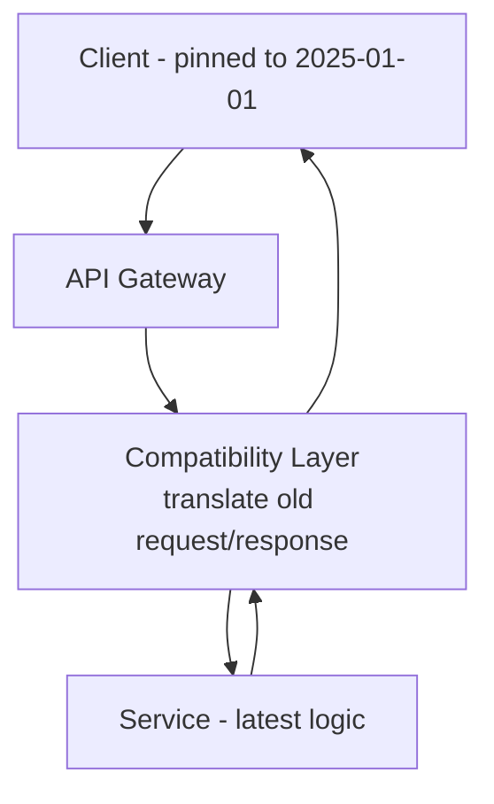
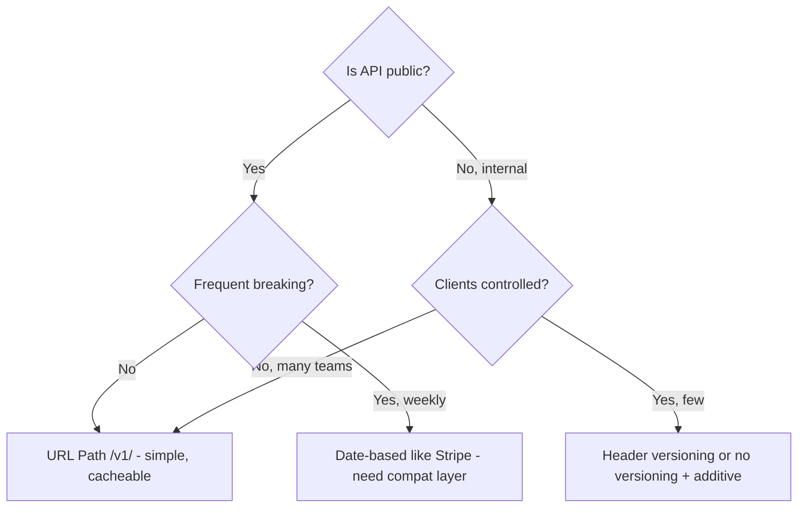

# API Versioning Strategies

## Overview

APIs outlive implementations. Breaking changes without versioning break clients. Good versioning balances **discoverability, cacheability, testability, and evolution**. In placement interviews, you must articulate why URL path versioning dominates public APIs, when header versioning is RESTful, and how Stripe's date-based pinning achieves zero breaking changes.

> Related: [REST](./rest.md), [gRPC](./grpc.md), [GraphQL](./graphql.md), [API Gateway](./api-gateway.md), [Idempotency](../patterns/idempotency.md)

## Strategies

| Strategy | Example | URL Impact | Caching | Testability | Best For |
|----------|---------|------------|---------|-------------|----------|
| **URL Path** | `/api/v1/users` | Version in URL | Excellent (URL varies) | Trivial (curl) | Public APIs, default choice |
| **Query Param** | `/api/users?v=1` | Param | Good | Easy | Quick escape hatch, migration |
| **Custom Header** | `X-API-Version: 1` | None (clean URL) | Poor (Vary header needed) | Moderate | Internal microservices |
| **Accept Header (Content Negotiation)** | `Accept: application/vnd.company.v1+json` | None | Poor | Hard | Enterprise, strict contracts |
| **Date-based (Stripe)** | `/api/2026-01-15/users` with account pinned version | Date in URL | Excellent | Moderate | Frequent releases, additive-only |
| **No versioning (evolution)** | `/api/users` additive only | None | Excellent | Trivial | Internal, rarely-changing |

### URL Path — Safest Default

```http
GET /api/v1/users HTTP/1.1
GET /api/v2/users?include=teams HTTP/1.1
```

- GitHub, Twitter, Google, Twilio use it.
- Pro: cache keys differ by URL, trivial to route in gateway (`/v1/` → service v1), curl friendly.
- Con: URL doesn't identify resource pure RESTfully.

### Header Versioning

```http
GET /api/users HTTP/1.1
Accept: application/vnd.company.v1+json
X-API-Version: 1
```

- Pro: clean URLs, REST purist (URL = resource, header = representation).
- Con: `Vary: Accept, X-API-Version` needed for caching else CDN serves wrong version; testing requires custom headers; discoverability poor.

GitHub supports both: default v3, preview via `Accept: application/vnd.github.mercy-preview+json`.

### Query Param — Anti-Pattern Long-Term

`GET /api/users?version=1` — easy to add retroactively to unversioned API, but pollutes query space, breaks caching if not included in `Vary`.

Use only for migration period.

### Content Negotiation — Theoretically Ideal, Practically Rare

Same URI, different representation via vendor media type. Requires sophisticated clients understanding HTTP content negotiation. Tooling (OpenAPI, Postman) struggles.

### Stripe Date-Based Pinning

Stripe never has `v1/v2` in URL for breaking changes. Instead:

- Each account pinned to API version date, e.g., `2026-01-15`
- Server sends `Stripe-Version: 2026-01-15` in response
- New fields added additively; breaking changes only visible when account upgrades version in dashboard
- Clients set `Stripe-Version` header to upgrade per-request

Result: **zero breaking changes** for existing accounts, new features additive. Requires version compatibility layer translating old → new internally.



## Evolution Without Versioning

Most changes can be **additive** without version bump:

- Add new endpoint: `/users/:id/teams` — no break
- Add optional request field: `include_archived?: bool` — old clients ignore
- Add response field: `users[].teams` — tolerant readers ignore unknown fields (Postel)
- Deprecate but don't remove: mark `X-Deprecated: true`, sunset header

Breaking changes requiring version bump: rename field, change type (int → string), remove endpoint, change auth, change pagination semantics.

## Decision Flow



## Implementation Patterns

### URL Path Routing

```go
// Gin example
r := gin.New()
v1 := r.Group("/api/v1")
v1.GET("/users", usersV1Handler)
v2 := r.Group("/api/v2")
v2.GET("/users", usersV2Handler)

// Gateway (Kong/Envoy): route /v1/ -> service-v1 cluster, /v2/ -> service-v2
```

### Header Middleware

```go
// Echo header versioning
e.Use(func(next echo.HandlerFunc) echo.HandlerFunc{
    return func(c echo.Context) error {
        ver := c.Request().Header.Get("X-API-Version")
        if ver == "" { ver = "v1" }
        c.Set("api_version", ver)
        return next(c)
    }
})
```

### Deprecation & Sunset

```http
HTTP/1.1 200 OK
Deprecation: true
Sunset: Sat, 31 Dec 2026 23:59:59 GMT
Sunset-Link: <https://docs.company.com/deprecations/v1-users>; rel="sunset"
X-API-Version: v1 (deprecated, use v2)
```

- `Deprecation` header (RFC 9745 Draft) signals deprecated
- `Sunset` gives removal date — clients can alert

## Interview Questions

**Q: URL path vs header versioning?**
URL path dominates public APIs for discoverability, caching (URL varies), trivial routing and curl testing. Header is more RESTful (URL identifies resource, header selects representation) but needs `Vary` for caching, harder to test, less discoverable. For internal microservices where you control all clients, header acceptable.

**Q: How does Stripe avoid breaking changes without v1/v2 URLs?**
Date-based version pinning: each account locked to API version date. New fields added additively; breaking semantics gated behind version. Compatibility layer translates old version requests/responses to latest logic. Clients upgrade by changing dashboard version + setting `Stripe-Version` header.

**Q: When can you avoid version bump?**
Additive changes: new endpoint, new optional request field, new response field (if clients are tolerant), new enum value (if clients handle unknown). Must avoid: renaming, removing, changing type, changing required → optional semantics.

**Q: How to handle versioning in gRPC?**
gRPC uses protobuf — field numbers never reuse, reserved fields, `oneof` for additive. Service version via package `v1`, `v2`. Breaking change → new package `company.api.v2` with new service, run both side-by-side, gateway routes.

**Q: Cache implications of header versioning?**
CDN cache key includes URL only by default. If version in header, cache may serve v1 response to v2 client unless `Vary: X-API-Version` set, which reduces hit rate. URL path versioning naturally varies cache by URL.

## Cross-References

- [REST](./rest.md) — REST principles
- [API Gateway](./api-gateway.md) — routing /v1/ vs /v2 clusters
- [GraphQL](./graphql.md) — schema evolution via deprecation, no URL versioning
- [gRPC](./grpc.md) — protobuf evolution rules
- [Idempotency](../patterns/idempotency.md) — safe retries across versions

## References

- API Versioning Strategies 2026: URL Path Dominance, Header Pain, Date-Based Pinning (Stripe) [apiscout.dev]
- API Versioning Reference: URL Path vs Query vs Accept Header vs Custom Header Table, Caching, Routing Complexity [knowledgelib.io]
- How to Version REST APIs Effectively: 4 Primary Approaches Flowchart [oneuptime.com]
- Stripe API Versioning Docs: https://docs.stripe.com/api/versioning
- GitHub REST API Versioning: Accept header preview
