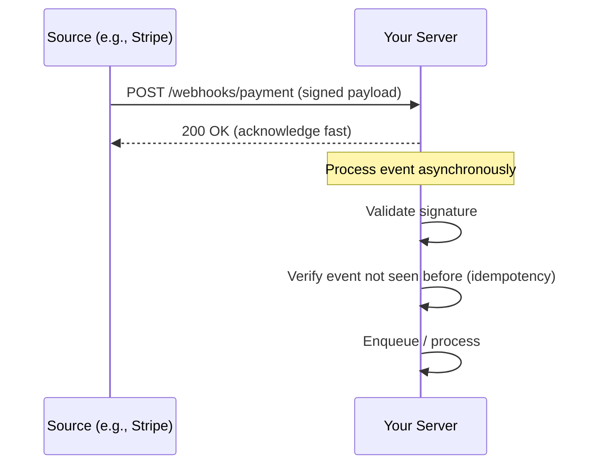
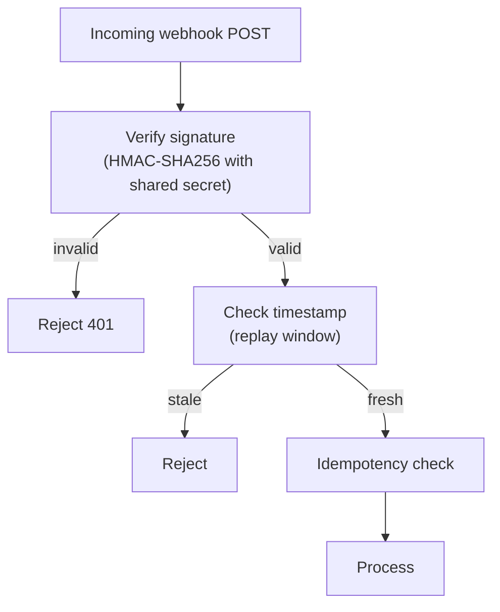

# Webhooks

## Overview

A **webhook** is an HTTP callback: instead of a client polling for changes, a server (or SaaS) **pushes** an HTTP request to a client-provided URL when an event occurs. Webhooks power integrations everywhere — Stripe payment events, GitHub repo events, Slack messages, CI notifications, and payment-notification flows.

## Webhook vs Polling vs SSE/WebSocket

| Mechanism | Direction | Latency | Use case |
|---|---|---|---|
| **Polling** | Client pulls | High (interval-bound) | Simple, fire-and-forget, no server push support |
| **Webhooks** | Server pushes on event | Near real-time | Event-driven integrations |
| **SSE** | Server pushes (one-way) | Real-time | Server→client streams over HTTP |
| **WebSocket** | Bidirectional | Real-time | Interactive apps, chat, live sync |

Webhooks invert the responsibility: the **provider must deliver** (with retries), and the **receiver must be secure and idempotent** (it can't control delivery timing).

## How It Works

1. **Registration** — the consumer supplies a URL (+ optional secret) to the provider.
2. **Delivery** — on event, provider POSTs a JSON (or form) payload to the URL.
3. **Acknowledge** — consumer returns `2xx` quickly; non-2xx triggers provider retries.
4. **Retries** — providers retry with backoff (e.g., Stripe: up to 3 days, exponential + jitter), and some offer **signature replay** for missed events.

## Reliability: Exactly-What Delivery Looks Like

Providers deliver **at least once** — the same event can arrive multiple times (retry after a timeout where the first attempt actually landed). Consumers must be **idempotent** (see [Idempotency](../patterns/idempotency.md)):

- Store processed event IDs (dedup keys).
- Use `Idempotency-Key`-style headers where available.
- Design handlers to converge (upsert, not insert).

## Security: Verify, Don't Trust

- **Signature** — provider signs the payload (HMAC-SHA256 with a shared secret; Stripe `v1`/`v2` signatures, GitHub `X-Hub-Signature-256`). Always verify with a **constant-time comparison**.
- **Replay protection** — signed timestamps let you reject old replays.
- **TLS** — always HTTPS endpoints.
- **Never parse untrusted payloads into dangerous operations** (SSRF is the classic webhook vulnerability: an attacker sends a webhook to `http://169.254.169.254/...` — validate and restrict target URLs, block private ranges).

## Consumer Design

- **Respond fast** — return `2xx` before doing heavy work; process asynchronously (queue). Slow responses cause provider retries → duplicates.
- **Handle duplicates** — dedup by event ID.
- **Handle ordering** — events may arrive out of order; include event sequence/timestamps and reconcile.
- **Observability** — log delivery, verify signature failures, monitor retry storms.
- **Dead letter** — if processing fails repeatedly, park events in a DLQ rather than letting the provider hammer you.

## Provider Design (if you expose webhooks)

- **Deliver with retries + backoff/jitter**, and a clear failure policy.
- **Sign payloads** and publish the signature scheme.
- **Provide replay / event log** APIs so consumers can backfill missed events.
- **Fan-out** — publish events to a broker ([Kafka](../../distributed/messaging/kafka.md), [NATS](../../backend/messaging/nats.md), [RabbitMQ](../../distributed/messaging/rabbitmq.md)) and deliver via worker pools; don't deliver synchronously inside the request path.

## Interview Questions

### Q: Webhooks vs polling — when would you use each?

Webhooks when you need low latency and the provider supports them, and you can be a good citizen (secure endpoint, idempotent, fast ack). Polling when you need simplicity, when the provider has no webhooks, when you're behind a NAT/firewall that can't receive inbound connections, or when event frequency is so low that periodic sync is cheaper than a push infrastructure.

### Q: How do you secure a webhook endpoint?

Verify the signature (HMAC with shared secret, constant-time compare), enforce HTTPS, check signed timestamps to block replays, restrict payload size, validate/allowlist the source, and never allow webhook-delivered URLs to trigger SSRF-able operations (e.g., fetching arbitrary URLs from the payload).

### Q: How do you handle duplicate webhook deliveries?

Treat delivery as at-least-once: dedup by event ID in a store with a unique constraint, make handlers idempotent (upserts), and acknowledge quickly so retries stop. The rare duplicate that slips through must converge to the same state.

## References

- Stripe webhooks documentation — https://docs.stripe.com/webhooks
- GitHub webhooks documentation — https://docs.github.com/en/webhooks
- RFC 9110 (HTTP semantics for status codes and headers) — https://www.rfc-editor.org/rfc/rfc9110
- AWS: webhook best practices / fan-out with SNS-SQS — https://docs.aws.amazon.com/sns/latest/dg/sns-lambda-as-subscriber.html

## Related Topics

- [Idempotency](../patterns/idempotency.md) — making webhook consumers safe
- [Event-Driven Architecture](../patterns/event-driven.md) — webhooks as one event delivery mechanism
- [HTTP APIs](./rest.md) — the HTTP foundation
- [API Gateways](./api-gateway.md) — where inbound webhooks often terminate
- [Retries and Backoff](../../distributed/microservices/README.md) — provider retry behavior
- [Kafka](../../distributed/messaging/kafka.md) — internal event fan-out
