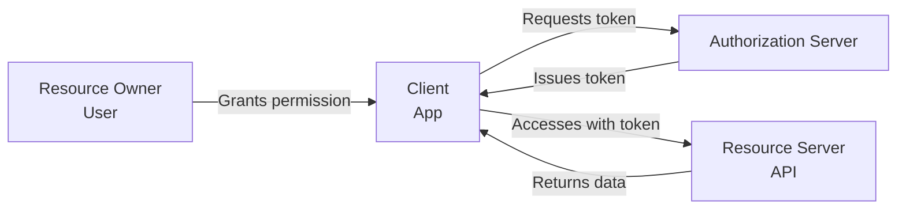
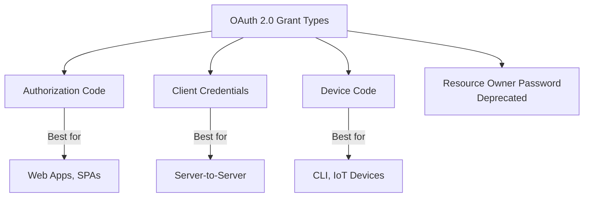
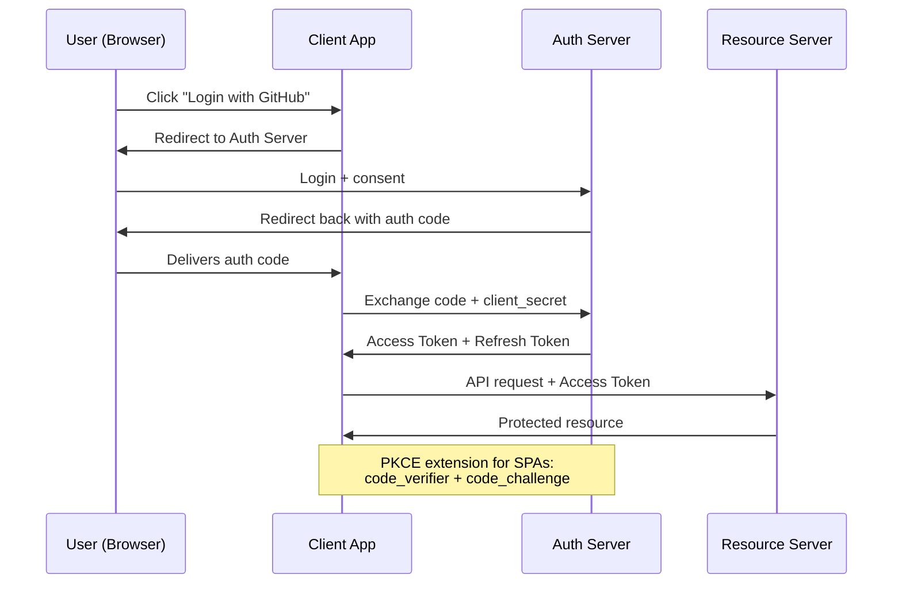
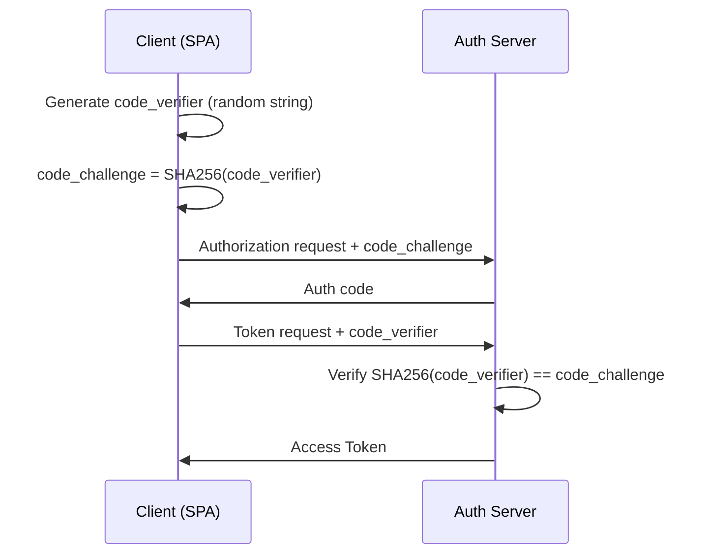
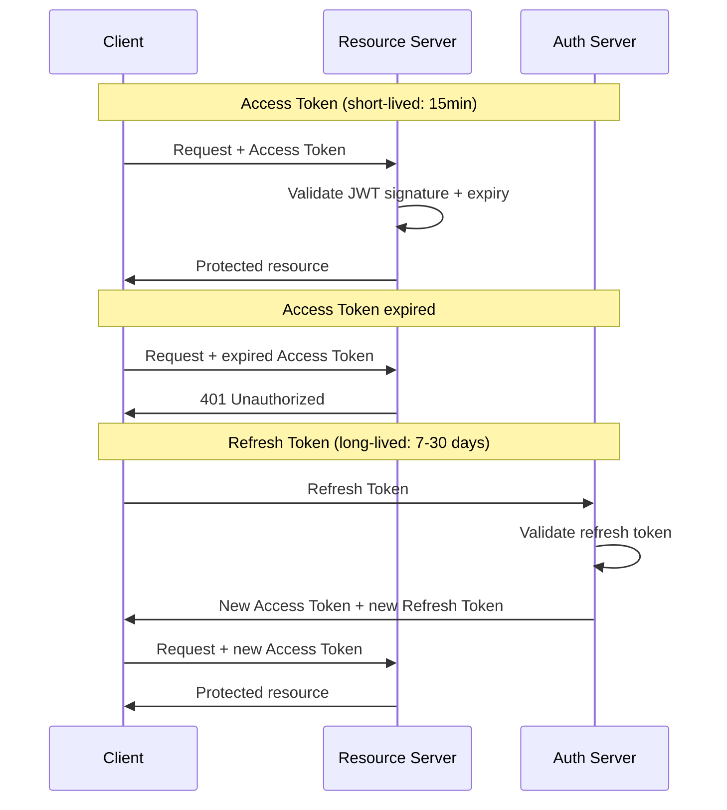
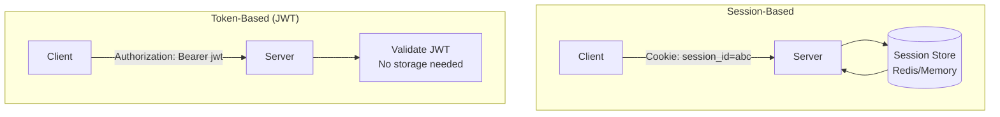
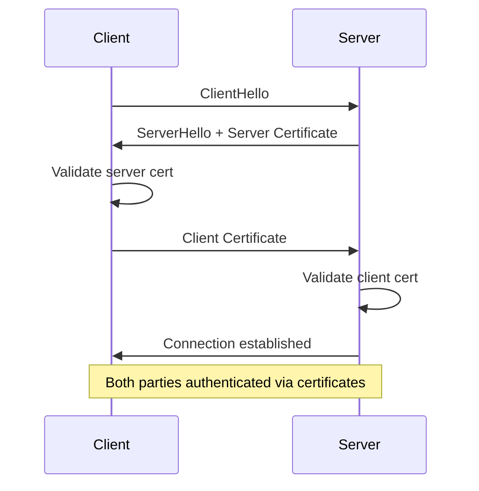
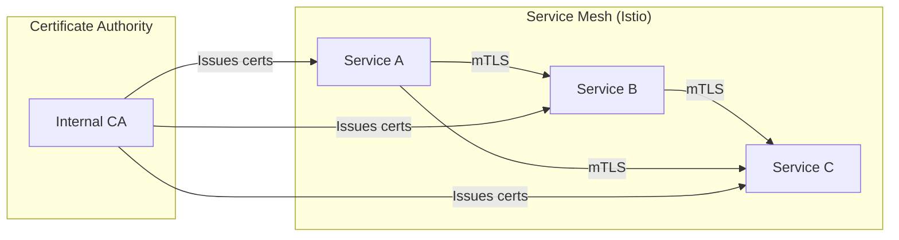
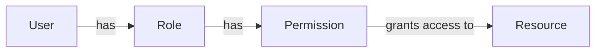

# Authentication & Authorization

Security is non-negotiable in backend systems. This section covers the protocols and patterns for verifying identity and controlling access in modern distributed applications.

## In This Section

- [OAuth 2.0](./oauth.md) — Delegated authorization framework
- [JWT](./jwt.md) — JSON Web Tokens for stateless authentication
- [Session Management](./session-management.md) — Server-side session strategies

## Authentication vs Authorization

| Aspect | Authentication | Authorization |
|--------|---------------|---------------|
| Question | "Who are you?" | "What can you do?" |
| Purpose | Verify identity | Grant access |
| Mechanism | Credentials, tokens | Policies, roles |
| Order | First | Second |
| Example | Login with password | Admin can delete users |

## OAuth 2.0

OAuth 2.0 is a **delegated authorization** framework that allows a user to grant a third-party application limited access to their resources without sharing credentials.

### Key Roles



| Role | Description | Example |
|------|-------------|---------|
| **Resource Owner** | The user who owns the data | You (GitHub user) |
| **Client** | The app requesting access | CI/CD tool |
| **Authorization Server** | Issues tokens after authentication | GitHub OAuth |
| **Resource Server** | Hosts the protected resources | GitHub API |

### Grant Types



### Authorization Code Flow (Most Common)



### PKCE (Proof Key for Code Exchange)

For public clients (SPAs, mobile apps) that can't store a `client_secret`:



### OAuth 2.0 Scopes

Scopes define the **granularity of access**:

```
# GitHub OAuth scopes
read:user        # Read user profile
repo             # Full access to repositories
repo:status      # Access commit statuses
read:org         # Read org membership

# Google OAuth scopes
openid           # OpenID Connect
profile          # User profile info
email            # User email
calendar.readonly # Read calendar
```

### Real-World OAuth Examples

| Provider | Authorization URL | Token URL |
|----------|------------------|-----------|
| **GitHub** | `github.com/login/oauth/authorize` | `github.com/login/oauth/access_token` |
| **Google** | `accounts.google.com/o/oauth2/v2/auth` | `oauth2.googleapis.com/token` |
| **Azure AD** | `login.microsoftonline.com/{tenant}/oauth2/v2.0/authorize` | `login.microsoftonline.com/{tenant}/oauth2/v2.0/token` |

## JWT (JSON Web Tokens)

JWT is a compact, URL-safe token format for securely transmitting claims between parties. It's the most common token format for modern APIs.

### JWT Structure

```
eyJhbGciOiJSUzI1NiJ9.eyJzdWIiOiIxMjM0NTY3ODkwIn0.signature
|        Header          |         Payload          | Signature |
```

```mermaid
graph LR
    subgraph "Header"
        H1[alg: RS256]
        H2[typ: JWT]
    end
    subgraph "Payload (Claims)"
        P1[sub: user-123]
        P2[name: Alice]
        P3[role: admin]
        P4[exp: 1700000000]
        P5[iat: 1699996400]
    end
    subgraph "Signature"
        S1[RSASHA256<br/>header.payload<br/>private_key)]
    end
```

### JWT Claims

| Claim | Name | Description | Required |
|-------|------|-------------|----------|
| `iss` | Issuer | Who issued the token | Yes |
| `sub` | Subject | User ID | Yes |
| `aud` | Audience | Intended recipient | Yes |
| `exp` | Expiration | Token expiry (Unix timestamp) | Yes |
| `nbf` | Not Before | Token valid from | No |
| `iat` | Issued At | When token was issued | No |
| `jti` | JWT ID | Unique token identifier | No |

### Access Token vs Refresh Token



### JWT Best Practices

| Practice | Why |
|----------|-----|
| Keep tokens short-lived (15-60 min) | Limits damage if stolen |
| Use RS256 (asymmetric) over HS256 (symmetric) | No shared secret needed for verification |
| Store in HttpOnly cookies (not localStorage) | Prevents XSS token theft |
| Include `aud` claim | Prevents token misuse across services |
| Validate on every request | Signature, expiry, issuer, audience |
| Use `jti` for token revocation | Track issued tokens for blacklisting |

## Session-Based vs Token-Based Authentication



| Aspect | Session-Based | Token-Based (JWT) |
|--------|--------------|-------------------|
| **Storage** | Server-side (Redis, DB) | Client-side |
| **Scalability** | Needs shared session store | Stateless, any server can validate |
| **Revocation** | Delete session from store | Hard (need blacklist or short expiry) |
| **Cross-domain** | Cookie domain restrictions | Works anywhere (Bearer header) |
| **Mobile support** | Cookie issues | Native support |
| **Use case** | Traditional web apps | APIs, SPAs, mobile, microservices |

### When to Use Which

- **Session-based**: Traditional server-rendered apps, need instant revocation, single domain
- **Token-based (JWT)**: Microservices, SPAs, mobile apps, cross-domain APIs
- **Hybrid**: Session for web + JWT for API (common in enterprise)

## mTLS (Mutual TLS)

In standard TLS, only the server proves its identity. In **mTLS**, both client and server present certificates, providing **two-way authentication**.



### mTLS vs Standard TLS

| Aspect | Standard TLS | mTLS |
|--------|-------------|------|
| **Server auth** | Yes (server cert) | Yes (server cert) |
| **Client auth** | No (password/token) | Yes (client cert) |
| **Use case** | Web browsers | Service-to-service |
| **Complexity** | Low | Higher (cert management) |
| **Zero trust** | Partial | Full |

### mTLS in Practice



**Real-world mTLS usage:**
- **Service meshes** (Istio, Linkerd): Automatic mTLS between all services
- **SPIFFE/SPIRE**: Standard for service identity in cloud-native
- **Banking/Finance**: Regulatory requirement for inter-service auth
- **Zero-trust networks**: Every connection verified, no implicit trust

## RBAC and ABAC

### Role-Based Access Control (RBAC)



```yaml
# RBAC Example (Kubernetes)
apiVersion: rbac.authorization.k8s.io/v1
kind: Role
metadata:
  name: pod-reader
rules:
- apiGroups: [""]
  resources: ["pods"]
  verbs: ["get", "list", "watch"]

---
apiVersion: rbac.authorization.k8s.io/v1
kind: RoleBinding
metadata:
  name: read-pods
subjects:
- kind: User
  name: alice
roleRef:
  kind: Role
  name: pod-reader
```

### Attribute-Based Access Control (ABAC)

More granular than RBAC—decisions based on attributes:

```json
{
  "policy": {
    "effect": "allow",
    "action": "read",
    "resource": "document:*",
    "condition": {
      "user.department": "engineering",
      "resource.classification": "internal",
      "time.hour": { "between": [9, 18] }
    }
  }
}
```

| Aspect | RBAC | ABAC |
|--------|------|------|
| **Granularity** | Role-level | Attribute-level |
| **Complexity** | Simple | Complex |
| **Flexibility** | Fixed roles | Dynamic conditions |
| **Use case** | Most apps | Government, healthcare, finance |

## Interview Questions

1. **What is the difference between authentication and authorization?**
   - Authentication verifies identity ("who are you?"). Authorization determines access ("what can you do?"). Authn always precedes authz.

2. **Explain the OAuth 2.0 Authorization Code flow.**
   - User clicks login → redirected to auth server → user authenticates and consents → auth server redirects back with code → client exchanges code + secret for tokens → uses access token to call API. PKCE extension adds `code_verifier`/`code_challenge` for public clients.

3. **What is JWT and what are its components?**
   - JWT has three parts: Header (algorithm, type), Payload (claims like sub, exp, iss), Signature (HMAC or RSA of header+payload). It's Base64URL-encoded and signed but not encrypted.

4. **When would you use sessions vs JWT?**
   - Sessions: server-rendered apps, need instant revocation, single domain. JWT: APIs, microservices, SPAs, mobile. JWT is stateless (scalable) but hard to revoke. Sessions are stateful (needs shared store) but easy to revoke.

5. **What is mTLS and when is it used?**
   - Mutual TLS where both client and server present certificates. Used for service-to-service auth in microservices, service meshes (Istio), and zero-trust networks. Both parties verify each other's identity.

6. **How do you secure JWT tokens?**
   - Short expiry (15-60 min), use RS256 (asymmetric), store in HttpOnly cookies, validate signature + expiry + issuer + audience on every request, use refresh tokens for renewal, implement token blacklisting for revocation.

7. **What is PKCE and why is it needed?**
   - PKCE (Proof Key for Code Exchange) prevents authorization code interception in public clients (SPAs, mobile). Client generates a `code_verifier`, sends its hash (`code_challenge`) in the auth request, and proves possession of the verifier when exchanging the code.

## Common Mistakes

- Storing JWTs in `localStorage` (vulnerable to XSS)—use `HttpOnly` cookies instead
- Making JWTs too long-lived (stolen tokens are valid for too long)
- Not validating the `aud` claim (tokens from other services accepted)
- Using symmetric signing (HS256) in microservices (shared secret distributed everywhere)
- Confusing OAuth 2.0 (authorization) with OpenID Connect (authentication)
- Skipping certificate validation in mTLS (defeats the purpose)
- Not rotating encryption keys and signing certificates

## Summary

| Method | Best For | Stateless? | Revocable? |
|--------|----------|-----------|------------|
| **Session** | Web apps | No | Instant |
| **JWT** | APIs, microservices | Yes | Hard (blacklist) |
| **OAuth 2.0** | Third-party access | Depends | Via revocation endpoint |
| **mTLS** | Service-to-service | Yes | Via cert revocation |
| **API Keys** | Server-to-server | Yes | Via key rotation |

## Cross-References

- [OAuth 2.0](./oauth.md) — Detailed OAuth flows
- [JWT](./jwt.md) — Token structure and validation
- [Session Management](./session-management.md) — Server-side sessions
- [API Gateway](../api/api-gateway.md) — Auth at the gateway
- [Service Mesh](../../distributed/microservices/service-mesh.md) — mTLS in practice
