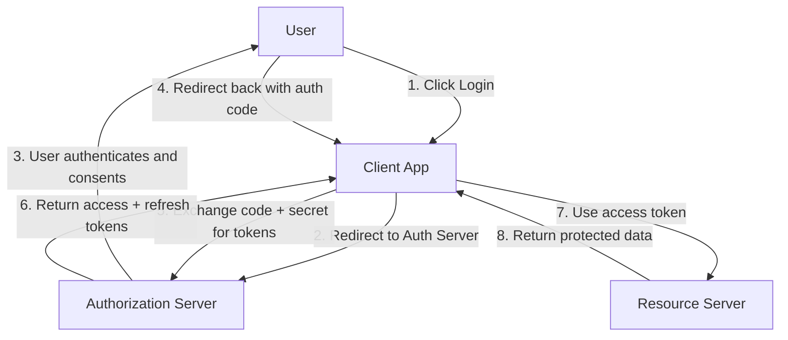
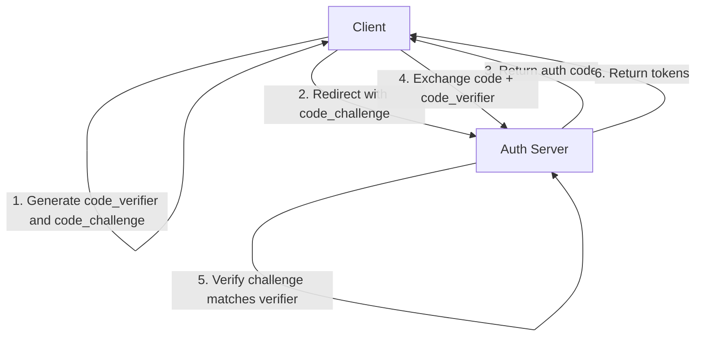
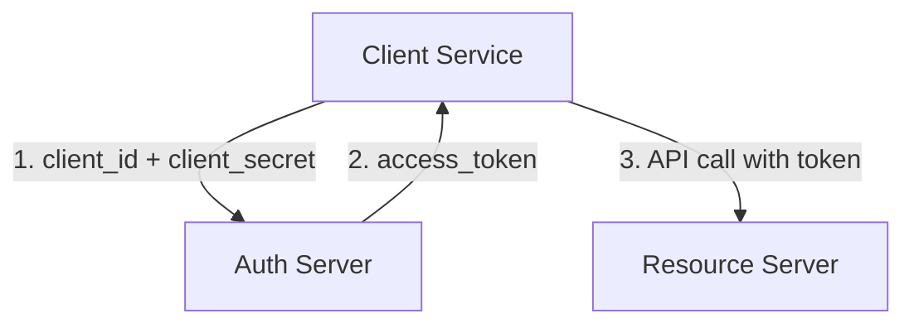
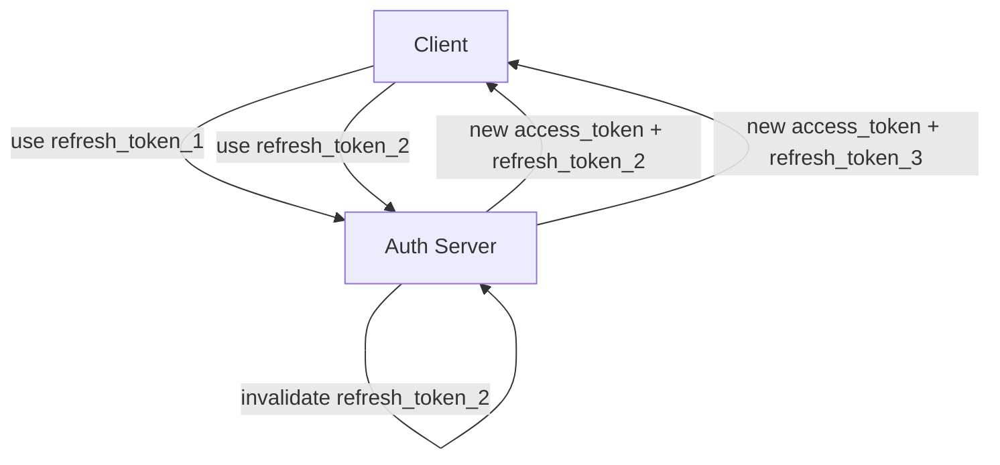

# OAuth 2.0 and OpenID Connect

## What Is OAuth?

**OAuth 2.0** is an authorization framework that allows a third-party application to obtain limited access to a user's resource, without exposing the user's credentials. It's the protocol behind "Sign in with Google" and "Allow this app to access your photos."

**Key principle**: OAuth is for **authorization** (what can this app do?), not **authentication** (who is this user?). OpenID Connect (OIDC) adds authentication on top.

---

## Core Concepts

### Roles

| Role | Description | Example |
|------|-------------|---------|
| **Resource Owner** | The user who owns the data | You (the user) |
| **Client** | The application requesting access | A third-party app |
| **Authorization Server** | Issues tokens after authenticating the user | Google, Auth0 |
| **Resource Server** | Hosts the protected resources | Google Photos API |

### Tokens

| Token | Purpose | Lifetime |
|-------|---------|----------|
| **Authorization Code** | Short-lived code exchanged for tokens | ~10 minutes |
| **Access Token** | Proves authorization to access resources | Minutes to hours |
| **Refresh Token** | Obtains new access tokens without user interaction | Days to months |
| **ID Token** (OIDC) | Proves user identity (JWT) | Minutes to hours |

---

## OAuth 2.0 Grant Types

### 1. Authorization Code Flow

The most secure and widely used flow. Recommended for server-side applications.



**Step-by-step:**

```
# Step 2: Client redirects user to authorization server
GET /authorize?
  response_type=code&
  client_id=abc123&
  redirect_uri=https://app.example.com/callback&
  scope=openid profile email&
  state=xyz789

# Step 4: Authorization server redirects back
GET /callback?
  code=AUTH_CODE_HERE&
  state=xyz789

# Step 5: Client exchanges code for tokens (server-to-server)
POST /token
Content-Type: application/x-www-form-urlencoded

grant_type=authorization_code&
code=AUTH_CODE_HERE&
redirect_uri=https://app.example.com/callback&
client_id=abc123&
client_secret=SECRET

# Step 6: Response
{
  "access_token": "eyJhbGciOiJSUzI1NiIs...",
  "token_type": "Bearer",
  "expires_in": 3600,
  "refresh_token": "dGhpcyBpcyBhIHJlZnJlc2g...",
  "id_token": "eyJhbGciOiJSUzI1NiIs..."
}
```

**Why it's secure**: The access token is never exposed to the user's browser. The client secret is only used in the server-to-server token exchange.

### 2. Authorization Code Flow with PKCE

**PKCE** (Proof Key for Code Exchange, pronounced "pixy") secures the authorization code flow for **public clients** (mobile apps, SPAs) that can't store a client secret.



```
# Client generates
code_verifier = random_string(43-128 chars)
code_challenge = BASE64URL(SHA256(code_verifier))

# Step 2: Authorization request includes challenge
GET /authorize?
  response_type=code&
  client_id=abc123&
  code_challenge=E9Melhoa2OwvFrEMTJguCHaoeK1t8URWbuGJSstw-cM&
  code_challenge_method=S256&
  ...

# Step 4: Token request includes verifier
POST /token
grant_type=authorization_code&
code=AUTH_CODE&
code_verifier=dBjftJeZ4CVP-mB92K27uhbUJU1p1r_wW1gFWFOEjXk
```

**Why PKCE matters**: Even if an attacker intercepts the authorization code, they can't exchange it without the `code_verifier`. The authorization server verifies: `SHA256(code_verifier) == code_challenge`.

### 3. Client Credentials Flow

For **machine-to-machine** communication where there's no user. The client authenticates directly with its own credentials.



```
POST /token
Content-Type: application/x-www-form-urlencoded

grant_type=client_credentials&
client_id=service-abc&
client_secret=SECRET&
scope=api:read
```

**Use cases**: Microservice-to-microservice calls, cron jobs, backend daemons.

### 4. Implicit Flow (Deprecated)

The access token is returned directly in the URL fragment. **No longer recommended** — use Authorization Code + PKCE instead.

```
# Token is in the URL fragment (visible in browser history)
GET /callback#access_token=eyJhbG...&token_type=Bearer&expires_in=3600
```

**Why deprecated**: The token is exposed in the URL, making it vulnerable to leakage via browser history, referrer headers, and network logs.

---

## OpenID Connect (OIDC)

OIDC is an identity layer on top of OAuth 2.0. It adds:

- **ID Token**: A JWT that proves the user's identity.
- **UserInfo Endpoint**: Returns user profile information.
- **Standard Scopes**: `openid`, `profile`, `email`, `address`, `phone`.
- **Discovery**: `/.well-known/openid-configuration` endpoint that lists all endpoints and capabilities.

### ID Token Structure

```json
{
  "iss": "https://auth.example.com",
  "sub": "user-123",
  "aud": "abc123",
  "exp": 1700000000,
  "iat": 1699996400,
  "nonce": "random-value",
  "email": "user@example.com",
  "name": "John Doe",
  "picture": "https://example.com/photo.jpg"
}
```

### OIDC vs OAuth

| Aspect | OAuth 2.0 | OpenID Connect |
|--------|-----------|----------------|
| Purpose | Authorization | Authentication + Authorization |
| Key Token | Access Token | ID Token + Access Token |
| User Info | Not standardized | Standardized claims |
| Scopes | Custom | `openid`, `profile`, `email` |
| Discovery | Not standardized | `.well-known/openid-configuration` |

---

## Scopes

Scopes define the boundaries of what the access token can do.

```
# Google OAuth scopes
scope=openid email profile https://www.googleapis.com/auth/calendar.readonly

# Custom API scopes
scope=read:users write:orders admin:billing
```

**Best practices**:
- Request the minimum scopes needed.
- Show users exactly what permissions you're requesting.
- Use granular scopes (`read:users` not `users`).

---

## Token Security

### Access Token Storage

| Storage | Secure for | XSS Risk | CSRF Risk |
|---------|-----------|----------|-----------|
| `localStorage` | SPAs | High (JS accessible) | Low |
| `sessionStorage` | SPAs | High (JS accessible) | Low |
| `HttpOnly` Cookie | Server-side apps | Low (not JS accessible) | High (needs CSRF protection) |
| In-memory variable | SPAs | Low (cleared on refresh) | Low |

**Recommended for SPAs**: Store in memory, use refresh tokens in `HttpOnly` cookies.

### Refresh Token Rotation



Each refresh token is single-use. If an attacker steals and uses an old token, the server detects the reuse and revokes the entire token family.

---

## Implementation Example

### Node.js with Passport.js

```javascript
const passport = require('passport');
const { Strategy: OAuth2Strategy } = require('passport-oauth2');

passport.use('google', new OAuth2Strategy({
    authorizationURL: 'https://accounts.google.com/o/oauth2/v2/auth',
    tokenURL: 'https://oauth2.googleapis.com/token',
    clientID: process.env.GOOGLE_CLIENT_ID,
    clientSecret: process.env.GOOGLE_CLIENT_SECRET,
    callbackURL: 'https://app.example.com/auth/google/callback',
    scope: ['openid', 'email', 'profile']
  },
  async (accessToken, refreshToken, profile, done) => {
    // Find or create user in database
    let user = await User.findOne({ googleId: profile.id });
    if (!user) {
      user = await User.create({
        googleId: profile.id,
        email: profile.email,
        name: profile.displayName
      });
    }
    return done(null, user);
  }
));

// Routes
app.get('/auth/google', passport.authenticate('google'));
app.get('/auth/google/callback',
  passport.authenticate('google', { failureRedirect: '/login' }),
  (req, res) => res.redirect('/dashboard')
);
```

---

## Interview Questions

1. **What is OAuth 2.0 and what problem does it solve?**
   OAuth 2.0 is an authorization framework that allows third-party apps to access a user's resources without sharing credentials. It solves the problem of delegated access — you can let a calendar app read your Google Calendar without giving it your Google password.

2. **Explain the Authorization Code flow step by step.**
   (1) Client redirects user to auth server. (2) User authenticates and consents. (3) Auth server redirects back with a short-lived code. (4) Client exchanges code + client secret for tokens (server-to-server). (5) Client uses access token to call APIs. The token never touches the browser.

3. **What is PKCE and why is it needed?**
   PKCE (Proof Key for Code Exchange) prevents authorization code interception attacks in public clients (SPAs, mobile apps) that can't store a client secret. The client generates a random `code_verifier`, sends its hash (`code_challenge`) in the auth request, and proves possession of the verifier in the token exchange.

4. **What is the difference between OAuth 2.0 and OpenID Connect?**
   OAuth 2.0 handles authorization (what can this app do?). OIDC adds an identity layer on top — it provides an ID Token (JWT proving user identity), standardized user info endpoints, and discovery. Use OAuth for API access, OIDC for "Sign in with X."

5. **Explain the Client Credentials flow.**
   Used for machine-to-machine communication with no user involved. The client authenticates directly with its own `client_id` and `client_secret` and receives an access token. No authorization code, no user interaction, no redirect.

6. **Why is the Implicit flow deprecated?**
   The access token is returned in the URL fragment, making it visible in browser history, referrer headers, and logs. There's no client authentication in the token request. Authorization Code + PKCE provides the same functionality with better security.

7. **What are refresh tokens and how does refresh token rotation work?**
   Refresh tokens are long-lived credentials used to obtain new access tokens without user interaction. Rotation means each refresh token is single-use — the server issues a new one and invalidates the old. If an attacker reuses a stolen token, the server detects the reuse and revokes the entire family.

8. **How would you store tokens in a Single Page Application?**
   Store access tokens in memory (JavaScript variable) — they're short-lived and not persisted. Store refresh tokens in `HttpOnly`, `Secure`, `SameSite=Strict` cookies — not accessible to JavaScript (XSS-safe) but need CSRF protection. Avoid `localStorage` for sensitive tokens.

9. **What is the `state` parameter in OAuth and why is it important?**
   A random value generated by the client, sent in the auth request, and verified in the callback. It prevents CSRF attacks — an attacker can't forge a callback because they don't know the `state` value.

10. **Explain scopes in OAuth 2.0.**
    Scopes define what the access token can do. They're requested during authorization and included in the token. Best practice: request minimum necessary scopes, use granular names (`read:users` not `users`), and show users exactly what you're requesting.

11. **What is the difference between an access token and an ID token?**
    An access token authorizes API calls — the resource server validates it. An ID token (OIDC) proves user identity — the client validates it. Don't use ID tokens for API authorization or access tokens for identity.

12. **How would you implement OAuth for a mobile app?**
    Use Authorization Code + PKCE. The mobile app opens a system browser (not an embedded WebView) for the auth request. After the user authenticates, the redirect URI is a custom scheme (`myapp://callback`) that returns the code. The app exchanges the code + `code_verifier` for tokens.
