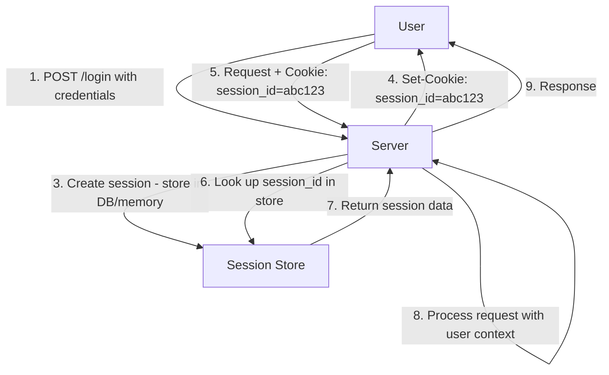
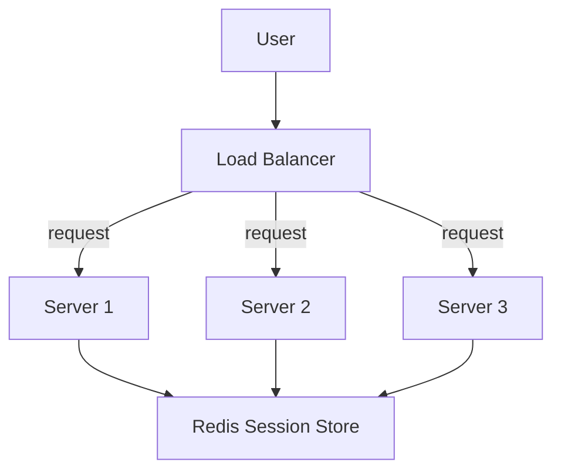
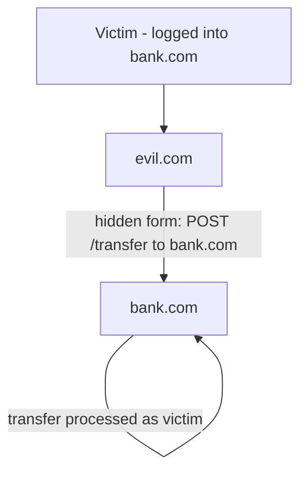
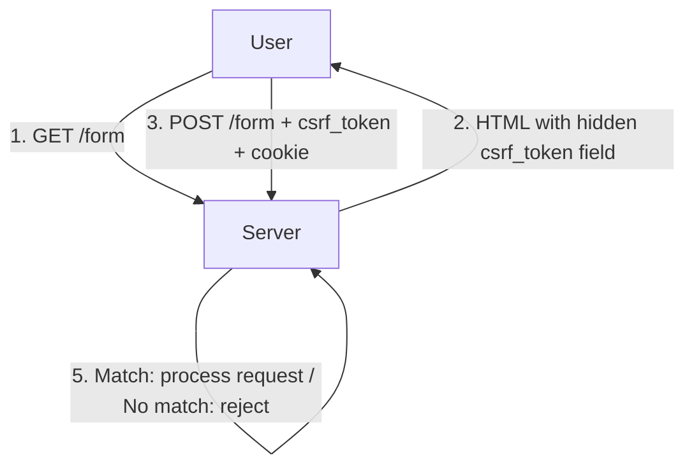
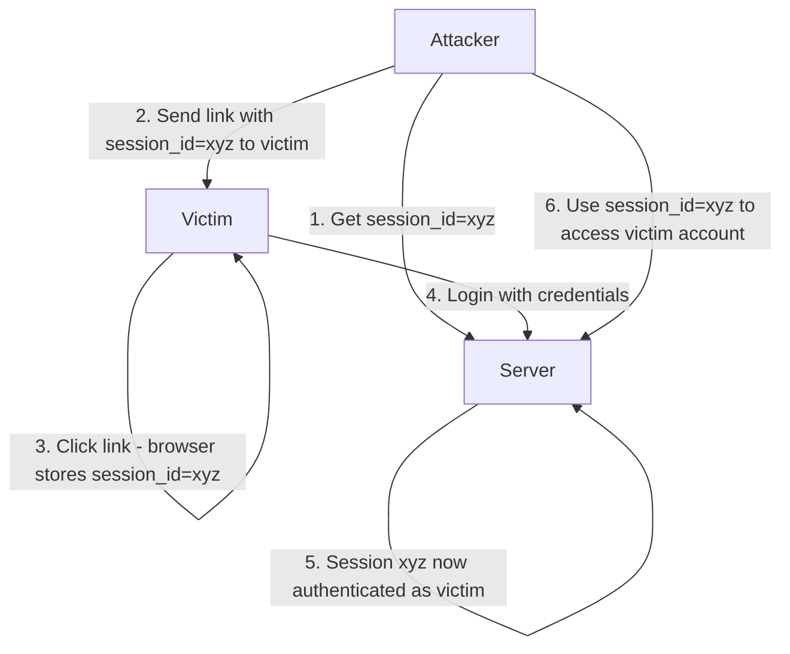

# Session Management

## What Is a Session?

A **session** is a server-side record that tracks a user's state across multiple HTTP requests. Since HTTP is stateless, sessions provide continuity — the server remembers who you are, what's in your cart, and what permissions you have.

There are two main approaches: **cookie-based sessions** (traditional) and **token-based sessions** (modern, covered in the JWT chapter). This chapter focuses on cookie-based and server-side session management.

---

## Cookie-Based Sessions

### How It Works



### Cookie Attributes

```http
Set-Cookie: session_id=abc123def456; HttpOnly; Secure; SameSite=Strict; Path=/; Max-Age=3600
```

| Attribute | Purpose | Recommendation |
|-----------|---------|----------------|
| `HttpOnly` | Prevents JavaScript access | ✅ Always set (XSS protection) |
| `Secure` | Only sent over HTTPS | ✅ Always set in production |
| `SameSite` | Controls cross-site sending | `Strict` or `Lax` (CSRF protection) |
| `Path` | Scope of the cookie | `/` for app-wide sessions |
| `Max-Age` | Lifetime in seconds | Match session timeout (e.g., 3600 = 1 hour) |
| `Domain` | Which domains receive the cookie | Omit for exact domain match |
| `Expires` | Absolute expiry date | Prefer `Max-Age` (relative) |

### SameSite Values

| Value | Behavior | CSRF Protection |
|-------|----------|-----------------|
| `Strict` | Cookie only sent for same-site requests | Strong (breaks external links) |
| `Lax` | Cookie sent for top-level GET navigations | Good (most common choice) |
| `None` | Cookie sent for all cross-site requests | None (requires `Secure`) |

---

## Server-Side Session Storage

### In-Memory (Single Server)

```python
# Simple in-memory session store
sessions = {}

def create_session(user_id):
    session_id = secrets.token_urlsafe(32)
    sessions[session_id] = {
        'user_id': user_id,
        'created_at': time.time(),
        'last_accessed': time.time(),
        'data': {}
    }
    return session_id

def get_session(session_id):
    session = sessions.get(session_id)
    if session and not is_expired(session):
        session['last_accessed'] = time.time()
        return session
    return None
```

**Pros**: Fastest (no network I/O), simple.
**Cons**: Lost on server restart, doesn't scale to multiple servers, memory leak risk.

### File-Based

```python
import json, os

SESSION_DIR = '/var/sessions/'

def create_session(user_id):
    session_id = secrets.token_urlsafe(32)
    session_data = {'user_id': user_id, 'created_at': time.time()}
    with open(f'{SESSION_DIR}{session_id}.json', 'w') as f:
        json.dump(session_data, f)
    return session_id

def get_session(session_id):
    path = f'{SESSION_DIR}{session_id}.json'
    if os.path.exists(path):
        with open(path) as f:
            return json.load(f)
    return None
```

**Pros**: Survives restarts.
**Cons**: Slow (disk I/O), doesn't scale, cleanup is manual.

---

## Distributed Sessions (Redis)

In production, sessions must be shared across multiple application servers. **Redis** is the most common distributed session store.

### Why Redis?

- **Fast**: Sub-millisecond reads/writes (in-memory).
- **TTL support**: Automatic expiry — no cleanup code needed.
- **Atomic operations**: Thread-safe without explicit locking.
- **Pub/Sub**: Can notify other servers of session changes.



### Implementation

```python
import redis
import json
import secrets

redis_client = redis.Redis(host='redis', port=6379, db=0)

def create_session(user_id, ttl_seconds=3600):
    session_id = secrets.token_urlsafe(32)
    session_data = json.dumps({
        'user_id': user_id,
        'created_at': time.time(),
        'roles': get_user_roles(user_id)
    })
    redis_client.setex(f'session:{session_id}', ttl_seconds, session_data)
    return session_id

def get_session(session_id):
    data = redis_client.get(f'session:{session_id}')
    if data:
        session = json.loads(data)
        # Extend TTL on access (sliding window)
        redis_client.expire(f'session:{session_id}', 3600)
        return session
    return None

def destroy_session(session_id):
    redis_client.delete(f'session:{session_id}')
```

### Session Expiration Strategies

| Strategy | Behavior | Use Case |
|----------|----------|----------|
| **Absolute** | Expires after fixed time from creation | Banking, high-security apps |
| **Idle** | Expires after period of inactivity | Most web applications |
| **Sliding** | TTL refreshed on each access | Long-lived sessions |
| **Absolute + Idle** | Hard limit + inactivity timeout | Best practice (e.g., 24h max, 30min idle) |

```python
def get_session_hybrid(session_id):
    data = redis_client.get(f'session:{session_id}')
    if not data:
        return None

    session = json.loads(data)

    # Check absolute expiry
    if time.time() - session['created_at'] > MAX_SESSION_AGE:
        destroy_session(session_id)
        return None

    # Reset idle timer (sliding window)
    redis_client.expire(f'session:{session_id}', IDLE_TIMEOUT)
    session['last_accessed'] = time.time()

    return session
```

---

## CSRF Protection

**Cross-Site Request Forgery (CSRF)** tricks a user's browser into making an unwanted request using their existing session. If you're logged into `bank.com` and visit `evil.com`, `evil.com` can make a form submission to `bank.com` — and the browser will automatically attach your session cookie.

### CSRF Attack Flow



### Protection: Synchronizer Token Pattern



```python
from flask import Flask, session, request, abort
import secrets

app = Flask(__name__)

@app.before_request
def csrf_protect():
    if request.method in ('POST', 'PUT', 'DELETE', 'PATCH'):
        token = request.form.get('csrf_token') or request.headers.get('X-CSRF-Token')
        if not token or token != session.get('csrf_token'):
            abort(403, 'CSRF token mismatch')

@app.route('/form')
def show_form():
    session['csrf_token'] = secrets.token_hex(32)
    return render_template('form.html', csrf_token=session['csrf_token'])
```

```html
<form method="POST" action="/transfer">
    <input type="hidden" name="csrf_token" value="{{ csrf_token }}">
    <input name="amount" type="number">
    <button type="submit">Transfer</button>
</form>
```

### Double Submit Cookie

An alternative where the CSRF token is set as a cookie and also sent in a header. The server verifies they match.

```javascript
// Client-side
const csrfToken = getCookie('csrf_token');
fetch('/api/transfer', {
    method: 'POST',
    headers: {
        'X-CSRF-Token': csrfToken,
        'Content-Type': 'application/json'
    },
    body: JSON.stringify({ amount: 100 }),
    credentials: 'include'  // Send cookies
});
```

**Why it works**: An attacker on `evil.com` can't read cookies from `bank.com` (same-origin policy), so they can't put the token in the header.

### SameSite Cookies (Modern Approach)

Setting `SameSite=Lax` or `SameSite=Strict` prevents the browser from sending cookies on cross-site requests, making CSRF largely a non-issue for modern browsers.

```http
Set-Cookie: session_id=abc123; SameSite=Lax; Secure; HttpOnly
```

**Limitation**: `Lax` still sends cookies on top-level GET navigations. For state-changing operations, always use POST/PUT/DELETE and combine with CSRF tokens.

---

## Session Fixation

**Session fixation** is an attack where an attacker sets a known session ID in the victim's browser, then waits for the victim to authenticate. After login, the attacker uses the known session ID to hijack the session.

### Attack Flow



### Prevention: Regenerate Session ID on Login

```python
@app.route('/login', methods=['POST'])
def login():
    username = request.form['username']
    password = request.form['password']

    if verify_credentials(username, password):
        # CRITICAL: Regenerate session ID after authentication
        old_session = dict(session)
        session.clear()
        session.regenerate()  # Flask: creates new session with new ID

        # Copy non-auth data from old session
        session['user_id'] = get_user_id(username)
        session['roles'] = get_user_roles(username)

        return redirect('/dashboard')

    return 'Invalid credentials', 401
```

```python
# Flask implementation of session regeneration
from flask import session
import secrets

def regenerate_session():
    """Delete old session and create new one with new ID."""
    old_data = dict(session)
    session.clear()
    # Flask-Session or custom implementation
    session.sid = secrets.token_urlsafe(32)
    for key, value in old_data.items():
        if key != 'csrf_token':  # Generate new CSRF token too
            session[key] = value
```

### Additional Defenses

1. **Don't accept session IDs from URLs or query parameters** — only from cookies.
2. **Bind session to client fingerprint** (User-Agent, IP range).
3. **Invalidate sessions on logout** — server-side deletion.
4. **Set short idle timeouts**.

---

## Session Security Best Practices

### 1. Secure Cookie Configuration

```python
app.config.update(
    SESSION_COOKIE_HTTPONLY=True,     # No JavaScript access
    SESSION_COOKIE_SECURE=True,       # HTTPS only
    SESSION_COOKIE_SAMESITE='Lax',   # CSRF protection
    SESSION_COOKIE_NAME='__Host-sid', # Cookie prefix for extra security
    SESSION_COOKIE_PATH='/',
    PERMANENT_SESSION_LIFETIME=timedelta(hours=1)
)
```

### 2. Session Data Minimization

Store only what's necessary in the session:

```python
# BAD: Store entire user object
session['user'] = {'id': 1, 'name': 'John', 'email': '...', 'address': '...'}

# GOOD: Store only the user ID
session['user_id'] = 1
# Fetch full user from DB when needed
```

### 3. Session Invalidation

```python
# Logout: destroy session server-side
@app.route('/logout', methods=['POST'])
def logout():
    session_id = request.cookies.get('session_id')
    redis_client.delete(f'session:{session_id}')
    session.clear()
    response = redirect('/login')
    response.delete_cookie('session_id')
    return response

# Password change: invalidate all sessions
def on_password_change(user_id):
    # Get all sessions for this user
    for key in redis_client.scan_iter(f'session:*'):
        data = redis_client.get(key)
        if json.loads(data).get('user_id') == user_id:
            redis_client.delete(key)
```

### 4. Concurrent Session Control

```python
def create_session_with_limit(user_id, max_sessions=3):
    # Get existing sessions for user
    existing = get_user_sessions(user_id)

    if len(existing) >= max_sessions:
        # Remove oldest session
        oldest = min(existing, key=lambda s: s['created_at'])
        destroy_session(oldest['session_id'])

    return create_session(user_id)
```

---

## Session vs JWT

| Aspect | Server-Side Sessions | JWT |
|--------|---------------------|-----|
| Storage | Server (Redis, DB) | Client (cookie/localStorage) |
| Scalability | Needs shared store | Stateless (no store needed) |
| Revocation | Instant (delete from store) | Hard (until expiry) |
| Payload size | Small cookie (session ID) | Large cookie (full token) |
| Server lookup | Every request | None (local validation) |
| Complexity | Simple | More complex (crypto, rotation) |

**Use sessions when**: Server-rendered apps, need instant revocation, simplicity matters.
**Use JWT when**: Microservices, mobile apps, stateless architecture.

---

## Interview Questions

1. **What is a session and why is it needed?**
   HTTP is stateless — each request is independent. A session is server-side state that tracks a user across requests. It stores user ID, permissions, preferences, etc. The client holds a session ID (in a cookie) that the server uses to look up the session data.

2. **Explain cookie-based session management.**
   The server creates a session, stores it (in-memory, Redis, DB), and sends a `Set-Cookie` header with the session ID. The browser attaches this cookie to subsequent requests. The server looks up the session by ID to identify the user.

3. **Why use Redis for distributed sessions?**
   With multiple application servers, sessions must be shared. Redis is ideal: sub-millisecond reads, built-in TTL (auto-expiry), atomic operations, and pub/sub for session invalidation. It's faster than a database and simpler than sticky sessions.

4. **What is CSRF and how do you prevent it?**
   CSRF tricks the browser into making authenticated requests to another site. Prevention: (1) `SameSite=Lax/Strict` cookies. (2) Synchronizer tokens (hidden form field that the server validates). (3) Double-submit cookies. (4) Check `Origin`/`Referer` headers.

5. **What is session fixation and how do you prevent it?**
   An attacker sets a known session ID in the victim's browser. After login, the session becomes authenticated. Prevention: regenerate the session ID after authentication (`session.regenerate()`), don't accept session IDs from URLs, and invalidate old sessions.

6. **What is the difference between `SameSite=Strict` and `SameSite=Lax`?**
   `Strict` never sends cookies on cross-site requests (strongest CSRF protection, but breaks external links). `Lax` sends cookies on top-level GET navigations (e.g., clicking a link) but blocks cross-site POST requests. `Lax` is the practical default.

7. **How do you handle session expiration?**
   Three strategies: (1) Absolute — expires after fixed time from creation. (2) Idle — expires after inactivity. (3) Sliding — TTL refreshed on each access. Best practice: combine absolute (24h max) with idle (30min) timeout.

8. **How do you invalidate all sessions for a user?**
   If using Redis: iterate session keys, check user_id, and delete matching sessions. Or store sessions in a user-specific namespace (`session:user:{user_id}:{session_id}`) and delete the entire namespace. On password change, always invalidate all sessions.

9. **What is the `HttpOnly` cookie attribute and why is it important?**
   `HttpOnly` prevents JavaScript from accessing the cookie via `document.cookie`. This protects against XSS attacks — even if an attacker injects script, they can't steal the session cookie. Always set `HttpOnly` on session cookies.

10. **How would you implement "remember me" functionality?**
    Issue a long-lived persistent cookie (30 days) with a random token. Store the token hash in the database linked to the user. On each visit, validate the token. If valid, create a new session. Rotate the remember-me token on each use.

11. **What are cookie prefixes (`__Host-` and `__Secure-`)?**
    `__Secure-` requires the `Secure` attribute. `__Host-` requires `Secure`, `Path=/`, and no `Domain` attribute. These prefixes prevent cookie injection attacks where an attacker sets cookies from a subdomain.

12. **How do you handle concurrent sessions?**
    Track active sessions per user (in Redis). Set a maximum (e.g., 3 concurrent sessions). When the limit is reached, evict the oldest session. Alternatively, use a "single session" policy for high-security applications.
