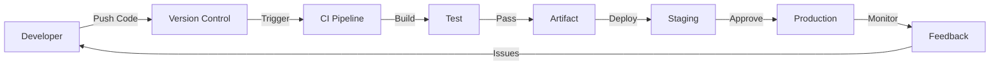
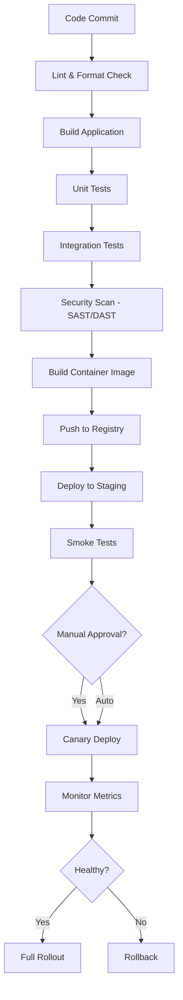
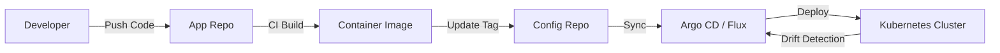
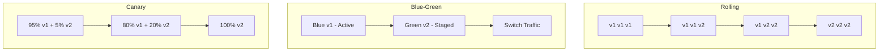

# CI/CD

Continuous Integration and Continuous Delivery automate the path from code commit to production deployment, reducing risk and increasing velocity.

## Why CI/CD?

Without CI/CD, releasing software is manual, error-prone, and slow. CI/CD automates the entire pipeline from code change to production, enabling teams to ship multiple times per day with confidence.



## CI vs CD

| Aspect | Continuous Integration | Continuous Delivery | Continuous Deployment |
|--------|----------------------|---------------------|----------------------|
| **Focus** | Code quality | Deployment readiness | Automated release |
| **Trigger** | Every commit | Approved changes | Every passing build |
| **Actions** | Build, test, lint | Deploy to staging | Deploy to production |
| **Human gate** | No | Manual approval | No |
| **Goal** | Catch bugs early | Fast, safe releases | Full automation |

## Pipeline Stages

```
Code → Lint → Build → Unit Test → Integration Test → Security Scan → Stage → Approve → Deploy → Monitor
```

### Detailed Pipeline



## CI/CD Tools Landscape

### Version Control & CI

| Tool | Type | Best For |
|------|------|----------|
| **GitHub Actions** | CI/CD (hosted) | GitHub repos, open source |
| **GitLab CI** | CI/CD (hosted/self-hosted) | GitLab repos, enterprise |
| **Jenkins** | CI/CD (self-hosted) | Complex pipelines, legacy |
| **CircleCI** | CI/CD (hosted) | Fast builds, Docker-native |
| **Travis CI** | CI/CD (hosted) | Open source projects |
| **Argo CD** | GitOps (self-hosted) | Kubernetes deployments |
| **Flux** | GitOps (self-hosted) | Lightweight K8s GitOps |

### Artifact Management

| Tool | Purpose |
|------|---------|
| **Docker Hub / ECR / GCR** | Container image registry |
| **Nexus** | Maven/npm/Docker artifacts |
| **JFrog Artifactory** | Universal artifact repository |
| **GitHub Packages** | Integrated package hosting |

## GitOps

GitOps uses Git as the single source of truth for infrastructure and application deployment.

### GitOps Workflow



**Principles:**
1. **Declarative** — Desired state is described declaratively (YAML/Helm)
2. **Versioned** — All changes tracked in Git history
3. **Automated** — Agents pull changes and reconcile state
4. **Self-healing** — Drift from desired state is automatically corrected

### Push vs Pull Deployment

| Model | How It Works | Tools | Pros | Cons |
|-------|-------------|-------|------|------|
| **Push** | CI pipeline pushes to cluster | GitHub Actions, Jenkins | Simple, familiar | CI needs cluster credentials |
| **Pull** | Agent in cluster pulls from Git | Argo CD, Flux | Secure (no inbound access) | Agent overhead |

## Deployment Strategies



| Strategy | Risk | Rollback Speed | Resource Cost | Use Case |
|----------|------|----------------|---------------|----------|
| **Rolling** | Low | Slow (re-deploy) | Low | Default for most services |
| **Blue-Green** | Low | Instant (switch LB) | 2x resources | Critical services |
| **Canary** | Very low | Fast (shift traffic) | Low + test infra | High-traffic services |
| **Shadow** | None | N/A | 2x traffic | Testing new versions with real traffic |

## GitHub Actions Deep Dive

```yaml
name: CI/CD Pipeline
on:
  push:
    branches: [main]
  pull_request:
    branches: [main]

jobs:
  test:
    runs-on: ubuntu-latest
    services:
      postgres:
        image: postgres:16
        env:
          POSTGRES_PASSWORD: test
        options: >-
          --health-cmd pg_isready
          --health-interval 10s
          --health-timeout 5s
          --health-retries 5
    steps:
      - uses: actions/checkout@v4
      - uses: actions/setup-go@v5
        with:
          go-version: '1.21'
      - run: go test ./... -race -coverprofile=coverage.out
      - uses: codecov/codecov-action@v3

  build:
    needs: test
    runs-on: ubuntu-latest
    if: github.ref == 'refs/heads/main'
    steps:
      - uses: actions/checkout@v4
      - uses: docker/build-push-action@v5
        with:
          push: true
          tags: myregistry/myapp:${{ github.sha }}

  deploy:
    needs: build
    runs-on: ubuntu-latest
    environment: production
    steps:
      - uses: actions/checkout@v4
      - run: |
          kubectl set image deployment/myapp \
            myapp=myregistry/myapp:${{ github.sha }}
```

## In This Section

- [GitHub Actions](./github-actions.md) — Workflow automation on GitHub
- [GitOps](./gitops.md) — Git as the single source of truth for infrastructure

## Interview Questions

1. **Q: What is the difference between CI and CD?**
   A: Continuous Integration means merging code changes frequently into a shared branch with automated builds and tests. Continuous Delivery extends this by automating deployment to staging, with a manual gate to production. Continuous Deployment goes further — every passing build is automatically deployed to production.

2. **Q: How would you design a CI/CD pipeline for a microservices architecture?**
   A: Each service has its own pipeline triggered by changes to its directory (monorepo) or its own repo. Shared libraries get a separate pipeline. Use path filters to avoid rebuilding unchanged services. Container images are tagged with Git SHA. Argo CD watches the config repo and syncs to Kubernetes.

3. **Q: What is a canary deployment and when would you use it?**
   A: A canary deployment routes a small percentage of traffic (e.g., 5%) to the new version while the rest goes to the old version. Monitor error rates, latency, and business metrics. If healthy, gradually increase traffic. If issues detected, roll back instantly. Use for high-traffic services where even small bugs have large impact.

4. **Q: How do you handle database migrations in CI/CD?**
   A: Separate schema changes from application code. Run migrations as a pre-deployment step. Use backward-compatible migrations (expand-contract pattern): add new column → deploy code using both → backfill → switch reads → remove old column. Tools: Flyway, Alembic, golang-migrate. Never auto-rollback migrations.

5. **Q: What is GitOps and how does it differ from traditional CI/CD?**
   A: In traditional CI/CD, the pipeline pushes changes to the cluster. In GitOps, an agent in the cluster pulls desired state from Git. Git is the single source of truth. The agent continuously reconciles actual state with desired state. Benefits: auditability (Git history), security (no push credentials), self-healing (drift correction).

6. **Q: How do you handle secrets in CI/CD pipelines?**
   A: Never hardcode secrets. Use: (1) CI platform's secret store (GitHub Secrets, GitLab Variables), (2) External secret managers (Vault, AWS Secrets Manager), (3) Kubernetes External Secrets Operator for runtime injection. Rotate secrets regularly. Audit secret access.

7. **Q: What is infrastructure as code (IaC)?**
   A: IaC manages infrastructure through declarative configuration files rather than manual processes. Benefits: version control, reproducibility, self-documenting, drift detection. Tools: Terraform (multi-cloud), Pulumi (code-first), CloudFormation (AWS), Ansible (configuration management).

8. **Q: How do you ensure fast CI/CD pipelines?**
   A: (1) Parallelize independent stages, (2) Cache dependencies and Docker layers, (3) Run only affected tests (test impact analysis), (4) Use faster runners (self-hosted, ARM), (5) Split monorepo pipelines with path filters, (6) Use incremental builds, (7) Keep Docker images small.

9. **Q: What is trunk-based development?**
   A: All developers commit to a single branch (main/trunk) with short-lived feature branches (< 1 day). Requires feature flags for incomplete features. Benefits: no merge hell, continuous integration, faster feedback. Contrasts with Git Flow (long-lived branches, release branches).

10. **Q: How would you implement rollback in a CI/CD pipeline?**
    A: (1) Tag every deployment with Git SHA, (2) Keep previous container images, (3) For Kubernetes: `kubectl rollout undo`, (4) For GitOps: revert the Git commit, (5) For databases: use backward-compatible migrations so old code still works, (6) Automate rollback based on health metrics (error rate > threshold).

## References

- [Continuous Delivery](https://continuousdelivery.com/) — Jez Humble
- [GitHub Actions Documentation](https://docs.github.com/en/actions) — Official docs
- [Argo CD Documentation](https://argo-cd.readthedocs.io/) — GitOps for Kubernetes
- [The DevOps Handbook](https://itrevolution.com/the-devops-handbook/) — Gene Kim et al.
- [Google SRE Book](https://sre.google/sre-book/table-of-contents/) — Deployment chapter
