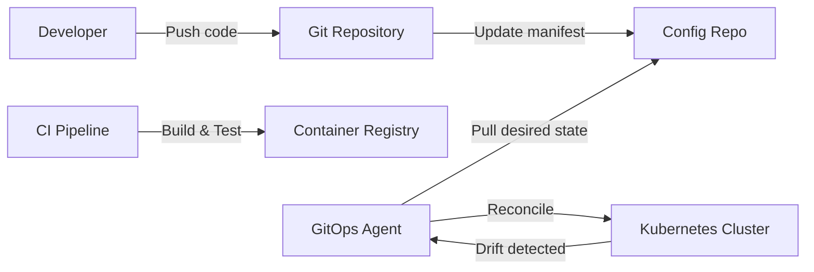
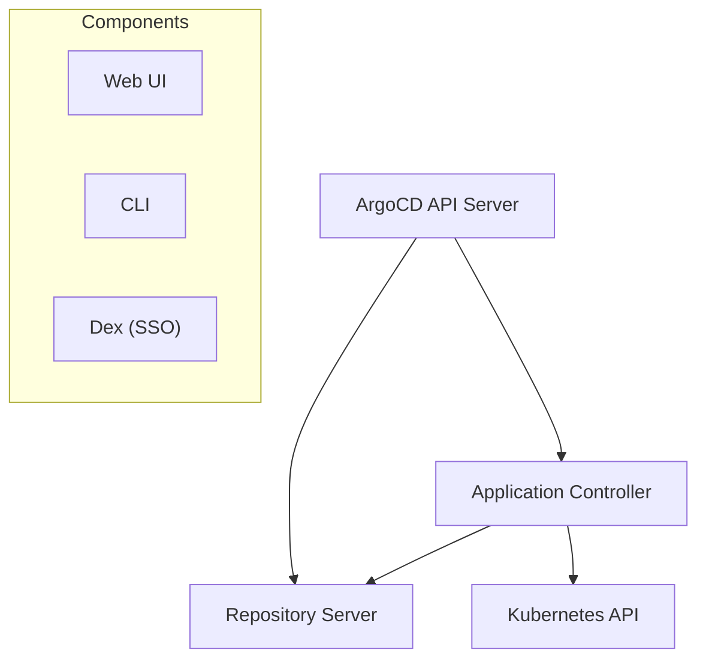
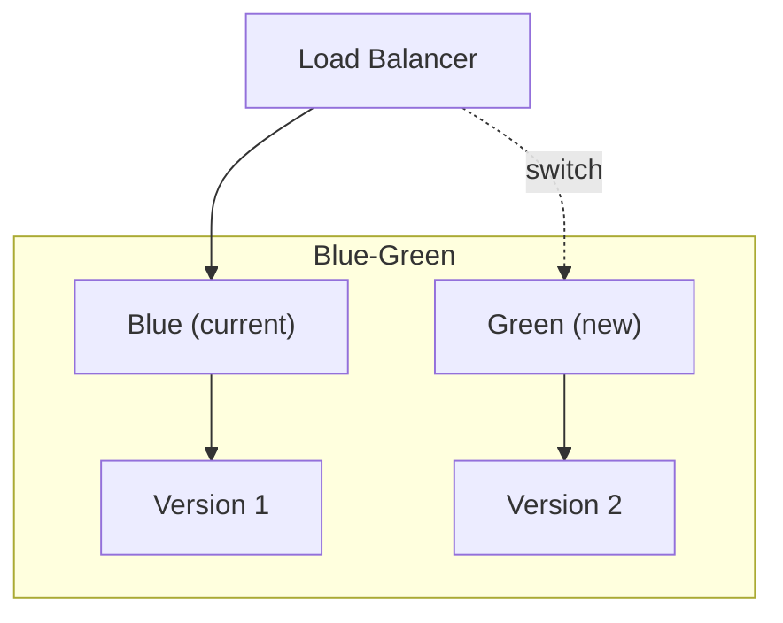

# GitOps

## Overview

GitOps is an operational framework where Git is the single source of truth for declarative infrastructure and applications. Changes are made by updating Git, and automated agents reconcile the actual state with the desired state.

## Core Principles

1. **Declarative**: Desired state described declaratively
2. **Versioned**: Git is the source of truth
3. **Automated**: Agents pull and apply changes
4. **Self-healing**: Drift is automatically corrected

## GitOps Workflow



## ArgoCD

### Architecture



### Application Definition

```yaml
apiVersion: argoproj.io/v1alpha1
kind: Application
metadata:
  name: my-app
  namespace: argocd
spec:
  project: default
  source:
    repoURL: https://github.com/org/k8s-manifests.git
    targetRevision: main
    path: apps/my-app
  destination:
    server: https://kubernetes.default.svc
    namespace: my-app
  syncPolicy:
    automated:
      prune: true       # Delete resources removed from Git
      selfHeal: true    # Correct drift
    syncOptions:
      - CreateNamespace=true
```

### Sync Strategies

| Strategy | Description | Use Case |
|----------|-------------|----------|
| **Manual** | Human approves sync | Production |
| **Automated** | Auto-sync on Git change | Staging |
| **Auto + Prune** | Auto-sync + delete removed | Full automation |
| **Auto + Self-heal** | Auto-sync + correct drift | Strict GitOps |

## Flux

### Components

- **Source Controller**: Manages Git/Helm/OCI sources
- **Kustomize Controller**: Applies Kustomize overlays
- **Helm Controller**: Manages Helm releases
- **Notification Controller**: Alerts and webhooks

### Flux vs ArgoCD

| Feature | Flux | ArgoCD |
|---------|------|--------|
| **Architecture** | K8s operators | Monolithic + UI |
| **Config** | Kustomize overlays | App CRD |
| **Multi-tenancy** | Namespace isolation | Projects |
| **Web UI** | Weave GitOps (optional) | Built-in |
| **SSO** | External | Built-in (Dex) |

## Progressive Delivery

### Canary Deployments

```yaml
apiVersion: flagger.app/v1beta1
kind: Canary
metadata:
  name: my-app
spec:
  targetRef:
    apiVersion: apps/v1
    kind: Deployment
    name: my-app
  progressDeadlineSeconds: 600
  analysis:
    interval: 30s
    threshold: 5        # Max failed checks
    maxWeight: 50       # Max canary weight %
    stepWeight: 10      # Weight increment %
    metrics:
      - name: request-success-rate
        thresholdRange:
          min: 99
      - name: request-duration
        thresholdRange:
          max: 500
```

### Blue-Green Deployments



## Best Practices

1. **Separate repos** — App code vs K8s manifests
2. **Encrypted secrets** — Use Sealed Secrets, SOPS, or Vault
3. **PR-based changes** — Review infrastructure changes via PRs
4. **Drift detection** — Alert on manual changes
5. **RBAC** — Limit who can sync applications
6. **Notifications** — Slack/Teams alerts on sync failures

## Interview Questions

1. **GitOps vs traditional CI/CD?** — GitOps: pull-based, declarative, self-healing. Traditional: push-based, imperative.
2. **How to handle secrets in GitOps?** — Sealed Secrets, Mozilla SOPS, HashiCorp Vault, external secrets operator
3. **ArgoCD vs Flux?** — ArgoCD: UI-first, feature-rich. Flux: lightweight, K8s-native operators.
4. **How to do canary with GitOps?** — Flagger (Argo Rollouts) automates canary analysis with metrics
5. **What if someone makes manual kubectl changes?** — GitOps agent detects drift and reverts (self-heal)
6. **How to handle database migrations?** — Pre/post-sync hooks in ArgoCD, init containers
7. **Multi-cluster GitOps?** — ArgoCD ApplicationSets, Flux Kustomizations per cluster
8. **Rollback strategy?** — Git revert → agent auto-syncs to previous state

## Related Topics

- [GitHub Actions](./github-actions.md) — CI pipeline
- [Kubernetes](../containers/kubernetes.md) — Deployment target
- [Docker](../containers/docker.md) — Containerization
