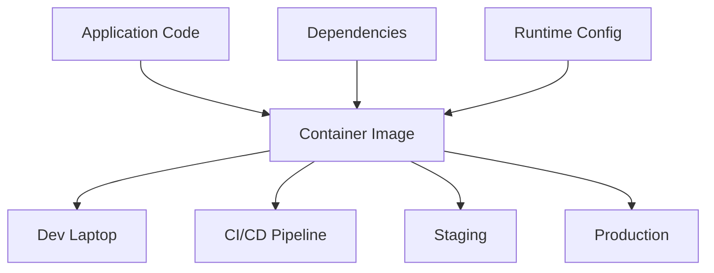
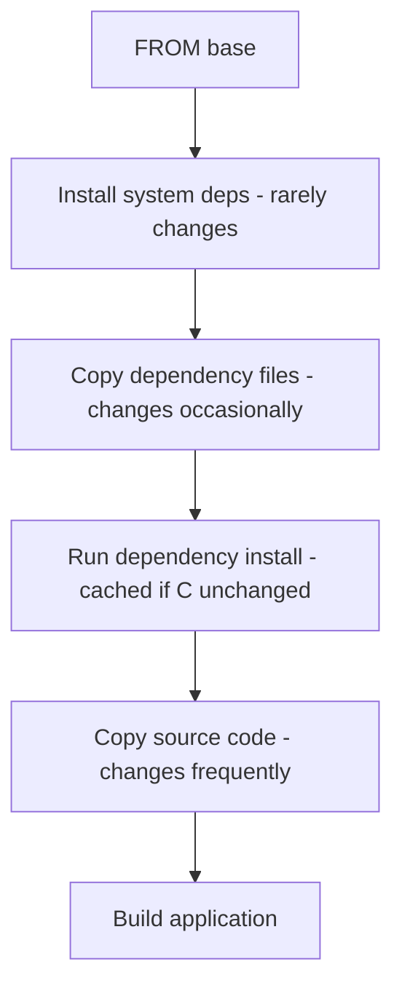
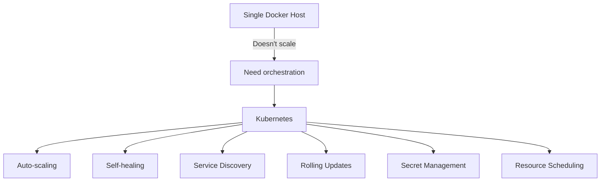
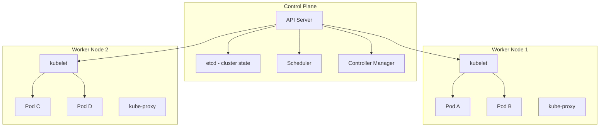
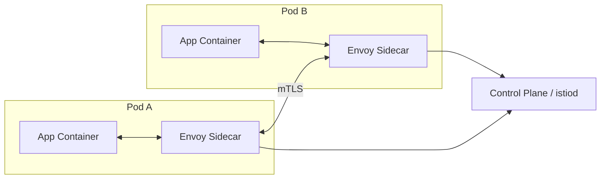

# Containerization

Containerization packages applications with their dependencies into portable, reproducible units. This section covers the container ecosystem from Docker to Kubernetes to service meshes.

## Why Containers?

Before containers, deploying software was plagued by the "works on my machine" problem. Containers solve this by packaging code, runtime, libraries, and configuration into a single unit that runs consistently across environments.



## Container vs VM

| Aspect | Container | Virtual Machine |
|--------|-----------|-----------------|
| Isolation | Process-level (namespaces, cgroups) | Hardware-level (hypervisor) |
| Startup | Seconds | Minutes |
| Size | MBs | GBs |
| Overhead | Minimal (~1-2%) | Significant (5-15%) |
| OS | Shared kernel | Full OS per VM |
| Density | 100s per host | 10s per host |
| Security | Weaker (shared kernel) | Stronger (full isolation) |
| Portability | Excellent (OCI standard) | Good (vendor formats) |

## How Containers Work

Containers use two key Linux kernel features:

### Namespaces (Isolation)

Namespaces isolate what a process can see:

| Namespace | Isolates | Example |
|-----------|----------|---------|
| **PID** | Process IDs | Container sees PID 1 as its init process |
| **NET** | Network interfaces | Container gets its own IP and ports |
| **MNT** | Filesystem mounts | Container sees its own root filesystem |
| **UTS** | Hostname | Container has its own hostname |
| **IPC** | Inter-process communication | Shared memory isolated |
| **USER** | User/group IDs | Container root ≠ host root |

### Cgroups (Resource Limits)

Control groups limit what a process can consume:

```bash
# Limit container to 1 CPU and 512MB RAM
docker run --cpus=1 --memory=512m myapp

# Under the hood, cgroups set:
# /sys/fs/cgroup/cpu/docker/<id>/cpu.cfs_quota_us = 100000
# /sys/fs/cgroup/memory/docker/<id>/memory.limit_in_bytes = 536870912
```

## Docker Fundamentals

### Dockerfile Best Practices

```dockerfile
# ✅ Multi-stage build — small final image
FROM golang:1.21-alpine AS builder
WORKDIR /app
COPY go.mod go.sum ./
RUN go mod download          # Cache dependencies
COPY . .
RUN CGO_ENABLED=0 go build -o server .

FROM alpine:3.19
RUN apk --no-cache add ca-certificates
COPY --from=builder /app/server /server
EXPOSE 8080
USER 1000:1000               # Non-root user
ENTRYPOINT ["/server"]
```

### Layer Caching Strategy



**Key rule**: Put things that change least often in earlier layers. Dependency files before source code.

### Docker Compose for Local Development

```yaml
version: '3.8'
services:
  api:
    build: .
    ports:
      - "8080:8080"
    environment:
      - DATABASE_URL=postgres://user:pass@db:5432/mydb
      - REDIS_URL=redis://cache:6379
    depends_on:
      db:
        condition: service_healthy
      cache:
        condition: service_started

  db:
    image: postgres:16
    volumes:
      - pgdata:/var/lib/postgresql/data
    environment:
      POSTGRES_PASSWORD: pass
    healthcheck:
      test: ["CMD-SHELL", "pg_isready -U user"]
      interval: 5s

  cache:
    image: redis:7-alpine

volumes:
  pgdata:
```

## Container Orchestration

When you have dozens of containers across multiple hosts, you need orchestration.

### Why Kubernetes?



### Kubernetes Architecture



### Key Kubernetes Resources

| Resource | Purpose | Example |
|----------|---------|---------|
| **Pod** | Smallest deployable unit | One or more containers |
| **Deployment** | Manages replica sets | `replicas: 3` ensures 3 pods |
| **Service** | Stable network endpoint | Load balances across pods |
| **Ingress** | HTTP routing | Path-based routing to services |
| **ConfigMap** | Configuration data | Environment variables, config files |
| **Secret** | Sensitive data | Passwords, API keys (base64) |
| **StatefulSet** | Stateful workloads | Databases, ordered deployment |
| **DaemonSet** | One pod per node | Log collectors, monitoring agents |

## Service Mesh

A service mesh manages service-to-service communication with a sidecar proxy pattern.



**What a service mesh provides:**
- **Mutual TLS** — Automatic encryption between services
- **Traffic management** — Canary deployments, traffic splitting
- **Observability** — Automatic metrics, traces, access logs
- **Resilience** — Retries, timeouts, circuit breaking

**Popular meshes**: Istio, Linkerd, Consul Connect

## In This Section

- [Docker](./docker.md) — Container fundamentals and Dockerfile best practices
- [Kubernetes](./kubernetes.md) — Container orchestration at scale
- [Service Mesh](./service-mesh.md) — Network infrastructure for microservices

## Interview Questions

1. **Q: What's the difference between a container and a VM?**
   A: Containers share the host kernel and isolate at the process level using namespaces and cgroups. VMs run a full guest OS on a hypervisor. Containers are lighter (MBs vs GBs), start faster (seconds vs minutes), and achieve higher density, but offer weaker isolation.

2. **Q: Explain Docker's layer caching mechanism.**
   A: Each Dockerfile instruction creates a layer. Docker caches layers and reuses them if the instruction and context haven't changed. If a layer changes, all subsequent layers are rebuilt. This is why `COPY go.mod` comes before `COPY .` — to cache dependency installation.

3. **Q: What is a Kubernetes Service and what types exist?**
   A: A Service provides a stable IP and DNS name for a set of pods. Types: ClusterIP (internal only), NodePort (exposes on node's port), LoadBalancer (provisions cloud LB), ExternalName (CNAME alias). ClusterIP is default and most common for internal communication.

4. **Q: How does Kubernetes handle pod failures?**
   A: The ReplicaSet controller continuously monitors pod health. If a pod crashes, the controller creates a new one to maintain the desired replica count. Liveness probes detect unresponsive containers; readiness probes control traffic routing. The scheduler places new pods on healthy nodes.

5. **Q: What is a sidecar pattern?**
   A: A sidecar is a helper container deployed alongside the main application container in the same pod. It augments the main container without modifying it — examples: Envoy proxy for service mesh, Fluentd for log collection, Istio for mTLS. The sidecar shares the pod's network namespace.

6. **Q: How would you zero-downtime deploy a containerized application?**
   A: Use Kubernetes rolling updates with `maxUnavailable: 0` and `maxSurge: 1`. This ensures new pods are ready before old ones terminate. Add readiness probes so traffic only routes to healthy pods. Use pre-stop hooks for graceful connection draining.

7. **Q: What's the difference between CMD and ENTRYPOINT in a Dockerfile?**
   A: ENTRYPOINT defines the executable that always runs. CMD provides default arguments that can be overridden. `ENTRYPOINT ["/server"]` + `CMD ["--port=8080"]` means `docker run myapp --port=9090` runs `/server --port=9090`. ENTRYPOINT is the binary; CMD is the default flags.

8. **Q: How do you persist data in containers?**
   A: Containers are ephemeral — data is lost when they stop. Use volumes (Docker) or PersistentVolumeClaims (Kubernetes) for durable storage. Named volumes survive container removal. For databases, always use persistent storage. Host mounts are useful for development but not production.

9. **Q: Explain the Kubernetes resource model (requests vs limits).**
   A: Requests guarantee a minimum amount of CPU/memory — the scheduler uses these for placement. Limits cap the maximum — the kernel enforces these via cgroups. If a container exceeds its memory limit, it's OOM-killed. If it exceeds CPU limit, it's throttled. Always set both.

10. **Q: What is a service mesh and when would you use one?**
    A: A service mesh manages inter-service communication via sidecar proxies. Use one when you need: automatic mTLS, fine-grained traffic control (canary, A/B), distributed tracing without code changes, or circuit breaking. Don't use one if you have fewer than ~10 services — the operational overhead isn't worth it.

## References

- [Docker Documentation](https://docs.docker.com/) — Official Docker docs
- [Kubernetes Documentation](https://kubernetes.io/docs/) — Official K8s docs
- [Container Networking](https://www.oreilly.com/library/view/container-networking/9781492036845/) — O'Reilly
- [Kubernetes in Action](https://www.manning.com/books/kubernetes-in-action-second-edition) — Marko Lukša
- [Istio Documentation](https://istio.io/latest/docs/) — Service mesh docs
