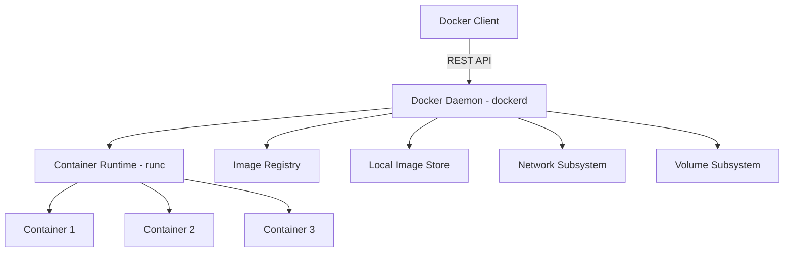
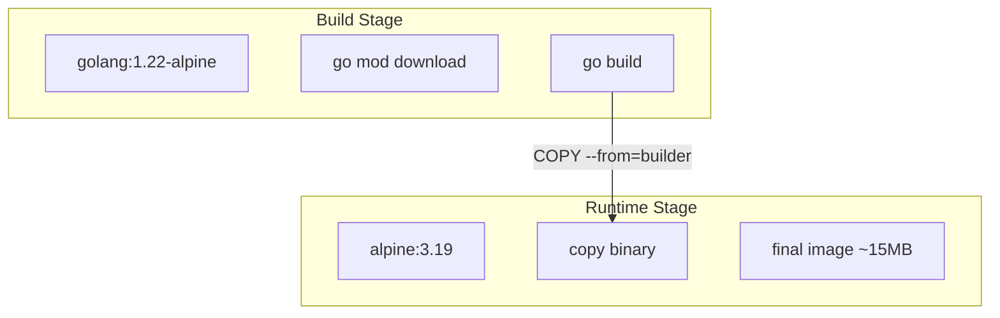
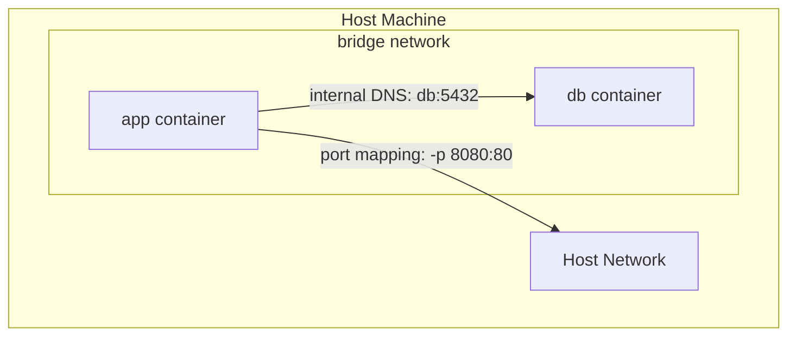

# Docker — Containers from First Principles

## What Is Docker?

Docker is a platform that packages applications and their dependencies into lightweight, portable **containers**. A container is an isolated user-space environment that shares the host OS kernel but has its own filesystem, networking, and process tree. Unlike virtual machines, containers do not run a separate OS — they use kernel features (namespaces, cgroups) for isolation, making them far more resource-efficient.

---

## Architecture Overview



The **Docker daemon** (`dockerd`) manages containers, images, networks, and volumes. The client communicates with the daemon over a REST API (Unix socket by default, TCP optionally).

---

## Images and Layers

A Docker **image** is a read-only template built from a stack of **layers**. Each layer represents a set of filesystem changes (added/modified/deleted files). Layers are cached and shared across images, which is why pulling `python:3.12` after already having `python:3.11` only downloads the delta.

### Image Internals

- **Base layer**: Usually a minimal OS (Alpine, Debian Slim) or a language runtime.
- **Intermediate layers**: Each Dockerfile instruction that modifies the filesystem creates a new layer.
- **Container layer**: When you run an image, Docker adds a thin writable layer on top (copy-on-write).

### Image Identifiers

| Concept | Example | Description |
|---------|---------|-------------|
| Repository | `nginx` | Collection of related images |
| Tag | `nginx:1.25-alpine` | Version label (mutable) |
| Digest | `sha256:abc123...` | Content-addressable hash (immutable) |

**Best practice**: Always pin tags in production. `latest` is a moving target.

---

## Dockerfile Deep Dive

A **Dockerfile** is a declarative recipe for building an image. Each instruction creates a layer.

```dockerfile
# syntax=docker/dockerfile:1

# --- Stage 1: Build ---
FROM golang:1.22-alpine AS builder
WORKDIR /app
COPY go.mod go.sum ./
RUN go mod download          # Cached if go.mod/go.sum unchanged
COPY . .
RUN CGO_ENABLED=0 GOOS=linux go build -o /server ./cmd/server

# --- Stage 2: Runtime ---
FROM alpine:3.19
RUN apk --no-cache add ca-certificates tzdata
COPY --from=builder /server /usr/local/bin/server
EXPOSE 8080
USER nobody:nobody
ENTRYPOINT ["/usr/local/bin/server"]
```

### Key Instructions

| Instruction | Purpose | Caching Impact |
|-------------|---------|----------------|
| `FROM` | Sets the base image | Base layer |
| `COPY` | Copies files from build context | Invalidates if source files change |
| `RUN` | Executes a command | Cached; bust if previous layer changes |
| `WORKDIR` | Sets working directory | Creates directory layer |
| `EXPOSE` | Documents listening port (metadata only) | No layer |
| `ENV` | Sets environment variables | Creates layer |
| `CMD` / `ENTRYPOINT` | Default command | No layer (metadata) |
| `USER` | Sets runtime user | No layer (metadata) |

### Layer Caching Strategy

Docker caches layers top-to-bottom. Once a layer is invalidated, all subsequent layers rebuild. **Order instructions from least to most frequently changing**:

```dockerfile
# BAD: Any source change re-downloads dependencies
COPY . .
RUN go mod download

# GOOD: Dependencies cached until go.mod changes
COPY go.mod go.sum ./
RUN go mod download
COPY . .
```

---

## Multi-Stage Builds

Multi-stage builds let you use one image for building and a different, smaller image for running. The `COPY --from=` directive pulls artifacts from earlier stages.

**Why it matters**: A Go binary is statically linked — you don't need the entire Go toolchain (800+ MB) in production. The final image above is ~15 MB.



---

## Networking

Docker provides several network drivers:

### Bridge (Default)

Containers on the same bridge network can communicate by name. The bridge is a virtual switch on the host.

```bash
docker network create my-net
docker run --network my-net --name app my-image
docker run --network my-net --name db postgres:16
# app can reach db at hostname "db" port 5432
```



### Host

The container shares the host's network stack directly. No port mapping needed — the container binds to host ports. Higher performance but no network isolation.

```bash
docker run --network host my-image
```

### Overlay

Used in **Docker Swarm** or multi-host setups. Overlay networks span multiple hosts using VXLAN encapsulation.

### None

No networking at all. Useful for batch jobs that don't need network access.

### Key Networking Concepts

- **Port mapping**: `-p 8080:80` maps host port 8080 to container port 80.
- **DNS resolution**: Docker runs an embedded DNS server on user-defined bridge networks. Containers resolve each other by service name.
- **Inter-container communication**: On the default bridge, containers must link or use IPs. On user-defined bridges, DNS works automatically.

---

## Volumes and Storage

Containers are ephemeral — data in the writable layer is lost when the container is removed. Docker provides three storage mechanisms:

### Named Volumes (Recommended)

```bash
docker volume create pgdata
docker run -v pgdata:/var/lib/postgresql/data postgres:16
```

Managed by Docker, stored under `/var/lib/docker/volumes/`. Survives container removal.

### Bind Mounts

```bash
docker run -v /host/path:/container/path my-image
```

Maps a host directory into the container. Useful for development (live reload) but creates host-container coupling.

### tmpfs Mounts

```bash
docker run --tmpfs /app/cache my-image
```

In-memory filesystem. Data is lost when the container stops. Good for sensitive temporary data.

---

## Docker Compose

Docker Compose defines and runs multi-container applications with a single YAML file.

```yaml
# docker-compose.yml
version: "3.9"

services:
  app:
    build:
      context: .
      dockerfile: Dockerfile
    ports:
      - "8080:8080"
    environment:
      - DATABASE_URL=postgres://user:pass@db:5432/mydb
      - REDIS_URL=redis://cache:6379
    depends_on:
      db:
        condition: service_healthy
      cache:
        condition: service_started
    restart: unless-stopped

  db:
    image: postgres:16-alpine
    volumes:
      - pgdata:/var/lib/postgresql/data
    environment:
      POSTGRES_USER: user
      POSTGRES_PASSWORD: pass
      POSTGRES_DB: mydb
    healthcheck:
      test: ["CMD-SHELL", "pg_isready -U user -d mydb"]
      interval: 5s
      timeout: 3s
      retries: 5

  cache:
    image: redis:7-alpine
    command: redis-server --maxmemory 256mb --maxmemory-policy allkeys-lru

volumes:
  pgdata:
```

### Essential Commands

```bash
docker compose up -d          # Start in background
docker compose down           # Stop and remove containers
docker compose logs -f app    # Follow logs for a service
docker compose exec app sh    # Shell into running container
docker compose build --no-cache  # Rebuild images
docker compose ps             # List running services
```

---

## Best Practices

### Image Security

1. **Use minimal base images**: Alpine (~5 MB) or distroless images reduce attack surface.
2. **Don't run as root**: `USER nobody:nobody` or create a dedicated user.
3. **Scan images**: Use `docker scout` or Trivy to find CVEs.
4. **No secrets in layers**: Use `--mount=type=secret` or environment variables at runtime, never `COPY` credentials into images.

### Image Size

1. **Multi-stage builds**: Keep build tools out of the final image.
2. **Combine RUN commands**: `RUN apt-get update && apt-get install -y pkg && rm -rf /var/lib/apt/lists/*` — one layer, no cache bloat.
3. **Use `.dockerignore`**: Exclude `.git`, `node_modules`, `*.md` from the build context.

### Performance

1. **Order for cache hits**: Dependencies before source code.
2. **Use BuildKit**: `DOCKER_BUILDKIT=1 docker build` enables parallel builds and better caching.
3. **Leverage `--cache-from`**: Pull a previous image as cache source in CI.

### Operational

1. **Health checks**: Add `HEALTHCHECK` instructions so orchestrators know if your app is ready.
2. **Graceful shutdown**: Handle `SIGTERM` in your application. Docker sends `SIGTERM`, waits 10 seconds, then `SIGKILL`.
3. **Logging to stdout/stderr**: Don't write logs to files inside the container. Let the runtime collect them.

---

## Interview Questions

1. **What is the difference between a container and a virtual machine?**
   Containers share the host kernel and use namespaces/cgroups for isolation. VMs run a full guest OS on a hypervisor. Containers are lighter (MBs, seconds to start) vs VMs (GBs, minutes to start).

2. **Explain Docker image layers and how caching works.**
   Each Dockerfile instruction creates a read-only layer. Docker caches layers and reuses them if inputs haven't changed. Invalidation cascades forward — once a layer is invalidated, all subsequent layers rebuild.

3. **What is a multi-stage build and why is it useful?**
   A multi-stage Dockerfile uses multiple `FROM` statements. You can compile code in a large build image and copy only the artifact into a minimal runtime image, reducing final image size by 10–100x.

4. **What is the difference between `CMD` and `ENTRYPOINT`?**
   `ENTRYPOINT` defines the executable that always runs. `CMD` provides default arguments that can be overridden at `docker run`. Together: `ENTRYPOINT ["/app"]` + `CMD ["--port", "8080"]` runs `/app --port 8080` by default.

5. **Explain the difference between named volumes and bind mounts.**
   Named volumes are managed by Docker and stored in Docker's directory. Bind mounts map a specific host path. Named volumes are portable; bind mounts create host coupling but are useful for development.

6. **How does Docker DNS work on user-defined bridge networks?**
   Docker runs an embedded DNS server (127.0.0.11) that resolves container names to IPs. This only works on user-defined networks, not the default bridge.

7. **What is the difference between `EXPOSE` and `-p`?**
   `EXPOSE` is documentation/metadata in the Dockerfile. `-p` (publish) actually maps host ports to container ports at runtime. `EXPOSE` without `-p` does nothing functionally.

8. **How would you handle secrets in Docker?**
   Never `COPY` or `ENV` secrets in Dockerfiles (they persist in layers). Use Docker secrets (`--mount=type=secret`), runtime environment variables, or a secrets manager like Vault.

9. **What is the purpose of `.dockerignore`?**
   It excludes files from the build context sent to the daemon, speeding up builds and preventing sensitive files (`.env`, `.git`) from being included in the image.

10. **How do you handle graceful shutdown in Docker?**
    Docker sends `SIGTERM` to PID 1 in the container. After a grace period (default 10s), it sends `SIGKILL`. Applications should catch `SIGTERM`, finish in-flight requests, and exit cleanly. Use `STOPSIGNAL` to change the signal if needed.

11. **Explain the difference between the default bridge and a user-defined bridge network.**
    The default bridge requires `--link` for DNS and has fewer features. User-defined bridges provide automatic DNS resolution, better isolation, and the ability to connect/disconnect containers at runtime.

12. **What is Docker BuildKit and how does it improve builds?**
    BuildKit is an improved build backend that supports parallel stage execution, better caching (including `--mount=type=cache` for package managers), secret mounts, and SSH forwarding. Enable with `DOCKER_BUILDKIT=1`.
