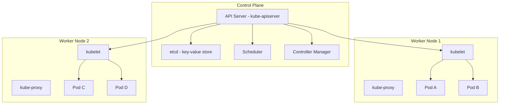
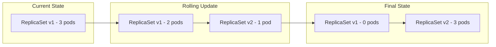
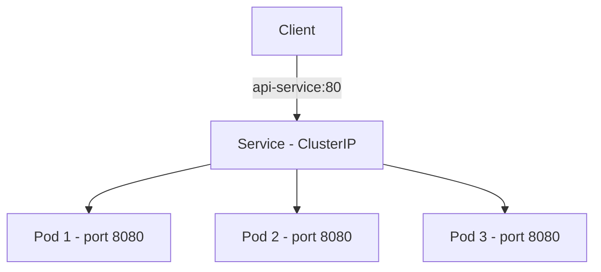
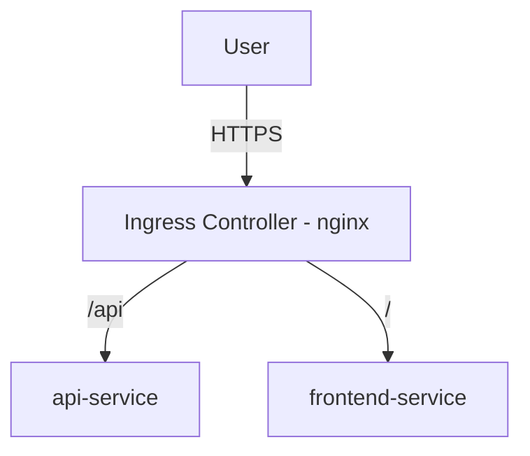

# Kubernetes — Container Orchestration at Scale

## Why Kubernetes?

Docker runs containers on a single host. When you have hundreds of containers across dozens of machines, you need:
- **Scheduling**: Which machine runs which container?
- **Scaling**: Add/remove instances based on load.
- **Self-healing**: Restart crashed containers, reschedule on failed nodes.
- **Service discovery**: How does service A find service B?
- **Rolling updates**: Deploy new versions without downtime.

Kubernetes (K8s) is the de facto standard for solving these problems.

---

## Architecture



### Control Plane Components

- **API Server** (`kube-apiserver`): Frontend for the cluster. All communication goes through it (REST API). Authenticates, validates, and persists objects to etcd.
- **etcd**: Distributed key-value store. The single source of truth for cluster state. Uses Raft consensus for consistency.
- **Scheduler** (`kube-scheduler`): Watches for unscheduled Pods and assigns them to nodes based on resource requests, affinity rules, and taints/tolerations.
- **Controller Manager**: Runs reconciliation loops. The Deployment controller ensures the desired number of Pods exist. The Node controller detects and responds to node failures.

### Node Components

- **kubelet**: Agent on each node. Receives PodSpecs from the API server and ensures the described containers are running and healthy.
- **kube-proxy**: Maintains network rules (iptables/IPVS) for Service routing. Enables Pod-to-Service communication.

---

## Pods

A **Pod** is the smallest deployable unit. It wraps one or more containers that share:
- **Network namespace**: Same IP, same ports. Containers in a Pod communicate via `localhost`.
- **Volumes**: Shared storage accessible to all containers in the Pod.
- **Lifecycle**: Containers in a Pod are co-scheduled and co-terminated.

### When to Use Multi-Container Pods

- **Sidecar**: A log shipper alongside the main app.
- **Ambassador**: A proxy that simplifies network access.
- **Adapter**: Transforms output to a standard format.

```yaml
apiVersion: v1
kind: Pod
metadata:
  name: app-with-logging
  labels:
    app: my-app
spec:
  containers:
    - name: app
      image: my-app:1.0
      ports:
        - containerPort: 8080
      resources:
        requests:
          cpu: "100m"
          memory: "128Mi"
        limits:
          cpu: "500m"
          memory: "256Mi"
      livenessProbe:
        httpGet:
          path: /healthz
          port: 8080
        initialDelaySeconds: 10
        periodSeconds: 5
      readinessProbe:
        httpGet:
          path: /ready
          port: 8080
        initialDelaySeconds: 5
        periodSeconds: 3
    - name: log-shipper
      image: fluentd:latest
      volumeMounts:
        - name: app-logs
          mountPath: /var/log/app
  volumes:
    - name: app-logs
      emptyDir: {}
```

### Probe Types

| Probe | Purpose | What Happens on Failure |
|-------|---------|------------------------|
| `livenessProbe` | Is the container alive? | Container is restarted |
| `readinessProbe` | Is the container ready for traffic? | Pod removed from Service endpoints |
| `startupProbe` | Has the container finished starting? | Other probes are disabled until this succeeds |

---

## Deployments

A **Deployment** declaratively manages Pods via a **ReplicaSet**. You describe the desired state; the Deployment controller reconciles reality with that state.

```yaml
apiVersion: apps/v1
kind: Deployment
metadata:
  name: api-server
spec:
  replicas: 3
  selector:
    matchLabels:
      app: api-server
  strategy:
    type: RollingUpdate
    rollingUpdate:
      maxSurge: 1
      maxUnavailable: 0
  template:
    metadata:
      labels:
        app: api-server
    spec:
      containers:
        - name: api
          image: my-api:1.2.0
          ports:
            - containerPort: 8080
          env:
            - name: DB_HOST
              valueFrom:
                configMapKeyRef:
                  name: app-config
                  key: db-host
            - name: DB_PASSWORD
              valueFrom:
                secretKeyRef:
                  name: app-secrets
                  key: db-password
```

### Rolling Update Strategy



- `maxSurge: 1`: At most 1 extra Pod during rollout.
- `maxUnavailable: 0`: Never go below desired count. Zero-downtime deploys.

---

## Services

A **Service** provides a stable IP and DNS name for a set of Pods. Pods are ephemeral (they get new IPs on restart), but the Service endpoint remains constant.

### Service Types

| Type | Use Case | Access |
|------|----------|--------|
| `ClusterIP` (default) | Internal communication | Only within the cluster |
| `NodePort` | Development/testing | Accessible on node IP + port (30000-32767) |
| `LoadBalancer` | Production external access | Provisions a cloud load balancer |
| `ExternalName` | Alias for external DNS | CNAME redirect |

```yaml
apiVersion: v1
kind: Service
metadata:
  name: api-service
spec:
  type: ClusterIP
  selector:
    app: api-server
  ports:
    - port: 80
      targetPort: 8080
      protocol: TCP
```



Services use **label selectors** to find Pods. The Service `api-service` with selector `app: api-server` routes to all Pods with that label.

---

## StatefulSets

Deployments treat Pods as interchangeable. **StatefulSets** are for stateful workloads (databases, message queues) that need:
- **Stable network identity**: `pod-0`, `pod-1`, `pod-2` (not random hashes).
- **Stable persistent storage**: Each Pod gets its own PersistentVolumeClaim.
- **Ordered deployment/termination**: `pod-0` starts before `pod-1`, and terminates in reverse order.

```yaml
apiVersion: apps/v1
kind: StatefulSet
metadata:
  name: postgres
spec:
  serviceName: postgres-headless
  replicas: 3
  selector:
    matchLabels:
      app: postgres
  template:
    metadata:
      labels:
        app: postgres
    spec:
      containers:
        - name: postgres
          image: postgres:16
          volumeMounts:
            - name: pgdata
              mountPath: /var/lib/postgresql/data
  volumeClaimTemplates:
    - metadata:
        name: pgdata
      spec:
        accessModes: ["ReadWriteOnce"]
        resources:
          requests:
            storage: 10Gi
```

A **headless Service** (`clusterIP: None`) is used with StatefulSets to enable direct Pod DNS: `postgres-0.postgres-headless.default.svc.cluster.local`.

---

## ConfigMaps and Secrets

### ConfigMaps

Store non-sensitive configuration as key-value pairs.

```yaml
apiVersion: v1
kind: ConfigMap
metadata:
  name: app-config
data:
  db-host: "postgres.default.svc.cluster.local"
  log-level: "info"
  nginx.conf: |
    server {
      listen 80;
      location / { proxy_pass http://api:8080; }
    }
```

### Secrets

Store sensitive data (base64-encoded, **not encrypted** by default).

```bash
# Create from literal
kubectl create secret generic app-secrets \
  --from-literal=db-password='s3cret'

# Create from file
kubectl create secret generic tls-cert \
  --from-file=tls.crt --from-file=tls.key
```

**Security considerations**:
- Secrets are base64-encoded, not encrypted. Enable **encryption at rest** in etcd.
- Use `secretKeyRef` in Pod specs, not environment variables visible in `kubectl describe`.
- Consider external secret managers (Vault, AWS Secrets Manager) with the **External Secrets Operator**.

---

## Ingress

An **Ingress** manages external HTTP/HTTPS access to Services. It provides:
- **Path-based routing**: `/api` → api-service, `/web` → frontend-service.
- **Host-based routing**: `api.example.com` vs `web.example.com`.
- **TLS termination**: Offload HTTPS at the ingress controller.

```yaml
apiVersion: networking.k8s.io/v1
kind: Ingress
metadata:
  name: app-ingress
  annotations:
    nginx.ingress.kubernetes.io/ssl-redirect: "true"
spec:
  ingressClassName: nginx
  tls:
    - hosts:
        - example.com
      secretName: tls-secret
  rules:
    - host: example.com
      http:
        paths:
          - path: /api
            pathType: Prefix
            backend:
              service:
                name: api-service
                port:
                  number: 80
          - path: /
            pathType: Prefix
            backend:
              service:
                name: frontend-service
                port:
                  number: 80
```



Popular ingress controllers: **NGINX Ingress**, **Traefik**, **Istio Gateway**, **AWS ALB Ingress**.

---

## Operators

An **Operator** is a custom controller that encodes domain-specific operational knowledge. It extends Kubernetes with **Custom Resource Definitions (CRDs)** and reconciliation logic.

For example, a PostgreSQL Operator watches a `PostgreSQL` CRD and automatically:
- Creates StatefulSets with the right configuration.
- Manages backups and restores.
- Handles failover and replication.

Popular operators: **Prometheus Operator**, **cert-manager**, **CloudNativePG**, **Zalando Postgres Operator**.

---

## Helm

Helm is the package manager for Kubernetes. A **Helm Chart** is a template-driven package of Kubernetes manifests.

```yaml
# values.yaml
replicaCount: 3
image:
  repository: my-api
  tag: "1.2.0"
  pullPolicy: IfNotPresent
resources:
  requests:
    cpu: 100m
    memory: 128Mi
```

```bash
# Install a chart
helm install my-release ./my-chart -f values.yaml

# Upgrade
helm upgrade my-release ./my-chart --set image.tag=1.3.0

# Rollback
helm rollback my-release 1

# List releases
helm list -A
```

### Helm Template Example

```yaml
# templates/deployment.yaml
apiVersion: apps/v1
kind: Deployment
metadata:
  name: {{ .Release.Name }}
spec:
  replicas: {{ .Values.replicaCount }}
  template:
    spec:
      containers:
        - name: {{ .Chart.Name }}
          image: "{{ .Values.image.repository }}:{{ .Values.image.tag }}"
          resources:
            {{- toYaml .Values.resources | nindent 12 }}
```

---

## Essential kubectl Commands

```bash
# Cluster info
kubectl cluster-info
kubectl get nodes -o wide

# Pods
kubectl get pods -A                    # All namespaces
kubectl describe pod <name>            # Detailed info
kubectl logs <pod> -f --tail=100       # Follow logs
kubectl exec -it <pod> -- /bin/sh      # Shell into pod
kubectl delete pod <name>              # Delete (rescheduled by controller)

# Deployments
kubectl apply -f deployment.yaml       # Create/update
kubectl rollout status deploy/<name>   # Watch rollout
kubectl rollout undo deploy/<name>     # Rollback
kubectl scale deploy/<name> --replicas=5

# Debugging
kubectl get events --sort-by='.lastTimestamp'
kubectl top pods                       # Resource usage
kubectl port-forward svc/api-service 8080:80  # Local access
```

---

## Interview Questions

1. **What is a Pod and why not just deploy containers directly?**
   A Pod is the smallest deployable unit that wraps one or more co-located containers. It provides shared network (same IP), shared volumes, and a co-lifecycle. This enables sidecar patterns (logging, proxying) without complex inter-container networking.

2. **Explain the difference between a Deployment and a StatefulSet.**
   Deployments manage stateless Pods with random names and no ordering guarantees. StatefulSets provide stable identities (`pod-0`, `pod-1`), persistent storage per Pod, and ordered creation/deletion. Use StatefulSets for databases, ZooKeeper, etc.

3. **How does Kubernetes Service discovery work?**
   Each Service gets a DNS entry (`<svc>.<ns>.svc.cluster.local`) and a stable ClusterIP. kube-proxy programs iptables/IPVS rules to route traffic from the ClusterIP to healthy Pod endpoints. Pods can also use environment variables (`<SVC>_SERVICE_HOST`).

4. **What is the difference between `ClusterIP`, `NodePort`, and `LoadBalancer` Services?**
   `ClusterIP` is internal-only. `NodePort` exposes on every node's IP at a static port (30000-32767). `LoadBalancer` provisions a cloud load balancer that routes to NodePort. `LoadBalancer` → `NodePort` → `ClusterIP` is the typical layering.

5. **How do ConfigMaps and Secrets differ and what are their security implications?**
   Both store key-value data. ConfigMaps are for non-sensitive config. Secrets are base64-encoded (not encrypted by default) — enable encryption at rest in etcd. Secrets can be mounted as files or env vars. Never commit Secrets to Git; use sealed-secrets or external managers.

6. **Explain the rolling update strategy in Deployments.**
   `maxSurge` controls how many extra Pods can exist during the rollout. `maxUnavailable` controls how many Pods can be down. With `maxSurge: 1, maxUnavailable: 0`, Kubernetes creates one new Pod, waits for it to be ready, then terminates one old Pod — achieving zero-downtime deploys.

7. **What is an Ingress and how does it differ from a Service?**
   A Service provides L4 (TCP/UDP) load balancing within the cluster. An Ingress provides L7 (HTTP/HTTPS) routing with path/host-based rules, TLS termination, and rate limiting. An Ingress resource requires an Ingress Controller (e.g., NGINX) to implement the rules.

8. **What is a Kubernetes Operator?**
   An Operator is a custom controller + CRD that encodes domain-specific operational knowledge. It watches custom resources and reconciles the desired state — e.g., a Postgres Operator creates StatefulSets, manages backups, and handles failover automatically.

9. **How do resource requests and limits work?**
   `requests` are guaranteed resources (used for scheduling). `limits` are the maximum allowed (exceeded = throttling for CPU, OOMKill for memory). Setting requests == limits gives "Guaranteed" QoS; only requests gives "Burstable"; neither gives "BestEffort".

10. **Explain etcd's role in Kubernetes.**
    etcd is the distributed key-value store that holds all cluster state (Pods, Services, ConfigMaps, Secrets, etc.). It uses Raft consensus for consistency. The API server is the only component that talks to etcd directly. etcd performance directly impacts cluster responsiveness.

11. **What are taints and tolerations?**
    Taints are applied to nodes to repel Pods that don't tolerate them. Tolerations are applied to Pods to allow scheduling on tainted nodes. Use cases: dedicated nodes for specific workloads, keeping Pods off the control plane.

12. **How would you implement blue-green deployments in Kubernetes?**
    Run two Deployments (blue and green) with different image tags. Use a Service selector to point to the active version. To switch, update the Service selector from `version: blue` to `version: green`. For instant rollback, switch the selector back.
