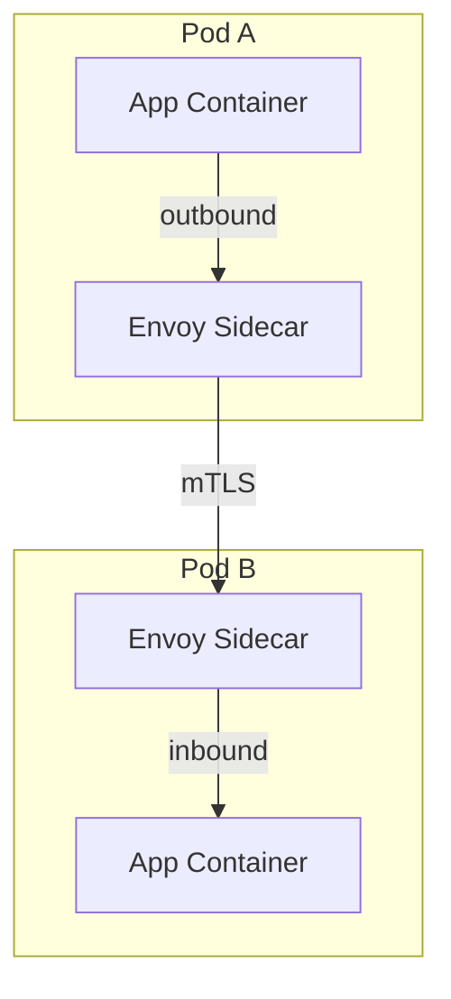
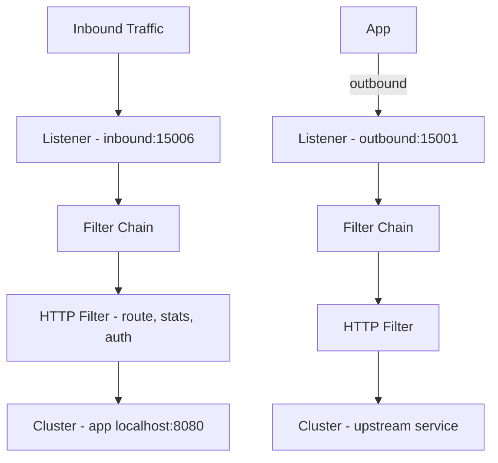
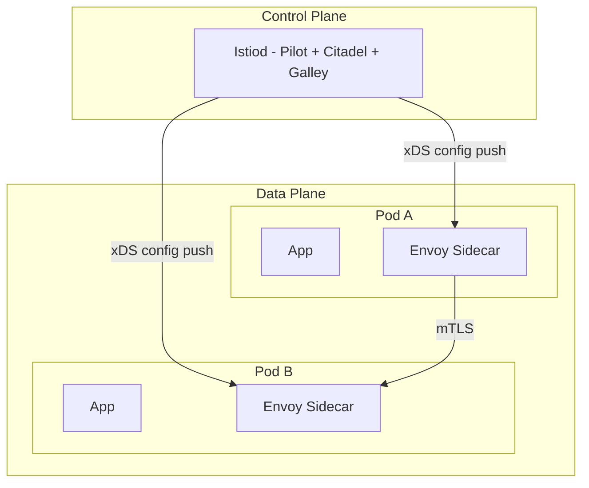
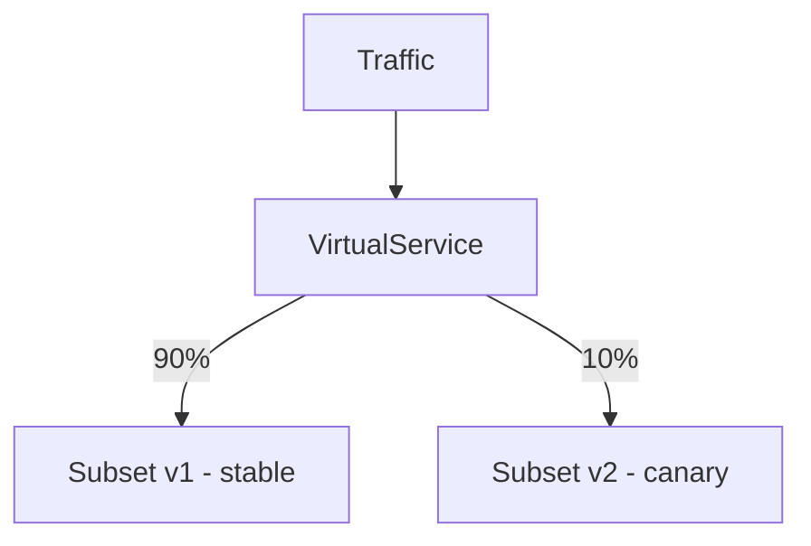
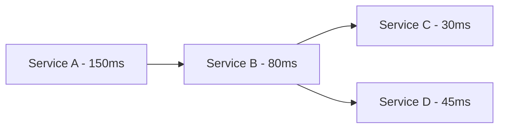
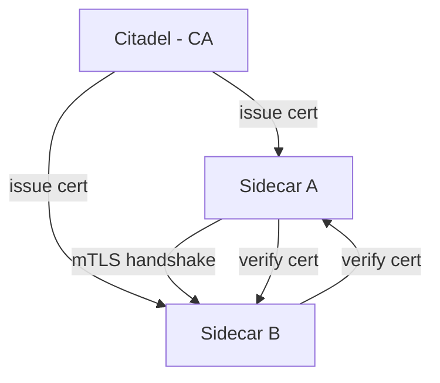

# Service Mesh — Infrastructure-Level Service Communication

## What Is a Service Mesh?

A **service mesh** is a dedicated infrastructure layer for managing service-to-service communication. In a microservices architecture, each service needs to handle concerns like retries, timeouts, mTLS, load balancing, observability, and traffic routing. A service mesh moves these concerns out of application code and into the infrastructure.

The core idea: **developers write business logic; the mesh handles communication.**

---

## The Sidecar Pattern

The fundamental building block of a service mesh is the **sidecar proxy**. Each service Pod gets an additional container — a proxy (typically Envoy) — that intercepts all inbound and outbound network traffic.



The application container is unaware of the sidecar. It sends requests to `localhost`, and the sidecar transparently:
- Adds mTLS encryption.
- Applies retry and timeout policies.
- Collects metrics and distributed traces.
- Routes traffic based on rules (canary, A/B).

---

## Envoy Proxy

**Envoy** is the most widely used sidecar proxy in service meshes. Originally built at Lyft, it's now a CNCF graduated project.

### Key Features

- **L4/L7 proxy**: Handles both TCP and HTTP traffic.
- **xDS API**: Dynamic configuration via gRPC (no restarts needed).
- **Observability**: Built-in stats, distributed tracing (Zipkin/Jaeger), access logging.
- **Extensibility**: WebAssembly (Wasm) filters for custom logic.
- **Hot restart**: Binary can be replaced without dropping connections.

### Envoy Architecture



Envoy uses **listeners** (bind to ports), **filter chains** (process traffic), and **clusters** (upstream endpoints).

---

## Istio

**Istio** is the most popular service mesh, built on Envoy. It provides a control plane that configures sidecar proxies across the mesh.

### Architecture



### Istiod Components

Istiod is a single binary that combines three functions:

| Component | Function |
|-----------|----------|
| **Pilot** | Traffic management — converts high-level routing rules into Envoy configs, service discovery |
| **Citadel** | Security — issues and rotates mTLS certificates, manages identity |
| **Galley** | Configuration — validates and distributes mesh configuration |

### Installation

```bash
# Install Istio with the demo profile
istioctl install --set profile=demo -y

# Enable automatic sidecar injection for a namespace
kubectl label namespace default istio-injection=enabled

# Verify installation
istioctl analyze
kubectl get pods -n istio-system
```

---

## Traffic Management

Istio provides powerful traffic routing through three CRDs: **VirtualService**, **DestinationRule**, and **Gateway**.

### VirtualService

Defines routing rules for traffic to a service.

```yaml
apiVersion: networking.istio.io/v1beta1
kind: VirtualService
metadata:
  name: api-vs
spec:
  hosts:
    - api-service
  http:
    - match:
        - headers:
            x-canary:
              exact: "true"
      route:
        - destination:
            host: api-service
            subset: v2
    - route:
        - destination:
            host: api-service
            subset: v1
          weight: 90
        - destination:
            host: api-service
            subset: v2
          weight: 10
      timeout: 5s
      retries:
        attempts: 3
        perTryTimeout: 2s
```

### DestinationRule

Defines subsets (versions) and load-balancing policies.

```yaml
apiVersion: networking.istio.io/v1beta1
kind: DestinationRule
metadata:
  name: api-dr
spec:
  host: api-service
  trafficPolicy:
    connectionPool:
      tcp:
        maxConnections: 100
      http:
        h2UpgradePolicy: DEFAULT
        http1MaxPendingRequests: 100
    outlierDetection:
      consecutive5xxErrors: 3
      interval: 10s
      baseEjectionTime: 30s
  subsets:
    - name: v1
      labels:
        version: v1
    - name: v2
      labels:
        version: v2
```

### Canary Deployments



Shift traffic gradually: 90/10 → 80/20 → 50/50 → 0/100. If the canary has errors, shift back to 100/0 instantly.

### Blue-Green Deployments

```yaml
# Route all traffic to v1 (blue)
http:
  - route:
      - destination:
          host: api-service
          subset: v1
        weight: 100

# Switch to v2 (green) — instant cutover
http:
  - route:
      - destination:
          host: api-service
          subset: v2
        weight: 100
```

### Gateway

Controls inbound traffic at the mesh edge (ingress).

```yaml
apiVersion: networking.istio.io/v1beta1
kind: Gateway
metadata:
  name: main-gateway
spec:
  selector:
    istio: ingressgateway
  servers:
    - port:
        number: 443
        name: https
        protocol: HTTPS
      tls:
        mode: SIMPLE
        credentialName: tls-credential
      hosts:
        - "api.example.com"
```

---

## Observability

A service mesh provides observability **without touching application code**.

### Metrics

Envoy automatically collects:
- **Request rate**: Requests per second by source, destination, status code.
- **Error rate**: 4xx/5xx responses.
- **Latency**: P50, P95, P99 request duration.
- **Saturation**: Active connections, pending requests.

These are exported to **Prometheus** and visualized in **Grafana** (Istio includes pre-built dashboards).

### Distributed Tracing

Envoy generates trace spans for every request. With **Jaeger** or **Zipkin**, you can see end-to-end request flows across services.



To enable tracing, propagate these headers in your application:
```
x-request-id
x-b3-traceid
x-b3-spanid
x-b3-parentspanid
x-b3-sampled
x-b3-flags
b3
```

### Kiali

**Kiali** is a service mesh observability console that provides:
- Service graph visualization (who talks to who).
- Health indicators (error rates, latency).
- Traffic animation (live request flow).
- Configuration validation.

---

## Mutual TLS (mTLS)

In standard TLS, only the server is authenticated. In **mTLS**, both client and server present certificates and verify each other.

### How Istio mTLS Works

1. **Citadel** (inside Istiod) acts as a Certificate Authority.
2. Each workload gets a SPIFFE identity: `spiffe://cluster.local/ns/default/sa/my-service`.
3. Citadel issues X.509 certificates to each sidecar.
4. Sidecars automatically establish mTLS connections.



### mTLS Modes

| Mode | Behavior |
|------|----------|
| `STRICT` | Only accept mTLS traffic. Reject plaintext. |
| `PERMISSIVE` | Accept both mTLS and plaintext. Migration mode. |
| `DISABLE` | Don't use mTLS. |
| `UNSET` | Inherit from mesh/namespace config. |

```yaml
apiVersion: security.istio.io/v1beta1
kind: PeerAuthentication
metadata:
  name: default
  namespace: default
spec:
  mtls:
    mode: STRICT
```

### Authorization Policy

```yaml
apiVersion: security.istio.io/v1beta1
kind: AuthorizationPolicy
metadata:
  name: api-authz
spec:
  selector:
    matchLabels:
      app: api-service
  rules:
    - from:
        - source:
            principals: ["cluster.local/ns/default/sa/frontend"]
    - to:
        - operation:
            methods: ["GET"]
            paths: ["/api/*"]
```

This allows only the `frontend` service account to `GET /api/*` on `api-service`.

---

## Alternatives to Istio

| Mesh | Proxy | Complexity | Key Feature |
|------|-------|------------|-------------|
| **Istio** | Envoy | High | Full-featured, large community |
| **Linkerd** | Linkerd2-proxy (Rust) | Low | Lightweight, fast, simple |
| **Consul Connect** | Envoy | Medium | HashiCorp integration (Vault, Nomad) |
| **Cilium Service Mesh** | eBPF (no sidecar) | Medium | Kernel-level, high performance |

### Linkerd vs Istio

**Linkerd** is significantly simpler:
- Single control plane binary (no Istiod complexity).
- Purpose-built Rust proxy (smaller, faster than Envoy).
- 5-minute install vs Istio's 15+ minutes.
- Less flexible but covers 90% of use cases.

---

## When to Use (and Not Use) a Service Mesh

### Use When
- You have 10+ microservices.
- You need mTLS everywhere.
- You need fine-grained traffic control (canary, A/B).
- You want uniform observability without code changes.
- You have compliance requirements (audit trails, encryption).

### Don't Use When
- Monolith or fewer than 5 services.
- You don't have a Kubernetes cluster (meshes are K8s-first).
- Your team can't operate the added complexity.
- Performance overhead (~1-3ms latency per hop) is unacceptable.

---

## Interview Questions

1. **What is a service mesh and what problems does it solve?**
   A service mesh is an infrastructure layer for managing service-to-service communication. It handles cross-cutting concerns (mTLS, retries, timeouts, observability, traffic routing) transparently via sidecar proxies, removing this logic from application code.

2. **Explain the sidecar pattern in a service mesh.**
   Each Pod gets an additional proxy container (e.g., Envoy) that intercepts all traffic. The app sends to localhost; the sidecar handles encryption, routing, retries, and metrics. The app is unaware of the mesh.

3. **How does mTLS work in Istio?**
   Istiod's Citadel component acts as a CA, issuing X.509 certificates to each sidecar using SPIFFE identities. Sidecars automatically perform mTLS handshakes — both client and server verify certificates. Modes: STRICT, PERMISSIVE, DISABLE.

4. **What is the difference between a VirtualService and a DestinationRule?**
   A VirtualService defines routing rules (which subset gets what percentage of traffic, timeouts, retries). A DestinationRule defines subsets (version labels) and traffic policies (connection pools, outlier detection, load balancing).

5. **How would you implement a canary deployment with Istio?**
   Define two subsets (v1, v2) in a DestinationRule. In the VirtualService, set weight-based routing: 90% to v1, 10% to v2. Monitor metrics. If v2 is healthy, shift weights progressively (80/20, 50/50, 0/100). Rollback by shifting back to 100/0.

6. **What is Envoy and why is it used in service meshes?**
   Envoy is a high-performance L4/L7 proxy originally built at Lyft. It supports dynamic configuration via xDS, mTLS, distributed tracing, stats collection, and WebAssembly extensions. It's the de facto sidecar proxy for Istio and other meshes.

7. **Explain the xDS API in Envoy.**
   xDS (x Discovery Service) is a set of gRPC APIs for dynamic configuration. LDS (Listener), RDS (Route), CDS (Cluster), EDS (Endpoint), SDS (Secret). The control plane pushes configs to sidecars without restarts.

8. **How does a service mesh provide observability?**
   The sidecar proxy automatically collects metrics (request rate, latency, error rate), generates distributed trace spans, and produces access logs. This data is exported to Prometheus/Jaeger/Grafana without any application code changes.

9. **What is the performance overhead of a service mesh?**
   Each sidecar adds ~1-3ms latency per hop and consumes ~50-100 MB of memory per Pod. For a 3-hop request, that's ~3-9ms additional latency. The overhead is usually acceptable for the functionality gained but matters for ultra-low-latency systems.

10. **Compare Istio and Linkerd.**
    Istio is feature-rich (complex traffic management, extensibility via Wasm) but complex to operate. Linkerd is simpler (single binary control plane, Rust proxy, 5-minute install) but less flexible. Choose Istio for advanced use cases, Linkerd for simplicity.

11. **What is a Gateway in Istio?**
    A Gateway configures the mesh edge (ingress/egress). It controls which ports/protocols/TLS settings the ingress gateway exposes and which hosts are allowed. Combined with VirtualService, it defines external traffic routing.

12. **When would you NOT use a service mesh?**
    For monoliths or small microservice deployments (< 5 services). The operational complexity (upgrades, debugging sidecars, resource overhead) outweighs the benefits. Also avoid if your team lacks the operational maturity to manage it.
