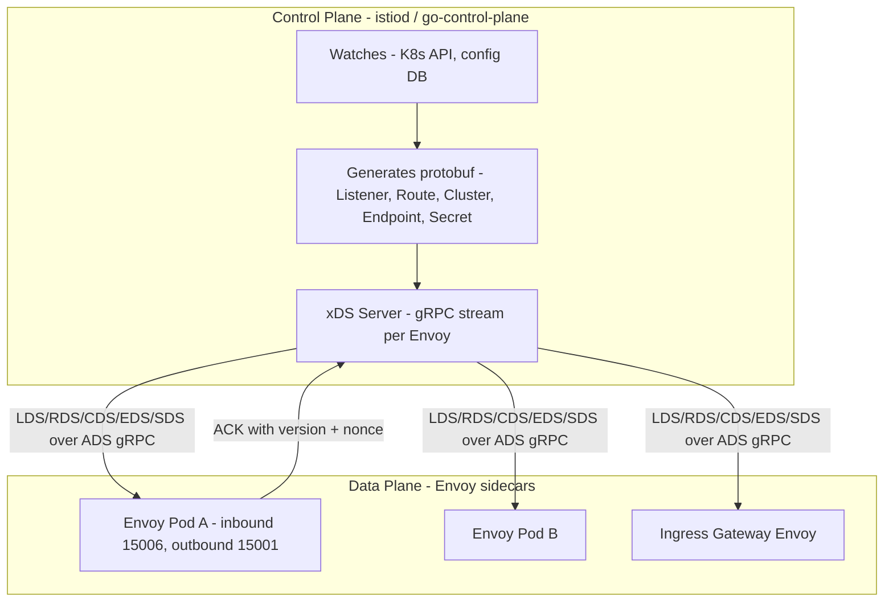
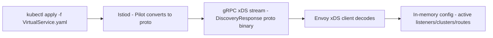
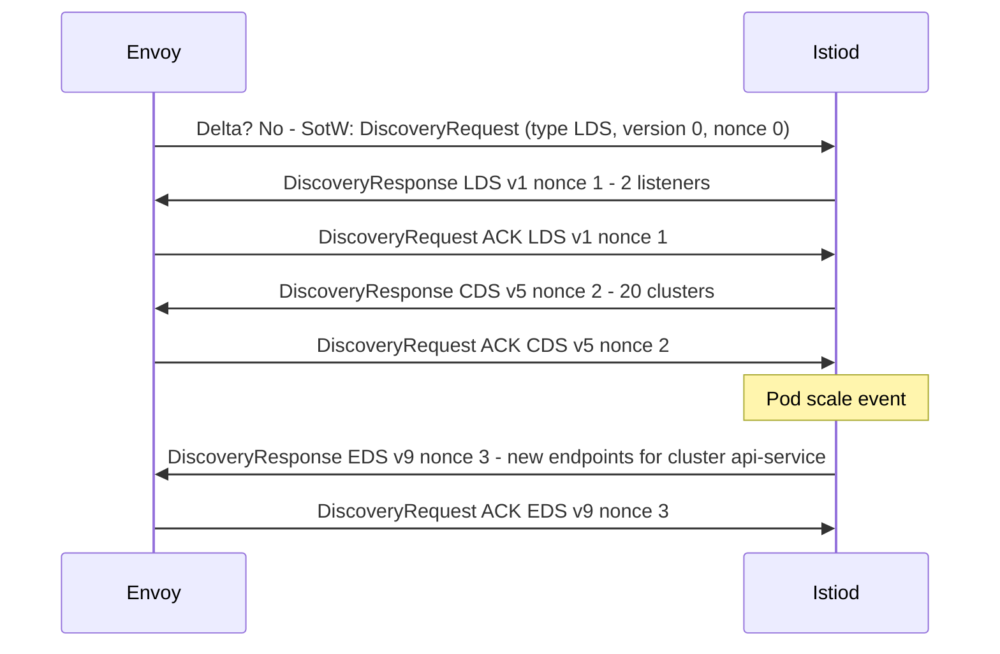
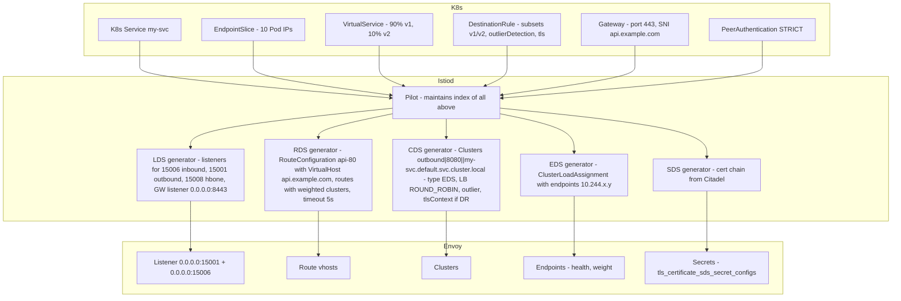
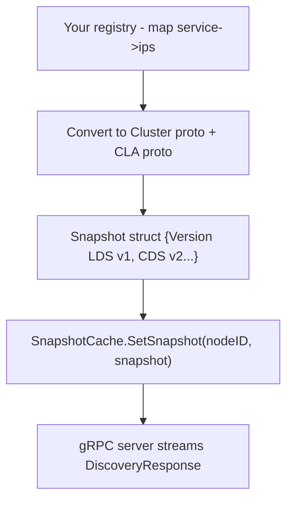

# xDS Protocol — The Control Plane Data Plane API

## Overview

**xDS** is Envoy's **discovery service** API family that lets a **control plane** (e.g., Istio's `istiod`, Consul Connect, or a custom `go-control-plane`) dynamically push configuration to Envoy sidecars at runtime over **gRPC streams** — no restart, no file reload. xDS is the brain of a service mesh: Envoy itself is dumb until xDS tells it what to listen on, where to route, what upstreams exist, and what certificates to use.

> Companion: [Service Mesh](./service-mesh.md) for high-level mesh architecture, traffic management, and mTLS. This page dives into the protocol layer.

## Why xDS?

Static Envoy config (YAML files) does not scale:

- Kubernetes Endpoints churn thousands of pod IP changes per minute.
- Canary routing changes must propagate in seconds.
- mTLS certs rotate every hour.

xDS solves this with an **eventually consistent**, versioned, ACK/NACKed push model.



## Five Core APIs (plus extensions)

| xDS | Full Name | What It Configures | Analogy | Istio Resource Driving It |
|-----|-----------|-------------------|---------|---------------------------|
| **LDS** | Listener Discovery Service | IP:port to bind, filter chains (TLS, HTTP connection manager) | Front door | `Gateway`, sidecar inbound/outbound defaults |
| **RDS** | Route Discovery Service | VirtualHosts, route rules, per-path filter overrides | Reception map | `VirtualService` |
| **CDS** | Cluster Discovery Service | Upstream cluster definition: type, LB policy, circuit breaker, upstream TLS (transport socket) | Destination department | `DestinationRule`, `Service` |
| **EDS** | Endpoint Discovery Service | Concrete endpoint list: IP:port per pod, locality, weight, health | Home addresses in department | `EndpointSlice` / `Endpoints` (from K8s Service) |
| **SDS** | Secret Discovery Service | TLS certificates + private keys | ID badge | `PeerAuthentication`, cert rotation by Citadel |

Extensions:

- **ECDS** — Extension Config DS (e.g., Wasm HTTP filter config)
- **RDS also loads VHDS/RDS separately** — Virtual Host DS can be incremental.
- **SRDS** — Scoped Route DS.
- **RTDS** — Runtime DS.

In most clusters, **CDS + EDS** see highest churn (pod scaling), **RDS** next (routing changes), **LDS** low (ports rarely change), **SDS** periodic (cert rotation).

## Wire Format — Protobuf, Not YAML

Common misconception: control plane sends YAML. Actually **YAML/JSON CRDs are ingress** to control plane; **egress to Envoy is protobuf**.



Example proto (simplified) for LDS:

```proto
message DiscoveryResponse {
  string version_info = 1; // e.g. "2026-08-08T14:32:00Z/123"
  repeated google.protobuf.Any resources = 2; // List of Listener proto
  string type_url = 4; // type.googleapis.com/envoy.config.listener.v3.Listener
  string nonce = 5;
}
// Each Listener proto contains FilterChains -> HTTP Connection Manager -> RouteConfig or RDS reference
```

Envoy replies with `DiscoveryRequest` {version_info = last acked version, response_nonce = last nonce, error_detail if NACK}. This ack protocol is crucial for versioning.

### ADS — Aggregated Discovery Service

Envoy can open one gRPC bidirectional stream multiplexing all xDS types (ADS) rather than one stream per type. ADS guarantees **order**: if CDS must be updated before EDS can be used (new cluster needs endpoints), server sends CDS then EDS on same stream, Envoy processes in order. Istio uses ADS.



## Versioning, Nonce, ACK/NACK

- **version_info**: opaque string (often timestamp + revision). Envoy keeps last applied version per type_url. Sends it in next request to say "I have vX".
- **nonce**: per response unique. Envoy must echo nonce back in ack so server knows ack corresponds to which response.
- **ACK**: `version_info` matches response's version, `error_detail` not set.
- **NACK**: `error_detail` set with error text (e.g., "invalid cluster validation"). Envoy keeps old config. Server can retry with fixed config or keep NACK loop. Observability key: `istioctl proxy-status` shows `STALE` vs `SYNCED`.

This is similar to TCP: version = state, nonce = seq number, ACK/NACK = flow control.

## SotW vs Delta xDS

- **State-of-the-World (SotW)**: server sends **entire** resource set for a type on every change. Simple, but wasteful: 5000 endpoints sent even if 1 pod changed. Envoy today still mostly uses SotW.
- **Delta xDS**: server sends only **changed** resources + removed names. More efficient, requires tracking. Istiod supports delta as alpha, incrementally rolled out (large meshes need it). Delta reduces bandwidth 10-100x for EDS.

Configuration in Envoy bootstrap: `api_type: DELTA_GRPC` vs `GRPC`.

## How Istio Maps Resources to xDS — Detailed



Crucial ordering:

1. Service+EndpointSlice appear -> Pilot creates CDS entry + EDS assignment.
2. VirtualService applied -> triggers RDS push only (no cluster change).
3. DestinationRule applied -> CDS push (subset keys, circuit breakers) + optional EDS (if locality LB).
4. Gateway applied -> LDS push to ingressgateway Envoy only (not all sidecars — optimization via sidecar scope).
5. Certificate rotated -> SDS push to relevant sidecars (every workload gets its own cert via SDS).

## Where Does Metadata Go?

A common platform extension question: Per-Pod version label, per-service LB policy, per-path rate limit.

| What you want | xDS Layer | Proto Field | Why |
|---------------|-----------|-------------|-----|
| Per-Pod label `version=v2`, zone, weight | **EDS** | `LbEndpoint.metadata`, `LocalityLbEndpoints.metadata` | Only EDS has per-endpoint granularity |
| Service-wide LB `LEAST_REQUEST`, circuit breaker, subset definition `version: v1`, upstream mTLS | **CDS** | `Cluster.metadata`, `lb_subset_config`, `circuit_breakers`, `transport_socket` | CDS defines cluster-level policy |
| Per-route timeout, retry, rate limit, ext_authz, header match | **RDS** | `Route.typed_per_filter_config`, `Route.metadata`, `VirtualHost.typed_per_filter_config` | RDS evaluated per HTTP request |
| Whether a filter (Wasm, authn) installed at all, port, TLS termination | **LDS** | `Listener.metadata`, `Listener.filter_chains` | LDS decides filter chain existence |
| TLS cert material | **SDS** | `TlsCertificate` | SDS is dynamic secret distribution |

Mistake: putting per-path logic in CDS will not work because CDS has no path awareness; putting per-endpoint in CDS causes cache misses (needs EDS).

## Debugging

```bash
# Overall sync status - MOST USEFUL FIRST COMMAND
istioctl proxy-status
# NAME                CDS        LDS        EDS        RDS   ECDS   ISTIOD                 VERSION
# productpage-v1-...  SYNCED     SYNCED     SYNCED     SYNCED  istiod-xyz                1.24.0

# Detailed per proxy
istioctl proxy-config all <pod> -n <ns> --output json | jq

# LDS
istioctl proxy-config listener <pod> -n <ns>
istioctl proxy-config listener <pod> -n <ns> --port 15001 -o json | jq '.[].filterChains'

# RDS
istioctl proxy-config route <pod> -n <ns> --name 80 -o json | jq

# CDS
istioctl proxy-config cluster <pod> -n <ns> | grep my-svc
istioctl proxy-config cluster <pod> -n <ns> --fqdn my-svc.default.svc.cluster.local -o json | jq

# EDS
istioctl proxy-config endpoint <pod> -n <ns> --cluster "outbound|8080||my-svc.default.svc.cluster.local" -o json | jq

# SDS - check cert expiry
istioctl proxy-config secret <pod> -n <ns> -o json | jq '.dynamicActiveSecrets[] | {name: .name, expiry: .secret.tlsCertificate.certificateChain[0].notAfter}'

# Envoy admin (requires kubectl port-forward 15000)
curl localhost:15000/config_dump?resource=dynamic_listeners
curl localhost:15000/config_dump?resource=dynamic_active_clusters
```

Common errors:

- **STALE**: Envoy NACKed config. Check `istioctl proxy-status <pod>` detail or `pilot` logs for "NACK".
- **CDS mismatch**: DestinationRule subset label does not match any pod labels -> EDS empty -> 503 `no_healthy_upstream`.
- **RDS not found**: VirtualService host does not match service discovery host (cluster.local) -> route not programmed.
- **LDS listener conflict**: Two Gateways bind same port with overlapping SNI -> LDS push fails.

## Performance & Scale Considerations

- **Number of clusters**: Each Service in same namespace visible to sidecar by default creates outbound CDS entry. In 2000-service cluster, each Envoy gets 2000 CDS. Istiod's **Sidecar** CRD scopes this: `egress hosts: ./my-svc.default.svc.cluster.local` reduces to 1.
- **EDS size**: Each Endpoint is ~200 bytes proto + overhead. 10k endpoints * 2000 sidecars naive push = 20M * 2000 = 40GB of data per scale event. Delta xDS + EDS cache reduces.
- **ADS flow control**: gRPC streams backpressured. Slow Envoy (CPU throttled) can cause queue buildup in istiod.
- **Memory**: Envoy ~50-100 MB + per cluster/endpoint overhead (~1KB per endpoint). 5000 endpoints => ~5MB per Envoy due to EDS duplication across clusters.
- **Startup**: At pod start, Envoy connects to istiod, ADS all types, wait for CDS+EDS+ LDS before `ready`. Slow istiod = slow pod readiness. Envoy **initial fetch timeout** 15s.
- **Benchmarks**: Solo.io & Google show isotiod can handle ~5k sidecars per instance with 1 CPU, up to ~10k with tuning; beyond, need shards.

## Building Your Own Control Plane — go-control-plane

- Libraries: `github.com/envoyproxy/go-control-plane` provides SnapshotCache (SotW) + Delta.
- You implement `snapshot version`: set resources for each type_url, increment version string.
- Envoy bootstrap staticly references control plane's gRPC address (`ads_config`).
- Minimal control plane: watch your own service registry (e.g., Consul, in-memory map) -> generate `Cluster`, `ClusterLoadAssignment` -> push.



## Alternatives to xDS

| Mechanism | Envoy Supports? | Use When |
|-----------|------------------|----------|
| **Static YAML** | Yes | Single proxy, edge, or testing |
| **xDS (SotW)** | Yes (GRPC) | Istio, large dynamic mesh - current standard |
| **xDS Delta** | Yes (DELTA_GRPC) | Very large scale (5000+ endpoints) |
| **File SDS** | Yes | Certs from Vault agent writing files, not control plane |
| **DNS (STRICT_DNS/LOGICAL_DNS)** | Yes but not xDS | Simple external cluster without EDS: uses DNS |

## Interview Questions

**Q: What does xDS stand for and what types exist?**
x Discovery Service. LDS (Listener), RDS (Route), CDS (Cluster), EDS (Endpoint), SDS (Secret). Control plane pushes dynamic config via gRPC, Envoy ACKs with version+nonce. ADS aggregates all types on one stream.

**Q: Why does Istio translate VirtualService to RDS and DestinationRule to CDS?**
VirtualService defines L7 routing rules (path, header, weight) -> naturally maps to RouteConfiguration which Envoy evaluates per request. DestinationRule defines upstream cluster policy (LB, circuit breaker, subset labels, upstream TLS) -> cluster-level.

**Q: How does Envoy learn new pod IP?**
K8s API creates EndpointSlice -> istiod watches -> generates new ClusterLoadAssignment (CLA) resource for that cluster's EDS -> ADS pushes EDS response with version bump + new nonce -> Envoy updates its load balancing pool, ACKs.

**Q: SotW vs Delta xDS?**
SotW sends whole resource set per type on every change. Simple but wasteful when many endpoints. Delta sends only added/removed/changed resources, reduces bandwidth drastically at large scale but needs tracking state.

**Q: What happens if Envoy NACKs?**
Envoy sends DiscoveryRequest with error_detail set, version stays old. Control plane keeps old version as current, can retry or keep NACK; proxy keeps old config, shows STALE in proxy-status. Often due to validation failure (e.g., invalid TLS context).

**Q: Why does Envoy need ADS and ordering?**
Example: new service needs Cluster before Endpoints arrive. If EDS arrives before CDS, Envoy would not know which cluster endpoints belong to. ADS on single stream ensures server controls order: CDS first, then EDS.

**Q: Where would you put rate limit for API path /admin?**
RDS — per route. Use Route.typed_per_filter_config with envoy.filters.http.local_ratelimit or ext_authz filter. Putting in LDS would apply to whole listener, not just path; CDS doesn't see path.

## Cross-References

- [Service Mesh](./service-mesh.md) — sidecar pattern, mTLS, traffic management
- [Kubernetes Operators](../../cloud/kubernetes/operators.md) — extending control plane
- [API Gateway](../api/api-gateway.md) — LDS/RDS for edge
- [Microservices Discovery](../../distributed/microservices/discovery.md) — EDS as service discovery
- [gRPC Deep Dive](../api/grpc.md) — gRPC streaming underlying xDS

## References

- Envoy — xDS API specification, LDS/RDS/CDS/EDS/SDS: https://www.envoyproxy.io/docs/envoy/latest/api-docs/xds_protocol [EnvoyProxy]
- Envoy — go-control-plane reference implementation: https://github.com/envoyproxy/go-control-plane [GitHub]
- Istio — How to Understand Envoy xDS API in Istio Context, mapping resources to xDS types: https://oneuptime.com/blog/post/2026-02-24-how-to-understand-envoy-xds-api-in-istio-context/view [OneUptime]
- What xDS Actually Ships: Control plane sends protobuf, not YAML — LDS/RDS/CDS/EDS/SDS analogy and grain analysis: https://dev.to/kanywst/what-xds-actually-ships-your-control-plane-sends-protobuf-not-yaml-2oje [dev.to]
- Solo.io — Guidance for Building a Control Plane to Manage Envoy Proxy: https://medium.com/solo-io/guidance-for-building-a-control-plane-to-manage-envoy-proxy-at-the-edge-as-a-gateway-or-in-a-mesh-badb6c36a2af [Medium - Solo.io]
- Istio docs — Architecture, Pilot as DiscoveryServer, xDS sync status: https://istio.io/latest/docs/ops/configuration/mesh/config-resource-ready/ [Istio]
