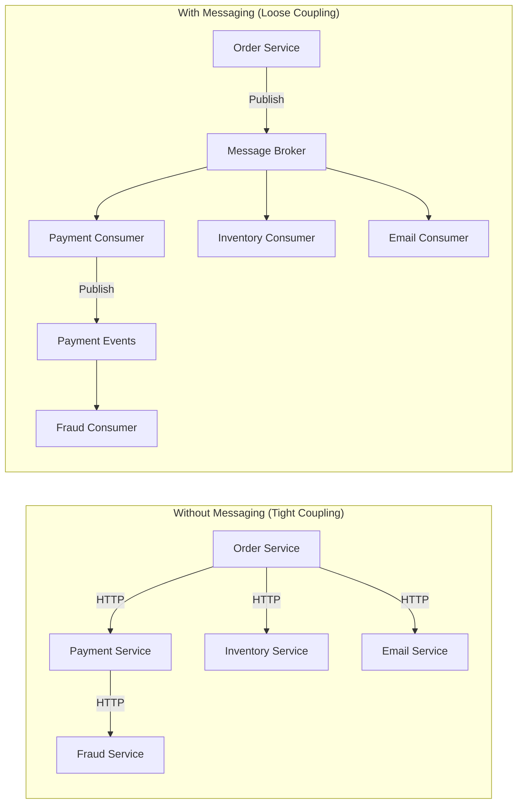
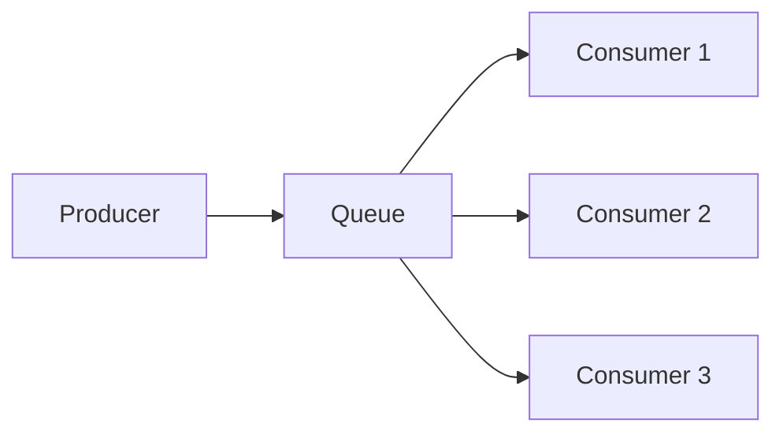
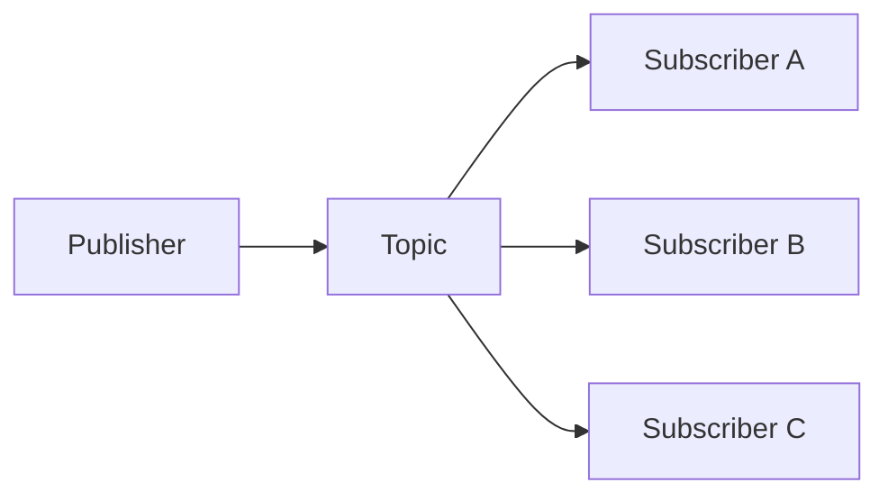
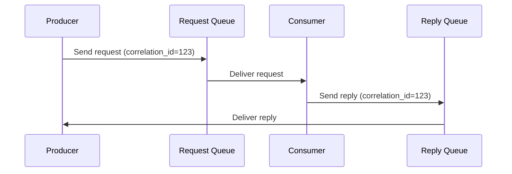
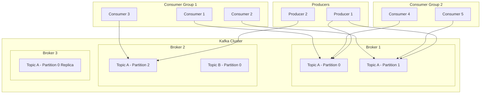
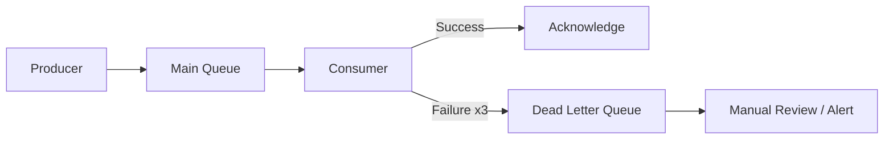

# Messaging Systems

Messaging systems enable asynchronous communication between services, decoupling producers from consumers and enabling resilient, scalable architectures.

## Why Messaging?

Synchronous (request-response) communication works for simple cases but breaks down at scale. When Service A calls Service B directly, both must be available simultaneously. Messaging decouples producers from consumers, enabling independent scaling and fault tolerance.

## When to Use Messaging

| Use Case | Why Messaging Helps |
|----------|-------------------|
| **Decoupling** | Services don't need to know about each other |
| **Buffering** | Handle traffic spikes without dropping messages |
| **Fan-out** | Deliver the same message to multiple consumers |
| **Ordering** | Guarantee processing order (Kafka partitions) |
| **Durability** | Persist messages for replay and recovery |
| **Retry** | Automatic retry with dead-letter queues |
| **Work distribution** | Load balance across consumer group |

## Messaging Patterns

### Point-to-Point (Queue)

Each message is consumed by exactly one consumer. Good for work distribution.

### Publish/Subscribe (Topic)

Each message is delivered to all subscribers. Good for event broadcasting.

### Request/Reply (Over Messaging)

## Comparison

| Feature | Kafka | RabbitMQ | Redis Streams | NATS |
|---------|-------|----------|---------------|------|
| **Model** | Distributed log | Queue/Exchange | Log-like | Subject-based |
| **Durability** | Disk (configurable) | Memory + Disk | Optional (AOF/RDB) | JetStream |
| **Throughput** | Very high (MB/s per partition) | Medium (K msg/s) | Very high | Very high |
| **Ordering** | Per-partition | Per-queue | Per-stream | Per-subject |
| **Replay** | Yes (offset-based) | No | Yes (ID-based) | JetStream |
| **Latency** | Low ms | Low ms | Sub-ms | Sub-ms |
| **Consumer groups** | Yes | Yes (competing consumers) | Yes | Queue groups |
| **Best for** | Event streaming, logs | Task queues, RPC | Caching + streams | Lightweight pub/sub |

## Apache Kafka

Kafka is a distributed event streaming platform that stores messages as an immutable, ordered log.

### Kafka Architecture

**Key concepts:**
- **Topic** — A named stream of records (like a table)
- **Partition** — An ordered, immutable sequence within a topic
- **Offset** — Position of a record within a partition
- **Consumer Group** — A set of consumers that share the workload
- **Replication** — Partitions replicated across brokers for fault tolerance

### Kafka Guarantees

| Guarantee | How |
|-----------|-----|
| **At-least-once** | Default — producer retries, consumer commits after processing |
| **At-most-once** | Consumer commits before processing |
| **Exactly-once** | Idempotent producer + transactional consumer (EOS) |
| **Ordering** | Per-partition only (not across partitions) |

## Dead Letter Queues (DLQ)

When a message can't be processed after N retries, it goes to a DLQ instead of blocking the queue.

**Best practices:**
- Set a retry limit (e.g., 3 retries with exponential backoff)
- Alert on DLQ growth — it indicates a bug or data issue
- Provide a mechanism to reprocess DLQ messages after fixing the bug
- Include error context (stack trace, original message) in DLQ

## Message Schema Evolution

As your system evolves, message formats change. Schema registries manage this evolution.

| Compatibility | What It Means | Use Case |
|---------------|---------------|----------|
| **Backward** | New code can read old messages | Adding optional fields |
| **Forward** | Old code can read new messages | Removing optional fields |
| **Full** | Both backward and forward | Safe evolution |

**Tools**: Confluent Schema Registry (Avro/Protobuf/JSON Schema), AWS Glue Schema Registry

## In This Section

- [Apache Kafka](./kafka.md) — Distributed event streaming platform
- [RabbitMQ](./rabbitmq.md) — Traditional message broker
- [Redis](./redis.md) — In-memory data structure store
- [NATS](./nats.md) — Lightweight, high-performance messaging

## Interview Questions

1. **Q: What's the difference between a message queue and a message broker?**
   A: A message queue is a simple FIFO data structure — producer pushes, consumer pops. A message broker (like RabbitMQ) is more sophisticated: it supports routing, exchanges, topics, acknowledgments, and complex delivery patterns. All brokers contain queues, but not all queues are brokers.

2. **Q: When would you choose Kafka over RabbitMQ?**
   A: Kafka when you need: high throughput (millions of messages/sec), message replay (consumers can re-read), event sourcing, log aggregation, or stream processing. RabbitMQ when you need: complex routing, request-reply patterns, task queues with per-message acknowledgment, or lower operational complexity.

3. **Q: Explain Kafka's consumer group concept.**
   A: A consumer group is a set of consumers that cooperatively consume a topic. Each partition is assigned to exactly one consumer in the group. If you have 3 partitions and 3 consumers, each gets one partition. If a consumer fails, its partitions are rebalanced to surviving consumers. Multiple consumer groups can independently read the same topic.

4. **Q: How do you handle message ordering in a distributed system?**
   A: Kafka guarantees ordering per partition. Use a consistent partition key (e.g., user ID) to ensure related messages go to the same partition. Avoid global ordering — it creates a bottleneck. For cross-partition ordering, use a saga pattern or outbox pattern with sequence numbers.

5. **Q: What is the outbox pattern?**
   A: Instead of publishing events directly (which can fail after DB commit), write events to an "outbox" table in the same database transaction. A separate process (CDC or poller) reads the outbox and publishes to the message broker. This guarantees atomicity between database writes and event publishing.

6. **Q: How do you prevent message loss?**
   A: (1) Producer: use acknowledgments (`acks=all` in Kafka), (2) Broker: replication factor ≥ 3, (3) Consumer: commit offset only after processing, (4) Use DLQ for failed messages, (5) Monitor consumer lag — growing lag indicates processing issues.

7. **Q: What is consumer lag and how do you handle it?**
   A: Consumer lag is the difference between the latest produced offset and the last committed consumer offset. It indicates the consumer is falling behind. Solutions: (1) Add more consumers (up to partition count), (2) Optimize consumer processing, (3) Batch processing, (4) Increase partition count if needed.

8. **Q: Explain exactly-once semantics in Kafka.**
   A: Exactly-once means each message is processed exactly once despite failures. In Kafka: (1) Idempotent producer prevents duplicate writes, (2) Transactional API ensures atomic writes across partitions, (3) Consumer reads committed transactions only (`isolation.level=read_committed`). End-to-end exactly-once also requires the sink (DB) to participate in the transaction.

9. **Q: What is backpressure in messaging systems?**
   A: Backpressure occurs when consumers can't keep up with producers. Solutions: (1) Buffer in the message broker, (2) Rate-limit producers, (3) Scale consumers horizontally, (4) Use reactive streams with explicit demand signaling, (5) Drop low-priority messages under extreme load.

10. **Q: How would you design a notification system using messaging?**
    A: Order Service publishes `OrderPlaced` event. Notification Service subscribes and determines channels (email, SMS, push). Each channel has its own consumer with retry logic. Use DLQ for permanent failures. Template Service provides message templates. Fan-out service handles multi-channel delivery.

## References

- [Designing Data-Intensive Applications](https://dataintensive.net/) — Chapter 11 (Stream Processing)
- [Kafka: The Definitive Guide](https://www.confluent.io/resources/kafka-the-definitive-guide/) — O'Reilly
- [RabbitMQ in Depth](https://www.manning.com/books/rabbitmq-in-depth) — Gavin Roy
- [Enterprise Integration Patterns](https://www.enterpriseintegrationpatterns.com/) — Gregor Hohpe
- [Confluent Documentation](https://docs.confluent.io/) — Kafka ecosystem docs
