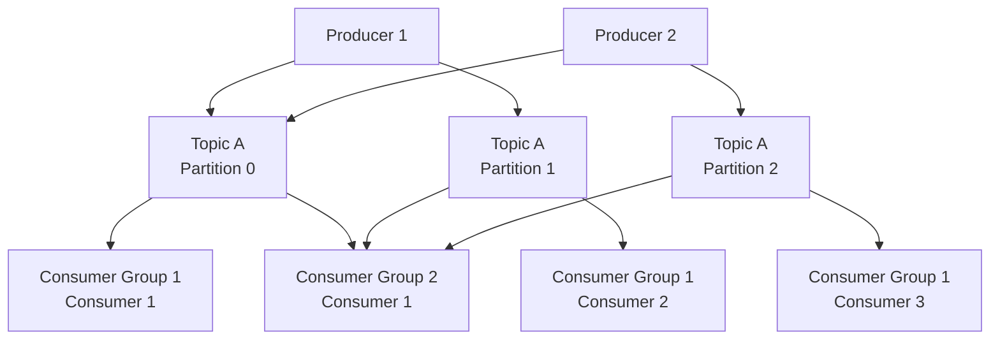
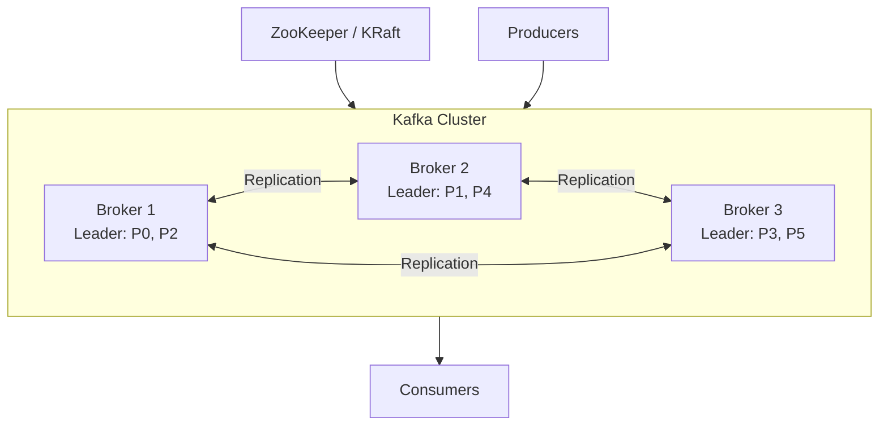

# Apache Kafka

Apache Kafka is a distributed event streaming platform capable of handling trillions of events per day. Originally developed at LinkedIn, it's the backbone of real-time data pipelines and streaming applications.

## Overview

Kafka provides a unified, high-throughput, low-latency platform for handling real-time data feeds. Its design combines the queuing and pub-sub messaging models.

### Why Kafka?

- **High throughput** — Millions of messages per second
- **Durability** — Messages persisted to disk with replication
- **Scalability** — Horizontal scaling via partitions
- **Replay** — Consumers can re-read messages from any offset
- **Ordering** — Guaranteed within a partition
- **Exactly-once semantics** — With idempotent producers and transactions

## Core Concepts



### Topics

A topic is a named category or feed to which records are published. Topics are partitioned and replicated.

```bash
# Create a topic
kafka-topics.sh --create \
  --topic orders \
  --partitions 6 \
  --replication-factor 3 \
  --bootstrap-server localhost:9092

# Describe a topic
kafka-topics.sh --describe --topic orders --bootstrap-server localhost:9092
```

### Partitions

Partitions are the unit of parallelism in Kafka. Each partition is an ordered, immutable sequence of records.

| Property | Description |
|----------|-------------|
| Ordering | Guaranteed within a partition |
| Assignment | Each partition assigned to exactly one consumer in a group |
| Key-based | Messages with same key go to same partition |
| Offset | Each record has a unique sequential ID within its partition |

```java
// Producer with key-based partitioning
producer.send(new ProducerRecord<>(
    "orders",           // topic
    orderId,            // key (determines partition)
    orderData           // value
));
```

### Consumer Groups

Consumer groups enable parallel consumption. Each partition is consumed by exactly one consumer within a group.

```java
Properties props = new Properties();
props.put("bootstrap.servers", "localhost:9092");
props.put("group.id", "order-processing");
props.put("key.deserializer", StringDeserializer.class.getName());
props.put("value.deserializer", OrderDeserializer.class.getName());
props.put("auto.offset.reset", "earliest");

KafkaConsumer<String, Order> consumer = new KafkaConsumer<>(props);
consumer.subscribe(Collections.singletonList("orders"));

while (true) {
    ConsumerRecords<String, Order> records = consumer.poll(Duration.ofMillis(100));
    for (ConsumerRecord<String, Order> record : records) {
        processOrder(record.value());
        consumer.commitSync();
    }
}
```

### Offset Management

| Strategy | Description | Pros | Cons |
|----------|-------------|------|------|
| Auto commit | Periodic automatic commits | Simple | May lose/duplicate messages |
| Manual sync | `commitSync()` after processing | At-least-once | Slower (blocking) |
| Manual async | `commitAsync()` | Faster | May have duplicates on failure |
| Commit specific | `commitSync(offsets)` | Precise control | More complex |

## Message Delivery Guarantees

| Guarantee | How | Use Case |
|-----------|-----|----------|
| At-most-once | Commit before processing | Metrics, logs |
| At-least-once | Commit after processing | Most applications |
| Exactly-once | Idempotent producer + transactions | Financial, critical |

### Exactly-Once Semantics (EOS)

```java
// Idempotent producer
props.put("enable.idempotence", true);
props.put("acks", "all");
props.put("retries", Integer.MAX_VALUE);

// Transactional producer
producer.initTransactions();
try {
    producer.beginTransaction();
    producer.send(new ProducerRecord<>("orders", orderId, orderData));
    producer.send(new ProducerRecord<>("inventory", itemId, updateData));
    producer.commitTransaction();
} catch (Exception e) {
    producer.abortTransaction();
}
```

## Kafka Streams

Kafka Streams is a client library for building stream processing applications.

```java
StreamsBuilder builder = new StreamsBuilder();

// Read from topic
KStream<String, Order> orders = builder.stream("orders");

// Process: filter, transform, aggregate
KTable<String, Long> ordersByCountry = orders
    .filter((key, order) -> order.getAmount() > 100)
    .groupBy((key, order) -> order.getCountry())
    .count();

// Write to topic
ordersByCountry.toStream().to("orders-by-country",
    Produced.with(Serdes.String(), Serdes.Long()));

KafkaStreams streams = new KafkaStreams(builder.build(), config);
streams.start();
```

### Windowing

```java
// Tumbling window: non-overlapping, fixed-size
orders
    .groupByKey()
    .windowedBy(TimeWindows.ofSizeWithNoGrace(Duration.ofMinutes(5)))
    .count();

// Sliding window: overlapping
orders
    .groupByKey()
    .windowedBy(SlidingWindows.ofTimeDifferenceWithNoGrace(Duration.ofMinutes(5)))
    .count();

// Session window: gap-based
orders
    .groupByKey()
    .windowedBy(SessionWindows.ofInactivityGapWithNoGrace(Duration.ofMinutes(30)))
    .count();
```

## Schema Registry

Schema Registry manages Avro/Protobuf/JSON schemas for Kafka topics.

```json
// Register a schema
POST /subjects/orders-value/versions
{
  "schema": "{\"type\":\"record\",\"name\":\"Order\",\"fields\":[{\"name\":\"id\",\"type\":\"string\"},{\"name\":\"amount\",\"type\":\"double\"},{\"name\":\"country\",\"type\":\"string\"}]}"
}
```

### Schema Evolution Rules

| Compatibility | Description | Use Case |
|---------------|-------------|----------|
| BACKWARD | New schema can read old data | Default, safest |
| FORWARD | Old schema can read new data | When consumers upgrade first |
| FULL | Both backward and forward | Most restrictive, safest |
| NONE | No compatibility checks | Destructive changes |

## Kafka Architecture



### Replication

| Factor | Meaning | Recommended |
|--------|---------|-------------|
| RF=1 | No replication (data loss risk) | Development only |
| RF=2 | One replica | Rarely used |
| RF=3 | Two replicas | Production standard |

**ISR (In-Sync Replicas):** Replicas that are fully caught up with the leader. Only ISR members can be elected as new leaders.

## Configuration Essentials

| Property | Description | Recommended |
|----------|-------------|-------------|
| `acks` | Number of acks needed | `all` for durability |
| `retries` | Retry count | `Integer.MAX_VALUE` |
| `enable.idempotence` | Exactly-once | `true` |
| `max.in.flight.requests` | Per connection | `5` (with idempotence) |
| `min.insync.replicas` | Min ISR for writes | `2` (with RF=3) |
| `retention.ms` | How long to keep data | `604800000` (7 days) |
| `max.message.bytes` | Max message size | `1048576` (1MB) |

## Kafka vs RabbitMQ vs Redis Streams

| Aspect | Kafka | RabbitMQ | Redis Streams |
|--------|-------|----------|---------------|
| Model | Distributed log | Message broker | In-memory log |
| Ordering | Per-partition | Per-queue | Per-stream |
| Replay | Yes (from offset) | No | Yes (from ID) |
| Throughput | Very high | Medium | Very high |
| Durability | Disk | Memory + Disk | Optional (AOF) |
| Consumer groups | Yes | Competing consumers | Yes |
| Latency | Low ms | Low ms | Sub-ms |
| Message size | Up to 1MB | Up to 128MB (config) | Up to 512MB |
| Best for | Event streaming | Task queues | Caching + streams |

## Common Mistakes

1. **Too few partitions** — Limits parallelism; can't add consumers
2. **Too many partitions** — Increases latency and memory usage
3. **Not committing offsets properly** — At-most-once or duplicate processing
4. **Ignoring consumer lag** — Processing falls behind production
5. **Single broker in production** — No fault tolerance
6. **Not setting `min.insync.replicas`** — Data loss with acks=1
7. **Large messages** — Kafka is optimized for small messages (<1MB)
8. **Not using Schema Registry** — Schema drift breaks consumers
9. **Ignoring consumer rebalancing** — Causes processing pauses
10. **Polling too infrequently** — Consumer marked as dead

## Production Best Practices

- **Use RF=3 and min.insync.replicas=2** — Survive one broker failure
- **Set acks=all** — Ensure all replicas receive the message
- **Enable idempotent producers** — Prevent duplicates
- **Monitor consumer lag** — Alert when lag exceeds threshold
- **Use Schema Registry** — Enforce schema compatibility
- **Size partitions appropriately** — Start with 6-12, scale as needed
- **Use sticky partitioner** — Better batching for null keys
- **Set retention policies** — Balance storage cost and replay needs
- **Use compaction** for state topics — Keep only latest value per key
- **Test with realistic load** — Kafka behaves differently under stress

## Interview Questions

### 1. What is a Kafka partition and why is it important?

**Answer:** A partition is an ordered, immutable sequence of records within a topic. It's the unit of parallelism — each partition is assigned to exactly one consumer in a group. More partitions mean more parallel consumers, but also more file handles and memory. Partitions also determine ordering: messages with the same key always go to the same partition, guaranteeing order for that key.

### 2. Explain Kafka's replication mechanism.

**Answer:** Each partition has one leader and multiple followers (replicas). Producers and consumers interact only with the leader. Followers replicate data from the leader. The ISR (In-Sync Replicas) set tracks replicas that are caught up. With `acks=all` and `min.insync.replicas=2`, a write succeeds only when at least 2 replicas have it, ensuring no data loss even if one broker fails.

### 3. What are the delivery guarantees in Kafka?

**Answer:** (1) At-most-once: commit offset before processing — message may be lost. (2) At-least-once: commit after processing — message may be processed twice. (3) Exactly-once: idempotent producer (no duplicates on produce) + consumer reading committed-only transactions + manual offset commit. Exactly-once requires `enable.idempotence=true` and transactional API.

### 4. How does Kafka achieve such high throughput?

**Answer:** (1) Sequential I/O — appends to log files, avoiding random disk seeks. (2) Zero-copy — uses `sendfile()` to transfer data directly from page cache to network. (3) Batching — accumulates messages before sending. (4) Compression — batches are compressed together. (5) Partitioning — parallel reads/writes across partitions. (6) Page cache — relies on OS page cache instead of managing its own.

### 5. What is consumer rebalancing and why is it problematic?

**Answer:** Rebalancing occurs when consumers join/leave a group or topics change. During rebalance, all consumers stop processing, partitions are reassigned, and consumption pauses. Problems: processing gaps, potential duplicate processing, and increased latency. Mitigations: use cooperative rebalancing (incremental), static group membership, and keep consumer processing fast.

### 6. How does Kafka Streams differ from consumer API?

**Answer:** Kafka Streams is a higher-level library built on the consumer/producer API. It provides: (1) DSL for stream processing (filter, map, join, aggregate), (2) stateful processing with state stores (RocksDB), (3) windowing (tumbling, sliding, session), (4) exactly-once processing, (5) automatic partition assignment and rebalancing, (6) fault-tolerant local state. Consumer API is lower-level, giving more control but requiring more boilerplate.

### 7. What is the role of Schema Registry?

**Answer:** Schema Registry stores and validates schemas (Avro, Protobuf, JSON Schema) for Kafka messages. It enforces compatibility rules (backward, forward, full) to prevent breaking changes. Producers register schemas before publishing; consumers fetch schemas to deserialize. This prevents schema drift and enables safe schema evolution in production.

### 8. How would you handle a Kafka consumer that's falling behind?

**Answer:** (1) Add more consumers (up to partition count). (2) Increase `max.poll.records` for bigger batches. (3) Optimize processing logic (async, batching). (4) Increase partitions (requires rebalance). (5) Check for slow deserialization. (6) Monitor GC pauses. (7) Consider skipping old messages if lag is too large and data is time-sensitive.

### 9. Explain Kafka's log compaction.

**Answer:** Log compaction retains only the latest value for each key. Instead of deleting old segments by time, compaction removes older records with duplicate keys. Use cases: changelog topics, event sourcing where you only need the latest state. Enable with `cleanup.policy=compact`. Can combine with time-based retention: `cleanup.policy=compact,delete`.

### 10. How do you achieve exactly-once semantics in Kafka?

**Answer:** Three components: (1) Idempotent producer (`enable.idempotence=true`) — prevents duplicate writes from retries. (2) Transactional API — atomically write to multiple topics and commit consumer offsets. (3) Consumer reads only committed messages (`isolation.level=read_committed`). This ensures each message is produced and consumed exactly once, even across retries and failures.

### 11. What is the difference between Kafka and traditional message queues?

**Answer:** Traditional queues (RabbitMQ, ActiveMQ) delete messages after consumption; Kafka retains them based on retention policy. Queues route messages to one consumer; Kafka allows multiple consumer groups to independently read the same data. Kafka provides ordering guarantees per partition and supports replay from any offset. Queues are better for task distribution; Kafka is better for event streaming and data pipelines.

### 12. How would you design a Kafka-based event sourcing system?

**Answer:** Use a topic per entity type (e.g., `order-events`). Events are the source of truth — append-only log of state changes. Use compacted topics for snapshots. Kafka Streams or a projection service builds read models (CQRS). Use the transactional API for atomic event + projection updates. Store entity version in events for optimistic concurrency control. Use Schema Registry for event schema evolution.
