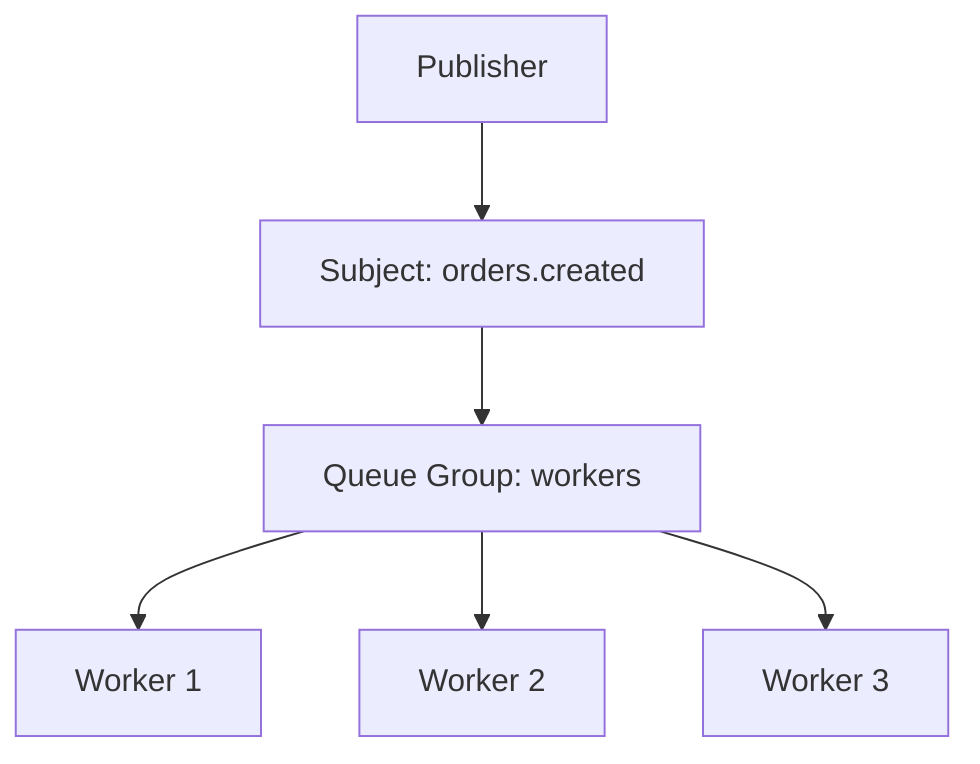
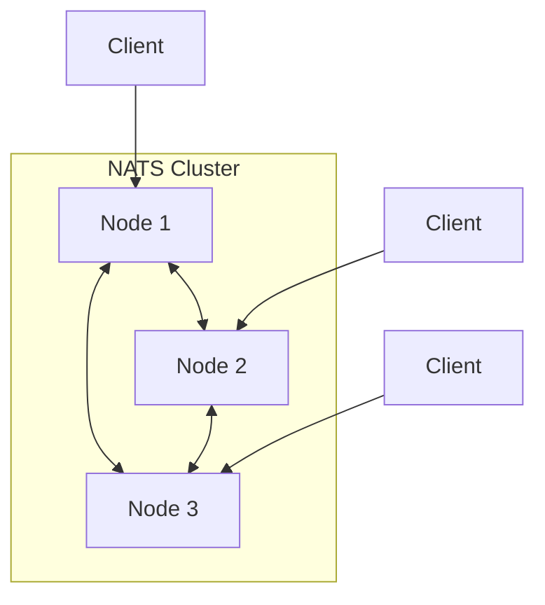

# NATS

NATS is a lightweight, high-performance messaging system designed for cloud-native applications, IoT messaging, and microservices architectures. It emphasizes simplicity, performance, and ease of operation.

## Overview

NATS was created by Derek Collison and is now a CNCF incubating project. It provides a simple pub/sub model with optional persistence via JetStream.

### Why NATS?

- **Simplicity** — Minimal configuration, easy to operate
- **Performance** — Millions of messages per second, sub-millisecond latency
- **Lightweight** — Single binary, small footprint
- **Flexible** — Pub/sub, request/reply, queue groups
- **Edge-friendly** — Works in constrained environments
- **JetStream** — Built-in persistence and streaming

## Core NATS

Core NATS provides "fire and forget" messaging — fast but without persistence.

### Subjects

Messages are organized by subjects (topics). Subjects use dot notation for hierarchy.

```
orders.created
orders.created.us
orders.created.eu
orders.updated
users.123.profile
system.metrics.cpu
```

### Wildcards

| Wildcard | Matches | Example |
|----------|---------|---------|
| `*` | One token | `orders.*` matches `orders.created` but not `orders.created.us` |
| `>` | One or more tokens | `orders.>` matches `orders.created`, `orders.created.us`, etc. |

```go
// Subscribe with wildcard
nc.Subscribe("orders.>", func(msg *nats.Msg) {
    fmt.Printf("Received on %s: %s\n", msg.Subject, string(msg.Data))
})

// Subscribe to specific
nc.Subscribe("orders.created.us", handler)
```

### Pub/Sub

```go
// Publisher
nc, _ := nats.Connect(nats.DefaultURL)
nc.Publish("orders.created", []byte(`{"id": "123", "amount": 99.99}`))

// Subscriber
nc.Subscribe("orders.created", func(msg *nats.Msg) {
    fmt.Printf("Order: %s\n", string(msg.Data))
})
```

### Queue Groups

Queue groups provide load balancing — messages are distributed among subscribers in the group.



```go
// All three subscribers share the load
nc.QueueSubscribe("orders.created", "workers", handler)
nc.QueueSubscribe("orders.created", "workers", handler)
nc.QueueSubscribe("orders.created", "workers", handler)
```

### Request/Reply

NATS provides built-in request/reply pattern.

```go
// Responder
nc.Subscribe("orders.get", func(msg *nats.Msg) {
    order := fetchOrder(string(msg.Data))
    msg.Respond(order)
})

// Requester
resp, err := nc.Request("orders.get", []byte("123"), 2*time.Second)
if err != nil {
    log.Fatal("Timeout or error:", err)
}
fmt.Println(string(resp.Data))
```

## JetStream

JetStream adds persistence, streaming, and exactly-once delivery to NATS.

### Streams

Streams store messages durably.

```bash
# Create stream
nats stream add ORDERS \
  --subjects "orders.*" \
  --storage file \
  --retention limits \
  --max-msgs 1000000 \
  --max-bytes 1GB \
  --max-age 7d \
  --replicas 3
```

```go
js, _ := nc.JetStream()

// Create stream
js.AddStream(&nats.StreamConfig{
    Name:     "ORDERS",
    Subjects: []string{"orders.*"},
    Storage:  nats.FileStorage,
    MaxMsgs:  1000000,
    MaxAge:   7 * 24 * time.Hour,
    Replicas: 3,
})

// Publish to stream
js.Publish("orders.created", []byte(`{"id": "123"}`))
```

### Consumers

Consumers read from streams with different delivery guarantees.

```go
// Push-based consumer (server pushes messages)
sub, _ := js.Subscribe("orders.created", func(msg *nats.Msg) {
    processOrder(msg.Data)
    msg.Ack()
}, nats.Durable("order-processor"), nats.ManualAck())

// Pull-based consumer (client pulls messages)
sub, _ := js.PullSubscribe("orders.created", "order-processor")
msgs, _ := sub.Fetch(10, nats.MaxWait(5*time.Second))
for _, msg := range msgs {
    processOrder(msg.Data)
    msg.Ack()
}
```

### Consumer Configuration

```go
js.AddConsumer("ORDERS", &nats.ConsumerConfig{
    Durable:       "order-processor",
    AckPolicy:     nats.AckExplicitPolicy,
    DeliverPolicy: nats.DeliverAllPolicy,
    MaxDeliver:    5,
    AckWait:       30 * time.Second,
    ReplayPolicy:  nats.ReplayInstantPolicy,
    FilterSubject: "orders.created",
})
```

| Delivery Policy | Description |
|----------------|-------------|
| `DeliverAll` | Deliver all messages from the stream |
| `DeliverLast` | Deliver only the last message |
| `DeliverNew` | Deliver only new messages after subscription |
| `DeliverByStartSequence` | Start from a specific sequence |
| `DeliverByStartTime` | Start from a specific time |

### Exactly-Once Delivery

```go
// Publish with deduplication
js.Publish("orders.created", data, nats.MsgId("order-123-001"))

// Idempotent consumer with explicit ack
sub, _ := js.PullSubscribe("orders.created", "processor",
    nats.ManualAck(),
)
msgs, _ := sub.Fetch(1)
for _, msg := range msgs {
    // Process idempotently
    if !alreadyProcessed(msg.Header.Get("Nats-Msg-Id")) {
        processOrder(msg.Data)
    }
    msg.Ack()
}
```

### Key-Value Store

JetStream includes a built-in key-value store.

```go
kv, _ := js.CreateKeyValue(&nats.KeyValueConfig{
    Bucket:   "config",
    TTL:      1 * time.Hour,
    MaxValueSize: 1024,
    History:  5,
})

// Operations
kv.Put("feature.flag.new_ui", []byte("true"))
entry, _ := kv.Get("feature.flag.new_ui")
kv.Delete("feature.flag.new_ui")

// Watch for changes
watcher, _ := kv.Watch("feature.flag.>")
for entry := range watcher.Updates() {
    fmt.Printf("Key: %s, Value: %s\n", entry.Key(), string(entry.Value()))
}
```

## NATS vs Kafka vs RabbitMQ

| Aspect | NATS | Kafka | RabbitMQ |
|--------|------|-------|----------|
| Model | Subject-based pub/sub | Distributed log | Message broker |
| Persistence | JetStream (optional) | Always on disk | Memory + disk |
| Latency | Sub-ms | Low ms | Low ms |
| Throughput | Very high | Very high | Medium |
| Complexity | Very low | High | Medium |
| Consumer groups | Queue groups | Native | Competing consumers |
| Replay | JetStream | Yes | No |
| Ordering | Per-subject | Per-partition | Per-queue |
| Best for | Microservices, IoT | Event streaming | Task queues |
| Binary size | ~10MB | ~100MB+ | ~50MB+ |

## Clustering



```bash
# Start cluster
nats-server --cluster nats://0.0.0.0:6222 --routes nats://node1:6222,nats://node2:6222,nats://node3:6222

# Super-cluster (leaf nodes for edge)
nats-server --leafnode nats://central:7422
```

## Authentication

```conf
# Simple token
authorization: my-secret-token

# NKEY-based
authorization {
  users = [
    { nkey: "UAH5L6SQGZM3EQXKNGMKKZS5N7DSYXBM6YLM4L5JYBPX5GXJHBL7XKL" }
  ]
}

# JWT-based (decentralized auth)
operator: /path/to/operator.nk
resolver: URL(https://resolver.ngs.global)
```

## Common Mistakes

1. **Using Core NATS for critical messages** — No persistence, messages lost if subscriber offline
2. **Not using queue groups** — All subscribers get all messages instead of load balancing
3. **Ignoring JetStream ack** — Messages redelivered if not acknowledged
4. **Too many subjects** — Increases routing overhead
5. **Not setting max delivery** — Failed messages retried indefinitely
6. **Large messages** — NATS is optimized for small to medium messages (<1MB)
7. **Not monitoring consumer lag** — Falling behind on JetStream consumers
8. **Single node in production** — No fault tolerance
9. **Using request/reply for async** — Use pub/sub with separate reply subject
10. **Not setting message TTL** — Storage grows unbounded

## Production Best Practices

- **Use JetStream for reliability** — Core NATS for ephemeral, JetStream for critical
- **Set message TTLs** — Prevent storage exhaustion
- **Use queue groups** — For load balancing consumers
- **Monitor with nats CLI** — `nats server report`, `nats stream info`
- **Deploy 3+ node clusters** — Survive node failures
- **Use leaf nodes** — For edge/IoT scenarios
- **Set max deliver** — Prevent infinite retries
- **Use message IDs** — For deduplication
- **Size streams appropriately** — Set limits on messages, bytes, and age
- **Use TLS** — Encrypt all communication

## Interview Questions

### 1. What is NATS and how does it differ from Kafka?

**Answer:** NATS is a lightweight pub/sub messaging system focused on simplicity and performance. Core NATS is fire-and-forget; JetStream adds persistence. Kafka is a distributed log designed for event streaming with strong ordering and replay guarantees. NATS has sub-millisecond latency and a tiny footprint; Kafka has higher throughput for streaming but more operational complexity. Use NATS for microservices communication; Kafka for event sourcing and data pipelines.

### 2. Explain NATS subjects and wildcards.

**Answer:** Subjects are dot-separated hierarchies (e.g., `orders.created.us`). Single-level wildcard `*` matches one token: `orders.*` matches `orders.created` but not `orders.created.us`. Multi-level wildcard `>` matches one or more tokens: `orders.>` matches `orders.created`, `orders.created.us`, etc. This enables flexible topic-based routing.

### 3. What are queue groups in NATS?

**Answer:** Queue groups provide load balancing among subscribers. When multiple subscribers join the same queue group, each message is delivered to only one subscriber in the group (round-robin). This is NATS's equivalent of competing consumers in RabbitMQ. Use queue groups when you want to distribute work across multiple workers.

### 4. What is JetStream and when should you use it?

**Answer:** JetStream is NATS's built-in persistence layer. It adds: durable message storage, consumer groups with acknowledgment, exactly-once delivery, message replay, key-value store, and object store. Use JetStream when you need message durability, replay capability, or guaranteed delivery. Use Core NATS for ephemeral real-time data where losing messages is acceptable.

### 5. How does NATS handle message ordering?

**Answer:** Core NATS doesn't guarantee ordering. JetStream guarantees ordering per subject within a stream. Messages are assigned sequential sequence numbers. Consumers receive messages in order by default (ReplayInstant). For strict ordering, ensure a single consumer processes messages from a subject (no parallel consumers on the same subject).

### 6. Explain the request/reply pattern in NATS.

**Answer:** The requester publishes a message to a subject and creates an auto-generated reply subject (inbox). The responder processes the request and publishes the response to the reply subject. The requester receives the response on its inbox. This is synchronous — the requester waits for a response with a timeout. For async patterns, use pub/sub with explicit reply subjects.

### 7. How does NATS handle authentication?

**Answer:** NATS supports: (1) Simple tokens — shared secret. (2) Username/password. (3) TLS client certificates. (4) NKEYS — public-key cryptography, no shared secrets. (5) JWT/NKEYs — decentralized authentication where operators issue JWTs to users/accounts. JWT-based auth enables multi-tenancy with account isolation.

### 8. What is a NATS leaf node?

**Answer:** Leaf nodes extend a NATS cluster to edge locations. A leaf node connects to a central cluster via a single connection but serves local clients. This reduces latency for edge clients and provides local resilience — if the central cluster connection drops, the leaf node continues serving local requests. Common in IoT and edge computing.

### 9. How would you implement exactly-once delivery with JetStream?

**Answer:** Three components: (1) Publisher deduplication — set `Nats-Msg-Id` header; JetStream deduplicates within a configurable window. (2) Consumer explicit ack — use `ManualAck()` and `AckExplicit` policy. (3) Idempotent processing — check message ID against a dedup store before processing. JetStream's publish deduplication + explicit ack + idempotent consumer = exactly-once.

### 10. How does NATS compare to Redis Pub/Sub?

**Answer:** Both are lightweight and fast. NATS: purpose-built messaging, native clustering, JetStream for persistence, subject-based routing with wildcards. Redis Pub/Sub: part of Redis ecosystem, no persistence (use Redis Streams for that), useful when Redis is already in the stack. NATS is better for standalone messaging; Redis Pub/Sub is better when you're already using Redis.

### 11. What is the difference between push and pull consumers in JetStream?

**Answer:** Push consumers: server delivers messages to the subscriber automatically. Simpler but less control over delivery rate. Pull consumers: client explicitly requests messages with `Fetch()`. More control over consumption rate, better for batch processing and backpressure handling. Pull consumers are generally recommended for production workloads.

### 12. How would you use NATS for IoT messaging?

**Answer:** NATS is ideal for IoT: (1) Lightweight protocol works on constrained devices. (2) Subject hierarchy organizes messages by device type/region. (3) Leaf nodes bring messaging to edge locations. (4) Wildcards enable flexible message routing. (5) JetStream provides durability for important telemetry. (6) Request/reply for device commands. (7) TLS and NKEYs for security. Deploy leaf nodes at edge sites connected to a central cluster.
