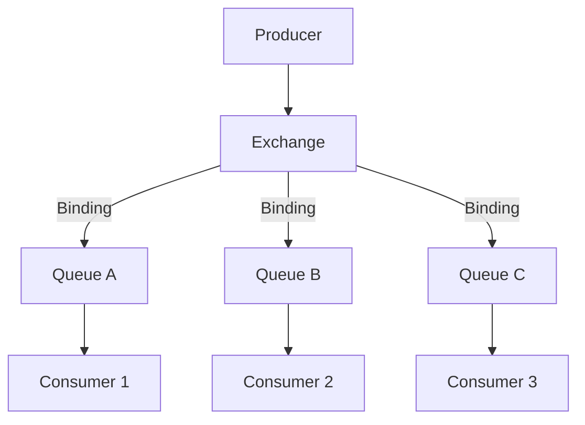
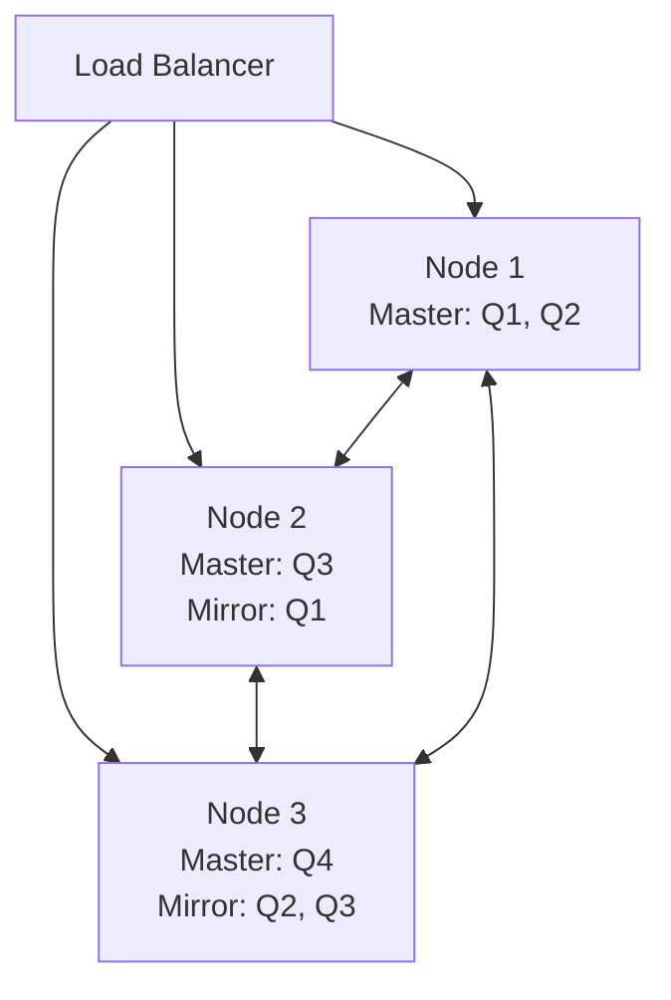

# RabbitMQ

RabbitMQ is the most widely deployed open-source message broker. It implements the AMQP (Advanced Message Queuing Protocol) and supports multiple messaging patterns including point-to-point, pub/sub, and request/reply.

## Overview

RabbitMQ acts as an intermediary between producers and consumers, providing reliable message delivery, routing, and storage.

### Why RabbitMQ?

- **Flexible routing** — Multiple exchange types for different routing patterns
- **Reliability** — Message acknowledgments, persistence, and clustering
- **Protocol support** — AMQP 0.9.1, AMQP 1.0, MQTT, STOMP
- **Management UI** — Built-in web interface for monitoring
- **Plugins** — Extensible architecture

## Core Concepts



### Exchanges

Exchanges receive messages from producers and route them to queues based on rules (bindings and routing keys).

| Exchange Type | Routing Rule | Use Case |
|---------------|-------------|----------|
| **Direct** | Exact routing key match | Point-to-point, task distribution |
| **Fanout** | Routes to all bound queues | Broadcast, pub/sub |
| **Topic** | Pattern matching with wildcards | Selective pub/sub |
| **Headers** | Header attribute matching | Complex routing |

```java
// Declare exchange
channel.exchangeDeclare("orders", "topic", true);

// Publish with routing key
channel.basicPublish("orders", "order.created.us", null, message.getBytes());
```

### Topic Exchange Patterns

| Routing Key | Binding Key | Match? |
|-------------|-------------|--------|
| `order.created.us` | `order.*.*` | ✅ |
| `order.created.us` | `order.#` | ✅ |
| `order.created.us` | `order.created.*` | ✅ |
| `order.created.us` | `order.created.us` | ✅ |
| `order.created.us` | `order.cancelled.#` | ❌ |

- `*` matches exactly one word
- `#` matches zero or more words

### Queues

```java
// Declare queue with options
channel.queueDeclare(
    "order-processing",  // queue name
    true,                // durable (survives restart)
    false,               // exclusive (connection-scoped)
    false,               // auto-delete (delete when last consumer disconnects)
    null                 // arguments
);

// Bind queue to exchange
channel.queueBind("order-processing", "orders", "order.created.*");
```

### Bindings

Bindings are rules that tell the exchange which queues to route messages to.

```java
// Multiple bindings for a queue
channel.queueBind("order-processing", "orders", "order.created.*");
channel.queueBind("order-processing", "orders", "order.updated.*");

// Headers exchange binding
Map<String, Object> headers = new HashMap<>();
headers.put("format", "pdf");
headers.put("type", "invoice");
headers.put("x-match", "all");  // all = AND, any = OR
channel.queueBind("pdf-invoices", "documents", "", headers);
```

## Message Acknowledgments

Acknowledgments ensure messages are only removed from the queue after successful processing.

```java
// Manual acknowledgment (recommended)
channel.basicConsume("orders", false, (tag, delivery) -> {
    try {
        processOrder(delivery.getBody());
        channel.basicAck(delivery.getEnvelope().getDeliveryTag(), false);
    } catch (Exception e) {
        // Requeue or send to DLQ
        channel.basicNack(delivery.getEnvelope().getDeliveryTag(), false, true);
    }
});

// Auto acknowledgment (not recommended for production)
channel.basicConsume("orders", true, consumer);
```

| Mode | Behavior | Use Case |
|------|----------|----------|
| Auto | Message removed immediately on delivery | Non-critical, high throughput |
| Manual | Message removed on `basicAck` | Production (recommended) |
| Reject | `basicNack` or `basicReject` to requeue or discard | Error handling |

## Dead Letter Queues (DLQ)

Messages that can't be processed are sent to a dead letter queue for investigation.

```java
// Declare DLQ
channel.queueDeclare("orders.dlq", true, false, false, null);

// Declare main queue with DLQ configuration
Map<String, Object> args = new HashMap<>();
args.put("x-dead-letter-exchange", "");
args.put("x-dead-letter-routing-key", "orders.dlq");
args.put("x-message-ttl", 60000);  // TTL before DLQ
channel.queueDeclare("orders", true, false, false, args);
```

### When Messages Are Dead-Lettered

| Condition | Description |
|-----------|-------------|
| Rejected | `basicReject` or `basicNack` with `requeue=false` |
| TTL expired | Message or queue TTL exceeded |
| Max length | Queue exceeds `x-max-length` |
| Max size | Queue exceeds `x-max-length-bytes` |

## Clustering and High Availability



### Quorum Queues (Recommended)

Quorum queues use Raft consensus for replication. They replace classic mirrored queues.

```java
// Declare quorum queue
Map<String, Object> args = new HashMap<>();
args.put("x-queue-type", "quorum");
channel.queueDeclare("orders", true, false, false, args);
```

| Feature | Classic Mirrored | Quorum |
|---------|-----------------|--------|
| Consensus | Async replication | Raft |
| Data safety | Possible loss | Guaranteed |
| Performance | Higher throughput | Slightly lower |
| At-least-once | With publisher confirms | Default |
| Recommended | Legacy | New deployments |

## Publisher Confirms

Confirms that messages have been accepted by the broker.

```java
channel.confirmSelect();  // Enable confirms

// Async confirm handler
channel.addConfirmListener(
    (tag, multiple) -> { /* ack handler */ },
    (tag, multiple) -> { /* nack handler */ }
);

channel.basicPublish("orders", "order.created", null, message.getBytes());
```

## Priority Queues

```java
Map<String, Object> args = new HashMap<>();
args.put("x-max-priority", 10);
channel.queueDeclare("priority-orders", true, false, false, args);

// Publish with priority
AMQP.BasicProperties props = new AMQP.BasicProperties.Builder()
    .priority(9)  // Higher = processed first
    .build();
channel.basicPublish("", "priority-orders", props, message.getBytes());
```

## Delayed Messages

```java
// Using message TTL + DLQ for delayed delivery
Map<String, Object> args = new HashMap<>();
args.put("x-message-ttl", 30000);  // 30 second delay
args.put("x-dead-letter-exchange", "");
args.put("x-dead-letter-routing-key", "target-queue");
channel.queueDeclare("delay-30s", true, false, false, args);

// Using delayed message exchange plugin
channel.exchangeDeclare("delayed", "x-delayed-message",
    true, false, Map.of("x-delayed-type", "direct"));
```

## RabbitMQ vs Kafka

| Aspect | RabbitMQ | Kafka |
|--------|----------|-------|
| Model | Message broker | Distributed log |
| Message lifecycle | Deleted after ack | Retained by policy |
| Ordering | Per-queue | Per-partition |
| Routing | Flexible (exchanges) | Partition-based |
| Consumer groups | Competing consumers | Native support |
| Replay | Not supported | From any offset |
| Throughput | ~50K msg/s | ~1M+ msg/s |
| Latency | Low ms | Low ms |
| Use case | Task queues, RPC | Event streaming, logs |
| Protocol | AMQP, MQTT, STOMP | Custom binary |

## Common Mistakes

1. **Auto-acknowledgment** — Losing messages on consumer crash
2. **Not using publisher confirms** — Not knowing if messages were persisted
3. **Unbounded queues** — Memory exhaustion, node crash
4. **Not setting TTL** — Messages accumulating indefinitely
5. **Ignoring DLQ** — Failed messages silently lost
6. **Using classic mirroring** — Use quorum queues instead
7. **Not prefetching** — Overwhelming consumers or under-utilizing them
8. **Hardcoding connections** — No reconnection logic
9. **Not monitoring queue depth** — Missing backpressure signals
10. **Single node in production** — No fault tolerance

## Production Best Practices

- **Use quorum queues** — Raft-based replication for data safety
- **Enable publisher confirms** — Know when messages are persisted
- **Manual acknowledgments** — Process before acking
- **Set queue limits** — Max length, max size, TTL
- **Use DLQ** — For failed message investigation
- **Monitor with Prometheus** — Queue depth, consumer count, publish rate
- **Set prefetch count** — Balance throughput and fairness
- **Use connection pooling** — Don't create connections per message
- **Deploy cluster of 3+ nodes** — Survive node failures
- **Use TLS** — Encrypt broker communication

## Interview Questions

### 1. What is the difference between direct, fanout, topic, and headers exchanges?

**Answer:** Direct: routes to queues with exact routing key match. Fanout: routes to all bound queues regardless of routing key (broadcast). Topic: pattern matching with `*` (one word) and `#` (zero or more words) wildcards. Headers: routes based on message header attributes with AND/OR logic.

### 2. How do dead letter queues work in RabbitMQ?

**Answer:** When a message can't be processed (rejected without requeue, TTL expired, queue max length exceeded), it's routed to a configured dead letter exchange and queue. This allows failed messages to be inspected, debugged, and potentially retried. Configure with `x-dead-letter-exchange` and `x-dead-letter-routing-key` queue arguments.

### 3. What are publisher confirms and why use them?

**Answer:** Publisher confirms are an asynchronous acknowledgment from the broker that a message has been handled (routed to queue(s) or persisted). Unlike `basicPublish` which returns immediately, confirms tell you if the message actually reached the queue. Essential for reliable publishing — without confirms, you don't know if messages were lost.

### 4. Explain RabbitMQ clustering and queue mirroring.

**Answer:** A RabbitMQ cluster distributes queues across nodes. By default, a queue lives on one node. Quorum queues replicate data across a majority of nodes using Raft consensus. If a node fails, another replica takes over. Classic mirroring (deprecated) used async replication which could lose messages. Quorum queues guarantee no data loss.

### 5. What is prefetch count and how does it affect performance?

**Answer:** `basicQos(prefetchCount)` limits how many unacknowledged messages a consumer can have. Low prefetch (1-10): fair distribution, slower throughput. High prefetch (100+): better throughput, but uneven distribution. The sweet spot depends on processing time — fast processing needs higher prefetch, slow processing needs lower.

### 6. How does RabbitMQ handle message ordering?

**Answer:** RabbitMQ guarantees FIFO ordering within a single queue. With competing consumers, messages are delivered in order but may be processed out of order if consumers have different processing speeds. To maintain strict ordering: use a single consumer, or partition messages by key across multiple queues.

### 7. What happens when a RabbitMQ node crashes?

**Answer:** With quorum queues, messages are safe — a new leader is elected from remaining replicas. Connected clients get disconnected and must reconnect. With classic mirrored queues, messages may be lost if the master node crashes before mirrors sync. Queue metadata is replicated across all nodes, so queues survive node loss.

### 8. How would you implement request-reply pattern in RabbitMQ?

**Answer:** Producer creates a temporary exclusive callback queue, sets `reply-to` header to this queue's name, and includes a `correlation-id`. The consumer processes the request and publishes the response to the `reply-to` queue with the same `correlation-id`. The producer matches responses by `correlation-id`. RPC frameworks like this are common in microservices.

### 9. What are the differences between quorum queues and streams?

**Answer:** Quorum queues: traditional message broker semantics, messages deleted after ack, competing consumers, at-least-once delivery. Streams: log-based (like Kafka), messages retained, multiple consumers can read independently, at-most-once delivery, supports replay from any offset. Use quorum queues for task processing, streams for event sourcing.

### 10. How do you prevent message loss in RabbitMQ?

**Answer:** (1) Use durable exchanges and queues. (2) Use persistent messages (`deliveryMode=2`). (3) Enable publisher confirms. (4) Use manual acknowledgments. (5) Deploy quorum queues for replication. (6) Set `mandatory` flag to detect unroutable messages. (7) Use TLS for network security. These measures together provide at-least-once delivery guarantee.

### 11. How would you scale RabbitMQ for high throughput?

**Answer:** (1) Add nodes to the cluster. (2) Use multiple queues (sharding). (3) Use consistent hash exchange for automatic distribution. (4) Increase prefetch count. (5) Use batch publishing (`basicPublish` in a loop, then `waitForConfirms`). (6) Use lazy queues for large backlogs. (7) Monitor and tune Erlang VM settings. (8) Consider moving to Kafka if throughput exceeds RabbitMQ's sweet spot.

### 12. Explain the mandatory flag and return listener.

**Answer:** When `mandatory=true`, if the message cannot be routed to any queue (no matching binding), the broker returns it to the producer via a return listener. Without this flag, unroutable messages are silently dropped. This is critical for detecting misconfigurations — if bindings are wrong, you want to know rather than lose messages.
