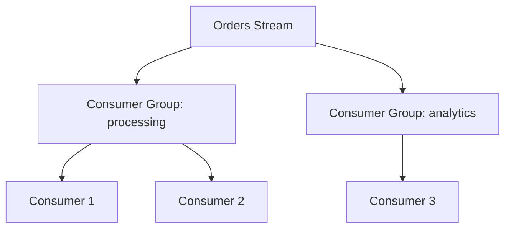
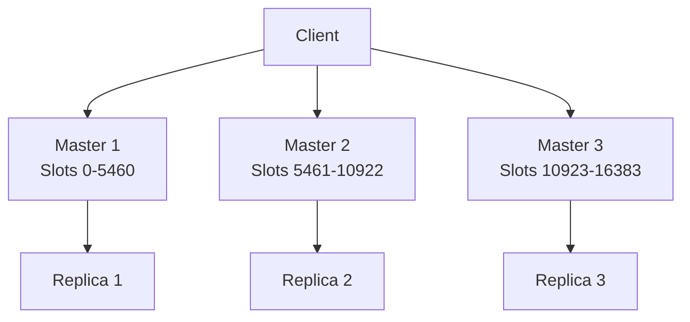

# Redis

Redis (Remote Dictionary Server) is an open-source, in-memory data structure store that can be used as a database, cache, message broker, and streaming platform. Its versatility and sub-millisecond latency make it indispensable in backend systems.

## Overview

Redis stores data primarily in memory, making it extremely fast. It supports rich data structures and provides persistence options for durability.

### Why Redis?

- **Speed** — Sub-millisecond read/write latency
- **Rich data structures** — Not just key-value: lists, sets, sorted sets, hashes, streams
- **Atomic operations** — All operations are atomic
- **Pub/Sub** — Built-in publish/subscribe messaging
- **Lua scripting** — Server-side scripting for complex operations
- **Persistence** — RDB snapshots and AOF logs
- **Clustering** — Horizontal scaling with Redis Cluster

## Data Structures

### Strings

The simplest data type — can hold strings, integers, or floats.

```redis
SET user:1:name "Alice"
GET user:1:name
SET counter:visits 0
INCR counter:visits
INCRBY counter:visits 10
SET session:abc123 "user_data" EX 3600  ; TTL of 1 hour
SETNX lock:order:456 "holder_id"        ; Set if not exists (for locks)
```

| Command | Description | Time |
|---------|-------------|------|
| `SET key value` | Set value | O(1) |
| `GET key` | Get value | O(1) |
| `INCR key` | Increment integer | O(1) |
| `MSET k1 v1 k2 v2` | Set multiple | O(N) |
| `MGET k1 k2` | Get multiple | O(N) |
| `APPEND key value` | Append to string | O(1) |
| `SETNX key value` | Set if not exists | O(1) |

### Hashes

Maps of field-value pairs — perfect for objects.

```redis
HSET user:1 name "Alice" email "alice@example.com" age 30
HGET user:1 name
HGETALL user:1
HINCRBY user:1 age 1
HDEL user:1 email
HEXISTS user:1 email
```

| Command | Description | Time |
|---------|-------------|------|
| `HSET key field value` | Set field | O(1) |
| `HGET key field` | Get field | O(1) |
| `HGETALL key` | Get all fields | O(N) |
| `HINCRBY key field n` | Increment field | O(1) |
| `HDEL key field` | Delete field | O(1) |
| `HMSET key f1 v1 f2 v2` | Set multiple | O(N) |

### Lists

Ordered sequences of strings — use for queues, stacks, recent items.

```redis
LPUSH queue:tasks "task1" "task2"     ; Push to left (head)
RPOP queue:tasks                       ; Pop from right (FIFO queue)
RPUSH stack:history "page1"            ; Push to right
LPOP stack:history                     ; Pop from left (LIFO stack)
LRANGE queue:tasks 0 -1                ; Get all elements
LLEN queue:tasks                       ; Length
BRPOP queue:tasks 30                   ; Blocking pop (wait 30s)
```

| Pattern | Push | Pop | Use Case |
|---------|------|-----|----------|
| Queue (FIFO) | `LPUSH` | `RPOP` | Task processing |
| Stack (LIFO) | `LPUSH` | `LPOP` | Undo history |
| Bounded list | `LPUSH` + `LTRIM` | `LPOP` | Recent items |

### Sets

Unordered collection of unique strings.

```redis
SADD tags:post:1 "redis" "database" "nosql"
SMEMBERS tags:post:1
SISMEMBER tags:post:1 "redis"
SINTER tags:post:1 tags:post:2       ; Intersection
SUNION tags:post:1 tags:post:2       ; Union
SDIFF tags:post:1 tags:post:2        ; Difference
SCARD tags:post:1                    ; Count
SRANDMEMBER tags:post:1 3            ; Random members
```

### Sorted Sets

Sets where each member has a score — perfect for leaderboards, rankings.

```redis
ZADD leaderboard 100 "alice" 85 "bob" 92 "charlie"
ZRANGE leaderboard 0 -1 WITHSCORES        ; All, sorted by score
ZREVRANGE leaderboard 0 2 WITHSCORES      ; Top 3
ZRANK leaderboard "alice"                  ; Rank (0-based)
ZSCORE leaderboard "alice"                 ; Score
ZINCRBY leaderboard 5 "alice"              ; Increment score
ZRANGEBYSCORE leaderboard 90 100           ; Score range
ZRANGEBYSCORE leaderboard -inf +inf LIMIT 0 10  ; Pagination
```

| Command | Description | Time |
|---------|-------------|------|
| `ZADD key score member` | Add with score | O(log N) |
| `ZRANGE key start stop` | Range by rank | O(log N + M) |
| `ZRANK key member` | Get rank | O(log N) |
| `ZSCORE key member` | Get score | O(1) |
| `ZINCRBY key n member` | Increment score | O(log N) |
| `ZREM key member` | Remove member | O(log N) |

## Pub/Sub

Redis Pub/Sub enables message broadcasting between publishers and subscribers.

```redis
SUBSCRIBE notifications:orders
PUBLISH notifications:orders "New order #12345"
UNSUBSCRIBE notifications:orders
```

```python
import redis

# Subscriber
r = redis.Redis()
pubsub = r.pubsub()
pubsub.subscribe("notifications:orders")

for message in pubsub.listen():
    if message["type"] == "message":
        print(f"Received: {message['data']}")

# Publisher
r.publish("notifications:orders", "New order #12345")
```

### Pub/Sub Limitations

- **Fire and forget** — No message persistence; if subscriber is offline, message is lost
- **No acknowledgment** — Publisher doesn't know if message was received
- **No replay** — Can't re-read old messages
- **Broadcast** — All subscribers get all messages (no filtering)

For durable messaging, use Redis Streams instead.

## Redis Streams

Streams are append-only logs with consumer groups — Redis's answer to Kafka.

```redis
# Add entries
XADD orders * user_id 1 product_id 100 amount 49.99
XADD orders * user_id 2 product_id 200 amount 99.99

# Read entries
XRANGE orders - +                ; All entries
XRANGE orders - + COUNT 10       ; First 10
XREVRANGE orders + -             ; Reverse order

# Consumer group
XGROUP CREATE orders processing 0
XREADGROUP GROUP processing consumer1 COUNT 10 BLOCK 5000 STREAMS orders >

# Acknowledge
XACK orders processing 1526569495631-0
```

### Consumer Groups in Streams



| Feature | Streams | Pub/Sub |
|---------|---------|---------|
| Persistence | Yes | No |
| Consumer groups | Yes | No |
| Acknowledgment | Yes | No |
| Replay | Yes (from ID) | No |
| Message history | Retained | Lost |
| Latency | Low ms | Sub-ms |

## Lua Scripting

Lua scripts execute atomically on the server — no other command can run during execution.

```redis
-- Atomic increment with limit
EVAL "
  local current = redis.call('GET', KEYS[1])
  if current and tonumber(current) >= tonumber(ARGV[1]) then
    return -1  -- limit reached
  end
  return redis.call('INCR', KEYS[1])
" 1 rate:user:123 100

-- Distributed lock with fencing token
EVAL "
  if redis.call('GET', KEYS[1]) == ARGV[1] then
    return redis.call('DEL', KEYS[1])
  end
  return 0
" 1 lock:order:456 "holder_id"
```

### Use Cases for Lua Scripts

- **Rate limiting** — Atomic check-and-increment
- **Distributed locks** — Compare-and-delete
- **Multi-step operations** — Conditional updates
- **CAS operations** — Compare-and-swap

## Persistence

### RDB (Redis Database Backup)

Point-in-time snapshots at specified intervals.

```conf
# redis.conf
save 900 1      # Save if at least 1 key changed in 900 seconds
save 300 10     # Save if at least 10 keys changed in 300 seconds
save 60 10000   # Save if at least 10000 keys changed in 60 seconds
```

### AOF (Append-Only File)

Logs every write operation for durability.

```conf
# redis.conf
appendonly yes
appendfsync everysec    # Sync every second (good balance)
# appendfsync always   # Sync on every write (slowest, safest)
# appendfsync no       # Let OS decide (fastest, least safe)
```

| Method | Durability | Performance | Recovery |
|--------|-----------|-------------|----------|
| RDB | Point-in-time | Fast | Fast (load snapshot) |
| AOF | Every write | Slower | Slower (replay log) |
| RDB + AOF | Best | Moderate | Fastest (AOF preferred) |

## Redis Cluster



| Feature | Description |
|---------|-------------|
| Slots | 16384 hash slots distributed across masters |
| Sharding | Keys are hashed to determine slot |
| Replication | Each master has at least one replica |
| Failover | Automatic promotion of replica on master failure |
| Gossip protocol | Nodes communicate state via gossip |

```bash
# Create cluster
redis-cli --cluster create \
  node1:6379 node2:6379 node3:6379 \
  node4:6379 node5:6379 node6:6379 \
  --cluster-replicas 1
```

## Distributed Locking (Redlock)

```python
import redis
import uuid
import time

def acquire_lock(conn, lock_name, acquire_timeout=10, lock_timeout=10):
    identifier = str(uuid.uuid4())
    lock_key = f"lock:{lock_name}"
    end = time.time() + acquire_timeout

    while time.time() < end:
        if conn.set(lock_key, identifier, nx=True, ex=lock_timeout):
            return identifier
        time.sleep(0.001)
    return None

def release_lock(conn, lock_name, identifier):
    lock_key = f"lock:{lock_name}"
    pipe = conn.pipeline(True)
    while True:
        try:
            pipe.watch(lock_key)
            if pipe.get(lock_key) == identifier:
                pipe.multi()
                pipe.delete(lock_key)
                pipe.execute()
                return True
            pipe.unwatch()
            break
        except redis.WatchError:
            pass
    return False
```

## Common Mistakes

1. **No TTL on keys** — Memory grows unbounded
2. **Using Redis as primary database** — It's a cache/broker, not a durable store
3. **Not using pipelining** — One round-trip per command is slow
4. **Blocking operations on main thread** — `KEYS *` on large datasets
5. **Not using connection pooling** — Creating connections per request
6. **Ignoring maxmemory policy** — OOM errors when memory is full
7. **Using Pub/Sub for critical messages** — No persistence, use Streams
8. **Not monitoring slow queries** — `SLOWLOG GET` to find slow commands
9. **Hot keys** — All traffic hitting one shard
10. **Large values** — Storing blobs >1MB (use external storage)

## Production Best Practices

- **Set maxmemory and eviction policy** — `allkeys-lru` for cache
- **Use pipelining** — Batch commands to reduce round-trips
- **Monitor with INFO** — Memory, clients, stats, replication
- **Use connection pooling** — Libraries like `redis-pool`
- **Avoid large keys** — Don't store huge lists/hashes
- **Use SCAN instead of KEYS** — Non-blocking iteration
- **Enable persistence for durability** — AOF with `everysec`
- **Deploy cluster for scale** — Horizontal sharding
- **Use Lua for atomicity** — Multi-step operations
- **Set TTLs** — Prevent memory leaks

## Interview Questions

### 1. What are the main data structures in Redis and their use cases?

**Answer:** Strings: simple key-value, counters, caching. Hashes: objects (user profiles, configs). Lists: queues, recent items, activity feeds. Sets: unique items, tags, membership. Sorted Sets: leaderboards, rankings, time-series. Streams: event logs, message queues with consumer groups. Bitmaps: feature flags, user activity tracking. HyperLogLogs: cardinality estimation.

### 2. How does Redis handle persistence?

**Answer:** Two mechanisms: (1) RDB — point-in-time snapshots at configured intervals. Fast recovery but can lose data between snapshots. (2) AOF — logs every write operation. More durable (can sync every second or every write) but larger files and slower recovery. Best practice: use both — AOF for durability and RDB for fast restarts.

### 3. Explain Redis Cluster and how it shards data.

**Answer:** Redis Cluster uses 16384 hash slots distributed across master nodes. Each key is hashed with CRC16, and the result modulo 16384 determines which master owns it. Each master has at least one replica for failover. Clients receive MOVED redirects when accessing keys on other nodes. Cross-slot operations (multi-key) require keys in the same hash tag (`{tag}`).

### 4. How would you implement rate limiting with Redis?

**Answer:** Multiple approaches: (1) Simple counter with INCR + EXPIRE — increment key per window, reject if over limit. (2) Sliding window with sorted sets — store timestamps as scores, remove old entries, count remaining. (3) Token bucket with Lua — atomic check-and-decrement. Sliding window is most accurate. Use Lua scripts for atomicity.

### 5. What is the difference between Redis Pub/Sub and Streams?

**Answer:** Pub/Sub: fire-and-forget broadcast, no persistence, no replay, no consumer groups. Messages lost if subscriber is offline. Streams: append-only log with persistence, consumer groups with acknowledgment, replay from any offset, pending entry tracking. Use Pub/Sub for ephemeral notifications; use Streams for reliable messaging.

### 6. How does the distributed lock (Redlock) algorithm work?

**Answer:** Redlock acquires locks on N/2+1 independent Redis nodes with a TTL. Steps: (1) Get current timestamp. (2) Try to acquire lock on all nodes with same key and value. (3) Lock is acquired if majority of nodes respond positively within the validity time. (4) Lock validity = TTL - time spent acquiring. (5) Release lock on all nodes. The algorithm handles node failures and clock drift.

### 7. What are Redis Lua scripts and when would you use them?

**Answer:** Lua scripts execute atomically on the server — no other command runs during execution. Use cases: (1) Rate limiting (check + increment), (2) Distributed locks (compare + delete), (3) Multi-step conditional updates, (4) Reducing round-trips (multiple operations in one script). Scripts are cached by SHA1 hash for repeated execution.

### 8. How do you handle hot keys in Redis Cluster?

**Answer:** Hot keys concentrate traffic on one shard. Solutions: (1) Key replication — store copies with different names across shards, client randomly picks. (2) Local caching — cache hot values in application memory. (3) Read replicas — direct reads to replicas. (4) Key redesign — distribute related data across multiple keys.

### 9. Explain Redis eviction policies.

**Answer:** When maxmemory is reached: (1) noeviction — return errors on write. (2) allkeys-lru — evict least recently used key. (3) volatile-lru — evict LRU among keys with TTL. (4) allkeys-random — random eviction. (5) volatile-ttl — evict key with shortest TTL. (6) volatile-random — random among keys with TTL. Use allkeys-lru for cache, noeviction for critical data.

### 10. How would you use Redis as a session store?

**Answer:** Store session data as a hash: `HSET session:{id} user_id 123 role admin`. Set TTL to match session timeout: `EXPIRE session:{id} 3600`. On each request: validate session exists, check TTL, refresh if needed. Use sticky sessions (route to same server) or a centralized Redis instance. For distributed sessions, ensure all app servers connect to the same Redis cluster.

### 11. What is pipelining and how does it improve performance?

**Answer:** Pipelining batches multiple commands into a single network round-trip instead of one command per round-trip. The client sends all commands without waiting for responses, then reads all responses at once. This dramatically reduces latency, especially over high-latency networks. Pipelining can improve throughput by 5-10x for batch operations.

### 12. How would you implement a message queue with Redis?

**Answer:** Options: (1) Lists — LPUSH to enqueue, BRPOP to dequeue (blocking). Simple but no consumer groups. (2) Streams — XADD to publish, XREADGROUP for consumer groups with acknowledgment. Better for production. (3) Sorted Sets — priority queues with ZADD (score = priority). For reliability, use Streams with XACK and XCLAIM for handling failed consumers.
