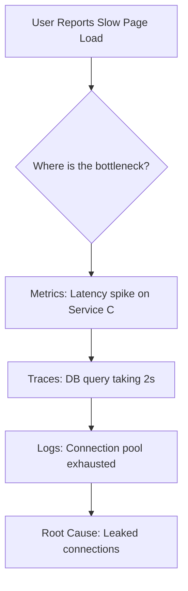
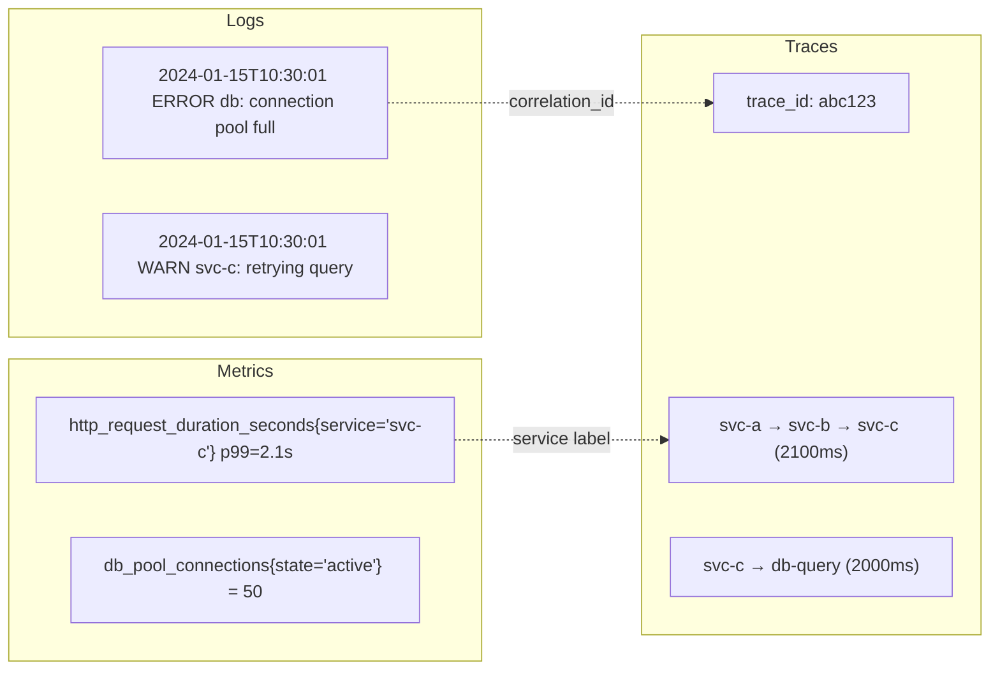
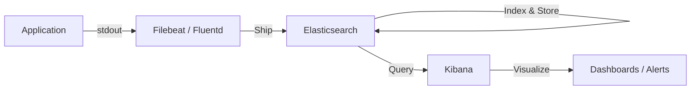
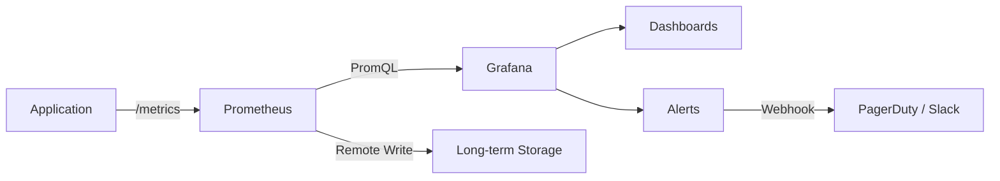
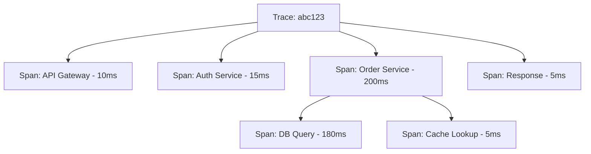
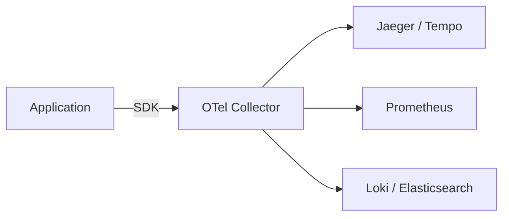
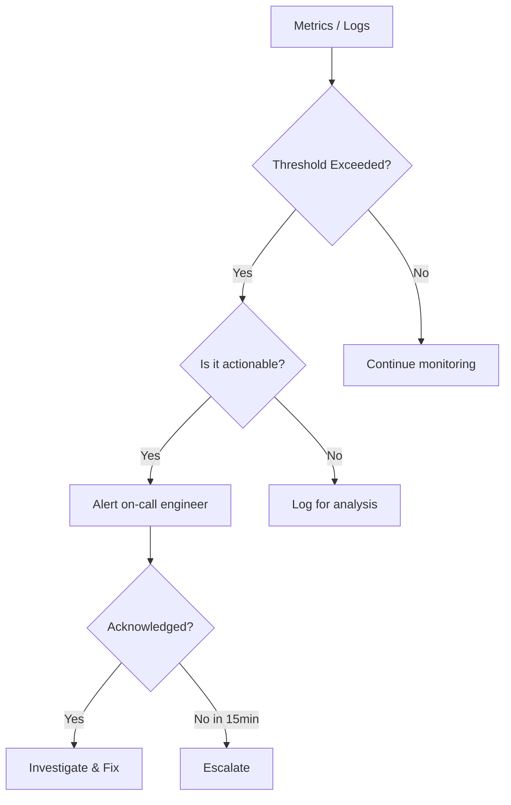

# Observability

Observability is the ability to understand the internal state of a system from its external outputs. The three pillars — logs, metrics, and traces — give you complete visibility into production systems.

## Why Observability?

You can't fix what you can't see. In distributed systems with dozens of microservices, debugging without observability is like navigating in the dark. Observability turns your system's behavior into actionable data.



Without all three pillars, you'd be guessing.

## Three Pillars of Observability

| Pillar | What It Answers | Format | Tools |
|--------|----------------|--------|-------|
| **Logs** | *What* happened? | Structured text events | ELK, Loki, Fluentd, CloudWatch |
| **Metrics** | *How much* / *how fast*? | Numeric time series | Prometheus, Grafana, Datadog |
| **Traces** | *Where* did the time go? | Span trees | Jaeger, Zipkin, Tempo, X-Ray |

### How They Work Together



**Correlation** is the key: a trace ID in logs links to the specific trace, metric labels identify which service is slow.

## Logs

### Structured Logging

```json
// ❌ Bad — unstructured
// "2024-01-15 User john@example.com login failed from 192.168.1.1"

// ✅ Good — structured JSON
{
  "timestamp": "2024-01-15T10:30:01Z",
  "level": "WARN",
  "service": "auth-service",
  "message": "Login failed",
  "user": "john@example.com",
  "ip": "192.168.1.1",
  "reason": "invalid_password",
  "trace_id": "abc123",
  "request_id": "req-456"
}
```

### Log Levels

| Level | When to Use | Example |
|-------|-------------|---------|
| **FATAL** | System is crashing | "Database connection lost, shutting down" |
| **ERROR** | Operation failed, needs attention | "Payment processing failed for order 123" |
| **WARN** | Unexpected but recoverable | "Rate limit approaching threshold" |
| **INFO** | Normal business events | "Order 123 placed successfully" |
| **DEBUG** | Detailed diagnostic info | "Cache miss for key user:123" |

### ELK Stack Architecture



## Metrics

### Metric Types

| Type | Description | Example | Use Case |
|------|-------------|---------|----------|
| **Counter** | Monotonically increasing | `http_requests_total` | Request count, errors |
| **Gauge** | Can go up or down | `memory_usage_bytes` | Current values |
| **Histogram** | Distribution of values | `request_duration_seconds` | Latency percentiles |
| **Summary** | Like histogram, calculated at client | `rpc_duration_seconds` | Similar to histogram |

### The RED Method (for services)

| Metric | What It Measures |
|--------|-----------------|
| **Rate** | Requests per second |
| **Errors** | Failed requests per second |
| **Duration** | Latency distribution (p50, p95, p99) |

### The USE Method (for resources)

| Metric | What It Measures |
|--------|-----------------|
| **Utilization** | % of resource in use |
| **Saturation** | Work waiting (queue depth) |
| **Errors** | Error count |

### Prometheus + Grafana



### Key SLIs, SLOs, SLAs

| Concept | Definition | Example |
|---------|-----------|---------|
| **SLI** | Service Level Indicator (measured metric) | 99.9% of requests < 200ms |
| **SLO** | Service Level Objective (target) | p99 latency < 500ms |
| **SLA** | Service Level Agreement (contract) | 99.95% uptime = 22 min/month downtime |

**Error budget**: If SLO is 99.9%, you have a 0.1% error budget. When exhausted, freeze deployments and focus on reliability.

## Tracing

### Distributed Trace Structure



### OpenTelemetry

OpenTelemetry (OTel) is the vendor-neutral standard for collecting observability data.



**Key concepts:**
- **Trace** — A complete request path across services
- **Span** — A single unit of work within a trace
- **Context Propagation** — Passing trace context across service boundaries (W3C Trace Context header)
- **Sampling** — Controlling what percentage of traces to collect (head-based vs tail-based)

## Alerting Best Practices



**Alert rules:**
1. Every alert must be **actionable** — if the responder can't do anything, it's noise
2. Alert on **symptoms**, not causes (alert on "high error rate", not "CPU > 80%")
3. Use **severity levels** — P1 (pages), P2 (slack), P3 (ticket)
4. Include **runbooks** — link to troubleshooting steps
5. Avoid **alert fatigue** — too many alerts = ignored alerts

## In This Section

- [Logging](../../cloud/observability/logging.md) — Structured logging and the ELK stack
- [Monitoring](../../cloud/observability/monitoring.md) — Metrics, dashboards, and alerting
- [Tracing](../../cloud/observability/tracing.md) — Distributed tracing with OpenTelemetry

## Interview Questions

1. **Q: What are the three pillars of observability?**
   A: Logs (discrete events with context), Metrics (aggregated numeric time series), and Traces (request flow across services). Logs tell you what happened, metrics tell you how much, and traces tell you where. You need all three for effective debugging.

2. **Q: What's the difference between monitoring and observability?**
   A: Monitoring is watching known metrics for known failure modes (predefined dashboards and alerts). Observability is the ability to ask arbitrary questions about your system's behavior — including failure modes you haven't anticipated. Observability enables exploration; monitoring enables alerting.

3. **Q: How do you propagate trace context across microservices?**
   A: Use W3C Trace Context headers (`traceparent` and `tracestate`). The calling service injects the trace ID and span ID into HTTP headers. The receiving service extracts them and creates child spans. Message queues use message attributes for context propagation. Libraries like OpenTelemetry handle this automatically.

4. **Q: What is the difference between head-based and tail-based sampling?**
   A: Head-based sampling decides at trace creation whether to record — simple but may miss interesting traces. Tail-based sampling decides after the trace completes — can keep error/slow traces and discard normal ones. Tail-based gives better signal but requires buffering all spans until completion.

5. **Q: How would you set up alerting for a production service?**
   A: Define SLIs (e.g., p99 latency, error rate). Set SLOs (e.g., p99 < 500ms). Create alerts when SLO is at risk (error budget burning fast). Use severity levels: P1 for customer-facing impact, P2 for degradation, P3 for warnings. Include runbooks. Alert on symptoms, not causes.

6. **Q: Explain the RED and USE methods.**
   A: RED (Rate, Errors, Duration) is for request-driven services — how many requests, how many fail, how long they take. USE (Utilization, Saturation, Errors) is for resources — CPU usage, queue depth, disk errors. Use RED for services, USE for infrastructure.

7. **Q: What is structured logging and why is it important?**
   A: Structured logging outputs logs in a machine-parseable format (JSON) with consistent fields. Benefits: searchable (filter by any field), aggregatable (group by service), machine-readable (automated alerting). Unstructured text logs are hard to query and analyze at scale.

8. **Q: How do you handle observability at scale?**
   A: (1) Use sampling for traces (don't record everything), (2) Aggregate metrics (Prometheus recording rules), (3) Retention policies (hot/warm/cold storage), (4) Log levels (don't ship DEBUG to production), (5) Use OpenTelemetry Collector as a pipeline for processing, filtering, and routing data.

9. **Q: What is an error budget and how do you use it?**
   A: Error budget = 1 - SLO. If SLO is 99.9%, error budget is 0.1% (43 minutes/month). When budget remains: ship features fast. When budget is low: freeze features, focus on reliability. This balances innovation vs stability. Track burn rate to predict if budget will be exhausted.

10. **Q: How would you debug a latency spike in a microservices architecture?**
    A: (1) Check metrics — which service has increased latency? (2) Look at traces — find slow traces and identify the bottleneck span. (3) Check logs of the slow service — any errors, timeouts, or resource exhaustion? (4) Check infrastructure metrics — CPU, memory, disk I/O, network. (5) Correlate with recent deployments or traffic changes.

## References

- [Observability Engineering](https://www.oreilly.com/library/view/observability-engineering/9781492076438/) — Charity Majors
- [Google SRE Book — Monitoring](https://sre.google/sre-book/practical-alerting/) — Alerting philosophy
- [OpenTelemetry Documentation](https://opentelemetry.io/docs/) — Vendor-neutral observability
- [Prometheus Documentation](https://prometheus.io/docs/) — Metrics collection
- [Distributed Tracing in Practice](https://www.oreilly.com/library/view/distributed-tracing-in/9781492056621/) — O'Reilly
