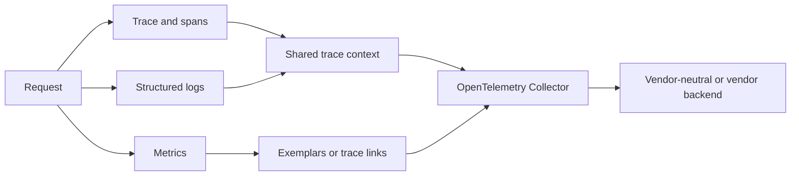
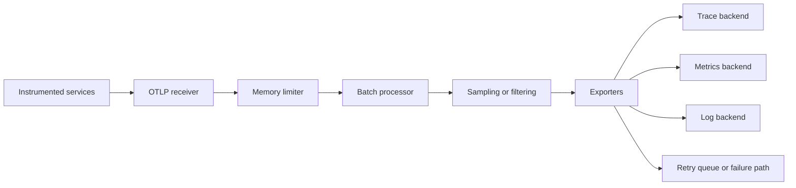

# OpenTelemetry for Production Observability

**OpenTelemetry, or OTel, is a vendor-neutral framework for generating,
collecting, and exporting telemetry.** It defines APIs, SDKs, a protocol,
semantic conventions, instrumentation libraries, and the OpenTelemetry
Collector. It is not a storage backend, dashboard, or alerting product.

The three core signals are **traces, metrics, and logs**. Profiles and baggage
extend the model, while shared context propagation connects telemetry across
process and service boundaries.

## Signals and correlation



### Traces

A trace is a causal view of one request or workflow. A span represents one
operation and can contain attributes, events, links, status, timing, and a
parent context. Spans can cross services, processes, machines, and regions.

Use traces for:

- Which services and dependencies were on the critical path?
- Where did tail latency accumulate?
- Which database, queue, or external call failed?
- Which retry or fan-out branch caused amplification?

### Metrics

Metrics are aggregated measurements over time: request count, error count,
latency histograms, queue depth, CPU, and saturation. They are efficient for
SLOs and alerts but lose per-request context during aggregation.

Avoid unbounded metric labels such as user ID, request ID, raw URL, or exception
message. Normalize route templates and put high-cardinality detail on traces
or logs.

### Logs

Logs describe discrete events with rich context. Structured logs should carry
trace and span IDs when emitted within a request context. Do not assume that
adding a trace ID automatically correlates logs if the context is lost at an
async task, queue, batch, or process boundary.

## Context propagation

Propagation serializes a `SpanContext` into a carrier such as HTTP headers or
message metadata. A typical flow is:

1. The ingress service extracts incoming context.
2. It creates a server span and attaches it to the current context.
3. It injects context into an outgoing HTTP, RPC, or messaging carrier.
4. The downstream service extracts it and creates a child span.
5. The system preserves trace and baggage policy across async boundaries.

Trace context identifies the trace and span. **Baggage** carries application
metadata across boundaries, so it must be treated as untrusted input and
controlled for size, privacy, and cardinality. Do not put secrets or sensitive
personal data in baggage.

For message queues, propagate context in message headers and model producer,
consumer, processing, and batch relationships explicitly. A consumer may use
span links rather than a strict parent when one batch derives from many
independent producer spans.

## Instrumentation strategy

### Automatic instrumentation

Agent or library instrumentation is the fastest way to cover HTTP clients,
servers, database calls, and common frameworks. It gives consistent baseline
telemetry but may miss business semantics and can add attributes with unsafe
cardinality.

### Manual instrumentation

Add spans around important business operations, retries, cache decisions,
queue waits, and domain transitions. Name spans by stable operation, not by raw
IDs or unbounded URLs:

```text
Good:  checkout.reserve_inventory
Bad:   checkout.reserve_inventory.order_918273
```

Use attributes for bounded dimensions such as region, result class, tenant tier,
and normalized route. Put a small number of meaningful events on a span rather
than logging every loop iteration.

## The Collector pipeline

The OpenTelemetry Collector can run as an agent near workloads, a gateway for
central processing, or both.



Typical components include:

- **Receivers:** OTLP, Prometheus, Jaeger, Zipkin, file logs, host metrics.
- **Processors:** memory limiter, batch, attributes, resource, transform,
  filtering, tail sampling, and redaction.
- **Exporters:** OTLP, Prometheus, logging/debug, vendor, Kafka, and storage
  integrations.
- **Connectors:** derive one signal from another, such as span-derived metrics.

Put a memory limiter early, batch before export, configure bounded retry and
sending queues, and monitor exporter failures. A Collector that silently drops
telemetry creates an observability blind spot.

## Sampling

### Head sampling

The sampling decision is made near the start of a trace. It is cheap and
scalable, but it cannot know whether a later span will fail or become slow.

### Tail sampling

The decision waits until enough of a trace is available. It can retain all
errors, high-latency traces, specific services, or rare attributes, but it
requires buffering, memory, coordination, and a gateway topology that sees the
relevant spans.

A practical design often uses head sampling to reduce extreme volume and tail
sampling at a gateway to preserve errors and latency outliers. Sampling policy
must be explicit so teams understand what “100% error retention” means across
partial traces and dropped spans.

## Semantic conventions

Semantic conventions standardize names for HTTP, RPC, database, messaging,
Kubernetes, cloud, process, host, and runtime attributes. They make queries and
dashboards portable across languages and teams.

Use stable semantic names and record the convention version where required.
Avoid mixing custom names such as `http_method`, `http.method`, and
`request_method` for the same concept. Prefer low-cardinality attributes on
metrics and richer fields on spans/logs.

## Production design checklist

- Set `service.name`, `service.version`, deployment environment, and instance
  identity consistently.
- Propagate trace context through HTTP, RPC, queue, batch, and async boundaries.
- Instrument the critical path manually even when auto-instrumentation exists.
- Capture errors and exception events without leaking secrets or full payloads.
- Use normalized route names and bounded metric dimensions.
- Configure Collector memory limits, batching, retries, queues, and exporters.
- Monitor Collector queue saturation, refused spans, export errors, and sample
  rate drift.
- Use tail sampling deliberately for errors and high-latency traces.
- Test a synthetic trace end to end through the Collector and backend.
- Keep telemetry pipeline availability separate from application availability.

## Interview questions

**Is OpenTelemetry a backend?**

No. It standardizes instrumentation, telemetry data, collection, and export.
You still need a backend for storing, querying, visualizing, and alerting.

**Why correlate logs with traces?**

Metrics reveal an aggregate symptom, traces reveal the causal request path, and
logs provide detailed events. Shared trace context lets an engineer move from
an alert to a request and then to the relevant service log.

**Head or tail sampling?**

Head sampling is cheaper and early; tail sampling can select based on the full
trace but needs buffering and a collector topology that sees the whole trace.
Choose based on volume, cost, and which evidence must never be dropped.

**Why are high-cardinality metric labels dangerous?**

Each distinct label set creates a time series. User IDs, request IDs, and raw
paths can create millions of series, overwhelm storage, and make queries slow.
Keep those fields on traces/logs instead.

## Cross-references

- [Backend Observability](./README.md)
- [Distributed Observability](../../distributed/microservices/observability.md)
- [OpenTelemetry in Rust](../../languages/rust/async-runtimes.md)
- [Rate Limiting](../api/rate-limiting.md) — metrics and tail latency
- [Service mesh xDS](../containers/xds-protocol.md)
- [CDC and Transactional Outbox](../patterns/cdc-outbox.md) — propagating event context
- [Linux tracing](../../linux/debugging/overview.md)

## References

- [OpenTelemetry documentation](https://opentelemetry.io/docs/)
- [What is OpenTelemetry?](https://opentelemetry.io/docs/what-is-opentelemetry/)
- [OpenTelemetry trace concepts](https://opentelemetry.io/docs/concepts/signals/traces/)
- [OpenTelemetry semantic conventions](https://opentelemetry.io/docs/concepts/semantic-conventions/)
- [OpenTelemetry specification overview](https://opentelemetry.io/docs/specs/otel/overview/)
- [OpenTelemetry sampling](https://opentelemetry.io/docs/concepts/sampling/)
