# Design Patterns

Backend design patterns are proven solutions to recurring architectural problems. This section covers patterns essential for building scalable, resilient distributed systems.

## In This Section

- [Microservices](./microservices.md) — Service decomposition and communication
- [Event-Driven Architecture](./event-driven.md) — Event sourcing and CQRS
- [Distributed Transactions](./distributed-transactions.md) — Consistency across services

## Pattern Selection Guide

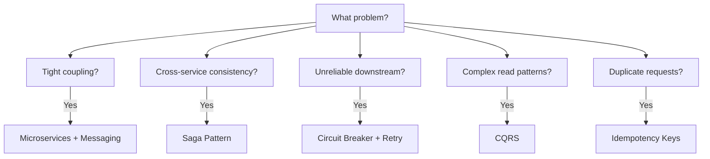

| Problem | Pattern |
|---------|---------|
| Tight coupling between services | Microservices + Messaging |
| Complex queries on event data | CQRS |
| Audit trail requirements | Event Sourcing |
| Cross-service consistency | Saga Pattern |
| Unreliable downstream services | Circuit Breaker |
| High read-to-write ratio | CQRS + Read Replicas |
| Duplicate request handling | Idempotency Keys |
| Cascading failures | Bulkhead + Circuit Breaker |

## Circuit Breaker

The Circuit Breaker pattern prevents an application from repeatedly trying an operation that's likely to fail, allowing the failing service to recover.

### States

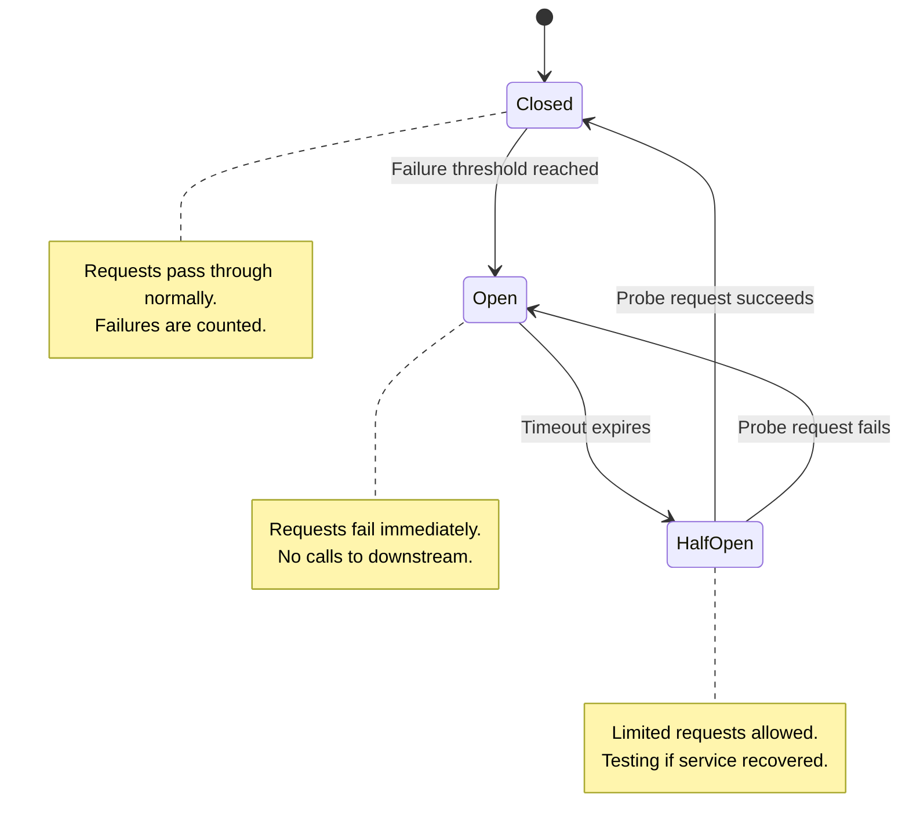

### How It Works

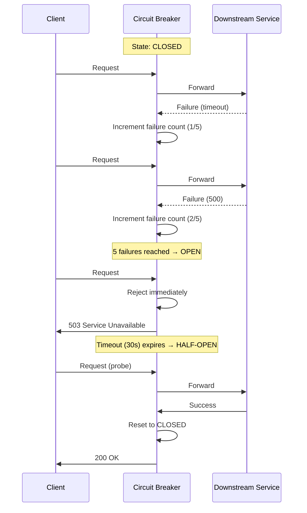

### Configuration

```python
circuit_breaker = CircuitBreaker(
    failure_threshold=5,      # Failures before opening
    success_threshold=3,      # Successes to close from half-open
    timeout=30,               # Seconds before half-open
    excluded_exceptions=[     # Don't count these as failures
        ValidationException,
        AuthenticationException
    ]
)

# Usage
try:
    result = circuit_breaker.call(downstream_service.call)
except CircuitBreakerOpen:
    return fallback_response()
```

### Real-World Implementations

| Library | Language | Features |
|---------|----------|----------|
| **Hystrix** | Java | Netflix, bulkhead, metrics (deprecated) |
| **Resilience4j** | Java | Lightweight, functional API |
| **Polly** | .NET | Retry, circuit breaker, bulkhead |
| **gobreaker** | Go | Simple, well-tested |
| **opossum** | Node.js | Full-featured |

## Retry Pattern

Retries handle transient failures by automatically retrying failed operations.

### Retry with Exponential Backoff

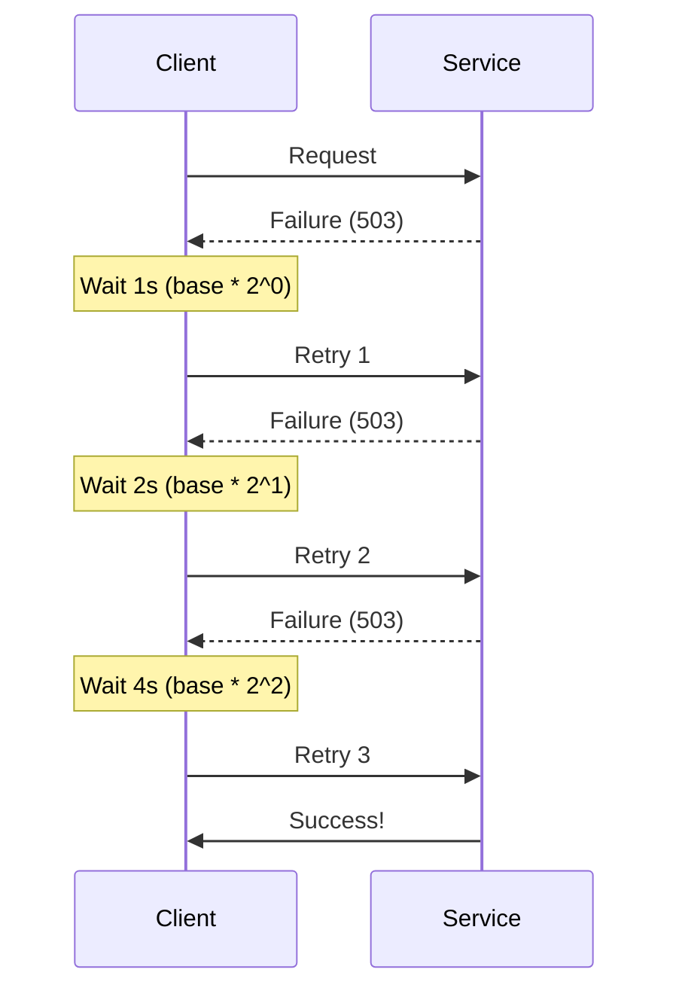

### Retry Configuration

```python
retry_policy = Retry(
    max_retries=3,
    backoff=ExponentialBackoff(
        base_delay=1,         # 1 second
        max_delay=30,         # Cap at 30 seconds
        multiplier=2,         # Double each time
        jitter=True           # Add randomness to prevent thundering herd
    ),
    retryable_exceptions=[
        ConnectionError,
        TimeoutError,
        ServiceUnavailable  # 503
    ],
    non_retryable_exceptions=[
        BadRequest,         # 400 - don't retry client errors
        NotFound,           # 404
        Unauthorized        # 401
    ]
)
```

### Retry Best Practices

| Practice | Why |
|----------|-----|
| **Add jitter** | Prevents thundering herd when many clients retry simultaneously |
| **Set max retries** | Prevents infinite retry loops |
| **Only retry idempotent operations** | Non-idempotent ops may cause duplicates |
| **Use exponential backoff** | Gives downstream time to recover |
| **Log retries** | For observability and debugging |
| **Set overall timeout** | Total time including all retries |

### Combining Circuit Breaker + Retry

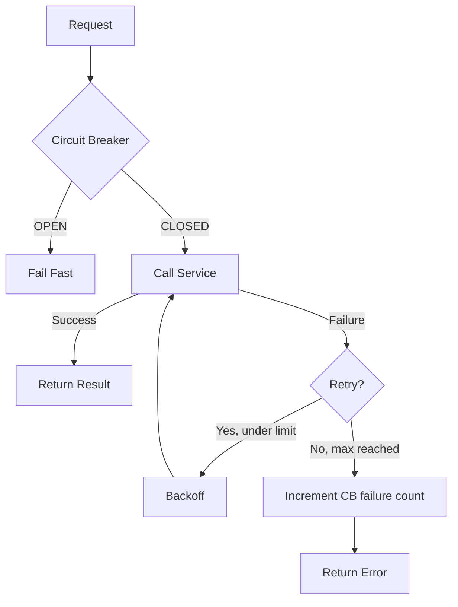

## Idempotency

An operation is **idempotent** if performing it multiple times has the same effect as performing it once. This is critical for distributed systems where retries and duplicate messages are common.

### Why Idempotency Matters

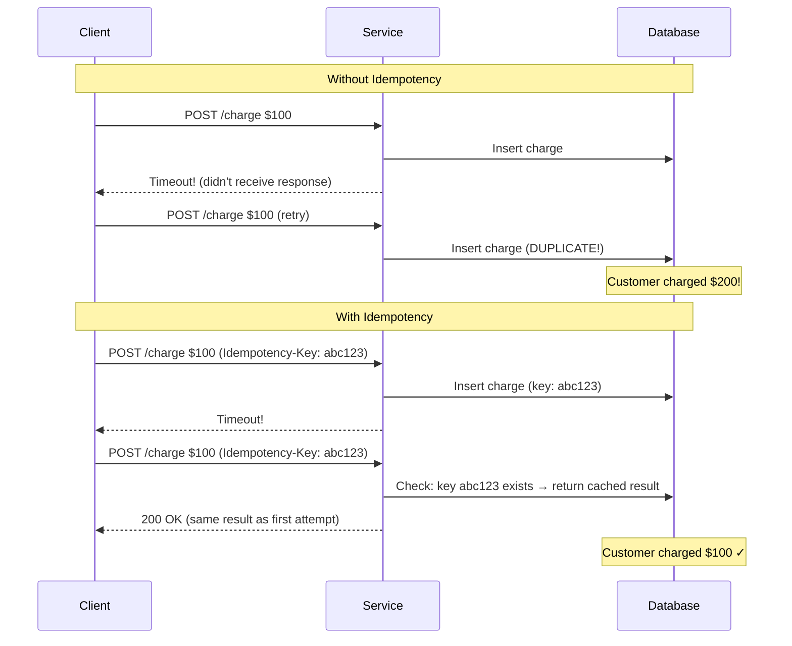

### Idempotency Key Pattern

```python
@app.route('/api/charges', methods=['POST'])
def create_charge():
    idempotency_key = request.headers.get('Idempotency-Key')

    if not idempotency_key:
        return {"error": "Idempotency-Key header required"}, 400

    # Check if we've seen this key before
    existing = db.get_idempotent_result(idempotency_key)
    if existing:
        return existing  # Return cached result

    # Process the charge
    result = process_charge(request.json)

    # Store result with idempotency key
    db.store_idempotent_result(idempotency_key, result)

    return result, 201
```

### What's Naturally Idempotent?

| Operation | Idempotent? | Why |
|-----------|-------------|-----|
| `GET /users/123` | ✅ Yes | Read-only |
| `PUT /users/123` | ✅ Yes | Full replacement |
| `DELETE /users/123` | ✅ Yes | Deleting twice = same result |
| `POST /users` | ❌ No | Creates duplicate |
| `PATCH /users/123` | ⚠️ Depends | `set balance=100` is, `increment balance` isn't |

## Saga Pattern

The Saga pattern manages **distributed transactions** across multiple services by breaking them into a sequence of local transactions, each with a **compensating transaction** for rollback.

### The Problem

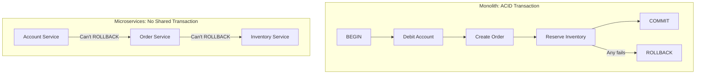

### Saga Types

#### Choreography-Based Saga

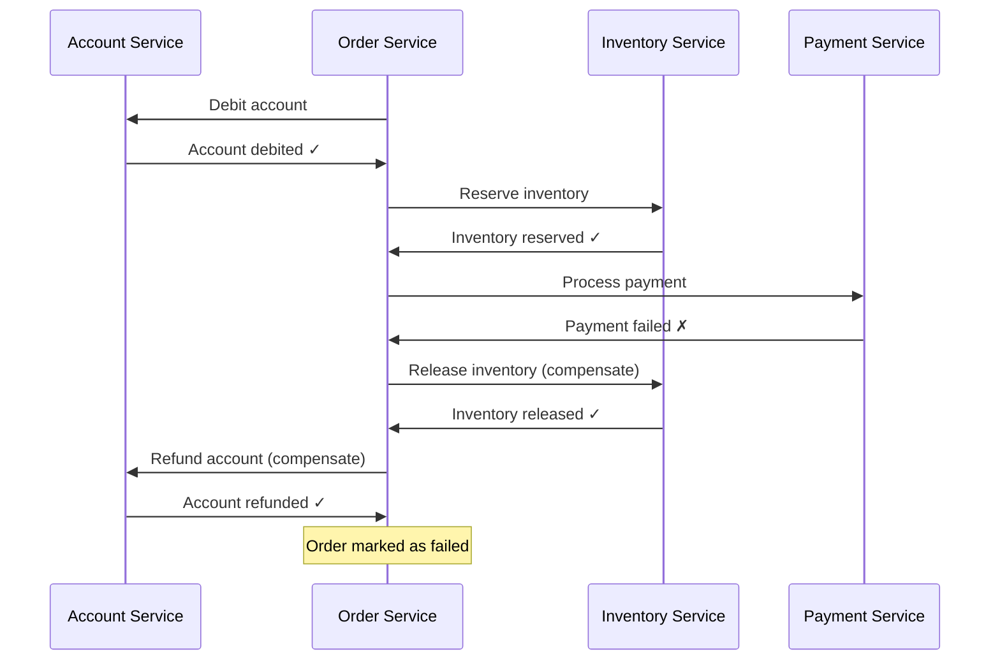

#### Orchestration-Based Saga

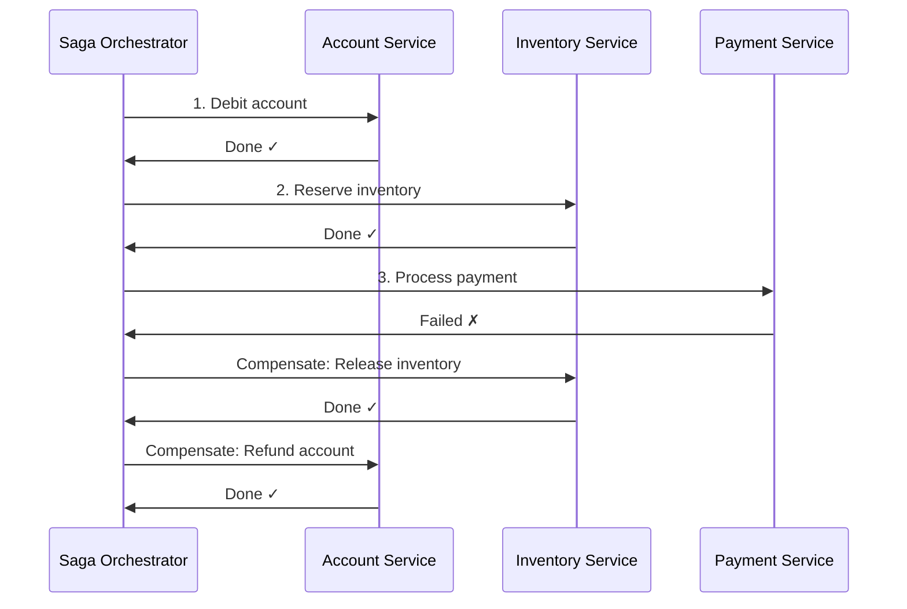

### Choreography vs Orchestration

| Aspect | Choreography | Orchestration |
|--------|-------------|---------------|
| **Coupling** | Loose | Central coordinator |
| **Complexity** | Hard to track flow | Easy to visualize |
| **Single point of failure** | None | Orchestrator |
| **Debugging** | Difficult | Easy |
| **Use case** | Simple flows (2-3 steps) | Complex flows (4+ steps) |

## CQRS (Command Query Responsibility Segregation)

CQRS separates the **write model** (commands) from the **read model** (queries), allowing each to be optimized independently.

### Architecture

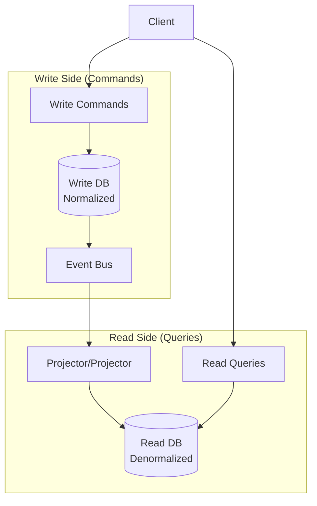

### Why CQRS?

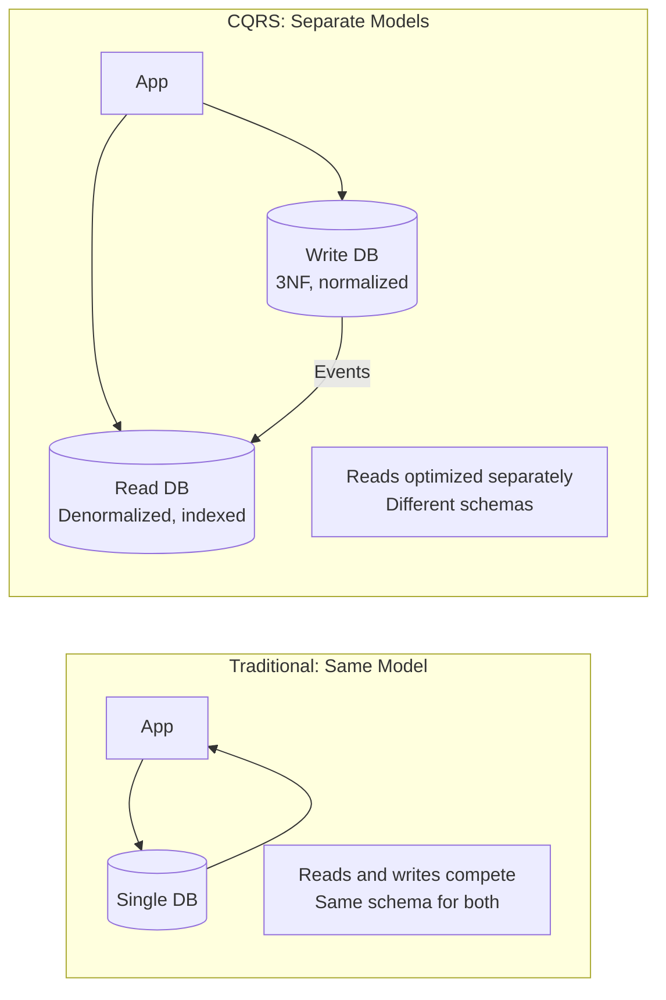

### CQRS Use Cases

| Use Case | Why CQRS Helps |
|----------|---------------|
| **High read:write ratio** | Scale read DB independently (e.g., 100:1) |
| **Complex queries** | Read model optimized for specific queries |
| **Different read/write models** | Write: normalized; Read: denormalized |
| **Event sourcing** | Natural fit—events rebuild read models |
| **Collaborative editing** | Multiple writers, conflict resolution |

### CQRS + Event Sourcing

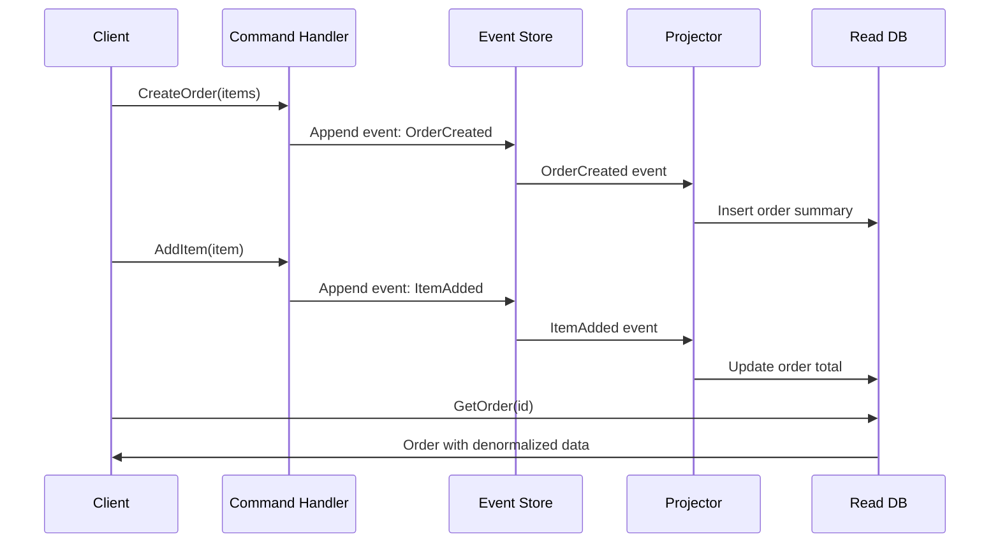

## Bulkhead Pattern

The Bulkhead pattern isolates components so that if one fails, the others continue operating—like watertight compartments in a ship.

```mermaid
graph TD
    subgraph "Without Bulkhead"
        REQ1[Request Type A] --> POOL[Shared Thread Pool]
        REQ2[Request Type B] --> POOL
        REQ3[Request Type C] --> POOL
        POOL -->|Type A exhausts pool| FAIL[All types fail!]
    end

    subgraph "With Bulkhead"
        R1[Request Type A] --> P1[Pool A (10 threads)]
        R2[Request Type B] --> P2[Pool B (20 threads)]
        R3[Request Type C] --> P3[Pool C (15 threads)]
        P1 -->|Exhausted| FAIL1[Only Type A fails]
        P2 --> OK2[Continues normally]
        P3 --> OK3[Continues normally]
    end
```

## Timeout Pattern

```python
# Always set timeouts on external calls
response = http_client.get(
    "https://api.example.com/data",
    timeout=5.0,          # Connection + read timeout
    connect_timeout=2.0   # Just the connection
)

# Hierarchy of timeouts
# Service A → Service B → Service C
# Timeout A > Timeout B > Timeout C
# Example: 10s > 5s > 2s
```

## Putting It All Together

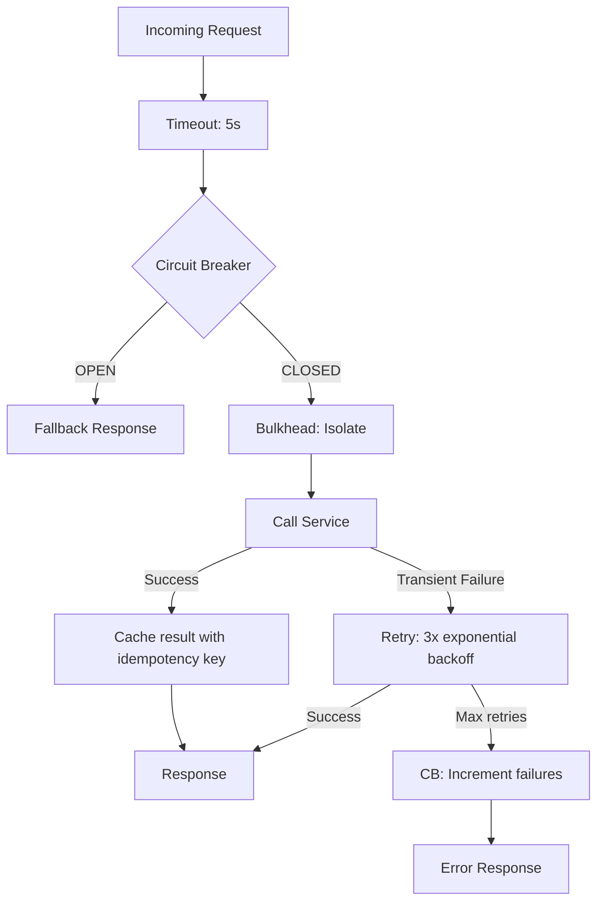

## Interview Questions

1. **What is the Circuit Breaker pattern?**
   - Prevents cascading failures by monitoring failure rates. States: Closed (normal), Open (fail fast), Half-Open (testing recovery). When failures exceed threshold, circuit opens and requests fail immediately without calling the downstream service.

2. **Explain the Saga pattern for distributed transactions.**
   - Replaces ACID transactions across microservices with a sequence of local transactions. Each has a compensating transaction for rollback. Two types: choreography (event-driven, decentralized) and orchestration (central coordinator).

3. **What is CQRS and when should you use it?**
   - Separates read and write models. Write side handles commands (normalized DB), read side handles queries (denormalized, optimized). Use when read:write ratio is high, queries are complex, or you need independent scaling.

4. **How do you handle idempotency in APIs?**
   - Use idempotency keys (client-generated UUID). Server checks if key was processed before; if so, returns cached result. Critical for payment processing and any non-idempotent operation that might be retried.

5. **What is the difference between Circuit Breaker and Retry?**
   - Retry handles transient failures by trying again. Circuit Breaker stops calling a failing service entirely to let it recover. They complement each other: retry first, then circuit breaker trips if retries consistently fail.

## Common Mistakes

- Retrying non-idempotent operations without idempotency keys
- Not adding jitter to retry backoff (thundering herd)
- Setting circuit breaker thresholds too low (unnecessary failures)
- Implementing CQRS when simple CRUD would suffice (over-engineering)
- Using choreography for complex sagas (hard to debug)
- Not setting timeouts on external calls (threads blocked forever)
- Forgetting compensating transactions in sagas (data inconsistency)

## Summary

| Pattern | Problem Solved | Key Trade-off |
|---------|---------------|---------------|
| **Circuit Breaker** | Cascading failures | May reject valid requests during recovery |
| **Retry** | Transient failures | Adds latency, needs idempotency |
| **Idempotency** | Duplicate requests | Storage overhead for keys |
| **Saga** | Distributed transactions | Eventual consistency, complex compensation |
| **CQRS** | Read/write optimization | Complexity, eventual consistency |
| **Bulkhead** | Resource exhaustion | Static partitioning may waste resources |
| **Timeout** | Hung connections | May kill slow but valid operations |

## Cross-References

- [Microservices](./microservices.md) — Service decomposition
- [Event-Driven Architecture](./event-driven.md) — Event sourcing
- [Distributed Transactions](./distributed-transactions.md) — Consistency patterns
- [Kafka](../../distributed/messaging/kafka.md) — Event streaming for sagas
- [API Gateway](../api/api-gateway.md) — Rate limiting, circuit breaking
- [Consistency Models](../../distributed/fundamentals/consistency.md) — Consistency trade-offs
