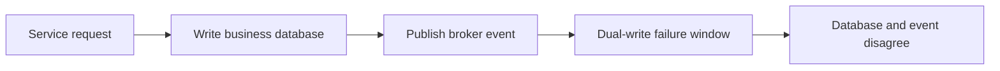
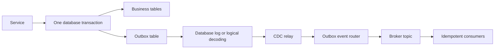

# Change Data Capture and the Transactional Outbox

A service often needs to update its database and publish an event. Doing those
as two independent writes creates the **dual-write problem**: the database can
commit while the broker publish fails, or the broker can receive an event for a
transaction that later rolls back.

The **transactional outbox** turns the two writes into one local database
transaction. **Change Data Capture, or CDC,** then reads the committed log or
outbox table and relays the event to a broker. This gives atomic local state
and event creation without requiring a distributed transaction between the
database and broker.

## The failure the pattern prevents



Possible failures include:

- The database commits, then the process crashes before publishing.
- The broker accepts the event, then the database transaction rolls back.
- A retry publishes the same event twice.
- A polling relay reads an event but crashes before recording progress.
- A CDC connector stops and the database retains log segments indefinitely.

The outbox solves atomic **creation** of the business change and event record.
It does not make delivery exactly once or make every consumer idempotent.

## Transactional outbox architecture



A typical transaction is:

```sql
BEGIN;

INSERT INTO orders (id, customer_id, total)
VALUES ('order-123', 'customer-9', 42.50);

INSERT INTO outbox_events
  (id, aggregate_type, aggregate_id, event_type, payload, created_at)
VALUES
  ('event-456', 'Order', 'order-123', 'OrderCreated',
   '{"order_id":"order-123","total":42.50}', CURRENT_TIMESTAMP);

COMMIT;
```

If the transaction rolls back, neither row is committed. If it commits, a CDC
relay can eventually observe the event row or the database log entry.

## Outbox schema design

A practical schema normally includes:

| Column | Purpose |
|---|---|
| `id` | Globally unique event identifier and deduplication key |
| `aggregate_type` | Domain type used for routing and observability |
| `aggregate_id` | Ordering key, often the broker message key |
| `event_type` | Stable domain event name |
| `payload` | Versioned event body, often JSON or an encoded schema |
| `created_at` | Audit and retention timestamp |
| optional headers | Trace ID, tenant, schema version, causation ID |

Keep the event contract independent of internal table layout. The outbox is a
boundary between a local transaction and an external event stream, not a dump
of every business-table column.

## CDC versus polling relay

### Log-based CDC

A connector reads a database change log or logical replication stream. For
PostgreSQL, Debezium commonly uses logical decoding and the built-in `pgoutput`
plugin. For MySQL, the connector reads the binlog. A replication slot or
checkpoint retains changes until the consumer acknowledges progress.

**Benefits:** low polling load, low latency, ordered log position, and a relay
that is independent of the request process.

**Costs:** connector operations, schema handling, log retention risk,
monitoring, upgrades, and operational coupling to Kafka Connect or another CDC
runtime.

### Polling publisher

A worker queries the outbox table, claims rows using a safe lease or
`FOR UPDATE SKIP LOCKED`, publishes them, and records completion.

**Benefits:** simple deployment and no database-log integration.

**Costs:** polling load, claim/lease complexity, cleanup, latency tuning, and
careful handling of crashes between publish and acknowledgement. It still
usually provides at-least-once delivery, so consumers must deduplicate.

Choose CDC when the organization already operates a reliable CDC platform and
needs low-latency streams. Choose polling when a small service needs a simple
relay and the event rate is modest.

## Debezium Outbox Event Router

Debezium's Outbox Event Router SMT transforms outbox rows into domain events.
A connector configuration typically selects the outbox table and maps fields
such as event type, key, aggregate type, and payload to the Kafka record.
Configuration names vary by Debezium version; consult the current connector
reference rather than copying secrets or version-specific examples blindly.

Conceptually:

```text
outbox row
  aggregate_type = Order
  aggregate_id   = order-123
  event_type     = OrderCreated
  payload        = { ... }

        ↓ Event Router

Kafka topic = Order.events
Kafka key   = order-123
payload     = { ... }
```

Use schema versioning in the payload or headers. Do not silently change the
meaning of an existing event type; add a new version or preserve compatibility.

## Delivery semantics and idempotency

A CDC relay normally provides **at-least-once** delivery. A crash can happen
after the broker accepts a record but before the connector persists its
checkpoint. The record may be delivered again.

Consumers should:

- Deduplicate by a stable event ID.
- Make state transitions idempotent, for example by storing processed event IDs
  with the business update.
- Use the aggregate ID as the partition key when per-aggregate ordering matters.
- Treat ordering across different aggregates as unavailable unless explicitly
  designed.
- Retry transient failures with bounded backoff and route poison events to a
  dead-letter or quarantine flow.

Exactly-once processing is a system property that includes the consumer's
transaction and side effects. A connector's delivery setting alone does not
make an email, payment, or external API call exactly once.

## Operational hazards

### Replication-slot and WAL retention growth

If a CDC connector is down or cannot acknowledge progress, the database may
retain WAL/binlog segments. Monitor slot lag, retained bytes, connector state,
filesystem usage, and the age of the oldest unconsumed event. A disconnected
consumer can become a storage outage.

### Outbox cleanup

Delete or archive delivered rows only after the retention and replay policy is
clear. Options include time-based partitioning, an archive sink, a cleanup job
keyed by acknowledged offsets, or a database-native logical message approach.
Cleanup itself must not break a connector snapshot or remove events that are
still needed for replay.

### Ordering and retries

A broker partition can preserve order for one key, not for all events globally.
Retries, dead-letter replay, and multiple consumers can make observed delivery
order differ from commit order. State machines should reject impossible
transitions or use event versions to detect reordering.

### Schema evolution

Version payloads, keep consumers backward-compatible, and test old consumers
against new producers. CDC captures schema changes differently from data
changes; understand what the connector emits and what the sink can deserialize.

## Outbox versus alternatives

| Approach | Atomic local write + event? | Operational cost | Typical weakness |
|---|---:|---:|---|
| Direct dual write | No | Low initially | Inconsistent state after partial failure |
| Transactional outbox + polling | Yes | Moderate | Polling and relay bookkeeping |
| Transactional outbox + CDC | Yes | Higher | Connector, log retention, and schema operations |
| Distributed 2PC | Yes across participants | Very high | Blocking, availability, coordinator complexity |
| Database transaction log message | Yes, database-specific | Moderate/high | Vendor-specific API and operational coupling |
| Event sourcing | Event is source of truth | High design change | Requires event-first domain and projection management |

## Interview questions

**What does the outbox pattern guarantee?**

It atomically records the business state change and the intent to publish an
event in one local database transaction. It does not by itself guarantee
exactly-once delivery or consumer side effects.

**Why use CDC instead of polling?**

CDC reads the database's committed change stream and avoids repeated polling
queries. It can provide lower latency, but it adds connector, replication-slot,
WAL-retention, and schema-management responsibilities.

**What happens if Debezium crashes after publishing?**

The broker record may be published again after restart because the connector
checkpoint may lag the broker acknowledgement. Consumers need stable event IDs
and idempotent processing.

**How do you preserve event order?**

Partition by aggregate ID and make consumers process one key in order. Do not
assume a total order across aggregates, topics, connectors, or retry queues.

**How do you monitor the design?**

Track outbox age and size, connector health, replication-slot/log lag,
publication scope, broker producer errors, consumer lag, duplicate rate, dead
letters, and end-to-end event latency.

## Cross-references

- [WAL](../../storage/wal.md) — durable transaction-log concepts
- [Transactions and ACID](../../dbms/transactions/acid.md) — local atomicity
- [CDC and replication](../../distributed/replication/README.md) — data movement
- [Kafka](../../distributed/messaging/kafka.md) — partitions, ordering, and consumers
- [Idempotency](./idempotency.md) — safe retries and duplicate events
- [Event-Driven Architecture](./event-driven.md) — event contracts and consumers
- [CQRS](./cqrs.md) — projections driven by events
- [CRDTs](../../distributed/fundamentals/crdts.md) — a different approach to replicated state

## References

- [Debezium PostgreSQL connector](https://debezium.io/documentation/reference/stable/connectors/postgresql.html) — logical decoding, `pgoutput`, replication slots, and WAL retention
- [Debezium Outbox Event Router](https://debezium.io/documentation/reference/stable/transformations/outbox-event-router.html)
- [Debezium transformations index](https://debezium.io/documentation/reference/stable/transformations/index.html)
- [Debezium architecture](https://debezium.io/documentation/reference/stable/architecture.html)
- [Microservices.io: Transaction log tailing](https://microservices.io/patterns/data/transaction-log-tailing.html)
- [Microservices.io: Transactional Outbox](https://microservices.io/patterns/data/transactional-outbox.html)
- [PostgreSQL logical decoding](https://www.postgresql.org/docs/current/logicaldecoding.html)
