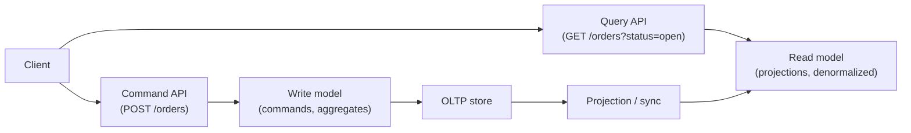
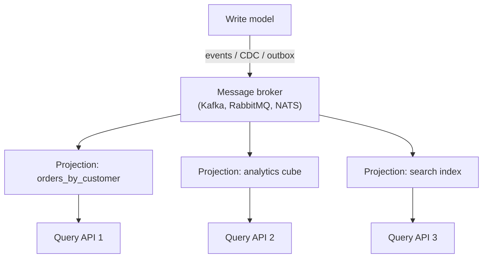

# CQRS

## Overview

**CQRS (Command Query Responsibility Segregation)** splits a system's data model into two distinct sides:

- **Command side (write)**: handles mutations — commands are optimized for correctness, validation, and writes.
- **Query side (read)**: handles reads — models are optimized for the exact queries the UI/API needs.

This is a specialization of **CQS (Command-Query Separation)** — the principle that a method either changes state or returns a value, never both — scaled up from method level to the **data-model and service level**.

## The Problem It Solves

In a classic CRUD service, one model serves both reads and writes. That works until reads and writes have *conflicting* requirements:

| | Writes want | Reads want |
|---|---|---|
| Model shape | Normalized, validated, business rules | Denormalized, pre-joined, cached |
| Consistency | Strong (transactions) | Fast, eventually consistent OK |
| Workload | Low volume, small payloads | High volume, fan-out queries |
| Storage | OLTP (Postgres, MySQL) | OLAP, search, cache, key-value |

CQRS lets each side be **independently shaped, scaled, and stored**.

## Without CQRS (CRUD) vs With CQRS

| Aspect | CRUD single model | CQRS |
|---|---|---|
| Model | One entity used for read + write | Separate read/write models |
| Query shape | Whatever the write schema allows | Exactly what the UI needs |
| Scaling | Scale both together | Scale each independently |
| Consistency | Strong by default | Write-side strong; read-side eventual |
| Complexity | Low | Higher (sync, two models) |

## Components

### Write side (commands)

- **Commands** are intent: `PlaceOrder`, `CancelOrder`, `TransferFunds`.
- Validated against business rules by **aggregates**.
- Writes go to an OLTP store, possibly via the **transactional outbox** for reliable publishing.

### Read side (projections)

- **Projections** consume write events (or DB changes) and build denormalized read models: materialized views, Elasticsearch indices, cache entries, star-schema tables.
- Queries are simple, targeted, and fast — often just "look up by ID and return."

### Synchronization

Synchronization options: event stream (see [Event Sourcing](./event-sourcing.md)), **change data capture (CDC)** from the write DB, or dual-write (least safe). Dual-writes risk inconsistency if one write fails — prefer outbox + CDC.

## Consistency

Read models are **eventually consistent** — after a write, there is a small lag before the projection updates. This is the fundamental trade-off: CQRS buys read flexibility and scale at the cost of read-your-writes guarantees. Mitigations:

- Projection lag monitoring.
- **Read-your-writes** via a hybrid path (write response contains the authoritative state).
- Synchronous projection for the small subset of reads that demand it.

## CQRS and Event Sourcing

CQRS does **not** require event sourcing and vice versa, but they compose well:

- Event sourcing provides the event log; CQRS projections consume it.
- The write side can be event-sourced (state rebuilt from events); the read side is inherently a projection.
- See [Event Sourcing](./event-sourcing.md).

## When to Use CQRS

| Strong fit | Poor fit |
|---|---|
| Read-to-write ratio is extreme (many reads, few writes) | Simple CRUD with one model |
| Same data read in very different shapes (dashboard + API + search) | Team new to eventual consistency |
| High-read scalability needed independently of writes | Strict read-your-writes everywhere |
| Complex domain with business rules on writes | MVP / prototype speed matters |

Many production systems use a **partial CQRS**: separate read models/tables for hot queries (e.g., a denormalized `user_stats` table or a search index) while keeping the canonical write model — without a full event-sourced write side.

## Interview Questions

### Q: What is the difference between CQS and CQRS?

CQS is a method-level principle (a method either queries or commands, never both — e.g., `pop()` violates it). CQRS applies the same idea at the architectural level: separate *services/models* for commands vs queries, often with different storage and consistency characteristics.

### Q: Why can read models be eventually consistent?

Writes and reads are decoupled by a projection that copies data asynchronously. The window between a write and its appearance in the read model is small but nonzero; CQRS designs accept this in exchange for independently optimized, independently scaled read paths. Systems that need strict read-your-writes should keep those reads on the write model.

### Q: How do you keep read models in sync without dual-write bugs?

Prefer **transactional outbox + CDC**: write the event/outbox row in the same DB transaction as the state change; a relay publishes it to the broker; projections consume and rebuild. Dual-writes (writing DB and broker separately) risk partial failure and divergence.

### Q: When would you reject CQRS in an interview?

When the domain is simple, the read/write ratio is balanced, or the team can't accept eventual consistency — CQRS adds operational complexity (two models, sync, lag) that is not justified. It's a tool for a specific problem, not a default.

## References

- Martin Fowler, *CQRS* — https://martinfowler.com/bliki/CQRS.html
- Greg Young, *CQRS Documents* — https://cqrs.files.wordpress.com/2010/11/cqrs_documents.pdf
- Udi Dahan, *Clarified CQRS* — https://udidahan.com/2009/12/09/clarified-cqrs/
- Fowler, *Event Sourcing* — https://martinfowler.com/eaaDev/EventSourcing.html
- AWS Prescriptive Guidance: CQRS pattern — https://docs.aws.amazon.com/prescriptive-guidance/latest/modernization-data-persistence/cqrs-pattern.html

## Related Topics

- [Event Sourcing](./event-sourcing.md) — the write-side pattern that feeds projections
- [Event-Driven Architecture](./event-driven.md) — decoupling via events
- [Microservices](./microservices.md) — service-level application of CQRS
- [Normalization vs Denormalization](../../dbms/normalization/README.md) — denormalized read models
- [Replication and Read Replicas](../../distributed/replication/README.md) — scaling reads
- [Distributed Transactions](./distributed-transactions.md) — write-side consistency across services
