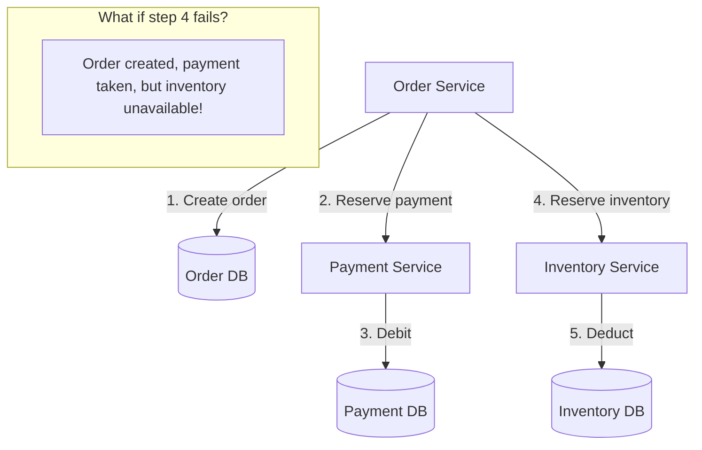
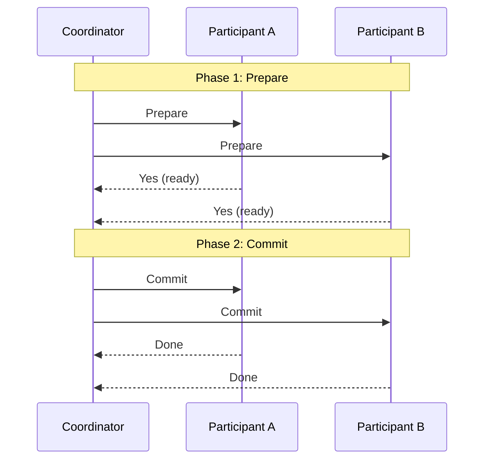
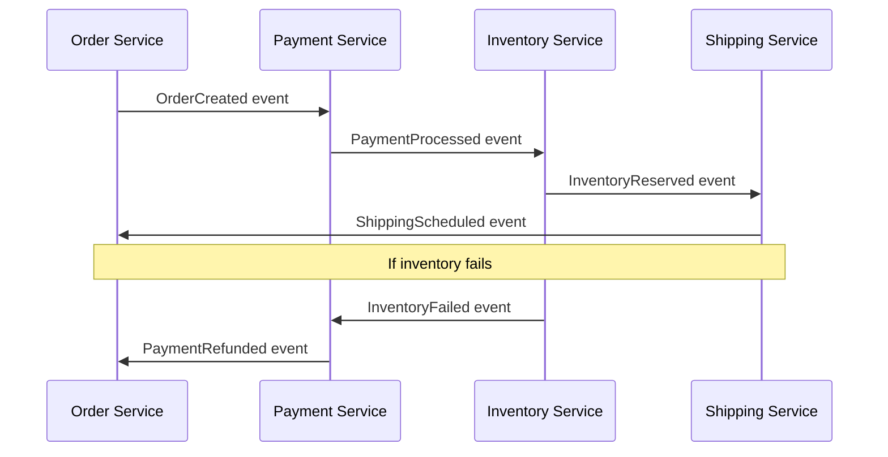
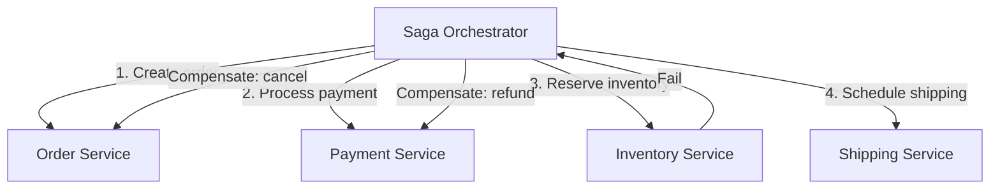
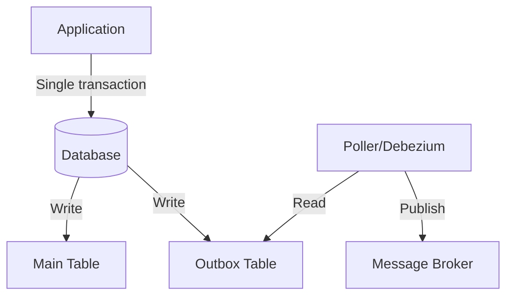
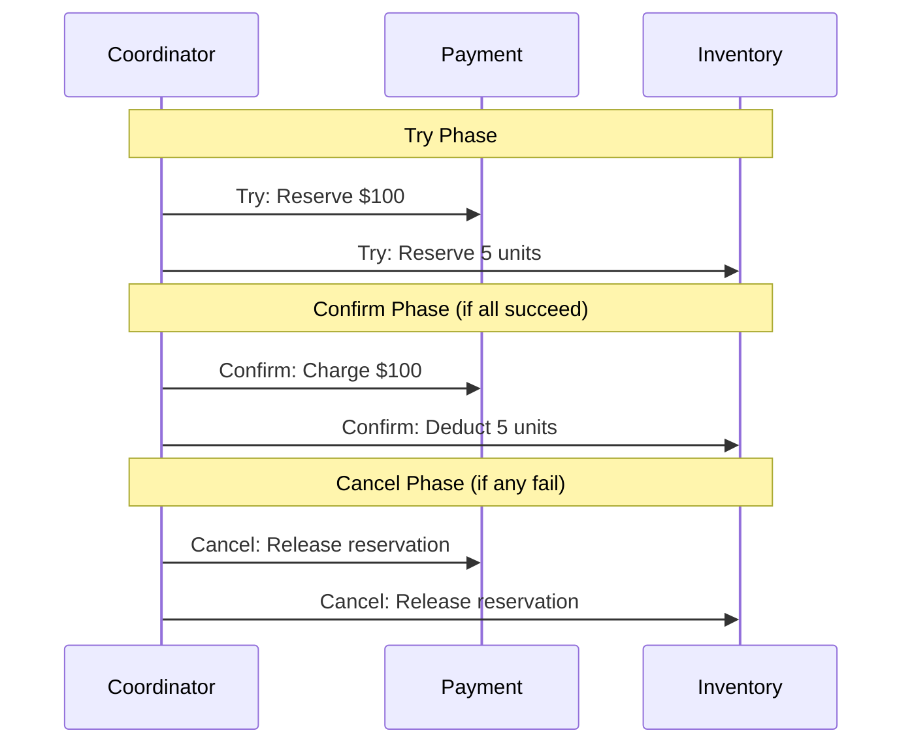

# Distributed Transactions

## Overview

Distributed transactions span multiple services or databases. Unlike local transactions (ACID), distributed transactions must coordinate across network boundaries, handling failures, partial commits, and consistency.

## The Problem



## Two-Phase Commit (2PC)

### How It Works



### 2PC Problems

| Problem | Description |
|---------|-------------|
| **Blocking** | Participants hold locks during prepare |
| **Single point of failure** | Coordinator failure blocks all |
| **Performance** | 2 round trips, lock contention |
| **Partial failure** | Some commit, some don't |

## Saga Pattern

A saga is a sequence of local transactions. Each publishes an event that triggers the next. If one fails, compensating transactions undo previous steps.

### Choreography-Based Saga



### Orchestration-Based Saga



### Choreography vs Orchestration

| Choreography | Orchestration |
|--------------|---------------|
| No central coordinator | Central orchestrator |
| Events trigger next step | Orchestrator calls services |
| Loose coupling | Clear flow |
| Hard to understand flow | Easy to understand |
| Good for simple flows | Better for complex flows |

## Transactional Outbox Pattern

### Problem

Service needs to update database AND publish event atomically. Can't do both in one transaction if message broker is separate.

### Solution: Outbox Table



```python
# Single transaction
def create_order(order):
    with transaction():
        db.insert("orders", order)
        db.insert("outbox", {
            "event_type": "OrderCreated",
            "payload": order.to_json(),
            "published": False
        })
    # Separate process polls outbox and publishes
```

### Debezium (CDC)

```yaml
# Debezium connector captures changes from outbox table
apiVersion: kafka.strimzi.io/v1beta2
kind: KafkaConnector
metadata:
  name: outbox-connector
spec:
  class: io.debezium.connector.postgresql.PostgresConnector
  config:
    database.hostname: postgres
    database.dbname: orders
    table.include.list: public.outbox
    transforms: outbox
    transforms.outbox.type: io.debezium.transforms.outbox.EventRouter
```

## TCC (Try-Confirm-Cancel)

### How It Works



### TCC vs Saga

| TCC | Saga |
|-----|------|
| Reserve resources first | Execute transactions first |
| Confirm or cancel | Compensate on failure |
| Pessimistic (lock resources) | Optimistic (compensate later) |
| Stronger consistency | Better availability |

## Eventually Consistent Patterns

### Polling Publisher

```python
# Background job polls for unprocessed events
def poll_outbox():
    while True:
        events = db.query("SELECT * FROM outbox WHERE published = false")
        for event in events:
            broker.publish(event)
            db.execute("UPDATE outbox SET published = true WHERE id = ?", event.id)
        time.sleep(1)
```

### Listen to Yourself

Consumer processes event, then publishes confirmation event. Original service listens for confirmation.

## Interview Questions

1. **2PC vs Saga?** — 2PC: strong consistency, blocking, synchronous. Saga: eventual consistency, non-blocking, async.
2. **When to use choreography vs orchestration?** — Choreography: simple flows, few services. Orchestration: complex flows, many services.
3. **How to handle partial failures in Saga?** — Compensating transactions. Each step must have a compensating action.
4. **What is the outbox pattern?** — Write events to a local outbox table in the same transaction as business data. Poller publishes to broker.
5. **How to make a saga idempotent?** — Idempotency keys, deduplication tables, event versioning
6. **TCC vs Saga?** — TCC: reserve resources first (pessimistic). Saga: execute and compensate (optimistic).
7. **How to test distributed transactions?** — Contract testing, chaos engineering, fault injection

## Related Topics

- [Microservices](./microservices.md) — Service decomposition
- [Event-Driven](./event-driven.md) — Event sourcing, CQRS
- [Kafka](../messaging/kafka.md) — Event streaming
- [Consensus](../../distributed/consensus/) — Coordination
