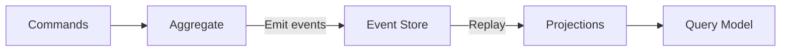
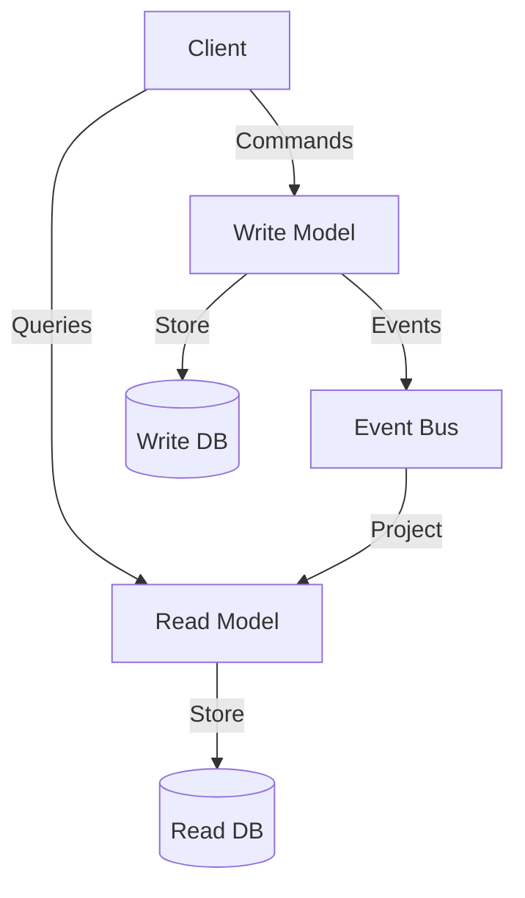
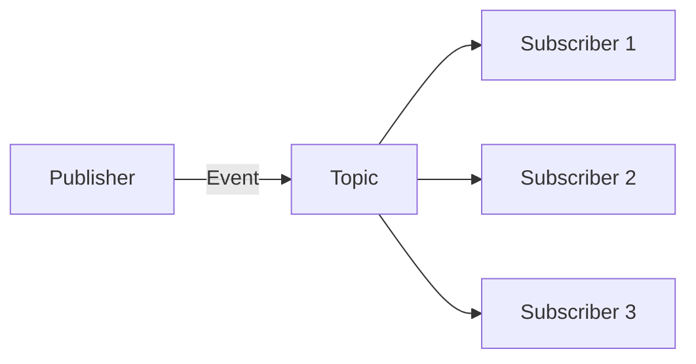

# Event-Driven Architecture

## Overview

Event-driven architecture (EDA) is a design pattern where the flow of the program is determined by events. Events represent significant changes in state and are the primary communication mechanism between decoupled components.

## Core Concepts

| Concept | Description |
|---------|-------------|
| **Event** | Immutable record of something that happened |
| **Producer** | Creates and publishes events |
| **Consumer** | Subscribes to and processes events |
| **Event Bus/Broker** | Routes events (Kafka, RabbitMQ, NATS) |

## Event Sourcing

Instead of storing current state, store all events that led to the current state.



### Example: Order Event Store

```python
# Events
@dataclass
class OrderCreated:
    order_id: str
    items: list
    total: float

@dataclass
class OrderPaid:
    order_id: str
    payment_id: str
    amount: float

@dataclass
class OrderShipped:
    order_id: str
    tracking_number: str

# Event Store
class EventStore:
    def __init__(self):
        self.events = []
    
    def append(self, event):
        self.events.append(event)
    
    def get_events(self, aggregate_id):
        return [e for e in self.events if e.aggregate_id == aggregate_id]

# Rebuild state from events
def rebuild_order(events):
    order = Order()
    for event in events:
        order.apply(event)
    return order
```

### Benefits and Drawbacks

| Benefits | Drawbacks |
|----------|-----------|
| Complete audit trail | Complex queries |
| Temporal queries | Event schema evolution |
| Replay/bug fix | Eventually consistent |
| Scalable writes | Larger storage |

## CQRS (Command Query Responsibility Segregation)

Separate the write model (commands) from the read model (queries).



### When to Use CQRS

- Read and write patterns are very different
- Complex domain model
- Need optimized read models (denormalized)
- High read-to-write ratio

### Example

```python
# Write model (rich domain model)
class Order:
    def add_item(self, product_id, quantity):
        # Business logic, validation
        self.events.append(ItemAdded(self.id, product_id, quantity))

# Read model (optimized for queries)
class OrderSummaryView:
    order_id: str
    customer_name: str
    total_items: int
    total_amount: float
    status: str

# Projection: updates read model from events
class OrderProjection:
    def handle_ItemAdded(self, event):
        db.execute("UPDATE order_summaries SET total_items = total_items + 1 WHERE order_id = ?", event.order_id)
```

## Event Schema Evolution

### Strategies

| Strategy | Description | Trade-off |
|----------|-------------|-----------|
| **Additive** | Add optional fields | Backward compatible |
| **Versioning** | Event type versions | Complex routing |
| **Upcasting** | Transform old events | Migration overhead |
| **Copy transform** | Rewrite event store | Expensive |

### Avro/Protobuf for Events

```protobuf
// Protobuf: forward/backward compatible
message OrderEvent {
    string order_id = 1;
    oneof event {
        OrderCreated created = 2;
        OrderPaid paid = 3;
        OrderShipped shipped = 4;
    }
}
```

## Event-Driven Patterns

### Publish-Subscribe



### Event-Carried State Transfer

Event carries full data needed by consumer (no lookup back to source).

### Event Notification

Event carries minimal data; consumer queries source for details.

### Event Streaming

Continuous flow of events (Kafka Streams, Flink).

## Interview Questions

1. **Event sourcing vs traditional CRUD?** — Event sourcing: append-only, audit trail, temporal queries. CRUD: simpler, current state only.
2. **When to use CQRS?** — Different read/write patterns, complex domain, need optimized reads.
3. **How to handle event ordering?** — Partition by aggregate ID (Kafka), sequence numbers, causal ordering
4. **Exactly-once processing?** — Idempotent consumers, transactional outbox, Kafka transactions
5. **Event schema evolution?** — Additive changes, versioning, Avro/Protobuf for compatibility
6. **How to handle failures in event processing?** — Dead letter queues, retry with backoff, idempotent consumers
7. **Eventual consistency — how to handle?** — Saga pattern, compensating transactions, UI handling

## Related Topics

- [Kafka](../messaging/kafka.md) — Event streaming
- [Microservices](./microservices.md) — Service decomposition
- [Distributed Transactions](./distributed-transactions.md) — Cross-service consistency
