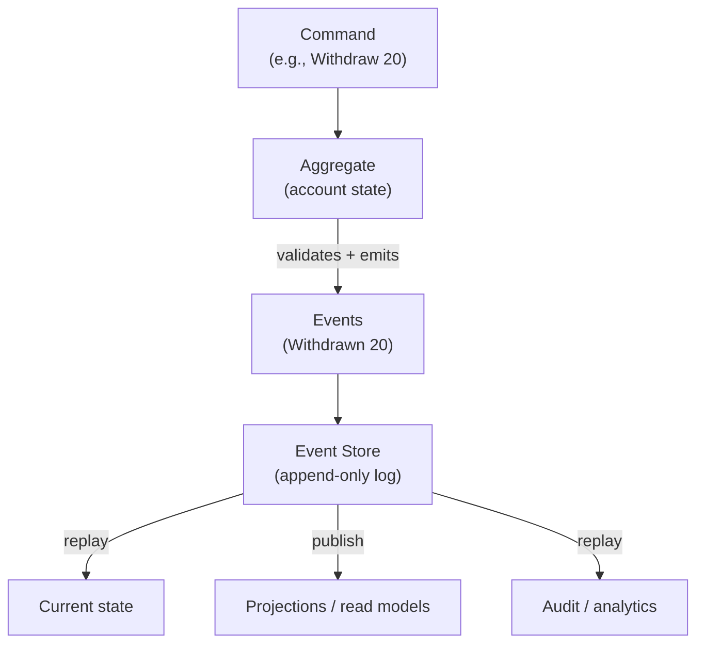
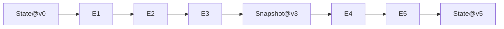

# Event Sourcing

## Overview

**Event sourcing** stores the *history* of an entity as an immutable sequence of events, instead of (or in addition to) its current state. The current state is **derived** — replayed from the event log — whenever needed.

> CRUD: `UPDATE account SET balance = 100` — the old value is gone.
> Event sourcing: `AccountOpened`, `Deposited(50)`, `Withdrawn(20)` — nothing is ever lost.



## Core Concept

An **event** is an immutable fact that already happened, written in past tense: `OrderPlaced`, `PaymentCaptured`, `InventoryDecremented`. Events are **never updated or deleted** — only appended. State is a **fold** over the event stream:

```text
state = fold(events, initial_state)      // e.g., balance = Σ deposits − Σ withdrawals
```

Because state is derived, you can:

- **Rebuild** any entity's state at any point in time.
- **Replay** the log into a new projection (new feature, new read model, analytics).
- **Audit** — the log is a complete, tamper-evident history.

## Events vs Commands

| | Command | Event |
|---|---|---|
| Tense | Imperative ("Withdraw 20") | Past ("Withdrawn 20") |
| Intent | A request that may fail validation | A fact that already happened |
| Mutability | Consumed, may be rejected | Immutable, append-only |
| Stored? | Usually not | Yes — the source of truth |

The aggregate validates the command against its current state, then emits events. If the account has no funds, `Withdraw` is rejected and no event is written.

## The Event Store

Technically an append-only log, often implemented on:

- **A relational DB** with an `events` table (`aggregate_id`, `version`, `type`, `payload`, `timestamp`) and a unique constraint on `(aggregate_id, version)` to enforce optimistic concurrency.
- **Dedicated event stores / brokers**: Kafka (see [Kafka](../../distributed/messaging/kafka.md)), NATS JetStream, EventStoreDB, or a log-based system.

```sql
-- optimistic concurrency: version must match what the aggregate loaded
INSERT INTO events (aggregate_id, version, type, payload)
VALUES ('acct-1', 4, 'Withdrawn', '{"amount": 20}');
-- unique(aggregate_id, version) → concurrent writers with the same version fail
```

## Snapshotting

Replaying every event since the beginning is slow for long-lived entities. **Snapshots** store the state at a checkpoint (e.g., every 100 events); replay starts from the nearest snapshot:



Snapshots are a *cache* of the fold — they can always be rebuilt from events, so they are disposable.

## Benefits

- **Complete audit trail** — every change, who/what/when, without extra auditing tables.
- **Temporal queries** — "what was the balance last Tuesday?" is a replay to that time.
- **Replay / debugging** — reproduce a bug by replaying production events.
- **Decoupling** — other services subscribe to events (projections) without the source knowing (see [Event-Driven Architecture](./event-driven.md)).
- **Natural fit with CQRS** — the event log feeds read models (see [CQRS](./cqrs.md)).

## Challenges

| Challenge | Mitigation |
|---|---|
| Eventual consistency of read models | Accept; design reads around it (see CQRS) |
| Event schema evolution | Version events (`OrderPlacedV2`), migrate lazily, tolerate multiple versions |
| Long replay times | Snapshots, compaction, parallel projection |
| Eventual consistency complexity | Careful aggregate design, idempotent consumers |
| Querying current state is awkward | CQRS — separate read model |
| Deleting data (GDPR) | Tombstone events / encryption keys (hard problem) |

## When to Use / When Not To

| Use event sourcing | Prefer plain CRUD |
|---|---|
| Audit/regulatory requirements | Simple state, simple CRUD |
| Complex business logic with history | Low write volume, need immediate consistency |
| Multiple projections / analytics | Prototypes, small domains |
| Event-driven integrations | Teams not ready for the operational cost |

## Interview Questions

### Q: How do you rebuild state and how do snapshots work?

State is `fold(events)`. To speed replay, take periodic snapshots (state at version N); replay loads the nearest snapshot ≤ N and applies the remaining events. Snapshots are disposable — they can always be rebuilt from the event log.

### Q: How do you handle concurrent writes to an aggregate?

Optimistic concurrency: each event carries a monotonic version; the write transaction enforces `unique(aggregate_id, version)`. A writer whose version is stale gets a conflict and must reload state and re-validate the command.

### Q: What is the relationship between event sourcing and CQRS?

They are independent but complementary. Event sourcing produces a log of events; CQRS separates the write side (commands, aggregates) from read sides (projections). The event log is a clean source for many projections — but CQRS works without event sourcing, and event sourcing can be queried without full CQRS.

### Q: How do you handle event schema evolution?

Version events (e.g., `OrderPlacedV1` → `OrderPlacedV2`), keep consumers able to handle multiple versions, and migrate lazily via upcasters/transformers when replaying old events. Never rewrite history in place; the past must remain reproducible.

## References

- Martin Fowler, *Event Sourcing* — https://martinfowler.com/eaaDev/EventSourcing.html
- Fowler, *CQRS* — https://martinfowler.com/bliki/CQRS.html
- Greg Young, *CQRS Documents* — https://cqrs.files.wordpress.com/2010/11/cqrs_documents.pdf
- EventStoreDB documentation — https://developers.eventstore.com/
- Kafka: Event sourcing and event-driven architectures — https://kafka.apache.org/documentation/

## Related Topics

- [CQRS](./cqrs.md) — read models fed by the event log
- [Event-Driven Architecture](./event-driven.md) — events as the communication backbone
- [Idempotency](./idempotency.md) — making consumers safe against redelivery
- [Distributed Transactions](./distributed-transactions.md) — saga vs event-sourced compensation
- [Kafka](../../distributed/messaging/kafka.md) — log as event store
