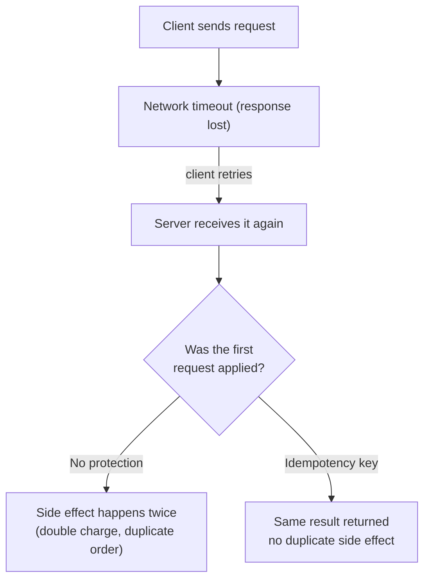
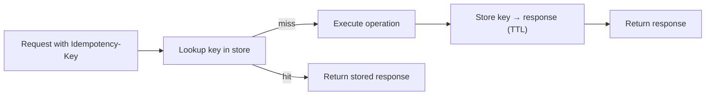

# Idempotency

## Overview

An operation is **idempotent** if applying it multiple times has the same effect as applying it once. Idempotency is the core defense against a whole class of distributed-system bugs: **retries**. When a client retries a request (timeout, rebalance, network blip), the server must not double-charge, double-create, or double-apply.

> `DELETE /users/42` is naturally idempotent. `POST /payments` is not — the first POST charges, the retry charges again.

## Why Idempotency Matters



Retries are unavoidable: networks drop packets, servers restart mid-request, load balancers time out. **Without idempotency, every retry is a potential double-side-effect.**

## Mechanisms

### 1. Natural idempotency (by HTTP semantics)

| Method | Idempotent? | Notes |
|---|---|---|
| GET, HEAD, OPTIONS, TRACE | Yes | Safe + idempotent |
| PUT, DELETE | Yes | Full replacement / delete by identifier |
| POST | **No** | Appends; same payload creates another resource |
| PATCH | No (generally) | Depends on patch semantics |

Making a `PUT` truly idempotent requires **full-state replacement**: `PUT /users/42 {name: "x"}` twice leaves the same final state. Partial updates (`PATCH`) can be non-idempotent.

### 2. Idempotency keys (the standard for POST-like APIs)

The client generates a unique key per logical operation and sends it in a header (`Idempotency-Key`, used by Stripe and others) or in the payload:

```text
POST /payments
Idempotency-Key: 8f6a3c2e-...        ← same key for retries of the same logical op
{ "amount": 1000, "currency": "USD" }
```

The server:

1. Looks up the key in its idempotency store.
2. **Miss** → execute, store `key → response`, return it.
3. **Hit** → return the stored response **without re-executing**.



Key design details:

- **Key generation**: UUIDv4 from the client; must be stable across retries.
- **Store**: Redis or a DB table with a unique constraint on the key. TTL (e.g., 24h) bounds storage.
- **Concurrency**: two racing requests with the same key must not both execute — use a unique index / `INSERT ... ON CONFLICT DO NOTHING` or a Redis `SETNX` lock, then return the winner's response.
- **Key reuse**: a different payload with the same key should be rejected (`422`).
- **Response caching**: also cache error responses where appropriate so a failed first attempt isn't retried into a different failure mode.

### 3. Database-level idempotency

| Technique | How it helps |
|---|---|
| **Unique constraints** | The second insert fails instead of duplicating (e.g., unique `order_number`) |
| **UPSERT / INSERT ... ON CONFLICT** | Same key converges to the same row |
| **Optimistic concurrency / version columns** | Detects that a change already happened |
| **Transactions + outbox** | Guarantee exactly-once side effect with the database write |
| **Exactly-once semantics in brokers** | Kafka producer idempotence (`enable.idempotence=true`), transactional outbox |

### 4. Distributed / exactly-once processing

For message consumers, the *at-least-once* delivery of queues (see [RabbitMQ](../distributed/messaging/rabbitmq.md), [Kafka](../distributed/messaging/kafka.md)) means a consumer may receive the same message twice. Make consumers idempotent:

- **Deduplication keys**: store processed message IDs; skip duplicates.
- **State-based convergence**: compute from current state so re-applying converges (like PUT).
- **Transactional outbox**: write the effect and the dedup marker in one DB transaction.

## Common Pitfalls

1. **Relying on POST being idempotent** — the most common interview trap; POST is *not* idempotent by spec.
2. **Storing idempotency keys in memory only** — lost on restart; the client retries and gets a double-execute.
3. **No concurrency protection on the key lookup** — two parallel retries both see "miss" and both execute.
4. **Reusing keys across different operations** — should return 422, not silently replay a different side effect.
5. **Retrying without the same payload** — the key must map to exactly one logical operation.

## Interview Questions

### Q: How would you make a payment API safe against double charges?

Issue an `Idempotency-Key` per checkout; the payment endpoint looks it up in a store with a unique constraint. First hit executes and stores the key→result; retries (same key) return the stored result. Additionally enforce a unique `order_id` in the DB so even a concurrent duplicate insert cannot double-charge, and use the outbox pattern to make the charge + order state change atomic.

### Q: What's the difference between idempotency and exactly-once?

Idempotency means "same input → same effect, no matter how many times applied." Exactly-once is a delivery/processing guarantee that *uses* idempotency under the hood: systems achieve exactly-once semantics by combining at-least-once delivery with idempotent processing (dedup keys, unique constraints) — true exactly-once messaging is built on this.

### Q: GET is idempotent — is it also safe?

Yes: a GET is *safe* (no side effects) and therefore idempotent. But "safe" methods may still have observable side effects in practice (logging, cache warmup) — HTTP semantics say they *shouldn't*, and clients may freely retry them.

### Q: How does Stripe's idempotency work at scale?

Stripe's design (publicly documented): the key is hashed and stored in a sharded data store keyed by (customer, key); first write wins via a unique index; TTL expires keys; the stored response — including error responses — is replayed for retries within the window.

## References

- RFC 9110, §9.2.2 — Safe methods; §9.2.2 — Idempotent methods — https://www.rfc-editor.org/rfc/rfc9110
- Stripe API docs: Idempotent requests — https://docs.stripe.com/api/idempotent_requests
- AWS Builders' Library: *Making retries safe with idempotent APIs* — https://aws.amazon.com/builders-library/making-retries-safe-with-idempotent-APIs/
- Kafka docs: Exactly-once semantics — https://kafka.apache.org/documentation/#semantics

## Related Topics

- [Event-Driven Architecture](./event-driven.md) — at-least-once consumers that must dedupe
- [Event Sourcing](./event-sourcing.md) — rebuilding state idempotently from an event log
- [Distributed Transactions](./distributed-transactions.md) — atomicity across services
- [Rate Limiting](../api/api-gateway.md) — related API robustness concern
- [Payment System Design](../../interview/system-design/payment.md) — real-world application
- [Retries and Backoff](../../distributed/microservices/README.md) — why clients retry in the first place
