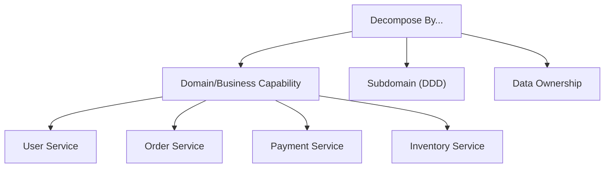
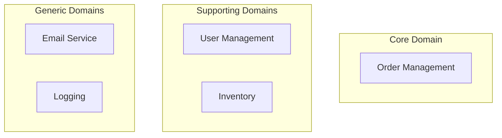
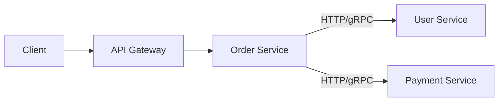
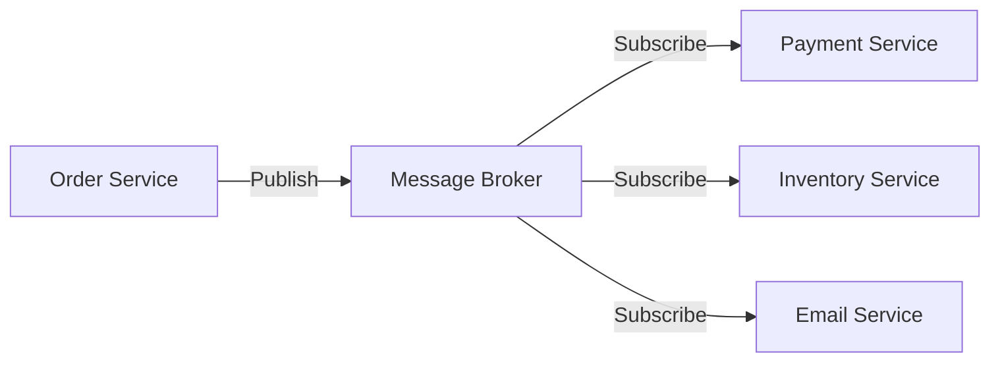
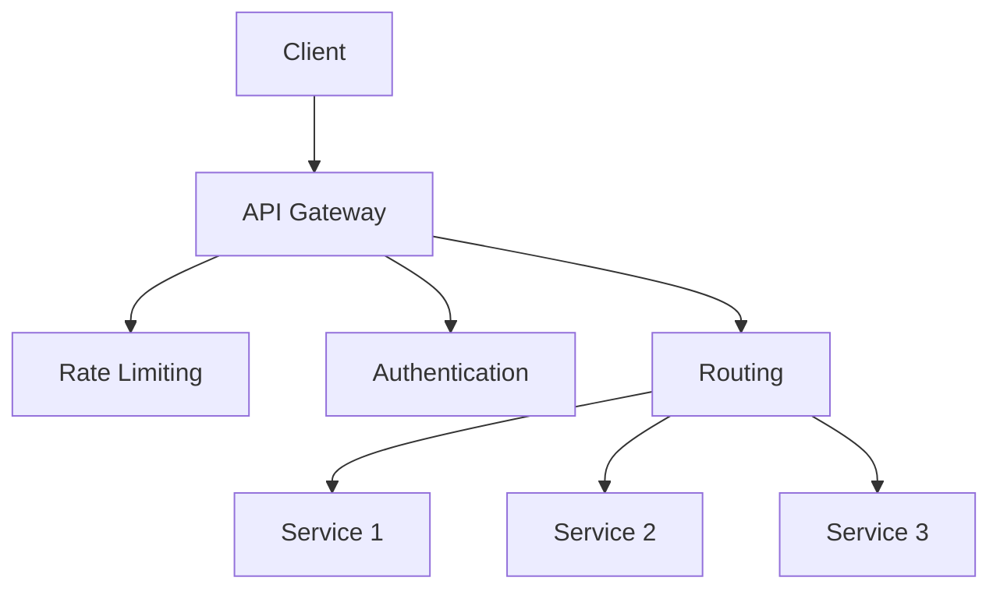
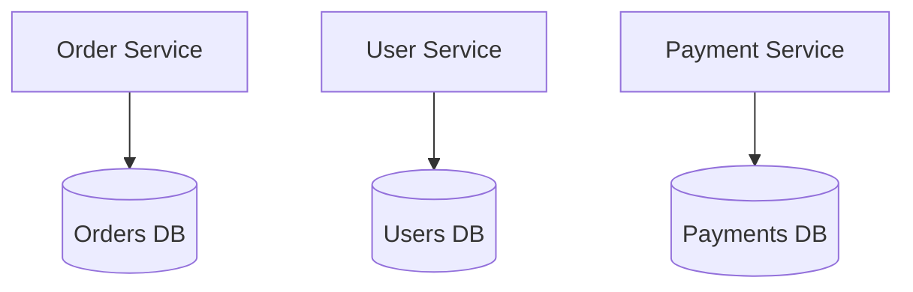
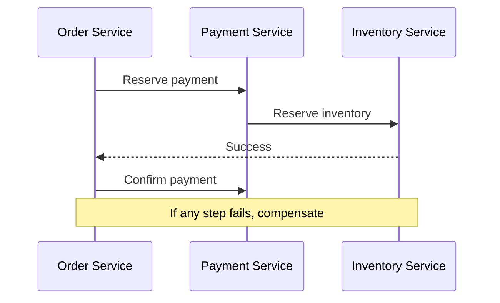
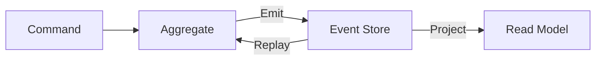
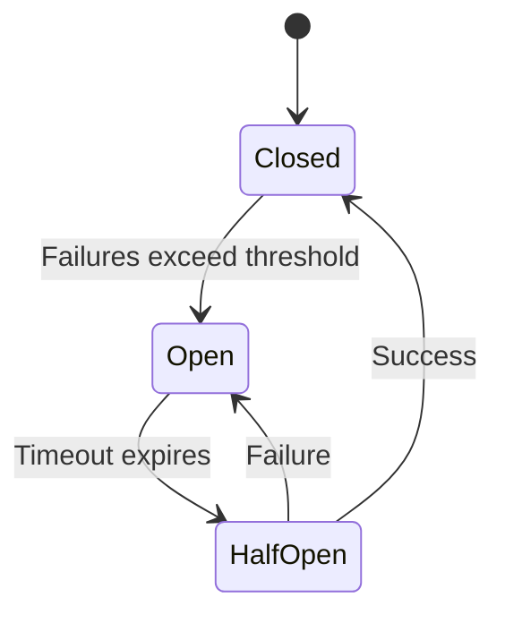
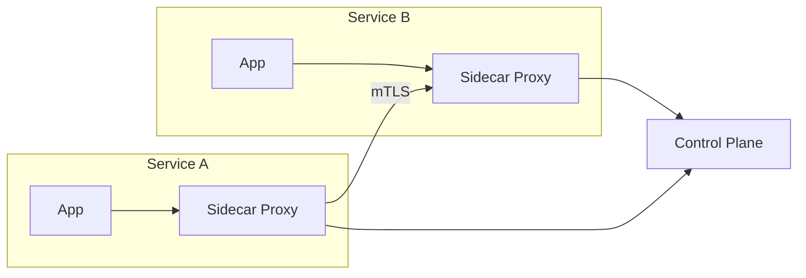

# Microservices Architecture

## Overview

Microservices is an architectural style where an application is composed of small, independently deployable services. Each service owns its data, runs in its own process, and communicates via well-defined APIs.

## Monolith vs Microservices

| Aspect | Monolith | Microservices |
|--------|----------|---------------|
| **Deployment** | Single unit | Independent per service |
| **Scaling** | Scale entire app | Scale individual services |
| **Technology** | Single stack | Polyglot |
| **Data** | Shared database | Database per service |
| **Team** | Large team, shared code | Small teams, ownership |
| **Complexity** | Simple initially | Complex (distributed) |

## Service Decomposition

### Decomposition Strategies



### Domain-Driven Design (DDD)



## Communication Patterns

### Synchronous (HTTP/gRPC)



### Asynchronous (Message Queue)



| Sync | Async |
|------|-------|
| Simple | Complex |
| Tight coupling | Loose coupling |
| Blocking | Non-blocking |
| Real-time | Eventual consistency |

## API Gateway



**Responsibilities:**
- Request routing and composition
- Authentication and authorization
- Rate limiting and throttling
- SSL termination
- Request/response transformation
- Load balancing

## Data Management

### Database per Service



### Saga Pattern



### Event Sourcing



## Resilience Patterns

### Circuit Breaker



```python
class CircuitBreaker:
    def __init__(self, threshold=5, timeout=60):
        self.failures = 0
        self.threshold = threshold
        self.timeout = timeout
        self.state = "CLOSED"
        self.last_failure = 0
    
    def call(self, func, *args):
        if self.state == "OPEN":
            if time.time() - self.last_failure > self.timeout:
                self.state = "HALF_OPEN"
            else:
                raise CircuitOpenError()
        
        try:
            result = func(*args)
            self.failures = 0
            self.state = "CLOSED"
            return result
        except Exception as e:
            self.failures += 1
            self.last_failure = time.time()
            if self.failures >= self.threshold:
                self.state = "OPEN"
            raise
```

### Bulkhead

Isolate failures to prevent cascading. Use separate thread pools or connection pools per service.

### Retry with Exponential Backoff

```python
def retry_with_backoff(func, max_retries=3, base_delay=1):
    for attempt in range(max_retries):
        try:
            return func()
        except Exception:
            if attempt == max_retries - 1:
                raise
            delay = base_delay * (2 ** attempt) + random.uniform(0, 1)
            time.sleep(delay)
```

## Service Mesh



**Features:** mTLS, traffic management, observability, canary deployments

## Interview Questions

1. **When to use microservices?** — Large team, different scaling needs, polyglot, independent deployment
2. **When NOT to use microservices?** — Small team, simple domain, tight coupling between features
3. **How to handle distributed transactions?** — Saga pattern (choreography or orchestration), eventual consistency
4. **API Gateway vs Service Mesh?** — Gateway: north-south (external). Service mesh: east-west (internal).
5. **How to handle service discovery?** — DNS, Consul, Kubernetes Services, etcd
6. **Strangler fig pattern?** — Incrementally migrate monolith to microservices by routing traffic to new services
7. **How to test microservices?** — Contract testing (Pact), integration tests, end-to-end tests
8. **Database per service — how to join data?** — API composition, CQRS, materialized views

## Related Topics

- [Docker](../containers/docker.md) — Containerization
- [Kubernetes](../containers/kubernetes.md) — Orchestration
- [Service Mesh](../containers/service-mesh.md) — Internal communication
- [Event-Driven](./event-driven.md) — Async patterns
- [Distributed Transactions](./distributed-transactions.md) — Cross-service consistency
