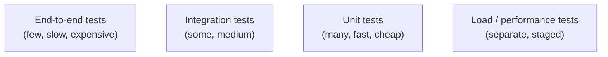

# Backend Testing

## Overview

Backend testing is the practice of verifying that services behave correctly across the **test pyramid** — many fast unit tests, fewer integration tests, and a handful of end-to-end/load tests. For interview purposes, the key skills are knowing the layers, choosing what to test at each, and understanding **load/performance testing** (a §15 topic) well enough to design a test plan and read results.



## The Test Pyramid

| Layer | Scope | Speed | Count | Examples |
|---|---|---|---|---|
| **Unit** | Single function/class, dependencies mocked | ms | Many | Pure logic, validation, utilities |
| **Integration** | Module + real dependencies (DB, cache, HTTP) | s | Some | Repository + DB, service + queue, API + DB |
| **E2E** | Full system through public interface | min | Few | User flow against deployed stack |
| **Contract** | API contract between consumer/provider | s | Per API | Consumer-driven contract tests |

**Unit tests** mock everything outside the unit — they catch logic bugs fast and localize failures. **Integration tests** use real infrastructure (often testcontainers) to catch wiring bugs (wrong SQL, bad schema, incorrect serialization) that mocks can't. **E2E** validates the whole path but is flaky/slow — reserve it for critical journeys.

## Testing by Layer

### API / HTTP tests

```python
# FastAPI example — integration test against the ASGI app with a test client
from fastapi.testclient import TestClient
from app.main import app

def test_create_user():
    with TestClient(app) as client:
        resp = client.post("/users", json={"name": "Ada"})
        assert resp.status_code == 201
        assert resp.json()["name"] == "Ada"
```

Test: status codes, payload shapes, validation errors, auth (401/403), idempotency (same request twice), rate limits, and error contracts.

### Database tests

- Use **testcontainers** (real Postgres in Docker) or an in-memory/embedded DB for integration.
- Test: schema migrations apply, queries return correct rows, transactions roll back, unique constraints fire.
- **Don't** assert SQL implementation details in unit tests; verify behavior through the repository/service.

### Message/queue consumers

- Publish a real event, assert the consumer's side effect (idempotency: same event twice → one effect).
- Test retry/backoff and dead-letter behavior (see [Event-Driven Architecture](./patterns/event-driven.md)).

## Mocking and Test Doubles

| Double | Behavior |
|---|---|
| **Stub** | Returns fixed data |
| **Fake** | Working lightweight implementation (in-memory repo) |
| **Mock** | Records calls; asserts interactions |
| **Spy** | Wraps real object, records calls |
| **Dummy** | Passed but unused |

Guideline: prefer **fakes and real infrastructure in integration tests**; use **mocks only at the unit boundary** to isolate the code under test. Over-mocking leads to tests that pass while the real system breaks.

## Load / Performance Testing

**Load testing** verifies the system handles expected (and beyond-expected) load within SLOs (latency, error rate), and finds the breaking point.

### Test types

| Type | Goal |
|---|---|
| **Smoke** | Verify the system works under minimal load |
| **Load** | Expected traffic: verify SLOs hold |
| **Stress** | Beyond expected: find the breaking point |
| **Soak** | Sustained load for hours: leaks, drift, GC issues |
| **Spike** | Sudden traffic jumps: autoscaling reaction |
| **Capacity** | Determine max throughput/requests the system supports |

### Key metrics

- **Latency**: p50, p95, p99 — the tail matters for user experience.
- **Throughput**: requests/sec or transactions/sec.
- **Error rate**: % of 4xx/5xx under load.
- **Concurrency**: active users/connections.
- **Resource**: CPU, memory, DB connections, queue depth.

### The coordinated-omission problem

If you measure latency only on requests that *completed* during the test, you ignore requests that were queued/blocked — artificially hiding the slowdown. Proper tools either send at a fixed rate regardless (e.g., **Vegeta**) or record response times including waiting time (e.g., **wrk2**). This is a classic gotcha when interpreting results.

### Tools (2026 landscape)

| Tool | Language | Best for |
|---|---|---|
| **k6** (Grafana) | JavaScript/TS | Code-first, CI/CD-native, thresholds; the strongest default for developer teams |
| **Apache JMeter** | Java + GUI | Broadest protocol coverage (20+ protocols, 1000+ plugins) |
| **Locust** | Python | Python teams, simple distributed load |
| **Gatling** | Java/Scala/Kotlin | Highest throughput per agent, excellent reports |
| **Artillery** | Node.js/YAML | Serverless & microservices, WebSocket |
| **Vegeta / wrk2** | Go | Constant-rate HTTP benchmarking (avoids coordinated omission) |

Example k6 script with thresholds:

```javascript
import http from 'k6/http';
import { check, sleep } from 'k6';

export const options = {
  stages: [
    { duration: '1m', target: 50 },   // ramp up
    { duration: '5m', target: 50 },   // sustain
    { duration: '1m', target: 0 },    // ramp down
  ],
  thresholds: {
    http_req_duration: ['p(95)<300', 'p(99)<1000'],
    http_req_failed: ['rate<0.01'],
  },
};

export default function () {
  const res = http.get('https://api.example.com/v1/items');
  check(res, { 'status 200': (r) => r.status === 200 });
}
```

### Load testing workflow

1. **Define SLOs first** — p99 latency target, error-rate budget, throughput goal.
2. **Build realistic scenarios** — user journeys, auth, think times, not just GET /.
3. **Run against a staging environment** (or isolated instances), never production initially.
4. **Monitor the whole stack** — app, DB, queue depths, autoscaler behavior (see [Autoscaling](../cloud/autoscaling.md)).
5. **Find the bottleneck** — is it the DB, connections, app CPU, or a downstream API?
6. **Re-test after fixes** and keep load tests in CI as regression gates (smoke-level) with full runs scheduled.

## Test-Driven Development (backend context)

- Write the failing test → minimal implementation → refactor.
- Works best for pure logic (business rules, validators, serializers); heavier for UI/E2E.
- **Property-based testing** (Hypothesis, QuickCheck) finds edge cases unit tests miss — valuable for parsers and data transforms.

## Common Mistakes

1. **Testing implementation, not behavior** — tests break on every refactor.
2. **Over-mocking** — tests assert mock interactions instead of outcomes; real integration is untested.
3. **Ignoring the test pyramid** — too many slow E2E tests make the suite impractical.
4. **Load testing without SLOs** — you can't judge "passed" without defined targets.
5. **Coordinated omission** — measuring only completed requests hides queuing latency.
6. **Testing only the happy path** — validation errors, timeouts, retries, and failure modes matter most in distributed systems.

## Interview Questions

### Q: What belongs in a unit test vs an integration test?

A unit test exercises one function/class with dependencies mocked — fast, localized, good for logic. An integration test exercises a module against real dependencies (a real DB via testcontainers, a real queue, real HTTP) — it catches wiring/schema/serialization bugs that mocks cannot. Use mocks at unit boundaries, real infrastructure at integration boundaries.

### Q: How do you design a load test for an API?

Define SLOs (p99 latency, error rate, throughput), write realistic user-journey scenarios, ramp load in stages (ramp up → sustain → ramp down), monitor app + DB + queues + autoscaler, and record p50/p95/p99 latency, throughput, error rate, and resource usage. Then find the bottleneck and verify fixes by re-running. Keep a smoke-level load test in CI.

### Q: What is coordinated omission in load testing?

It's the measurement error where only requests that complete within the test window are counted — queued/blocked requests are ignored, so reported latency looks better than reality under overload. Tools that pace requests at a fixed rate (Vegeta, wrk2) or that record including wait time avoid it. Always check whether a latency result accounts for this.

### Q: How do you test idempotency and retries?

For idempotency: send the same request twice with the same idempotency key and assert one side effect and identical responses. For retries: simulate failures (drop first response, return 500, time out) and assert the retry policy fires correctly and the system converges — plus test that the dead-letter path captures repeatedly failing messages (see [Idempotency](./patterns/idempotency.md)).

## References

- k6 documentation — https://grafana.com/docs/k6/latest/
- Apache JMeter — https://jmeter.apache.org/
- Locust — https://locust.io/
- Gatling — https://gatling.io/
- Martin Fowler: *Test Pyramid* — https://martinfowler.com/bliki/TestPyramid.html
- Google Testing Blog: *Just Say No to More End-to-End Tests* — https://testing.googleblog.com/2015/04/just-say-no-to-more-end-to-end-tests.html

## Related Topics

- [Idempotency](./patterns/idempotency.md) — what retries and duplicate requests must respect
- [Retries and Circuit Breakers](../distributed/microservices/circuit-breakers.md) — failure injection targets
- [Autoscaling](../cloud/autoscaling.md) — what load tests exercise
- [Observability](../cloud/observability/README.md) — metrics to watch during load tests
- [CI/CD](./cicd/README.md) — running tests in pipelines
- [Rate Limiting](./api/api-gateway.md) — API behavior to verify under load
