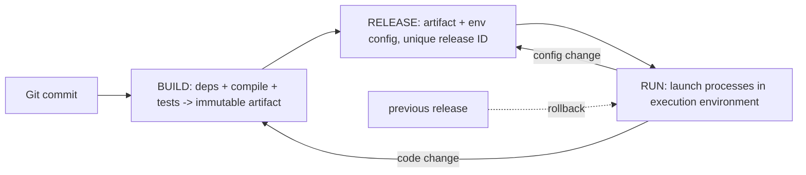

# The Twelve-Factor App

The Twelve-Factor App is a methodology for building software-as-a-service applications, published in 2011 by Adam Wiggins based on Heroku's platform experience. It distills twelve practices that make an app *portable* (runs the same on any environment), *deployable* (continuous delivery-friendly), *scalable* (horizontal by construction), and *resilient* (processes are disposable). Twelve-factor is not a framework or a product — it is the shared vocabulary of cloud-native design, and that is exactly why interviews use it: "is this service 12-factor?" compresses a dozen architecture questions into one. The canonical text is [12factor.net](https://12factor.net/); this page summarizes each factor with the rule, the reason it exists, the smells of violating it, and its 2020s mapping.

## Why It Still Gets Asked

Twelve-factor described, in 2011, what Docker (2013), Kubernetes (2014), and serverless (2014) later industrialized. Reading it today is reading the spec the cloud-native toolchain implements: containers made dependency isolation cheap, Kubernetes made disposability and concurrency the scheduler's job, and GitOps turned build-release-run into a pull model. Interviewers deploy the vocabulary to test whether you understand *why* platforms work the way they do — or just operate them.

There is also a practical screening motive: a candidate who can name which factor a given architecture violates can be taught a team's platform in a week; one who cannot will fight the platform. That is why "have you read 12-factor" appears in platform, SRE, and backend interviews even for shops that never mention it in the job ad.

## The Twelve Factors at a Glance

| # | Factor | One-line rule | Modern mapping |
|---|---|---|---|
| I | Codebase | One codebase, many deploys | Git repo (or monorepo dir) as source of deploys |
| II | Dependencies | Explicitly declare + isolate | Lockfiles, vendoring, containers |
| III | Config | Config in the environment | Env vars, Secrets managers, External Secrets |
| IV | Backing services | Attach as resources | Connection strings, k8s Services, managed clouds |
| V | Build-release-run | Strict stage separation | CI → registry image → GitOps deploy |
| VI | Processes | Stateless, share-nothing | Replicas + external session store |
| VII | Port binding | App is the web server | Container listens on its own port |
| VIII | Concurrency | Scale via process types | One Deployment per type + HPA |
| IX | Disposability | Fast start, graceful stop | Probes, SIGTERM, termination grace |
| X | Dev/prod parity | Keep environments similar | Containers + IaC + preview envs |
| XI | Logs | Event stream to stdout | Structured JSON + sidecar collectors |
| XII | Admin processes | One-off, same codebase/config | Jobs, CronJobs, release-phase hooks |

Grouped by concern, the factors split into authoring-time rules (what you write), pipeline rules (how it ships), and runtime rules (how it behaves once live):

```mermaid
flowchart LR
    subgraph AUTHOR["Authoring-time factors"]
        F1["I. Codebase"]
        F2["II. Dependencies"]
        F3["III. Config"]
        F10["X. Dev/prod parity"]
    end
    subgraph PIPE["Pipeline factors"]
        F4["IV. Backing services"]
        F5["V. Build-release-run"]
        F12["XII. Admin processes"]
    end
    subgraph RUNTIME["Runtime factors"]
        F6["VI. Processes"]
        F7["VII. Port binding"]
        F8["VIII. Concurrency"]
        F9["IX. Disposability"]
        F11["XI. Logs"]
    end
    AUTHOR --> PIPE --> RUNTIME
```

## The Factors, One by One

### I. Codebase — one codebase, many deploys

**Rule.** A deployable app has exactly one version-controlled codebase; every deploy (staging, prod, a developer's environment) is a run of some tagged/commit-pinned version of it.
**Why.** Multiple deploys of one app must be *versions of the same thing*; a forked copy means fixes get applied twice and "what is prod running?" becomes unanswerable.
**Violation smells.** Several repos each claiming to be the app; the staging copy diverging to hot-fix a bug; a repo deploying multiple unrelated services from one build.
**Modern mapping.** Monorepos are compatible — the factor is per *deployable unit*, not per Git repo. In GitOps the repo becomes the source of deploys themselves (see [GitOps](./cicd/gitops.md)).

### II. Dependencies — explicitly declare and isolate

**Rule.** Never rely on implicit existence of system-wide packages; declare every dependency in a manifest (`package.json`, `go.mod`, `requirements.txt`) and isolate it (lockfiles, virtualenvs, container images).
**Why.** A fresh checkout must build deterministically on any machine; implicit dependencies produce snowflake hosts that can never be rebuilt.
**Violation smells.** READMEs saying "first apt-install X"; "works on the bastion because someone installed that Python lib in 2019"; builds that only succeed on one laptop.
**Modern mapping.** Lockfiles made resolution reproducible; containers made isolation near-free ([Docker](./containers/docker.md)) — the factor is so industrialized that its violations now mostly signal legacy systems.

### III. Config — store config in the environment

**Rule.** Configuration that *varies between deploys* — credentials, database URLs, hostnames — lives in the environment (env vars), never in code or per-environment files committed to the repo.
**Why.** The same build artifact must be promotable through environments; config-in-code means the artifact secretly differs per deploy and secrets leak into Git history.
**Violation smells.** `config/production.yml` checked into the repo; builds that bake their target environment; credentials grep-able from Git history.
**Modern mapping.** Env vars remain the substrate, but secrets managers (Vault, AWS Secrets Manager/SSM, Kubernetes Secrets with External Secrets Operators) inject values at runtime — 12-factor never distinguished *config* from *secrets*; modern practice does. Caveats below in the criticism section.

### IV. Backing services — treat attached resources

**Rule.** Databases, queues, caches, mail servers, even third-party APIs are *attached resources*: addressed by a URL/credential, swappable without code change.
**Why.** Swapping local Postgres for RDS, or a queue vendor for another, should be a config edit — coupling to service *topology* kills portability and elasticity.
**Violation smells.** Code assuming "the DB is on this host"; service endpoints hard-coded per environment in source; an app that must be reconfigured to use a standby database.
**Modern mapping.** Kubernetes Services and operators, cloud managed services, service brokers — the app sees a connection string and nothing else.

### V. Build, release, run — strict stage separation

**Rule.** Three isolated stages: **build** turns code + dependencies into an immutable artifact; **release** combines the artifact with environment config; **run** launches processes in the execution environment. Every release is uniquely identified; rollback means launching the previous release.
**Why.** No mutation of running systems; no builds happening on production hosts; every incident ends with "roll back" as a first-class operation.
**Violation smells.** SSH-ing to prod to edit a file and restart; builds compiled on the app server; "rollback" meaning "find the old tarball".
**Modern mapping.** Container images are the build artifact, image digests are release IDs, and the run stage is a deployment rollout — canary and blue-green strategies ([Progressive Delivery](./patterns/progressive-delivery.md), [Canary Releases](../sre/canary-releases.md)) are release-stage policy, not code.

### VI. Processes — stateless and share-nothing

**Rule.** The app executes as one or more stateless processes; anything that must persist goes to a backing service (database, queue, cache). Nothing in process memory or local disk may be depended on by a later request.
**Why.** Stateless processes can be replicated, rescheduled, and replaced freely — the precondition for horizontal scaling and zero-downtime deploys.
**Violation smells.** Sessions in process memory behind a load balancer with sticky sessions; "restart the pod and users lose their carts"; uploads written to local disk and never replicated.
**Modern mapping.** Kubernetes replicas assume it; sticky sessions are explicitly a smell; the session goes to Redis, files go to object storage ([Kubernetes](./containers/kubernetes.md)).

### VII. Port binding — self-contained services

**Rule.** The app *is* the web server: it binds a port itself and speaks HTTP, rather than being injected into an external application server.
**Why.** One service = one port means the execution environment can expose, load-balance, and route any app uniformly.
**Violation smells.** Deploying a WAR into a shared Tomcat; requiring Apache `mod_php`; an app that only works behind a specific fronting server.
**Modern mapping.** Containers expect self-binding; Kubernetes Services and ingress front the pod; sidecar proxies (Envoy) terminate TLS *for* the locally-bound port. Serverless is the reductio: the platform owns the port entirely.

### VIII. Concurrency — scale out via the process model

**Rule.** Scale by adding processes of a given *type* (web, worker, scheduler), not by growing one giant multi-threaded process. Unix processes are the unit of management.
**Why.** Process types scale independently — ten more web processes, two more queue workers — and crash isolation comes free.
**Violation smells.** One process doing HTTP serving, cron jobs, and queue consumption; the only scaling story being "buy a bigger box".
**Modern mapping.** One Deployment per process type, each with its own HPA ([Kubernetes](./containers/kubernetes.md)); queue-driven burst offload to Lambda ([serverless](../cloud/advanced/serverless.md), [Lambda](../cloud/aws/lambda.md)) is concurrency as a managed primitive.

### IX. Disposability — fast startup and graceful shutdown

**Rule.** Processes start in seconds and shut down gracefully on SIGTERM — finishing in-flight work, releasing locks — and must tolerate being killed at any moment.
**Why.** Elastic scaling, rolling deploys, and crash resilience all assume processes are cattle: cheap to create, safe to destroy.
**Violation smells.** Ten-minute boots with manual warm-up; dropped requests during deploys because SIGTERM is ignored; a worker that never re-leases its queue lock.
**Modern mapping.** Readiness/liveness probes, `preStop` hooks, and termination grace periods in Kubernetes; spot/preemptible instances make disposability mandatory rather than optional.

### X. Dev/prod parity — keep environments similar

**Rule.** Keep development, staging, and production as similar as possible: same backing services at the same versions, same tooling, small gaps between deploys and between developers.
**Why.** Divergence is where "works in dev" bugs breed — SQLite vs Postgres, Windows vs Linux, Apache vs nginx each add a class of production-only failures.
**Violation smells.** Dev on SQLite, prod on Postgres; "set up dev" being a two-day tribal ritual; staging refreshed twice a year.
**Modern mapping.** Containers and IaC make parity cheap — the app image is identical, the infra is code ([Terraform](../iac/terraform.md)); preview environments spin parity up per-PR. Accepted partial deviation: parity of *scale* is expensive, so teams tier by risk while keeping topology identical.

### XI. Logs — treat as event streams

**Rule.** A 12-factor app writes its log as an unbuffered event stream to stdout and never concerns itself with routing or storage; the execution environment captures and aggregates the stream.
**Why.** Separates the app from log plumbing, so the same process runs unchanged whether logs go to a file, a collector, or stdout in a terminal.
**Violation smells.** The app manages its own log files and rotation; log shipping configured inside the app; "logs are on that host's disk, hope it doesn't die".
**Modern mapping.** The biggest factor shift since 2011: logs are now *structured* (JSON with trace context), collected by sidecars/agents (Fluent Bit, Vector) into Loki/Elastic, and unified with metrics and traces under [OpenTelemetry](./observability/opentelemetry.md). See [logging](../cloud/observability/logging.md).

### XII. Admin processes — run as one-off processes

**Rule.** Administrative and maintenance tasks — migrations, one-off scripts, REPL sessions — run as one-off processes in the identical environment: same codebase, same config, same release.
**Why.** Admin code then evolves with the app and runs against the right environment; no snowflake ops box with its own assumptions.
**Violation smells.** Running migrations from a laptop against prod; a "special" node where manual fixes are applied; admin scripts living in a wiki.
**Modern mapping.** Kubernetes Jobs and CronJobs, ECS one-off tasks, Heroku release-phase hooks, and the standard "migration Job runs before rollout" CI pattern.

## Common Violations Cheat Sheet

The fastest way to internalize the factors is to pair each with its most common production violation and its fix:

| Factor | Common violation | Fix |
|---|---|---|
| I Codebase | Staging fork diverges to hotfix | Shared library + deploy from one repo |
| II Dependencies | Host needs a hand-installed package | Lockfile + container image |
| III Config | `config/production.yml` in Git | Env injection / secrets manager |
| IV Backing services | Hard-coded DB host per environment | Connection strings from config only |
| V Build-release-run | SSH-edit-restart on prod | Immutable images + pipeline-only deploys |
| VI Processes | Sessions in pod memory | Redis-backed sessions, object storage for files |
| VII Port binding | WAR into shared Tomcat | App binds its own port; front with ingress |
| VIII Concurrency | One process does web + cron + workers | Separate process types, scale each independently |
| IX Disposability | SIGTERM ignored, requests dropped | Graceful shutdown + readiness probes |
| X Dev/prod parity | Dev on SQLite, prod on Postgres | Same services via containers/compose |
| XI Logs | App writes and rotates its own files | Structured stdout + sidecar/agent shipping |
| XII Admin processes | Migrations run from a laptop | Migration Jobs in the release pipeline |

Code-review usage: when you spot a row's violation, name the factor — "this in-memory session store is a factor VI violation under autoscaling" — and the conversation moves from taste to principle.

## What Changed Since 2011

The methodology survives, but four factors changed meaning materially — the delta interviewers like to probe:

| Factor | 2011 reading | 2020s reading |
|---|---|---|
| XI Logs | Write to stdout; platform pipes text files | Structured JSON with trace IDs; sidecar/agent collection; logs+metrics+traces unified (OpenTelemetry) |
| III Config | Env vars for everything that varies | Split: config vs *secrets* (managers, encrypted injection) vs *feature flags* (flag services as live config) |
| VI Processes | Hand-run processes behind a LB | Managed replicas; serverless makes processes a platform primitive that scales to zero |
| V Build-release-run | CI builds, ops releases | GitOps: release *is* a Git commit; supply-chain security (signed images, SBOMs) adds a stage 2011 never imagined |

Disposability (IX) also hardened from advice into enforcement — probes and grace periods are now scheduler-configured contracts, not developer discipline.

## Criticism and Legitimate Deviations

Twelve-factor is a model for *stateless, request-driven web services*; its critics mostly attack cases it never claimed:

- **Env vars don't scale past a dozen keys.** Flat, untyped, undocumented strings become a config dumping ground. Modern practice layers typed config libraries and hierarchical files over the env-var substrate — and admits that *secrets in env vars leak* (visible in child processes, crash dumps, debug endpoints), which is why secrets managers displaced them for credentials.
- **Parity is a cost dial, not a binary.** Full prod-parity staging for a 5-person team can cost more than prod; tiering parity (identical topology, downsized scale) is a rational deviation.
- **Monoliths are not exempt, only factors are.** A modular monolith can be perfectly 12-factor (one artifact, stateless replicas, streams to stdout); conversely, microservices built with sticky sessions and baked-in config violate it happily. The factors are orthogonal to service granularity — a point made in [Microservices](./patterns/microservices.md).
- **Stateful systems deviate structurally.** Databases, ML training jobs, and data pipelines need local scratch, slow starts, and careful shutdown; forcing factor VI/IX on them produces ceremony, not reliability.
- **"One codebase" vs monorepo** is a misreading, not a flaw — the factor scopes per deployable unit, and monorepos with per-service build roots satisfy it.

The interview move is to say which factors a given system *deliberately* breaks, and what it buys — that is senior-sounding because it treats 12-factor as a trade-off surface, not a religion.

## 12-Factor as System-Design Vocabulary

In system-design interviews the factors work as a checklist that structures an answer: stateless processes (VI) means sessions go to Redis and replicas scale behind an LB (VIII); config in environment (III) means the same image promotes through environments; logs as streams (XI) means a sidecar ships structured events while you answer the scalability question. When a prompt says "design a scalable web service", factors VI, VII, VIII, and IX *are* the scaling story; when it asks about deploys, V and IX are zero-downtime; when it asks about environments, III, IV, and X are the answer. Dropping the names signals shared vocabulary with the interviewer's platform team — see the [API overview](./api/README.md) and [platform engineering](../sre/infrastructure-platform-engineering.md) pages for adjacent vocabulary.

| Interview prompt | Factors that answer it | Sibling pages |
|---|---|---|
| "Design a service that scales to N replicas" | VI, VII, VIII | [Kubernetes](./containers/kubernetes.md), [Serverless](../cloud/advanced/serverless.md) |
| "How do you ship config and secrets?" | III, IV | [Docker](./containers/docker.md), [Kubernetes security](../cloud/kubernetes/security.md) |
| "Zero-downtime deploys / rollback" | V, IX | [Progressive Delivery](./patterns/progressive-delivery.md), [Canary](../sre/canary-releases.md) |
| "How would you debug or observe it?" | XI, IX | [OpenTelemetry](./observability/opentelemetry.md), [On-Call](../sre/on-call.md) |
| "Keep dev and prod consistent" | X, II, I | [Terraform](../iac/terraform.md), [GitOps](./cicd/gitops.md) |

A final usage note: the factors also make good *critique* answers — when given an existing architecture to evaluate, walking the twelve factors is a legitimate review framework, and naming two or three concrete violations with fixes is a complete, well-bounded answer.

## Cross-References

- [Docker](./containers/docker.md) — factors II, V, VII industrialized: images, immutability, port binding.
- [Kubernetes](./containers/kubernetes.md) — factors VI, VIII, IX as scheduler contracts; see also [Pods](../cloud/kubernetes/pods.md) for probes and grace periods.
- [GitOps](./cicd/gitops.md) — factor V as a pull model: release = Git commit.
- [Progressive Delivery](./patterns/progressive-delivery.md) and [Canary Releases](../sre/canary-releases.md) — release-stage policy for factor V.
- [OpenTelemetry](./observability/opentelemetry.md) and [Logging](../cloud/observability/logging.md) — the modern factor XI stack.
- [Serverless](../cloud/advanced/serverless.md) and [Lambda](../cloud/aws/lambda.md) — factors VI/VIII as a platform primitive.
- [Microservices](./patterns/microservices.md) — why 12-factor is orthogonal to granularity.
- [Testing](./testing.md) — factor X's test layer: parity includes the test suite, not just the runtime.
- [Platform Engineering](../sre/infrastructure-platform-engineering.md) — golden paths that make factors the default; [On-Call](../sre/on-call.md) for what violating IX costs at 3am.

## Interview Questions

**Q1: What is the Twelve-Factor App methodology, and why does it still matter?**
A: A 2011 twelve-practice methodology from Heroku for portable, scalable, disposable SaaS apps — covering codebase, dependencies, config, backing services, build-release-run, stateless processes, port binding, concurrency, disposability, parity, logs, and admin processes. It matters because Kubernetes, containers, and serverless later implemented exactly these practices, so the vocabulary is the shared language of cloud-native design. Interviewers use it to check whether you understand *why* platforms behave as they do.

**Q2: Which factors changed meaning the most since 2011?**
A: Logs went from stdout text streams to structured JSON with trace context, collected by sidecars and unified with traces/metrics. Config split into config, secrets (managers, encrypted injection), and feature flags. Processes became platform-managed replicas — serverless is concurrency and disposability as a managed primitive. Build-release-run became GitOps, where release is a Git commit and supply-chain signing added a stage 2011 never imagined.

**Q3: "Stateless processes" — how do you reconcile that with sessions, websockets, or file uploads?**
A: Push all durable state to backing services: sessions to Redis, uploads to object storage, websocket connection state either externalized or accepted as per-pod ephemeral state behind consistent routing. The moment any request depends on "the same pod that handled my last request", horizontal scaling and zero-downtime deploys break. For small apps, in-memory sessions with sticky LBs are a pragmatic deviation — but name it as one.

**Q4: What are the limitations of "config in environment variables"?**
A: Env vars are flat, untyped, and undocumented, so they degrade into a dumping ground past a dozen keys; and secrets in env vars leak via child processes, crash dumps, and debug endpoints. Modern practice layers typed config loading on top and moves credentials to secrets managers injected at runtime. The 12-factor principle survives — *config varies per deploy and lives outside the artifact* — but the mechanism matured.

**Q5: Express build-release-run in Kubernetes terms.**
A: Build = CI compiles and pushes an immutable image to a registry; release = a GitOps commit or deploy manifest pins that image digest *plus* environment config (ConfigMaps/Secrets); run = the controller rolls out pods, with rollback meaning "revert to the previous digest". The strict separation is what makes rollback a pointer flip instead of an archaeology dig. Canary and blue-green are policies layered onto the release stage.

**Q6: How do you achieve dev/prod parity when prod is serverless or managed services?**
A: You can't run a faithful Lambda locally, so parity shifts from *systems* to *contracts*: run the same container image or handler code with emulators (LocalStack, containers for dependencies) in dev, and verify against the real service in an ephemeral preview environment. Teams tier parity by risk — identical code and config format, downsized scale. The failure mode to avoid is dev-only code paths that never run against prod semantics.

**Q7: Where does 12-factor reasonably not apply?**
A: Stateful and long-running systems — databases, ML training, batch pipelines — need local scratch, slow starts, and careful shutdown, which factors VI and IX forbid; forcing them produces ceremony. Tiny teams may accept config files per environment, and monoliths can be fully 12-factor, so the factors are orthogonal to service granularity. The senior answer names which factors a system deliberately breaks and what that buys.

**Q8: In a system-design interview, how do you use 12-factor without reciting a list?**
A: Use factor names as the connective tissue of the design: "processes are stateless so sessions go to Redis and we scale replicas (VI, VIII)"; "the container binds its own port behind a Service (VII)"; "SIGTERM handling with a grace period makes rolling deploys safe (IX)"; "structured logs stream to a sidecar (XI)". It signals platform maturity in seconds and invites the interviewer to drill anywhere on ground you've already covered.

## References

- The Twelve-Factor App (canonical text): <https://12factor.net/>
- Factor pages referenced above: <https://12factor.net/config>, <https://12factor.net/logs>, <https://12factor.net/processes>, <https://12factor.net/build-release-run>
