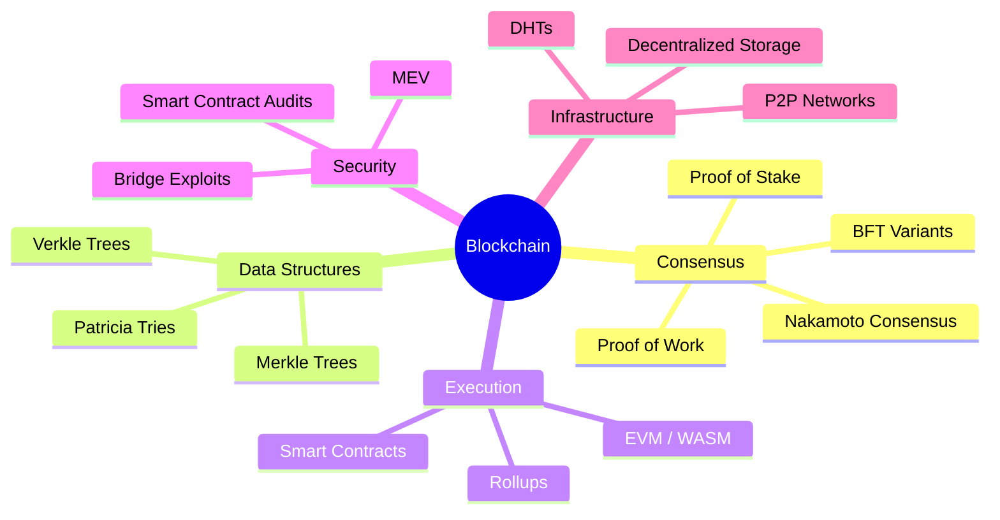

# Blockchain & Decentralized Systems

## Overview

Blockchain technology enables trustless, decentralized computation across networks of mutually distrustful participants. What began as Bitcoin's distributed ledger has evolved into a rich ecosystem of consensus protocols, smart contract platforms, rollup architectures, and decentralized infrastructure. Understanding blockchain internals is now essential for roles in fintech, infrastructure engineering, distributed systems, and cryptographic research.

## Why This Section Matters for Interviews

Blockchain interviews span a unique intersection of distributed systems, cryptography, game theory, and systems engineering. You may encounter blockchain questions for roles at:

- **Protocol teams**: Ethereum Foundation, Solana Labs, Cosmos, Avalanche
- **Infrastructure**: Alchemy, Infura, QuickNode, Chainstack
- **DeFi/CEX**: Coinbase, Binance, Uniswap Labs, Aave
- **Enterprise**: Chainlink, Polygon, Arbitrum, Optimism
- **General SWE**: Any company exploring Web3 or distributed trust

## Section Map

| File | Topics | Key Systems |
|------|--------|-------------|
| [Consensus Mechanisms](./consensus-mechanisms.md) | PoW, PoS, BFT, HotStuff, Tendermint | Bitcoin, Ethereum, Cosmos |
| [Ethereum Internals](./ethereum-internals.md) | State trie, rollups, sharding, Verkle trees | Ethereum, L2s, EIPs |
| [Blockchain Security](./blockchain-security.md) | Reentrancy, bridges, MEV, consensus attacks | DeFi, cross-chain, oracles |
| [Decentralized Infrastructure](./decentralized-infra.md) | IPFS, DHTs, DID, modular blockchains | IPFS, Filecoin, Cosmos SDK |

## Core Concepts at a Glance

## Key Trade-offs

| Dimension | Centralized | Decentralized |
|-----------|-------------|---------------|
| **Throughput** | 10K–1M TPS | 10–100K TPS (with L2s) |
| **Finality** | Milliseconds | Seconds to minutes |
| **Censorship resistance** | Low | High |
| **Operational cost** | OPEX | Token economics / gas |
| **Data availability** | Controlled | Erasure-coded / DAS |

## Prerequisites

- [Distributed Consensus](../distributed/consensus/README.md) — Raft, Paxos, BFT foundations
- [Cryptography](../cryptography/README.md) — Hashing, digital signatures, PKI
- [Distributed Systems](../interview/system-design/consistency-patterns.md) — CAP theorem, consistency models

## Interview Preparation Strategy

1. **Know the classic results cold**: Nakamoto consensus, PBFT, the impossibility trilemma
2. **Understand Ethereum deeply**: State transition function, gas mechanics, EIP-4844, EIP-1559
3. **Be able to compare**: PoW vs PoS trade-offs, optimistic vs ZK rollups, monolithic vs modular
4. **Think in attacks**: Reentrancy, front-running, bridge exploits, data withholding
5. **Connect to fundamentals**: How blockchain consensus relates to FLB/PBFT, how Merkle trees relate to content-addressed storage
