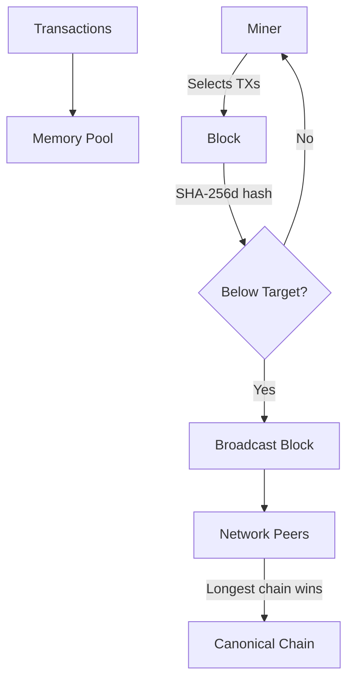
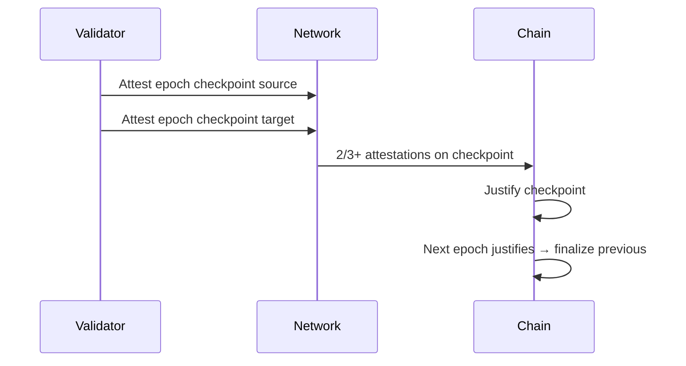
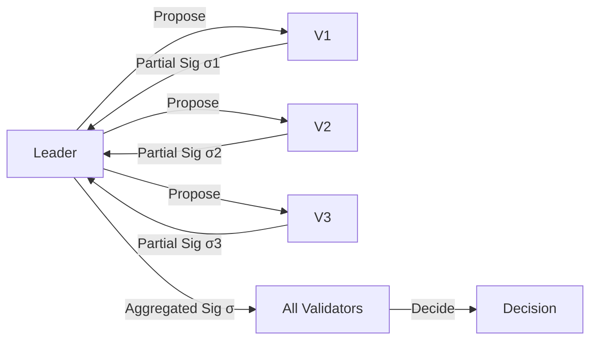
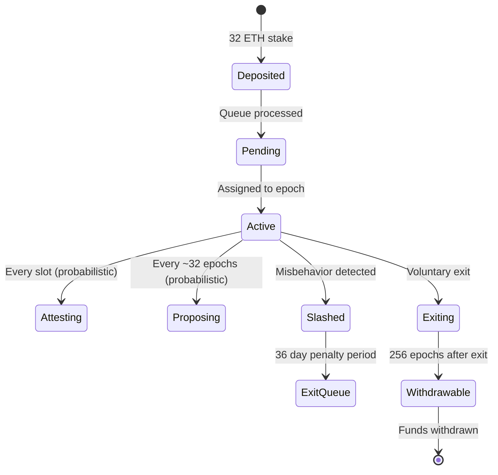

# Consensus Mechanisms

## Overview

Consensus mechanisms are the core algorithmic foundation of blockchain networks. They determine how independent, potentially adversarial nodes agree on a single canonical chain of transactions. Unlike traditional distributed consensus (Raft, Paxos) which assumes known, bounded participants, blockchain consensus operates in permissionless environments where anyone can join and identities are pseudonymous.

## Nakamoto Consensus

### The Bitcoin Model

Satoshi Nakamoto's 2008 whitepaper introduced a radical departure from classical BFT consensus. Rather than relying on voting among known identities, Nakamoto consensus ties block proposal rights to computational work, creating an economic cost for participation.

### Key Properties

- **Probabilistic finality**: Confirmations accumulate over time; 6 blocks (~1 hour) is the conventional "safe" threshold for Bitcoin.
- **Longest chain rule**: When forks occur, nodes adopt the chain with the most cumulative work (not strictly the most blocks).
- **Difficulty adjustment**: Bitcoin retargets difficulty every 2016 blocks to maintain a ~10-minute block time. The formula is: `new_target = old_target * (actual_time / expected_time)`.
- **Uncle blocks**: Ethereum (pre-merge) included uncle blocks with reduced rewards to mitigate centralization pressure from high orphan rates.

> **Interview Angle**: "Why doesn't Bitcoin use PBFT?" — PBFT requires known participants (n ≤ 3f+1) and O(n²) message complexity. Bitcoin's permissionless setting has no identity set, and the network is too large for quadratic messaging.

## Proof of Work (PoW)

### How It Works

Miners search for a nonce such that `SHA256(SHA256(header)) < target`. The header includes the Merkle root of transactions, previous block hash, timestamp, and difficulty target. The expected number of hashes is proportional to `2^(difficulty_bits)`.

### Mining Hardware Evolution

| Generation | Hardware | Hash Rate | Energy Efficiency |
|------------|----------|-----------|-------------------|
| CPU | Intel Core i7 | ~10 MH/s | ~1,000 J/GH |
| GPU | NVIDIA RTX 4090 | ~150 MH/s | ~1 J/GH |
| FPGA | Xilinx VU9P | ~1 GH/s | ~0.5 J/GH |
| ASIC | Antminer S21 | ~200 TH/s | ~0.017 J/TH |

### Selfish Mining

Selfish mining is a strategy where a miner with significant hash power (≥1/3 of total) withholds found blocks to gain disproportionate advantage. By selectively publishing blocks to split the network's mining power, the selfish miner earns more than their fair share of rewards. This demonstrates that Nakamoto consensus is not incentive-compatible for all hash power distributions.

## Proof of Stake (PoS)

### Core Idea

Instead of expending computational energy, validators lock ("stake") economic capital as collateral. Misbehavior results in slashing — partial or full confiscation of the stake. This transforms the security model from burning electricity to putting skin in the game.

### Casper FFG (Ethereum's Finality Gadget)

Ethereum's transition from PoW to PoS (The Merge, Sept 2022) implemented Casper FFG as the consensus layer combined with the existing execution layer (formerly Ethash PoW).

**Key parameters**:
- **Epoch**: 32 slots (~6.4 minutes), each slot is 12 seconds
- **Committee size**: At least 128 validators per committee, randomly selected via RANDAO + VDF
- **Quorum**: 2/3 of total staked ETH must attest for finality
- **Slashing conditions**: Surround vote (attesting to conflicting checkpoints) and double vote are slashable offenses

### LMD-GHOST (Latest Message Driven Greedy Heaviest Observed Subtree)

LMD-GHOST is the fork-choice rule used alongside Casper FFG. When multiple chain heads exist, LMD-GHOST selects the head with the most accumulated attestations by weight (stake), recursively descending through the tree. This ensures the chain with the strongest support grows.

## Delegated Proof of Stake (DPoS)

### Mechanism

Token holders vote for a fixed set of delegates (typically 21–101) who run block-producing nodes. Delegates are periodically rotated based on vote weight. This trades decentralization for throughput and finality speed.

### Systems Using DPoS

| System | Delegates | Block Time | Finality | Throughput |
|--------|-----------|------------|----------|------------|
| EOS | 21 block producers | 0.5s | Instant (after 2/3+ BP confirm) | ~4,000 TPS |
| Lisk | 101 delegates | 10s | 101 confirmations | ~100 TPS |
| Tron | 27 SRs | 3s | 19/27 SR signatures | ~2,000 TPS |
| Steem | 21 witnesses | 3s | Instant (after majority) | ~10,000 TPS |

> **Interview Angle**: "What's the centralization trade-off with DPoS?" — A small fixed set of validators means a DDoS attack only needs to target 21 nodes to halt the chain. Vote buying and plutocracy are also concerns since voting power is proportional to token holdings.

## BFT Consensus Variants

### Practical BFT (PBFT)

PBFT tolerates f Byzantine faults with 3f+1 nodes across three phases: pre-prepare, prepare, and commit. It requires O(n²) messages per consensus round, limiting scalability to ~100 nodes. Used as the theoretical foundation for many modern BFT variants.

### HotStuff

HotStuff (used in Meta's Diem/Libra) reduces BFT's three-phase commit to a linear communication pattern using threshold signatures. The leader proposes, validators respond with partial signatures, and an aggregated signature serves as proof of agreement.

**Pipelining**: HotStuff pipes three consensus rounds together (prepare, pre-commit, commit) so that the leader drives O(n) messages per round rather than O(n²). This is critical for throughput at scale.

**Variants**:
- **HotStuff-1**: Linear communication, 3 round-trips (BFT safety)
- **HotStuff-2**: 2 round-trips with optimistic fast path
- **Fast-HotStuff**: 1 round-trip when the leader is honest (best case)

### Tendermint

Tendermint (used in Cosmos SDK chains) is a BFT consensus protocol optimized for proof-of-stake networks with known validator sets. It features instant finality — once a block is committed, it cannot be reverted (unlike Nakamoto's probabilistic finality).

**Tendermint consensus rounds**:
1. **Propose**: Designated proposer broadcasts a block
2. **Prevote**: Validators broadcast prevote for the proposed block (or nil)
3. **Precommit**: If 2/3+ prevotes for same block, validators broadcast precommit
4. **Commit**: If 2/3+ precommits, block is committed

If no block reaches 2/3+ precommits in a round, the protocol advances to the next round with a new proposer (deterministic round-robin based on validator set and block height).

## Ethereum Consensus Deep Dive

### Execution Layer vs Consensus Layer

Post-Merge Ethereum splits into two layers:

| Layer | Role | Client Software |
|-------|------|-----------------|
| Execution Layer (EL) | Runs EVM, processes transactions, manages state | Geth, Nethermind, Besu, Erigon |
| Consensus Layer (CL) | Manages validators, attestations, finality, sync | Lighthouse, Prysm, Lodestar, Nimbus, Teku |

The two layers communicate via the Engine API — a JSON-RPC interface where the CL tells the EL which blocks to build on, and the EL returns block bodies with execution results.

### Validator Lifecycle

### RANDAO + VDF for Randomness

Ethereum uses RANDAO (a commit-reveal scheme where validators contribute entropy) augmented with a Verifiable Delay Function (VDF) to prevent the last contributor from manipulating randomness. The VDF is a sequential computation that takes a minimum wall-clock time, making precomputation infeasible.

## Comparison Table

| Property | PoW (Bitcoin) | PoS (Ethereum) | BFT (Tendermint) | DPoS (EOS) | HotStuff |
|----------|---------------|-----------------|-------------------|------------|----------|
| **Finality** | Probabilistic | Probabilistic + Gasper | Instant | Instant | Instant |
| **Fault tolerance** | < 50% hash power | < 33% stake | < 33% validators | < 33% delegates | < 33% validators |
| **Validator count** | Unlimited | ~900K | ~100–200 | 21 | ~100 |
| **Message complexity** | O(1) per block | O(n) attestations | O(n²) | O(n) | O(n) |
| **Energy consumption** | Very high | Negligible | Negligible | Negligible | Negligible |
| **Throughput** | ~7 TPS | ~15–30 TPS (L1) | ~10K TPS | ~4K TPS | ~100K TPS |
| **Decentralization** | High | High | Medium | Low | Medium |

## Interview Questions

### Q1: What happens to Ethereum if 34% of validators go offline?

The chain cannot finalize new checkpoints (requires 2/3+ attestation), but it continues to produce blocks via LMD-GHOST fork choice. Blocks are still proposed and included, but no new epoch becomes justified or finalized. This is a liveness failure without a safety failure — the chain keeps producing blocks but without the guarantee that they won't be reverted. Once validators come back online, finality resumes.

### Q2: Why did Ethereum switch from PoW to PoS?

Three primary reasons: (1) **Energy efficiency** — PoS reduces energy consumption by ~99.95%; (2) **Security** — PoS enables slashing as an explicit punishment mechanism, whereas PoW's only cost is wasted electricity; (3) **Foundation for sharding** — PoS's known validator set is a prerequisite for random committee selection in sharded designs.

### Q3: How does HotStuff achieve O(n) communication?

By using threshold signatures. Instead of each validator sending messages to all others (O(n²)), each sends a partial signature to the leader only (O(n)). The leader aggregates these into a single combined signature using BLS or Schnorr threshold cryptography, then broadcasts one message to all (O(n)). Total: O(n) per round.

### Q4: Compare longest-chain vs BFT finality.

Longest-chain (Nakamoto) is probabilistic — a block's confirmation probability increases with depth but never reaches 1. BFT provides immediate, cryptographic finality once 2/3+ validators commit. The trade-off is that BFT requires known validator sets and more communication overhead, while Nakamoto works in permissionless settings with minimal per-block communication.

## Related Topics

- [Distributed Consensus](../distributed/consensus/README.md) — Classical consensus algorithms
- [Ethereum Internals](./ethereum-internals.md) — Execution layer, state trie, rollups
- [Blockchain Security](./blockchain-security.md) — Consensus attacks, slashing
- [Cryptography](../cryptography/README.md) — Hashing, signatures, VDFs
