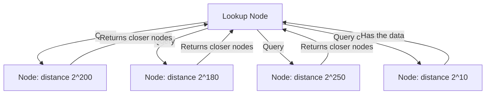
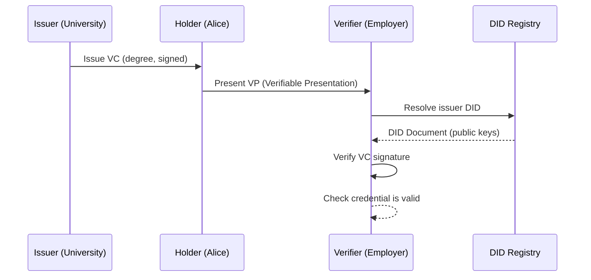
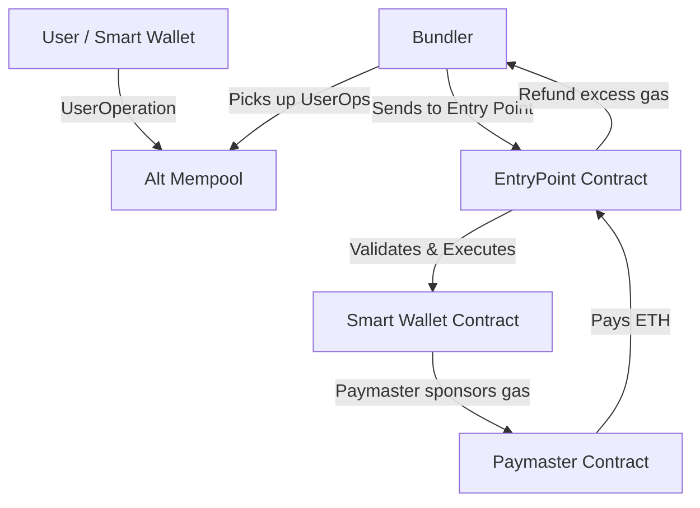
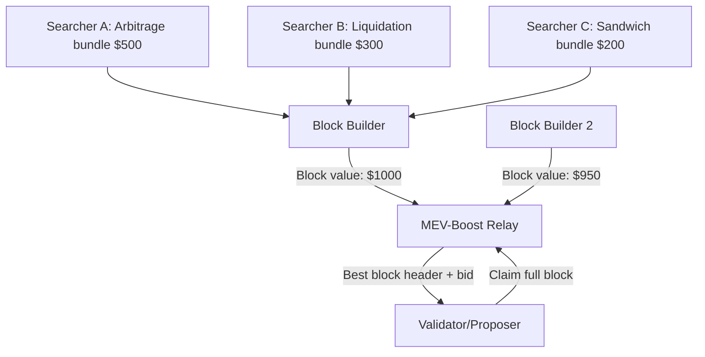

# Decentralized Infrastructure

## Overview

Decentralized infrastructure extends blockchain principles beyond ledgers to storage, identity, compute, and interoperability. This layer provides the building blocks for trustless applications — from content-addressed file storage (IPFS) to decentralized identity (DID) to modular blockchain architectures. Understanding these primitives is essential for designing systems that operate without centralized points of failure.

## Distributed Ledgers

### Ledger Models

| Model | Description | Examples |
|-------|-------------|----------|
| **UTXO** | Each transaction consumes inputs and creates outputs; no account state | Bitcoin, Cardano |
| **Account** | Global state maps addresses to balances and data | Ethereum, Solana |
| **DAG-based** | Transactions reference previous transactions in a directed acyclic graph | IOTA (Tangle), Sui, Aptos |
| **Key-value** | Append-only log of key-value operations with Merkle proofs | Ceramic, ComposeDB |

The UTXO model offers better parallelism (independent UTXOs can be processed concurrently) and clearer privacy semantics, while the account model simplifies smart contract state management. DAG-based ledgers attempt to achieve both high throughput and finality by removing the linear chain structure.

## Decentralized Storage

### IPFS (InterPlanetary File System)

IPFS is a peer-to-peer hypermedia protocol that uses content-addressing to store and retrieve data. Files are addressed by their cryptographic hash (CID — Content Identifier), not by their location. This makes data immutable and verifiable — any change to the content produces a different CID.

```
Content: "Hello, World!"
SHA-256: dffd6021bb2bd5b0af676290809ec3a53191dd81c7f70a4b28688a362182986f
CID (v0): QmTp2hEo8... (base58 encoded multihash)
CID (v1): bafybeig... (includes multicodec + multihash)
```

**How IPFS stores data**:
1. File is split into 256 KB chunks (using the same Rabin fingerprinting as Git)
2. Each chunk is hashed and stored as a DAG node
3. Nodes form a Merkle DAG (DAG with multiple parents allowed)
4. The root CID uniquely identifies the file and all its chunks
5. Nodes advertise which CIDs they hold via the DHT

**Limitations**: IPFS provides *addressing* but not *persistence*. Data is only available while at least one peer is actively pinning (caching) it. For permanent storage, you need Filecoin, Arweave, or a pinning service like Pinata.

### Filecoin

Filecoin adds a crypto-economic incentive layer on top of IPFS. Storage providers (miners) earn FIL tokens for storing data and prove they're doing so via Proof of Spacetime (PoSt) and Proof of Replication (PoRep).

| Proof | Purpose | How It Works |
|-------|---------|--------------|
| **PoRep (Proof of Replication)** | Proves data was uniquely encoded to a sector | Uses SEAL (slow, sequential encoding) to create a unique replica. Only the holder who performed the encoding can generate valid proofs. |
| **PoSt (Proof of Spacetime)** | Proves data is still stored over time | Prover must respond to random challenges on sealed sectors within a time window. Uses Window PoSt (daily, one sector at a time) and Winning PoSt (every ~30s for block eligibility). |

### Content-Addressed Networks

Content-addressing provides several unique properties:

- **Deduplication**: Identical content has identical CIDs — no redundant storage
- **Verifiability**: Downloaded content can be verified against the expected hash
- **Censorship resistance**: No central server to block; data spreads organically
- **Integrity**: Tampering changes the CID, making corruption immediately detectable

## Peer-to-Peer Overlays and DHTs

### How P2P Networks Organize

P2P networks use overlay networks — logical topologies built on top of the physical internet. Instead of every node connecting to every other node (O(n²)), overlay networks provide efficient routing with O(log n) connections per node.

### Kademlia DHT

Kademlia is the distributed hash table algorithm used by IPFS (via libp2p's Kademlia DHT, or "KadDHT"). It maps keys to values across a decentralized network.

**XOR Metric**: Kademlia measures distance between node IDs using XOR: `distance(A, B) = A XOR B`. This metric has the property that each bit position represents a distinct region of the key space, and XOR is symmetric (`d(A,B) = d(B,A)`) and triangular.

**Routing**: Node IDs and content keys share the same 256-bit space. Each node maintains a routing table of 256 "k-buckets," where bucket `i` contains up to `k` nodes whose distance falls in the range `[2^i, 2^(i+1))`. To look up a key, a node queries the closest known nodes, iteratively refining until the closest nodes are reached.



**Kademlia operations**:
- **PUT(key, value)**: Find the `k` nodes closest to `key`, send store requests
- **GET(key)**: Find the closest nodes, recursively query until the value is found or closest nodes are exhausted
- **Complexity**: O(log² n) messages for lookup in the worst case

### libp2p

libp2p is a modular networking stack used by IPFS, Filecoin, Ethereum (consensus layer), and many other blockchain networks. It provides:

| Module | Function |
|--------|----------|
| **Transport** | TCP, WebSocket, QUIC, WebTransport |
| **Encryption** | Noise protocol (TLS replacement) |
| **Peer Discovery** | Kademlia DHT, mDNS, bootstrap nodes |
| **Multiplexing** | Yamux (stream multiplexing over single connection) |
| **NAT Traversal** | AutoNAT, UPnP, hole punching via relay (circuit v2) |
| **PubSub** | Gossipsub (epidemic broadcast for block/tx propagation) |

## Decentralized Identity (DID)

### What Are DIDs?

Decentralized Identifiers (DIDs) are globally unique, self-owned identifiers that don't require a centralized registration authority. A DID document describes the DID subject and contains verification methods (public keys) for authentication.

```
did:method:specific-identifier

Examples:
did:ethr:0xabcdef1234567890abcdef1234567890abcdef12
did:key:z6MkhaXgBZDvotDkL5257faiztiGiC2QtKLGpbnnEGta2doK
did:web:example.com:user:alice
did:ion:EiAnKD8-jfdd0MDcZUjAbRgaThBrMxPTFOxcnfJhI7O6WQ
```

### Verifiable Credentials (VCs)

Verifiable Credentials are digitally signed claims about a subject, issued by an authoritative party. The holder presents the credential to a verifier who checks the issuer's signature.



**VC structure (simplified)**:
```json
{
  "@context": ["https://www.w3.org/2018/credentials/v1"],
  "type": ["VerifiableCredential", "UniversityDegreeCredential"],
  "issuer": "did:ethr:0xUniversityKey...",
  "issuanceDate": "2024-01-01T00:00:00Z",
  "credentialSubject": {
    "id": "did:ethr:0xAliceKey...",
    "degree": {"type": "BachelorDegree", "name": "Computer Science"}
  },
  "proof": {
    "type": "EcdsaSecp256k1RecoveryMethod2020",
    "created": "2024-01-01T00:00:00Z",
    "proofPurpose": "assertionMethod",
    "verificationMethod": "did:ethr:0xUniversityKey...#key-1",
    "jws": "eyJhbGciOiJFUzI1Nk..."
  }
}
```

## Threshold Signatures and MPC Wallets

### Threshold Signatures

Threshold signatures allow `t`-of-`n` parties to jointly produce a single signature without any party ever learning the full private key. The signature is indistinguishable from one produced by a single key holder.

| Scheme | Properties | Use Cases |
|--------|-----------|-----------|
| **T-ECDSA** | Threshold version of ECDSA, widely supported | Fireblocks, Coinbase Custody |
| **T-BLS** | Aggregatable — n signatures combine into 1 | Ethereum validator attestations |
| **T-EdDSA** | Threshold EdDSA (Ed25519) | Solana, Cardano validators |
| **FROST** | Flexible Round-Optimized Schnorr Threshold | General-purpose, post-quantum variants |

### MPC Wallets

MPC (Multi-Party Computation) wallets split the private key across multiple parties using secure multi-party computation. No single party ever holds the full key, eliminating the single point of failure of traditional key storage.

**Key generation ceremony**: Multiple compute nodes run a distributed key generation (DKG) protocol. Each node ends up with a key share. The corresponding public key is known, but the private key never exists in any single location.

**Signing**: To sign a transaction, `t`-of-`n` key shares participate in an MPC signing protocol. The result is a valid signature that can be verified against the known public key.

> **Interview Angle**: "How is an MPC wallet different from a multi-sig?" — A multi-sig requires multiple on-chain signatures, each visible in the transaction data and costing separate gas. An MPC wallet produces a single signature indistinguishable from a regular transaction — the threshold is enforced off-chain. MPC is cheaper (one gas cost), private (participants aren't visible on-chain), and more flexible (support for any signature scheme).

## Account Abstraction

### EIP-4337: Account Abstraction via Alt Mempool

EIP-4337 enables smart contract wallets to be first-class citizens without requiring consensus-layer changes. It introduces a UserOperation that goes through a separate alt mempool and is bundled by "bundlers" into standard transactions.



**Key components**:
- **UserOperation**: Partial transaction describing the intent (sender, call data, gas limits, paymaster)
- **EntryPoint**: Singleton contract that handles validation and execution of UserOperations
- **Bundler**: Off-chain actor that aggregates UserOperations into a single transaction (MEV opportunity)
- **Paymaster**: Optional contract that sponsors gas fees for users (enabling gasless UX)
- **Smart Wallet**: User's account contract that can implement custom logic (multisig, session keys, social recovery, daily spending limits)

**Capabilities unlocked**:
- **Gasless transactions**: Paymasters sponsor gas, users pay with ERC-20 tokens or nothing
- **Batched transactions**: Multiple operations in a single UserOperation
- **Session keys**: Temporary keys for specific dApps without approving each transaction
- **Social recovery**: Replace lost signers through trusted contacts (e.g., 3-of-5 social guardians)
- **Automated actions**: Scheduled transfers, subscription payments, limit orders

## Smart Contract VMs

### EVM (Ethereum Virtual Machine)

The EVM is a stack-based, 256-bit word machine. It's quasi-Turing-complete — gas metering ensures all programs terminate. Key characteristics:

| Property | Value |
|----------|-------|
| Architecture | Stack-based (1024 max depth) |
| Word size | 256 bits (32 bytes) |
| Memory model | Volatile memory (expanding), storage (persistent), calldata (read-only) |
| Gas metering | ~3-25 gas per opcode; block gas limit ~30M |
| Bytecode | 1 byte per opcode, up to 24576 bytes per contract (EIP-170) |

### WASM Blockchains

WebAssembly (WASM) is emerging as an alternative to the EVM for smart contract execution, offering multi-language support (Rust, C++, Go, AssemblyScript), near-native performance, and a richer standard library.

| Feature | EVM | WASM |
|---------|-----|------|
| Languages | Solidity, Vyper | Rust, C++, Go, AssemblyScript |
| Performance | ~15M gas/sec on Geth | 5-20x faster than EVM |
| Determinism | Guaranteed by design | Requires deterministic floats, system calls |
| Tooling | Mature (Hardhat, Foundry, Slither) | Growing (cargo-contract, ewasm) |
| Bytecode size | 24 KB max | Larger, but more efficient |
| Adoption | Ethereum, BSC, Polygon, Avalanche C-Chain | Polkadot (pallets), Cosmos (CosmWasm), Near, Flow |

CosmWasm is the most widely deployed WASM smart contract platform, running on 50+ Cosmos SDK chains. It compiles Rust to WASM with a deterministic subset, providing a secure sandbox with metered execution.

## Blockchain Indexing and Analytics

### The Indexing Problem

Blockchain data is stored as raw, unindexed logs. Queries like "find all NFT transfers for address X" require scanning millions of blocks. Indexers transform raw chain data into queryable formats.

| Indexer | Architecture | Query Language | Use Case |
|---------|-------------|----------------|----------|
| **The Graph** | Subgraphs (manifest + mappings) | GraphQL | DeFi dashboards, NFT marketplaces |
| **Goldsky** | Mirror (real-time data streaming) | SQL, GraphQL | Analytics, data pipelines |
| **Envio** | Rust-based, event-driven | GraphQL | High-performance indexing |
| **Ponder** | TypeScript framework | GraphQL | Developer-friendly indexing |
| **Alloy/etherscan APIs** | Direct RPC + caching | REST/JSON-RPC | Simple lookups |

### The Graph Protocol

The Graph uses a decentralized network of indexers who stake GRT tokens and earn query fees. Developers write subgraphs — manifest files that define which events to index and how to transform them into entities.

```graphql
# Example: Track all ERC-20 transfers for a token
type Transfer @entity {
  id: Bytes!           # tx hash + log index
  from: Bytes!         # sender address
  to: Bytes!           # recipient address
  value: BigInt!       # amount
  blockTimestamp: BigInt!
}
```

## MEV Auctions and Decentralized Sequencing

### MEV Auctions

MEV auctions (e.g., Flashbots Protect, MEV-Boost) move transaction ordering from a dark-forest race to a transparent auction. Searchers bid for inclusion of their bundles, and block builders compete for the right to produce the most valuable block.



### Shared Sequencers

Sequencers (entities that order and produce L2 blocks) are currently centralized per rollup. Shared sequencers propose a single entity that sequences transactions across multiple rollups, enabling:

- **Cross-rollup atomicity**: Transactions that span multiple L2s can be atomically ordered
- **Sequencer decentralization**: Rollups don't need to bootstrap their own validator sets
- **MEV smoothing**: MEV is distributed across rollups rather than concentrated in one

**Projects**: Espresso Systems, Astria, Radius are building shared sequencer networks that use threshold decryption or encrypted mempools to prevent sequencer censorship and front-running.

## Modular Blockchains

### The Modular Thesis

Modular blockchains decompose the traditional monolithic blockchain stack into specialized layers, each optimized for a specific function:

| Layer | Function | Examples |
|-------|----------|----------|
| **Execution** | Process transactions, run smart contracts | Rollups (Optimism, Arbitrum, zkSync), Celestia + Sovereign Rollups |
| **Settlement** | Provide finality guarantees, dispute resolution | Ethereum L1, Optimism OP Stack, Polygon CDK |
| **Consensus** | Order transactions, produce blocks | Ethereum PoS, Tendermint, shared sequencers |
| **Data Availability** | Ensure transaction data is retrievable | Celestia, EigenDA, Avail, Ethereum (EIP-4844) |

### The Celestia Model

Celestia is a data availability layer that provides blob storage for sovereign rollups — rollups that define their own execution and settlement rules but use Celestia purely for DA.

```
Monolithic:  [Execution + Settlement + Consensus + DA] — one chain
Modular:    [Execution (rollup)] + [Settlement (optional)] + [DA (Celestia)] + [Consensus (Celestia)]
```

### Interoperability

| Protocol | Type | Security Model |
|----------|------|----------------|
| **IBC (Cosmos)** | Relayer-based with on-chain light clients | Trust-minimized (verifies headers on-chain) |
| **LayerZero** | Oracle + relayer (Ultra Light Node) | Trust in oracle + relayer (2-of-2 trust) |
| **Wormhole** | Guardian network + ZK proofs | Trusted guardian set (19 validators) |
| **Hyperlane** | Permissionless interchain mailboxes | Sovereign security per chain |
| **CCIP (Chainlink)** | Risk management network + on-chain routers | Decentralized DON verification |

### Decentralized Compute

| Network | Model | Use Case |
|---------|-------|----------|
| **Golem** | P2P marketplace for compute | Rendering, ML inference |
| **Akash Network** | DeCloud for containerized workloads | Hosting, CI/CD, API services |
| **iExec** | Off-chain computation with on-chain results | Confidential computing, TEE-based |
| **Livepeer** | Decentralized video transcoding | Video streaming infrastructure |
| **Render Network** | GPU rendering network | 3D rendering, AI training |

Decentralized compute networks use a request-bid model where compute providers (workers) stake tokens, accept jobs, and submit verifiable results. Verifiers check a subset of results, and misbehaving workers are slashed. This creates a trustless marketplace for computation, though latency and reliability remain challenges compared to centralized cloud providers.

## Interview Questions

### Q1: How does content-addressing in IPFS relate to Git's object model?

Both use content-addressed storage where the hash of the content is the identifier. Git stores blobs, trees, and commits each addressed by SHA-1 (migrating to SHA-256). IPFS uses CIDs that wrap multihashes (supporting SHA-256, BLAKE3, etc.) with multicodec metadata. Both split large files into chunks and organize them as DAGs. The key difference is that IPFS's DAG is a Merkle DAG (allows multiple parents for deduplication) and is designed for distributed retrieval, while Git's DAG is commit-oriented and designed for version control.

### Q2: What's the problem with centralized sequencers in rollups?

Centralized sequencers create three risks: (1) **Censorship** — the sequencer can refuse to include transactions; (2) **MEV extraction** — the sequencer sees all transactions before ordering them, enabling front-running; (3) **Liveness failure** — if the sequencer goes down, the rollup halts. Shared sequencers and forced-inclusion mechanisms (L1 force-inclusion via Smart Contract Wallet) are the proposed mitigations.

### Q3: Compare account abstraction via EIP-4337 vs native account abstraction.

EIP-4337 achieves account abstraction at the application layer (smart contracts) without consensus changes. Native account abstraction (originally proposed as EIP-2938) would modify the protocol itself to natively support smart contract accounts. EIP-4337 is a pragmatic compromise — it works today but adds overhead (bundlers, alt mempool, EntryPoint). Native AA would be more efficient but requires a hard fork and is more complex to specify.

## Related Topics

- [Consensus Mechanisms](./consensus-mechanisms.md) — BFT consensus, validator sets, PBS
- [Ethereum Internals](./ethereum-internals.md) — Rollups, data availability, EVM
- [Blockchain Security](./blockchain-security.md) — Bridge security, oracle attacks
- [Distributed Systems](../interview/system-design/) — CAP theorem, consistency patterns
- [Cryptography](../cryptography/README.md) — Threshold signatures, ZK proofs, hashing