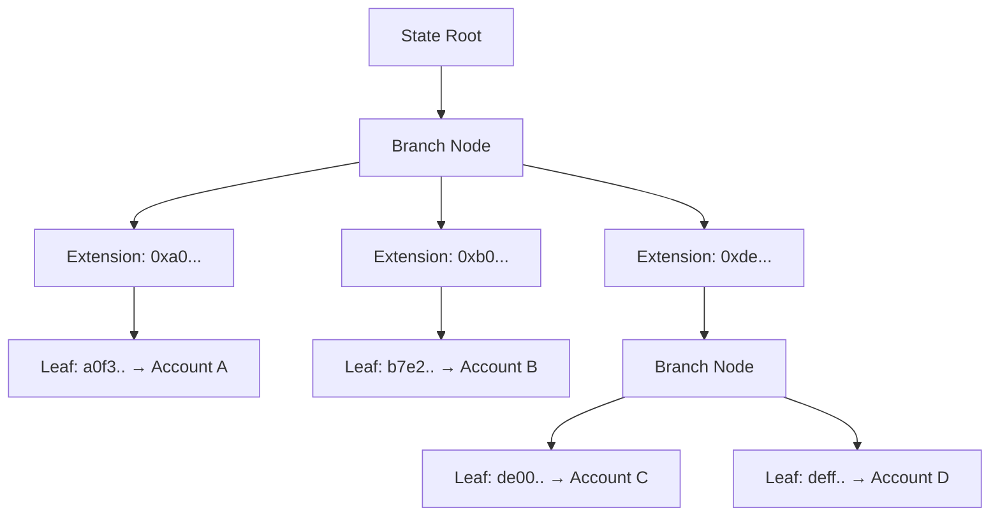
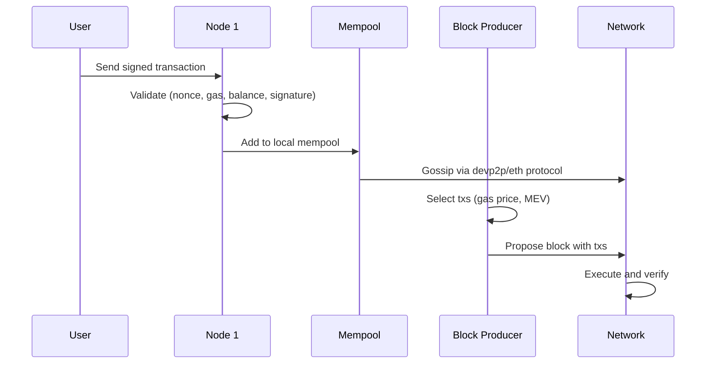
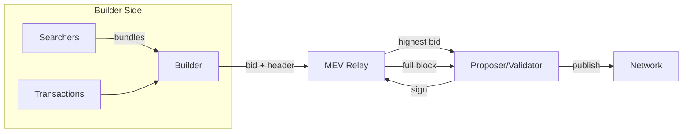

# Ethereum Internals

## Overview

Ethereum is a stateful, account-based blockchain with a Turing-complete virtual machine (EVM). Unlike Bitcoin's UTXO model, Ethereum maintains a global state that maps addresses to account objects (nonce, balance, storage root, code hash). Understanding Ethereum's internals requires grasping its data structures (Merkle Patricia tries), state management, transaction lifecycle, and the scaling roadmap centered on rollups and data availability.

## Ethereum State Trie

### Account-Based State

Every Ethereum address has an associated Account object:

```
Account {
    nonce:     uint256  // transaction count for EOA, deployment count for contracts
    balance:   uint256  // wei balance
    storage_root:  Hash  // root of the contract's storage trie (empty for EOAs)
    code_hash:  Hash    // hash of contract bytecode (empty for EOAs)
}
```

The global state is a single Modified Merkle Patricia Trie (MPT) that maps 20-byte addresses to RLP-encoded account objects. The state root hash is stored in every block header, creating a cryptographic commitment to the entire world state.

### State Trie Structure



## Merkle Patricia Tries

### Three Node Types

| Node Type | Purpose | Encoding |
-----------|---------|----------|
| **Leaf** | Terminal node, contains value | `[encoded_path, value]` with hex-prefix even flag = 2 |
| **Extension** | Compresses shared path prefix | `[encoded_path, next_node_hash]` with hex-prefix even flag = 0 |
| **Branch** | 16-ary branching node | `[branch_0..branch_15, value]` — 17-element array |

### Hex-Prefix Encoding

Hex-prefix (HP) encoding encodes nibbles (half-bytes) into bytes while embedding two flag bits in the terminator nibble:
- **Odd-length path**: First nibble is `3` (flags: odd=1, terminator=1)
- **Even-length path**: First two nibbles are `00` (flags: odd=0, terminator=0) or `20` (flags: odd=0, terminator=1)

This compact encoding avoids an extra byte to store parity and termination flags.

### Path Compression

When multiple keys share a common prefix, the trie compresses them into a single extension node pointing to the divergent branch node. This is critical for Ethereum's key space where addresses share common prefixes (e.g., all addresses starting with `0x7a...`). Without compression, trie depth would be 64 levels (for 32-byte keys); with compression, average depth is much lower.

## Blockchain Storage

### LevelDB / Key-Value Layout

Ethereum clients store trie nodes in a key-value database (LevelDB in Geth, RocksDB in Erigon). The storage layout includes:

| Key Prefix | Content |
|------------|---------|
| `"secure-key-" + hash` | Trie node by hash (content-addressed) |
| `"a" + address` | Account data (canonical hash lookup) |
| `"s" + address + hash` | Contract storage slot |
| `"l" + txHash` | Transaction receipt |
| `"h" + blockNum` | Block header |
| `"b" + blockHash` | Block body |
| `"t" + txHash + blockHash + index` | Transaction lookup |

### Pruning and Archive Nodes

- **Pruned nodes**: Delete trie nodes for old states once a state is no longer needed for reorgs (saves ~90% disk space).
- **Archive nodes**: Keep all historical state forever (~15+ TB as of 2024). Required for reorgs beyond the last 128 blocks and for querying historical state.

### Snap Sync vs Full Sync

| Mode | What It Downloads | Time | Disk Usage |
|------|-------------------|------|-------------|
| Full sync | All blocks + execute all transactions | Days | Archive-level |
| Snap sync | Block headers + state snapshots + recent blocks | Hours | ~2 TB |
| Light sync | Block headers only | Minutes | ~GB |

## Transaction Propagation and Mempools

### Transaction Lifecycle



### Mempool Design

Ethereum's mempool is a peer-local structure — there is no global mempool. Each node maintains its own transaction pool, typically organized as a priority queue sorted by effective gas price. Geth uses a `txpool` with three sub-pools:

- **Pending**: Transactions with valid nonce sequences, ready for inclusion
- **Queued**: Transactions whose nonce is too high (gap in the nonce sequence)
- **BaseFee**: Transactions below current base fee (held for potential fee drops)

### EIP-1559 Fee Market

EIP-1559 introduced a base fee that is burned (not paid to block producers) and adjusts block-to-block based on congestion. Users also specify a priority fee (tip) paid directly to the validator.

```
effective_gas_price = base_fee + min(max_priority_fee_per_gas, max_fee_per_gas - base_fee)

// Base fee adjustment (EIP-1559):
if gas_used > target_gas_used:
    base_fee = base_fee * (1 + (gas_used - target) / target / base_fee_max_change_denominator)
else:
    base_fee = base_fee * (1 - (target - gas_used) / target / base_fee_max_change_denominator)
```

The max change per block is 12.5% (denominator = 8), targeting 15M gas per block.

## MEV (Maximal Extractable Value)

### What Is MEV?

MEV refers to value that block producers can extract by ordering, including, or excluding transactions within the blocks they produce. This includes arbitrage, sandwich attacks, liquidations, and NFT sniping.

### Types of MEV

| Type | Description | Example |
|------|-------------|---------|
| **Arbitrage** | Profit from price differences across DEXs | Buy on Uniswap, sell on SushiSwap |
| **Sandwich** | Front-run + back-run a user's swap | Place buy order before victim, sell after |
| **Liquidation** | Execute undercollateralized loan liquidations | Aave/Compound liquidation rewards |
| **Just-in-time liquidity** | Add liquidity right before a large swap | Extract fee + price impact |

### Proposer-Builder Separation (PBS)

PBS separates the roles of block building (ordering transactions, maximizing value) and block proposing (choosing the highest-value block). This reduces the technical burden on validators while democratizing MEV extraction.



**MEV-Boost** (implemented post-Merge) is the current PBS infrastructure. Builders submit block bodies to relays (trusted intermediaries), proposers see only the header and bid, then request the full block after signing. This prevents builders from withholding blocks and forces competition.

## Rollups

### Why Rollups?

Rollups execute transactions off-chain (L2) and post compressed transaction data or proofs on-chain (L1). This leverages L1 for data availability and security while achieving 10–100x throughput improvements. Rollups are the centerpiece of Ethereum's scaling roadmap.

### Optimistic Rollups

Optimistic rollups (Optimism, Arbitrum, Base) assume transactions are valid by default and provide a 7-day challenge window during which anyone can submit a fraud proof to dispute incorrect execution.

**Architecture**:
1. Sequencer orders transactions and produces L2 blocks
2. Batch submitter posts compressed transaction data to L1 via calldata (EIP-4844 blobs)
3. If fraud is suspected, a verifier posts a fault proof triggering on-chain re-execution
4. If no challenge within the challenge period, state is considered final

**Trade-offs**: Low on-chain computation cost, but withdrawal delays of ~7 days. Fraud proofs use interactive verification (Arbitrum's multi-round challenge) or single-round verification (Optimism's Cannon/ZK fraud proofs).

### ZK Rollups

ZK rollups (zkSync, StarkNet, Polygon zkEVM, Scroll) generate a validity proof (SNARK or STARK) for each batch of transactions. The proof attests that state transitions were computed correctly, and the L1 contract verifies the proof in constant time regardless of batch size.

```mermaid
flowchart TD
    TXS[L2 Transactions] --> SEQ[Sequencer]
    SEQ --> EXEC[Execute Off-chain]
    EXEC --> PROVER[Generate ZK Proof]
    PROVER --> PROOF[Validity Proof ~200KB]
    DATA[Compressed TX Data] --> L1[L1 Contract]
    PROOF --> L1
    L1 -->|Verify proof| STATE[Update L2 State Root on L1]
```



**SNARK vs STARK**:

| Property | SNARK | STARK |
|----------|-------|-------|
| **Trusted setup** | Required (toxic waste problem) | None (transparent) |
| **Proof size** | ~200 bytes | ~50–200 KB |
| **Verification** | Very fast (few ms) | Fast, but larger constant |
| **Quantum resistance** | No (pairing-based) | Yes (hash-based) |
| **Used by** | zkSync, Polygon zkEVM | StarkNet, StarkEx |

### EIP-4844 (Proto-Danksharding)

EIP-4844 introduced "blob-carrying transactions" — a new transaction type that carries large data blobs (128 KB each, up to 6 per block) at ~100x cheaper cost than calldata. Blobs are stored in the beacon chain for ~18 days (4096 epochs) and are not accessible from the EVM, making them purely for L2 data availability. This is the prerequisite for full Danksharding.

## Data Availability and DAS

### The Data Availability Problem

If a rollup posts transaction data to L1, validators must ensure the data is actually available (not withheld). If data is unavailable, the rollup's state becomes unreconstructible — a critical safety failure.

### Data Availability Sampling (DAS)

Instead of downloading all blob data, light clients randomly sample a small number of chunks (using 2D Reed-Solomon encoding). If any sample fails, the client rejects the block. With enough sampling clients, the probability of undetected data withholding drops exponentially.

```
P(miss) = (1 - p)^k
where p = fraction of nodes sampling, k = number of samples

Example: 1000 samplers, 30 samples each, 50% data missing
P(miss) = (0.5)^30000 ≈ 10^(-9039)
```

### Erasure-Coded Blockchains

Block data is extended using 2D Reed-Solomon encoding, expanding an n×n data matrix into 2n×2n (doubling the data). Any n² chunks suffice to reconstruct the original data. This redundancy enables DAS — light clients only need to verify k randomly chosen chunks to have high confidence in full availability.

## Light and Stateless Clients

### The State Size Problem

Ethereum's state is over 100 GB and growing. Full validation requires the entire state. This creates a centralization pressure — only well-resourced nodes can fully validate.

### Stateless Clients

Stateless clients receive state access proofs (witnesses) alongside blocks. A witness contains all trie nodes needed to verify the block's state transitions — typically a few hundred KB per block rather than 100+ GB of state. The client verifies Merkle proofs for each accessed state element without storing any state.

### Verkle Trees

Verkle (Vector Commitment) trees replace 32-byte hashes in Merkle Patricia tries with 32-byte vector commitments. This reduces witness sizes from ~4 KB per accessed element to ~128 bytes — a 32x improvement.

```
Witness size comparison for a block touching 1000 accounts:
  Merkle Patricia Trie:  ~4 MB
  Verkle Tree:           ~128 KB
  Improvement:           ~32x
```

Verkle trees use Pedersen commitments over elliptic curves, enabling proofs of inclusion for any leaf without revealing the full path. They maintain the same structure as Merkle trees but with much wider branching (typically 256-ary instead of binary), enabled by polynomial commitments that prove membership in a set of 256 children with a single group element.

## Blockchain Sharding

### What Is Sharding?

Sharding splits the blockchain's state and transaction processing into multiple parallel partitions (shards), each processed by a different subset of validators. This is the horizontal scaling approach — each shard handles a fraction of the total load.

### Ethereum's Sharding Roadmap

Ethereum pivoted from "state sharding" (splitting execution across shards) to "data sharding" (Danksharding). The insight was that rollups already provide execution scaling; L1's role is data availability, not execution.

| Era | Approach | Status |
|-----|----------|--------|
| Original (v1.0 plan) | 64 execution shards with cross-shard communication | Abandoned |
| Proto-danksharding | Blob transactions, ~0.5 MB/block extra data | Implemented (EIP-4844, March 2024) |
| Full Danksharding | ~16 MB/block blobs, DAS with KZG commitments | Roadmap |

> **Interview Angle**: "Why did Ethereum abandon execution sharding for rollups + data sharding?" — Execution sharding requires complex cross-shard communication, creates composability challenges, and splits validator attention. Rollups provide execution scaling with better composability. The L1's role shifts to being a data availability and settlement layer, which is simpler to shard.

### KZG Polynomial Commitments

KZG (Kate-Zaverucha-Goldberg) commitments are used for blob data availability in EIP-4844. The data is encoded as a polynomial, and a single group element commitment (48 bytes) commits to the entire polynomial. Individual evaluations can be proved without revealing the full polynomial.

```solidity
// Simplified KZG verification (conceptual)
function verifyKZG(
    G1Point commitment,  // 48 bytes - commitment to polynomial
    G1Point proof,       // 48 bytes - evaluation proof  
    G2Point x,           // 96 bytes - evaluation point
    Fr y                 // 32 bytes - claimed evaluation
) internal view returns (bool) {
    // Verify: P(x) = y using pairing check
    // e(commitment - y, G2_generator) == e(proof, x - generator)
    return pairing(commitment - y*G1, G2_gen) == pairing(proof, x - G2_gen);
}
```

## Interview Questions

### Q1: Why does Ethereum use Patricia tries instead of simple Merkle trees?

Patricia tries support efficient proofs of non-inclusion (proving a key does not exist) via the branching structure. They also provide path compression for shared prefixes, reducing proof sizes. Simple Merkle trees would require 2^256 leaves to cover the full address space, which is infeasible.

### Q2: How does EIP-4844 reduce L2 costs?

Before EIP-4844, rollups posted transaction data via calldata at ~16 gas/byte. Blob data costs ~1 gas/byte and has a separate fee market with its own base fee. This reduces per-transaction L2 costs by 10-100x. The blobs are pruned after 18 days, so there's no permanent storage burden.

### Q3: What's the difference between optimistic and ZK rollups?

Optimistic rollups assume validity and rely on a 7-day challenge period with fraud proofs. ZK rollups generate cryptographic validity proofs verified on-chain. ZK rollups offer faster finality (minutes vs days) and stronger security guarantees (no assumption about honest challengers), but proof generation is computationally expensive and EVM-equivalence is harder to achieve.

## Related Topics

- [Consensus Mechanisms](./consensus-mechanisms.md) — PoS, Casper FFG, validator lifecycle
- [Blockchain Security](./blockchain-security.md) — Reentrancy, MEV attacks, bridge exploits
- [Decentralized Infrastructure](./decentralized-infra.md) — Modular blockchains, rollup infrastructure
- [ZK Proofs](../cryptography/zk-proofs.md) — SNARKs, STARKs, polynomial commitments
