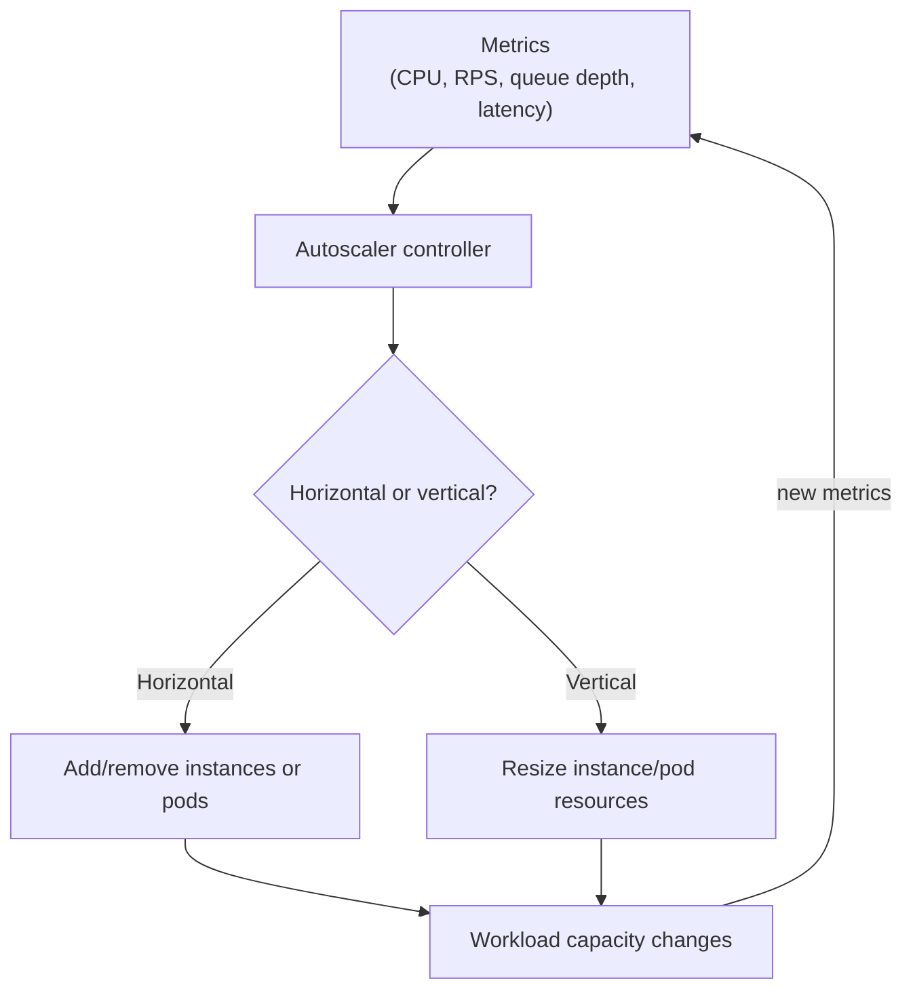
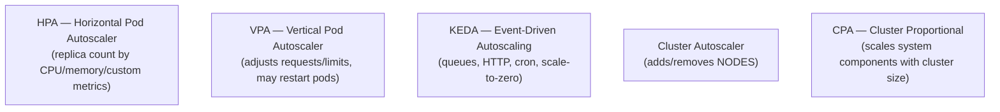

# Autoscaling

## Overview

**Autoscaling** automatically adjusts the amount of compute (VMs, containers, serverless invocations) serving a workload in response to demand. Done right, it keeps latency SLOs while minimizing idle capacity — the core of the cloud promise "pay for what you use."

There are two fundamentally different knobs:

- **Horizontal scaling (scale out/in)** — change the *number* of instances/pods.
- **Vertical scaling (scale up/down)** — change the *size* (CPU/memory) of each instance.



## Vertical vs Horizontal

| | Horizontal (scale out) | Vertical (scale up) |
|---|---|---|
| What changes | Number of instances | Size of each instance |
| Works for | Stateless services, web tiers, workers | Databases, stateful workloads, legacy apps |
| Limit | None practical (add nodes) | Single machine's max size |
| Failover | Easy (replicas) | Harder (one big instance) |
| Cost model | Linear per instance | Step function per size |
| Cloud examples | K8s HPA, AWS ASG, EC2 Auto Scaling | Resize VM type, K8s VPA, RDS instance class |

Rule of thumb: **prefer horizontal for stateless web tiers; vertical for stateful systems** (a database can't easily "add replicas" without replication complexity).

## Cloud Autoscaling (AWS / Azure / GCP)

| Service | What it scales | Signal |
|---|---|---|
| **EC2 Auto Scaling Groups (ASG)** | EC2 instances | CPU, requests, custom CloudWatch metrics |
| **Application Auto Scaling** | ECS tasks, DynamoDB capacity, Lambda | Per-service metrics |
| **Azure VM Scale Sets + autoscale** | VMs | CPU, queue, custom metrics |
| **GCP Managed Instance Groups** | VMs | CPU, load balancing utilization |
| **AWS Lambda / serverless** | Invocations (implicit) | Request rate, concurrency |

Key concepts:

- **Target tracking** — "keep average CPU at 50%"; the autoscaler continuously adjusts.
- **Step scaling / scheduled scaling** — step changes by threshold; predict known peaks (Black Friday, business hours).
- **Cooldown / stabilization** — wait before scaling again to avoid oscillation.
- **Min/max limits** — safety bounds; scale-to-zero only where appropriate.

## Kubernetes Autoscaling



| Component | Scales | Signal | Scale-to-zero? |
|---|---|---|---|
| **HPA** | Pod replicas | CPU/memory/custom/external metrics | No (min 1) |
| **VPA** | Pod requests/limits | Resource utilization | N/A (recommendations) |
| **KEDA** | Pod replicas (extends HPA) | External events (queue depth, HTTP RPS, cron) | **Yes** |
| **Cluster Autoscaler** | Nodes | Pending pods (insufficient capacity) | No |
| **CPA** | System components (CoreDNS etc.) | Cluster size (nodes/cores) | No |

### HPA basics

```yaml
apiVersion: autoscaling/v2
kind: HorizontalPodAutoscaler
metadata:
  name: api-hpa
spec:
  scaleTargetRef:
    apiVersion: apps/v1
    kind: Deployment
    name: api
  minReplicas: 2
  maxReplicas: 20
  metrics:
    - type: Resource
      resource:
        name: cpu
        target:
          type: Utilization
          averageUtilization: 60
```

HPA computes `desiredReplicas = ceil(currentReplicas × currentMetric / targetMetric)` and applies **stabilization windows** to avoid thrashing. Important nuance: **CPU is a lagging signal** (scrape + aggregation + sync ≈ 45s+), so latency-sensitive services should bake headroom into the target (e.g., 50% not 80%) and add an over-provisioning buffer for the cluster-autoscaler bootstrap window.

### KEDA (event-driven)

KEDA doesn't replace HPA — it **feeds external metrics into HPA** and adds the missing pieces:

- Scale **0 → 1** (wake up) and **1 → 0** (scale to zero) for event-driven workers.
- 70+ built-in **scalers**: Kafka lag, RabbitMQ/SQS queue depth, Prometheus, cron schedules, HTTP request rate.
- The 1 → N scaling decision still goes through HPA's algorithm.

**Choose HPA alone** for straightforward CPU/memory-driven web tiers; **add KEDA** for queue-driven workers, batch jobs, or anything needing scale-to-zero.

## Common Failure Modes

1. **Oscillation / thrashing** — autoscaler fights itself (adds then removes). Fix: stabilization windows, cooldowns, hysteresis.
2. **HPA + VPA feedback loop** — VPA raises requests → utilization drops → HPA scales in → per-pod load rises → VPA raises further. Use VPA in `Off`/`Initial` (recommendation-only) mode with HPA.
3. **Scaling on the wrong metric** — CPU is a proxy; queue depth or RPS may be the real signal. Throttled CPUs look underloaded (a blind spot).
4. **Cold-start / bootstrap latency** — a new pod/node isn't ready instantly; a traffic spike outpaces scaling. Mitigate: min replicas, warm pools, predictive scaling, headroom targets.
5. **Scaling a stateful workload horizontally** — replicas that share a DB are fine; replicas with local state cause inconsistency.

## Interview Questions

### Q: How does Kubernetes HPA decide how many replicas to run?

HPA polls metrics (CPU/memory utilization or custom/external metrics) and computes `desired = ceil(current × current/target)`. Stabilization windows smooth noisy metrics, `minReplicas`/`maxReplicas` bound it, and the controller reconciles the Deployment's replica count. With external metrics, KEDA feeds queue-depth etc. into the same algorithm.

### Q: Why is CPU a bad autoscaling signal for latency-sensitive services?

CPU utilization is a **lagging, smoothed proxy**: metrics-server scrapes + aggregates with ~45s+ delay, and a throttled pod can look underloaded. A sudden traffic spike hits p99 latency long before CPU crosses the threshold. Use near-real-time signals (request rate, queue depth) or bake headroom into the target and keep warm capacity for the scale-up window.

### Q: What is the difference between HPA and Cluster Autoscaler?

HPA scales the **application** (pod replica count) based on workload metrics. Cluster Autoscaler scales the **infrastructure** (number of nodes) when pods are pending because the cluster lacks capacity — it reacts to unschedulable pods, not application load. They complement each other: HPA needs nodes to land new pods on, and CA provides them.

### Q: When would you use KEDA over plain HPA?

When the scaling signal lives **outside the cluster** (Kafka lag, SQS depth, HTTP rate, cron) or you need **scale-to-zero** for event-driven/batch workloads. KEDA brings those metrics into the metrics API and lets HPA drive 1→N; KEDA itself handles 0→1 wake-ups and 1→0 shutdowns.

## References

- AWS: EC2 Auto Scaling documentation — https://docs.aws.amazon.com/autoscaling/
- Kubernetes: Horizontal Pod Autoscaling — https://kubernetes.io/docs/tasks/run-application/horizontal-pod-autoscale/
- Kubernetes: Vertical Pod Autoscaling — https://github.com/kubernetes/autoscaler/tree/master/vertical-pod-autoscaler
- KEDA documentation — https://keda.sh/docs/
- Kubernetes: Cluster Autoscaler — https://github.com/kubernetes/autoscaler/tree/master/cluster-autoscaler

## Related Topics

- [Kubernetes Deployments](./kubernetes/deployments.md) — what HPA scales
- [Cloud Overview](./overview.md) — elasticity and scalability
- [Serverless and Lambda](./aws/lambda.md) — implicit autoscaling
- [Load Balancing](../networks/load-balancing/README.md) — distributing load across scaled instances
- [Distributed Systems: Scaling](../distributed/overview.md) — scale-out patterns
- [Model Serving](../ml/system-design/model-serving.md) — autoscaling ML inference
