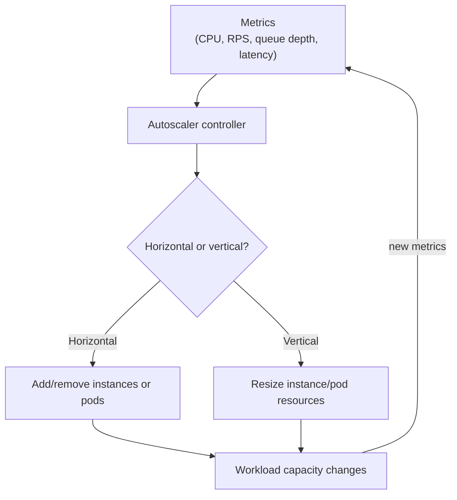
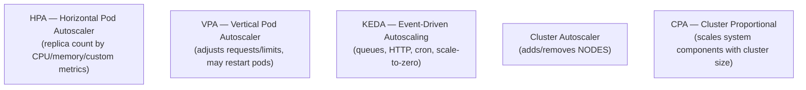
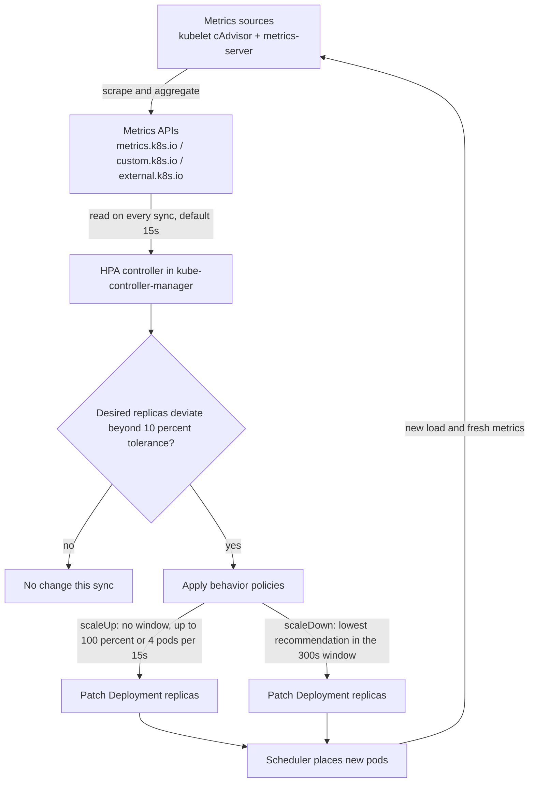
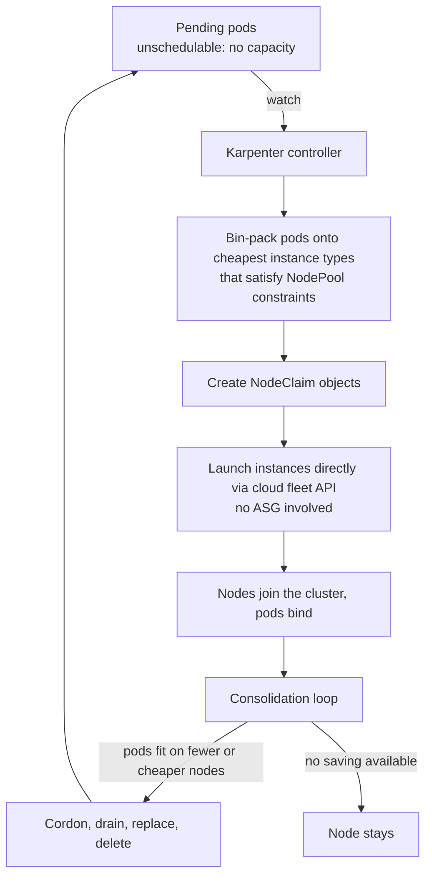

# Autoscaling

## Overview

**Autoscaling** automatically adjusts the amount of compute (VMs, containers, serverless invocations) serving a workload in response to demand. Done right, it keeps latency SLOs while minimizing idle capacity — the core of the cloud promise "pay for what you use."

There are two fundamentally different knobs:

- **Horizontal scaling (scale out/in)** — change the *number* of instances/pods.
- **Vertical scaling (scale up/down)** — change the *size* (CPU/memory) of each instance.


```mermaid
graph TD
    METRICS["Metrics<br/>(CPU, RPS, queue depth, latency)"] --> CONTROLLER["Autoscaler controller"]
    CONTROLLER --> DECIDE{"Horizontal or vertical?"}
    DECIDE -->|"Horizontal"| REPLICAS["Add/remove instances or pods"]
    DECIDE -->|"Vertical"| SIZE["Resize instance/pod resources"]
    REPLICAS --> SCALE["Workload capacity changes"]
    SIZE --> SCALE
    SCALE -->|"new metrics"| METRICS
```

## Vertical vs Horizontal

| | Horizontal (scale out) | Vertical (scale up) |
|---|---|---|
| What changes | Number of instances | Size of each instance |
| Works for | Stateless services, web tiers, workers | Databases, stateful workloads, legacy apps |
| Limit | None practical (add nodes) | Single machine's max size |
| Failover | Easy (replicas) | Harder (one big instance) |
| Cost model | Linear per instance | Step function per size |
| Cloud examples | K8s HPA, AWS ASG, EC2 Auto Scaling | Resize VM type, K8s VPA, RDS instance class |

Rule of thumb: **prefer horizontal for stateless web tiers; vertical for stateful systems** (a database can't easily "add replicas" without replication complexity).

### Multi-Dimensional Scaling

Real fleets combine the knobs: HPA scales replicas, VPA right-sizes requests, Cluster Autoscaler/Karpenter scale nodes. The combinations interact — see [Common Failure Modes](#common-failure-modes) for the HPA+VPA feedback loop. Kubernetes 1.27+ added **in-place pod vertical scaling** (changing CPU/memory requests without a restart, alpha→beta path), which removes the VPA restart cost but still requires nodes with spare capacity, so vertical moves remain bounded by the node footprint. In practice most teams run HPA + VPA (recommendation-only) + a node autoscaler, and reserve multi-dimensional coupling for platforms that reconcile all three in one controller.

## Cloud Autoscaling (AWS / Azure / GCP)

| Service | What it scales | Signal |
|---|---|---|
| **EC2 Auto Scaling Groups (ASG)** | EC2 instances | CPU, requests, custom CloudWatch metrics |
| **Application Auto Scaling** | ECS tasks, DynamoDB capacity, Lambda | Per-service metrics |
| **Azure VM Scale Sets + autoscale** | VMs | CPU, queue, custom metrics |
| **GCP Managed Instance Groups** | VMs | CPU, load balancing utilization |
| **AWS Lambda / serverless** | Invocations (implicit) | Request rate, concurrency |

Key concepts:

- **Target tracking** — "keep average CPU at 50%"; the autoscaler continuously adjusts.
- **Step scaling / scheduled scaling** — step changes by threshold; predict known peaks (Black Friday, business hours).
- **Cooldown / stabilization** — wait before scaling again to avoid oscillation.
- **Min/max limits** — safety bounds; scale-to-zero only where appropriate.

### Predictive and Scheduled Scaling

Reactive scaling always trails demand by at least one metrics-pipeline-plus-boot-time round trip, so platforms add feed-forward paths. **Scheduled scaling** handles deterministic seasonality: business hours, daily batch windows, marketing events — set capacity ahead of time via cron-like rules instead of waiting for a threshold. **Predictive scaling** (AWS ASG predictive scaling, GCP MIG predictive autoscaling) fits a forecast model (typically a seasonal decomposition over weeks of CloudWatch/monitoring history) and pre-provisions capacity ahead of the predicted curve — the right tool for strongly diurnal traffic, useless for genuinely random spikes. When boot times are long (GPU nodes minutes-long, see [Cold-Start Economics](#cold-start-economics)), **warm pools** (ASG warm pools, pre-initialized instances in `Stopped`/`Hibernated` state) and over-provisioning buffers close the gap; the deeper forecasting methodology lives in [Workload Forecasting](../sre/workload-forecasting.md) and [Capacity Planning](../sre/capacity-planning.md), and the scheduler's view of the same problem in [Cloud Scheduling](./advanced/cloud-scheduling.md).

## Kubernetes Autoscaling


```mermaid
graph TD
    HPA["HPA — Horizontal Pod Autoscaler<br/>(replica count by CPU/memory/custom metrics)"]
    VPA["VPA — Vertical Pod Autoscaler<br/>(adjusts requests/limits, may restart pods)"]
    KEDA["KEDA — Event-Driven Autoscaling<br/>(queues, HTTP, cron, scale-to-zero)"]
    CA["Cluster Autoscaler<br/>(adds/removes NODES)"]
    CP["CPA — Cluster Proportional<br/>(scales system components with cluster size)"]
```

| Component | Scales | Signal | Scale-to-zero? |
|---|---|---|---|
| **HPA** | Pod replicas | CPU/memory/custom/external metrics | No (min 1) |
| **VPA** | Pod requests/limits | Resource utilization | N/A (recommendations) |
| **KEDA** | Pod replicas (extends HPA) | External events (queue depth, HTTP RPS, cron) | **Yes** |
| **Cluster Autoscaler** | Nodes | Pending pods (insufficient capacity) | No |
| **CPA** | System components (CoreDNS etc.) | Cluster size (nodes/cores) | No |

### HPA basics

```yaml
apiVersion: autoscaling/v2
kind: HorizontalPodAutoscaler
metadata:
  name: api-hpa
spec:
  scaleTargetRef:
    apiVersion: apps/v1
    kind: Deployment
    name: api
  minReplicas: 2
  maxReplicas: 20
  metrics:
    - type: Resource
      resource:
        name: cpu
        target:
          type: Utilization
          averageUtilization: 60
```

HPA computes `desiredReplicas = ceil(currentReplicas × currentMetric / targetMetric)` and applies **stabilization windows** to avoid thrashing. Important nuance: **CPU is a lagging signal** (scrape + aggregation + sync ≈ 45s+), so latency-sensitive services should bake headroom into the target (e.g., 50% not 80%) and add an over-provisioning buffer for the cluster-autoscaler bootstrap window.

### HPA Mechanics: the Metrics Pipeline and Behavior Control

HPA never scrapes pods itself. **Resource metrics** (`metrics.k8s.io`) come from **metrics-server**, a cluster add-on that scrapes kubelets/cAdvisor every ~15-60s, aggregates in memory only (no persistence, no alerting-grade data), and serves short rolling windows. **Custom and external metrics** (`custom.metrics.k8s.io`, `external.metrics.k8s.io`) are served by adapter APIServices — the Prometheus adapter, or KEDA's metrics adapter — that translate arbitrary monitoring queries into the API the HPA can read. Every hop adds latency: scrape interval → aggregation → HPA sync period (default 15s) → Deployment reconciliation → pod scheduling → pod boot. End-to-end, a CPU-driven scale-out typically lands 1-2 minutes after the load arrived.

Three controls tame the noise, all expressed in the HPA `behavior` block: **Tolerance** — HPA ignores deviations under 10% (default) of the target; without it, replica counts flapping by ±1 around the target would be constant. **Stabilization window (scale-down)** — HPA remembers recommended replica counts for the last 300s (default) and applies the *lowest* one, so a 30-second traffic dip cannot shed capacity. **Scale-up/down policies** — rate limits per period (percent or pod count): defaults are deliberately asymmetric, with scale-up fast (no stabilization window, up to 100% growth or +4 pods per 15s, whichever allows more) and scale-down slow.


```mermaid
graph TD
    SRC["Metrics sources<br/>kubelet cAdvisor + metrics-server"] -->|"scrape and aggregate"| API["Metrics APIs<br/>metrics.k8s.io / custom.k8s.io / external.k8s.io"]
    API -->|"read on every sync, default 15s"| HPA["HPA controller in kube-controller-manager"]
    HPA --> TOL{"Desired replicas deviate beyond 10 percent tolerance?"}
    TOL -->|"no"| HOLD["No change this sync"]
    TOL -->|"yes"| BEHAV["Apply behavior policies"]
    BEHAV -->|"scaleUp: no window, up to 100 percent or 4 pods per 15s"| UP["Patch Deployment replicas"]
    BEHAV -->|"scaleDown: lowest recommendation in the 300s window"| DOWN["Patch Deployment replicas"]
    UP --> SCHED["Scheduler places new pods"]
    DOWN --> SCHED
    SCHED -->|"new load and fresh metrics"| SRC
```

### KEDA (event-driven)

KEDA doesn't replace HPA — it **feeds external metrics into HPA** and adds the missing pieces:

- Scale **0 → 1** (wake up) and **1 → 0** (scale to zero) for event-driven workers.
- 70+ built-in **scalers**: Kafka lag, RabbitMQ/SQS queue depth, Prometheus, cron schedules, HTTP request rate.
- The 1 → N scaling decision still goes through HPA's algorithm.

**Choose HPA alone** for straightforward CPU/memory-driven web tiers; **add KEDA** for queue-driven workers, batch jobs, or anything needing scale-to-zero.

### KEDA Deep Dive: ScaledObjects, Activation, and Scale-to-Zero

A **scaler** is a small poller that converts an external system's state into one number (Kafka partition lag, SQS `ApproximateNumberOfMessagesVisible`, Redis list length, a Prometheus query). The operator watches **ScaledObject** CRDs, and for each one manages an HPA whose `external.metrics` source is KEDA's adapter — which is why the 1→N math is still HPA's. The CRD carries the knobs:

```yaml
apiVersion: keda.sh/v1alpha1
kind: ScaledObject
metadata:
  name: order-worker
spec:
  scaleTargetRef:
    name: order-worker        # the Deployment KEDA manages
  minReplicaCount: 0          # scale-to-zero enabled
  maxReplicaCount: 30
  cooldownPeriod: 300         # idle seconds before 1 -> 0
  triggers:
    - type: kafka
      metadata:
        lagThreshold: "1000"       # target: drives 1 -> N
        activationThreshold: "50"  # below this the scaler is inactive -> 0
```

The two thresholds answer different questions. The **target threshold** (`lagThreshold`) defines "one replica's worth of work": with 5,000 lag KEDA wants 5 replicas. The **activation threshold** answers "is there any work at all": below it the scaler reports inactive, and KEDA lets HPA fall to `idleReplicaCount: 0` instead of `minReplicaCount` — that is the scale-to-zero mechanism. Scale-to-zero interlocks with cold starts: when the first event arrives, the pod must pull its image and boot before processing, while the queue keeps growing — so activation thresholds, admission control, and [backpressure](../backend/patterns/backpressure-pattern.md) design decide whether the wake-up is a graceful ramp or a [thundering herd](#scaling-limits-the-database-connection-ceiling).

## Karpenter: Node-Level Autoscaling

Cluster Autoscaler's model is ASG-centric: it simulates "would this pending pod fit in an ASG?" and asks the cloud provider to resize pre-defined groups. **Karpenter** (AWS, now a CNCF project) inverts this: it observes pending pods directly and provisions exactly-sized nodes just-in-time, with no ASG in the data path.

- **NodePool → NodeClaim → instance**: a NodePool (cluster-scoped) declares constraints — labels, taints, resource limits, expiry. For a batch of pending pods Karpenter computes the set of instance types that fit, bin-packs the pods, and creates **NodeClaims** that launch instances directly through the cloud fleet API (on AWS, `CreateFleet`) — choosing from dozens of instance types per decision rather than the 1-5 baked into an ASG.
- **Bin-packing, consolidation, interruption handling**: at provision time it picks the cheapest fitting type; after provisioning, the consolidation controller continuously looks for under-utilized nodes whose pods fit elsewhere, then cordons/drains/deletes them (rate-limited by disruption budgets) — capacity follows load down, not just up. It also watches Spot Interruption Notices, scheduled maintenance, and health events via EventBridge/SQS, draining affected nodes within the ~2-minute Spot notice window, with on-demand fallback ladders per NodePool.

| Dimension | Cluster Autoscaler | Karpenter |
|---|---|---|
| Granularity | Per-ASG, pre-defined instance types | Per-pod-set, any of 60+ instance types |
| Provisioning model | Resize existing ASGs (simulated fit) | Just-in-time NodeClaims via fleet API, no ASG |
| Consolidation | None (scale-in only when utilization drops group-wide) | Continuous: replaces under-utilized nodes, removes empty ones |
| Spot handling | ASG spot pools; capacity re-balancing hints | Native: per-node-type spot pricing, on-demand fallback, interruption queue |
| Scope | One config per ASG; multi-cloud via per-provider plugins | Cluster-wide NodePools; AWS, Azure, GCP/Alibaba alphas |
| Maturity | ~9 years, battle-tested | v1.0 in 2024; default on EKS, younger codebase |


```mermaid
graph TD
    PODS["Pending pods<br/>unschedulable: no capacity"] -->|"watch"| KARP["Karpenter controller"]
    KARP --> BINPACK["Bin-pack pods onto cheapest instance types<br/>that satisfy NodePool constraints"]
    BINPACK --> CLAIM["Create NodeClaim objects"]
    CLAIM --> LAUNCH["Launch instances directly via cloud fleet API<br/>no ASG involved"]
    LAUNCH --> JOIN["Nodes join the cluster, pods bind"]
    JOIN --> CONSOLIDATE["Consolidation loop"]
    CONSOLIDATE -->|"pods fit on fewer or cheaper nodes"| DRAIN["Cordon, drain, replace, delete"]
    DRAIN --> PODS
    CONSOLIDATE -->|"no saving available"| KEEP["Node stays"]
```

## Scaling Signals and Their Traps

| Signal | Leading or lagging | Traps |
|---|---|---|
| CPU utilization | Lagging | Scrape+aggregate delay; throttled CPUs look underloaded; GC pauses and compression bursts inflate it without user-visible load |
| RPS / request rate | Leading | Says nothing about cost per request; noise from retries and health checks; needs LB metrics, not pod CPU |
| Queue depth | Leading | The honest signal for workers, but "zero queue" is not always optimal (batching); couples you to one queue's semantics |
| p99 latency | Leading for SLOs | Noisy at low RPS (one slow request dominates); feedback loops if the autoscaler itself adds jitter; needs pre-aggregated histograms |
| Custom business metric (orders/min, msgs processed) | Cleanest | Requires instrumentation discipline; mapping business metric → capacity must be re-validated after code changes |

The pattern across every row: an autoscaling signal is a **proxy for "capacity vs demand"**, and each proxy degrades differently under interference (see [Noisy Neighbors](./noisy-neighbors.md)) — a co-tenant stealing CPU makes your CPU signal look *saturated* while a throttled one looks *idle*. Robust setups compound signals: scale out on queue depth or RPS (fast, leading), verify with utilization (cheap, lagging), and alert on the SLO itself.

## Scaling Limits: the Database Connection Ceiling

The least-bounded-looking tier hides the hardest ceiling. Every pod opens a connection pool (10-50 conns is typical), so a 100-replica scale-out demands 1,000-5,000 database connections — while a tuned Postgres realistically serves a few hundred (each connection is a process with MBs of overhead), and its own ability to scale vertically stops at one machine. The autoscaler happily produces replicas the data tier cannot absorb, and the first symptom is connection exhaustion and queue-time spikes *at the database*, not in the tier that scaled.

Three mitigations recur in production:

1. **Multiplex at the boundary** — PgBouncer/RDS Proxy style transaction pooling collapses thousands of client conns into hundreds of server conns, at the cost of session-state features (advisory locks, prepared statements need care). See [Connection Pooling](../backend/patterns/connection-pool-deep.md).
2. **Push back instead of scaling out** — admission control, [rate limiting](../backend/patterns/rate-limiting-pattern.md), and [backpressure](../backend/patterns/backpressure-pattern.md) convert "more demand than downstream capacity" into graceful degradation instead of a meltdown.
3. **Fix the elasticity mismatch structurally** — read replicas, caching, or a data store whose read path scales horizontally; otherwise cap `maxReplicas` at the number the DB can carry. The general lesson: **autoscaling the stateless tier only moves the queue** — design for the least elastic component, and read [Distributed Systems: Scaling](../distributed/overview.md) for the system-level view.

## Cold-Start Economics

Scale-to-zero trades boot latency for idle cost, and the trade is dominated by concrete numbers:

| Path | Typical cold start | Notes |
|---|---|---|
| Lambda (interpreted runtimes) | ~100 ms – 1 s | JVM/container images: seconds; SnapStart resumes from snapshot |
| Knative/new pod on existing node | ~1 – 30 s | Image pull dominates; pre-pulled images and sidecar caching cut it |
| New node via Cluster Autoscaler | ~1 – 10 min | Instance boot + node bootstrap + pod scheduling |
| GPU node + large model load | minutes | Image pull + CUDA init + multi-GB weight load before first token |

The economics are asymmetric. Serving steady traffic on always-on capacity may cost 30-50% more than scale-to-zero, but a cold start that drops requests during a traffic spike can cost far more in SLO breaches — so scale-to-zero belongs on batch, preview, and spiky-internal workloads, while SLO-bearing paths keep `minReplicas ≥ 1` plus warm pools for the boot window. Even Firecracker boots a microVM in ~125 ms, which is why serverless platforms can afford per-request isolation. Platform-level details live in [Advanced Serverless](./advanced/serverless.md), [Knative Serverless Internals](./advanced/knative-serverless-internals.md), and [AWS Lambda](./aws/lambda.md); the GPU variant's bill-side analysis in [TGI Serving](../llm/llm-serving/tgi.md) and [FinOps](../sre/finops-cloud-cost.md).

## Common Failure Modes

1. **Oscillation / thrashing** — autoscaler fights itself (adds then removes). Fix: stabilization windows, cooldowns, hysteresis.
2. **HPA + VPA feedback loop** — VPA raises requests → utilization drops → HPA scales in → per-pod load rises → VPA raises further. Use VPA in `Off`/`Initial` (recommendation-only) mode with HPA.
3. **Scaling on the wrong metric** — CPU is a proxy; queue depth or RPS may be the real signal. Throttled CPUs look underloaded (a blind spot).
4. **Cold-start / bootstrap latency** — a new pod/node isn't ready instantly; a traffic spike outpaces scaling. Mitigate: min replicas, warm pools, predictive scaling, headroom targets.
5. **Scaling a stateful workload horizontally** — replicas that share a DB are fine; replicas with local state cause inconsistency.
6. **Downstream capacity mismatch** — the stateless tier scales; the database or third-party API does not; connections exhaust and p99 spikes *there* (see the connection-ceiling section above). A related trap: KEDA's `minReplicaCount: 0` meeting an HPA or namespace policy that floors replicas at 1 — two controllers with different opinions of "minimum" flap the workload between them.

## Related Topics

- [Kubernetes Deployments](./kubernetes/deployments.md) — what HPA scales
- [Cloud Overview](./overview.md) — elasticity and scalability
- [Serverless and Lambda](./aws/lambda.md) — implicit autoscaling
- [Load Balancing](../networks/load-balancing/README.md) — distributing load across scaled instances
- [Distributed Systems: Scaling](../distributed/overview.md) — scale-out patterns
- [Model Serving](../ml/system-design/model-serving.md) — autoscaling ML inference
- [Noisy Neighbors](./noisy-neighbors.md) — interference that distorts autoscaling signals
- [Spot & Preemptible Instances](./spot-preemptible.md) — the capacity Karpenter/ASGs interrupt
- [Cloud Scheduling](./advanced/cloud-scheduling.md) — the scheduler-side capacity game
- [Capacity Planning](../sre/capacity-planning.md) — the human complement to reactive scaling
- [Workload Forecasting](../sre/workload-forecasting.md) — models behind predictive/scheduled scaling
- [Backpressure](../backend/patterns/backpressure-pattern.md) — pushing back instead of scaling out
- [Connection Pooling](../backend/patterns/connection-pool-deep.md) — the DB-connection ceiling

## Interview Questions

### Q: How does Kubernetes HPA decide how many replicas to run?

HPA polls metrics (CPU/memory utilization or custom/external metrics) and computes `desired = ceil(current × current/target)`. Stabilization windows smooth noisy metrics, `minReplicas`/`maxReplicas` bound it, and the controller reconciles the Deployment's replica count. With external metrics, KEDA feeds queue-depth etc. into the same algorithm.

### Q: Why is CPU a bad autoscaling signal for latency-sensitive services?

CPU utilization is a **lagging, smoothed proxy**: metrics-server scrapes + aggregates with ~45s+ delay, and a throttled pod can look underloaded. A sudden traffic spike hits p99 latency long before CPU crosses the threshold. Use near-real-time signals (request rate, queue depth) or bake headroom into the target and keep warm capacity for the scale-up window.

### Q: What is the difference between HPA and Cluster Autoscaler?

HPA scales the **application** (pod replica count) based on workload metrics. Cluster Autoscaler scales the **infrastructure** (number of nodes) when pods are pending because the cluster lacks capacity — it reacts to unschedulable pods, not application load. They complement each other: HPA needs nodes to land new pods on, and CA provides them.

### Q: When would you use KEDA over plain HPA?

When the scaling signal lives **outside the cluster** (Kafka lag, SQS depth, HTTP rate, cron) or you need **scale-to-zero** for event-driven/batch workloads. KEDA brings those metrics into the metrics API and lets HPA drive 1→N; KEDA itself handles 0→1 wake-ups and 1→0 shutdowns.

### Q: Karpenter vs Cluster Autoscaler — when does the difference actually show up?

CA resizes pre-defined ASGs, so its flexibility is the instance types you baked into each group, and it has no consolidation — nodes come back only when a whole group under-utilizes. Karpenter watches pending pods, bin-packs them across dozens of instance types, launches via the fleet API without an ASG, and continuously consolidates under-utilized nodes away. The gap shows up on heterogeneous or bursty fleets (GPU + CPU pools, Spot-heavy): faster scale-out from seconds-not-minutes provisioning, and real cost savings from consolidation and per-node Spot pricing. For a homogeneous, steady workload on one instance type, both converge to similar behavior and CA's maturity is worth more.

### Q: Your HPA scaled out 10x and the database fell over. What happened and what do you fix?

Each replica opened its pool (say 20 conns), so 100 replicas demanded 2,000 connections against a Postgres realistically serving a few hundred — the stateless tier scaled past the data tier's absolute ceiling. Immediate fixes: put PgBouncer/RDS Proxy in front for transaction-mode multiplexing, lower per-pod pool sizes, and cap `maxReplicas` at what the DB carries. Structural fixes: admission control ([rate limiting](../backend/patterns/rate-limiting-pattern.md), [backpressure](../backend/patterns/backpressure-pattern.md)) so excess demand waits instead of melting the boundary, plus read replicas or caching to give the read path real headroom. The interview point: autoscaling the tier in front of a bottleneck just relocates the queue — design for the least elastic component.

## Key Takeaways

- Autoscaling is closed-loop control over a laggy distributed system: total reaction time = metrics pipeline + decision sync + boot time, often 1-2+ minutes end-to-end.
- HPA math is trivial (`desired = ceil(current × current/target)`); the engineering is in behavior fields — 10% tolerance, 300s scale-down stabilization window, asymmetric up/down policies.
- Resource metrics (metrics-server) are cheap but lagging; custom/external metrics via adapters or KEDA bring leading signals (queue depth, RPS) at the cost of running the pipeline.
- KEDA = scalers (external signal → metric) + ScaledObject CRD + HPA for 1→N; its activation threshold is what makes scale-to-zero work.
- Karpenter replaces ASG-based node scaling with just-in-time NodeClaims, cross-type bin-packing, and continuous consolidation — biggest wins on heterogeneous/bursty fleets.
- The DB-connection ceiling is the classic scaling limit: replicas × pool size vs a stateful tier that cannot scale out — pool multiplexing, admission control, or structural read-path scaling.
- Scale-to-zero is a cost/SLO trade priced by cold-start numbers: ~100 ms serverless, ~1-30 s pods, ~1-10 min nodes, minutes for GPU+models — warm pools close the gap for SLO paths.

## References

- AWS: EC2 Auto Scaling documentation — https://docs.aws.amazon.com/autoscaling/
- Kubernetes: Horizontal Pod Autoscaling — https://kubernetes.io/docs/tasks/run-application/horizontal-pod-autoscale/
- Kubernetes: Vertical Pod Autoscaling — https://github.com/kubernetes/autoscaler/tree/master/vertical-pod-autoscaler
- KEDA documentation — https://keda.sh/docs/
- Kubernetes: Cluster Autoscaler — https://github.com/kubernetes/autoscaler/tree/master/cluster-autoscaler
