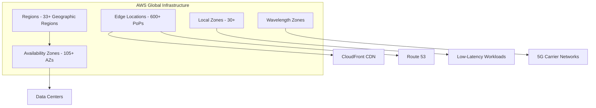
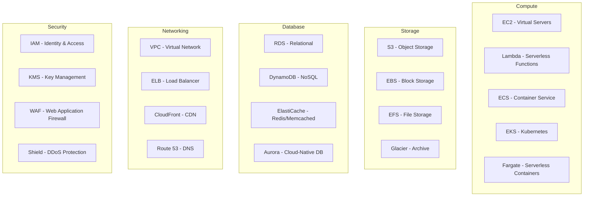
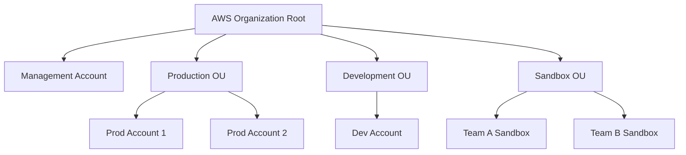
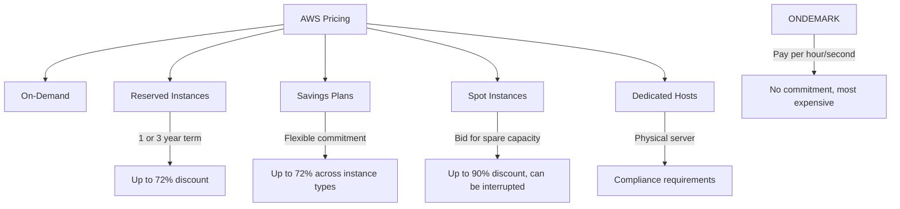
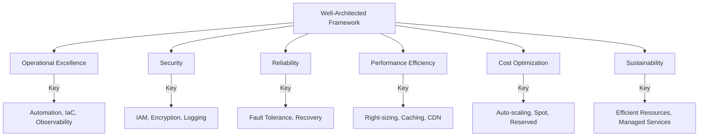

# Amazon Web Services (AWS)

## Introduction

Amazon Web Services (AWS) is the world's most comprehensive and broadly adopted cloud platform, launched in 2006. It offers over 200 fully featured services from data centers globally, serving millions of customers from startups to enterprises to government agencies.

## AWS Global Infrastructure



### Regions

A region is a geographic area with multiple, isolated Availability Zones:

| Region | Code | Location |
|--------|------|----------|
| US East (N. Virginia) | `us-east-1` | Virginia, USA |
| US West (Oregon) | `us-west-2` | Oregon, USA |
| Europe (Ireland) | `eu-west-1` | Dublin, Ireland |
| Asia Pacific (Tokyo) | `ap-northeast-1` | Tokyo, Japan |
| Asia Pacific (Mumbai) | `ap-south-1` | Mumbai, India |
| Asia Pacific (Singapore) | `ap-southeast-1` | Singapore |

**How to choose a region:**
1. **Latency**: Closest to your users
2. **Compliance**: Data sovereignty requirements (GDPR, data residency)
3. **Service availability**: Not all services in all regions
4. **Cost**: Prices vary by region

### Availability Zones (AZs)

- Physically separate data centers within a region
- Connected via low-latency, high-throughput networking (< 10ms between AZs)
- Each AZ has independent power, cooling, and physical security
- Designed for fault isolation—failure in one AZ doesn't affect others
- Deploy across multiple AZs for high availability

### Edge Locations

- CDN endpoints for CloudFront and Route 53
- 600+ points of presence globally
- Cache content close to users for low latency
- Used for DNS resolution (Route 53) and content delivery (CloudFront)

## Core Services Overview



## AWS Account Structure



**Multi-Account Strategy:**
- **Security**: Isolate environments (prod, dev, staging)
- **Billing**: Separate cost tracking per team/project
- **Compliance**: Different policies per account
- **Service Control Policies (SCPs)**: Organization-wide permission guardrails

## AWS Pricing Models



| Model | Discount | Commitment | Interruption Risk | Best For |
|-------|----------|------------|-------------------|----------|
| **On-Demand** | None | None | None | Short-term, unpredictable workloads |
| **Reserved (1yr)** | ~40% | 1 year | None | Steady-state workloads |
| **Reserved (3yr)** | ~60-72% | 3 years | None | Long-term predictable workloads |
| **Savings Plans** | Up to 72% | $/hr commitment | None | Flexible across instance types |
| **Spot** | Up to 90% | None | Can be interrupted | Fault-tolerant, flexible workloads |
| **Dedicated Host** | Varies | None | None | Compliance, licensing requirements |

## AWS Well-Architected Framework

Six pillars for building secure, high-performing, resilient, and efficient infrastructure:



### The Six Pillars

1. **Operational Excellence**: Automate operations, make frequent small changes, learn from failures
2. **Security**: Apply security at all layers, enable traceability, automate security best practices
3. **Reliability**: Recover from failures, meet demand, mitigate disruptions
4. **Performance Efficiency**: Use computing resources efficiently, evolve as technologies change
5. **Cost Optimization**: Avoid unnecessary costs, understand spending, select the right resources
6. **Sustainability**: Minimize environmental impact, maximize utilization

## AWS Shared Responsibility Model

```mermaid
graph TB
    subgraph "Customer Responsibility - Security IN the Cloud"
        C1[Customer Data]
        C2[Platform, Applications, IAM]
        C3[Operating System, Network, Firewall]
        C4[Client-Side & Server-Side Encryption]
        C5[Network Traffic Protection]
    end

    subgraph "AWS Responsibility - Security OF the Cloud"
        A1[Hardware / AWS Global Infrastructure]
        A2[Regions, Availability Zones, Edge Locations]
        A3[Compute, Storage, Database, Networking]
        A4[Software (Managed Service Platforms)]
    end

    C1 --> A1
```

**Key principle**: AWS secures the infrastructure; you secure what you put in the cloud.

## AWS CLI & SDK Essentials

```bash
# Configure AWS CLI
aws configure
# Enter: Access Key ID, Secret Access Key, Region, Output format

# List S3 buckets
aws s3 ls

# Launch an EC2 instance
aws ec2 run-instances \
    --image-id ami-0abcdef1234567890 \
    --instance-type t3.micro \
    --key-name my-key \
    --security-group-ids sg-0123456789abcdef0 \
    --subnet-id subnet-0123456789abcdef0

# Get instance status
aws ec2 describe-instance-status --instance-ids i-0123456789abcdef0
```

## Interview Questions

### Q1: What is an Availability Zone and how does it differ from a Region?
**Answer**: A Region is a geographic area (e.g., us-east-1) containing multiple AZs. An AZ is one or more discrete data centers with redundant power, networking, and connectivity within a region. AZs are physically separated (typically 100+ km apart) but connected via low-latency links (< 10ms). Regions are for data sovereignty and latency; AZs are for high availability and fault tolerance.

### Q2: Explain the AWS Shared Responsibility Model.
**Answer**: AWS is responsible for security OF the cloud—the physical infrastructure, hardware, software, networking, and facilities. The customer is responsible for security IN the cloud—customer data, IAM, OS patching, network configuration, encryption, and application security. The boundary shifts by service type: IaaS (more customer responsibility) → PaaS → SaaS (less customer responsibility).

### Q3: How do you choose between On-Demand, Reserved, Spot, and Savings Plans?
**Answer**: On-Demand for unpredictable, short-term workloads (no commitment). Reserved Instances for steady-state, predictable workloads (1-3 year commitment, up to 72% off). Spot for fault-tolerant, flexible workloads (up to 90% off, but can be interrupted with 2-minute warning). Savings Plans for flexible commitment across instance types and compute services. Most organizations use a mix: Reserved/Savings Plans for baseline + On-Demand for peaks + Spot for batch processing.

### Q4: How do you design for high availability on AWS?
**Answer**: Deploy across multiple AZs within a region. Use Auto Scaling Groups spanning AZs. Place an Application Load Balancer in front. Use RDS Multi-AZ for database HA. Replicate data across AZs (S3 does this automatically). For cross-region HA, use Route 53 health checks with failover routing, S3 Cross-Region Replication, and Aurora Global Database.

### Q5: What is the AWS Well-Architected Framework?
**Answer**: AWS's best practices framework with six pillars: (1) Operational Excellence—automate and observe, (2) Security—defense in depth, (3) Reliability—design for failure, (4) Performance Efficiency—right-size and optimize, (5) Cost Optimization—eliminate waste, (6) Sustainability—minimize environmental impact. It provides a structured way to evaluate and improve cloud architectures.

## Common Mistakes

1. **Single-AZ deployments**: Running production in one AZ means any AZ failure takes down your app
2. **Ignoring the Free Tier**: Many services have free tier limits—use them for learning and testing
3. **Not using IAM roles**: Hard-coding AWS credentials in applications instead of using IAM roles for EC2/Lambda
4. **Over-provisioning**: Choosing m5.4xlarge when t3.medium would suffice
5. **Neglecting cost monitoring**: Not setting up billing alerts, resulting in surprise bills
6. **Using root account for daily tasks**: Always create IAM users; use root only for account-level operations
7. **Data transfer costs**: Ignoring cross-AZ, cross-region, and internet egress charges

## Summary

| Concept | Key Takeaway |
|---------|-------------|
| **Regions** | Geographic isolation, data sovereignty |
| **AZs** | Fault isolation within a region |
| **Edge Locations** | CDN and DNS endpoints, 600+ globally |
| **Pricing** | Mix On-Demand + Reserved + Spot for optimal cost |
| **Well-Architected** | 6 pillars: ops, security, reliability, performance, cost, sustainability |
| **Shared Responsibility** | AWS secures infra; you secure your data and configs |

## Cross-References

- **EC2**: [Instance Types & Pricing](./ec2.md) — Compute fundamentals
- **S3**: [Storage Classes](./s3.md) — Object storage
- **VPC**: [Networking](./vpc.md) — Network foundation
- **IAM**: Security and access management
- **Lambda**: [Serverless](./lambda.md) — Event-driven compute
- **Kubernetes**: [EKS](../kubernetes/README.md) — Managed Kubernetes on AWS
