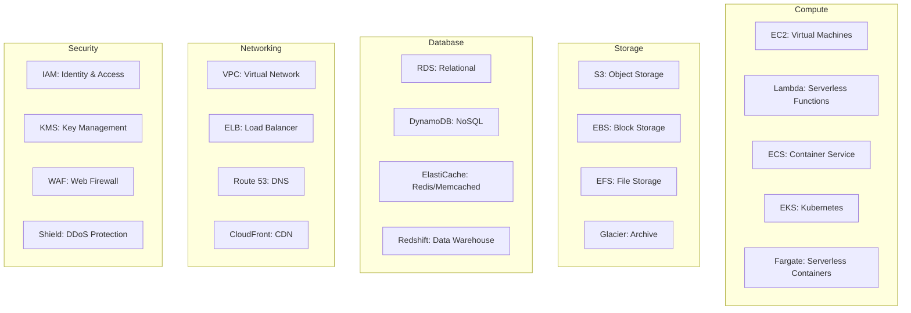
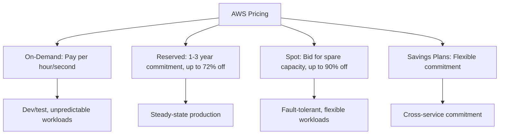

# AWS Services Overview

## Introduction

Amazon Web Services (AWS) is the largest cloud provider, offering 200+ services across compute, storage, database, networking, machine learning, and more. Understanding core AWS services is essential for cloud engineering and backend development interviews.

## AWS Global Infrastructure

```mermaid
graph TD
    AWS[AWS Global Infrastructure] --> REGIONS[33 Regions]
    REGIONS --> AZ[105 Availability Zones]
    AZ --> EDGE[600+ Edge Locations]

    REGIONS --> R1[us-east-1 (N. Virginia)]
    REGIONS --> R2[eu-west-1 (Ireland)]
    REGIONS --> R3[ap-southeast-1 (Singapore)]

    AZ --> A1[AZ-a: Datacenter 1]
    AZ --> A2[AZ-b: Datacenter 2]
    AZ --> A3[AZ-c: Datacenter 3]
```

## Core Services Map



## Service Deep Dives

- [EC2](./ec2.md) — Elastic Compute Cloud
- [S3](./s3.md) — Simple Storage Service
- [RDS](./rds.md) — Relational Database Service
- [Lambda](./lambda.md) — Serverless Functions
- [VPC](./vpc.md) — Virtual Private Cloud

## AWS Pricing Models



## Well-Architected Review

AWS recommends reviewing architectures against five pillars:
1. **Operational Excellence**: Automation, monitoring, incident response
2. **Security**: IAM, encryption, logging, network security
3. **Reliability**: Fault tolerance, auto-scaling, disaster recovery
4. **Performance Efficiency**: Right-sizing, caching, CDN
5. **Cost Optimization**: Reserved/spot instances, right-sizing, lifecycle policies

## Interview Questions

1. **Q: What is the difference between an AWS Region and an Availability Zone?**
   A: A Region is a geographic area (e.g., us-east-1) with multiple isolated datacenters. An Availability Zone is one or more datacenters within a region, with independent power, networking, and cooling. AZs are connected by low-latency links. Deploy across AZs for high availability.

2. **Q: When would you use Reserved vs Spot instances?**
   A: Reserved instances for steady-state production workloads (databases, core services) — commit 1-3 years for up to 72% savings. Spot instances for fault-tolerant, flexible workloads (batch processing, CI/CD) — up to 90% savings but can be interrupted.

3. **Q: How does AWS charge for S3?**
   A: S3 charges for: storage (per GB/month), requests (per 1000 PUT/GET requests), data transfer out (per GB), and transfer acceleration (optional). Storage costs vary by class (Standard: $0.023/GB, Glacier: $0.004/GB).

## Cross-References

- [EC2](./ec2.md) — Virtual machines
- [S3](./s3.md) — Object storage
- [RDS](./rds.md) — Managed databases
- [Lambda](./lambda.md) — Serverless
- [VPC](./vpc.md) — Networking
- [Cloud Overview](../overview.md) — Cloud fundamentals
