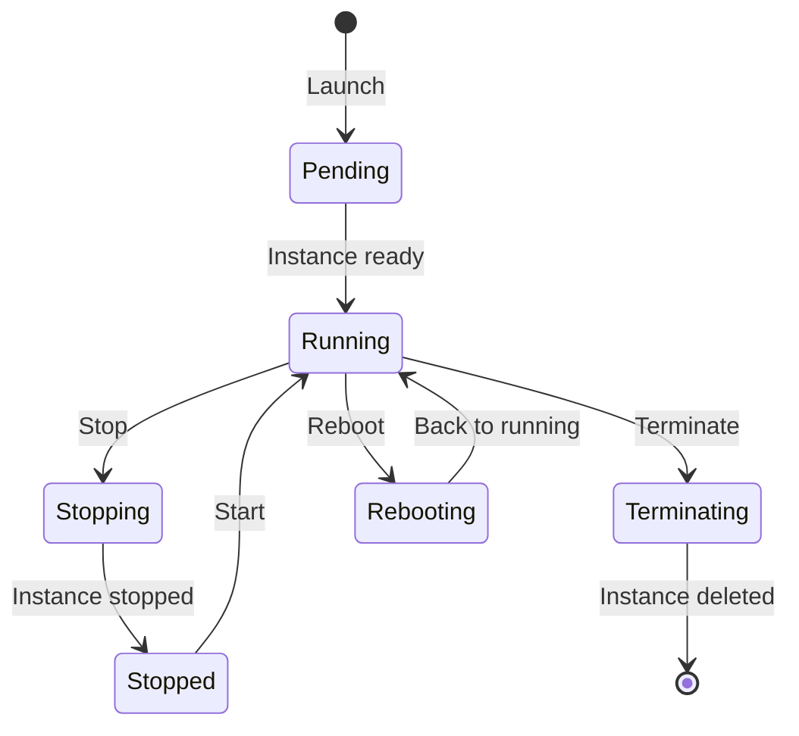
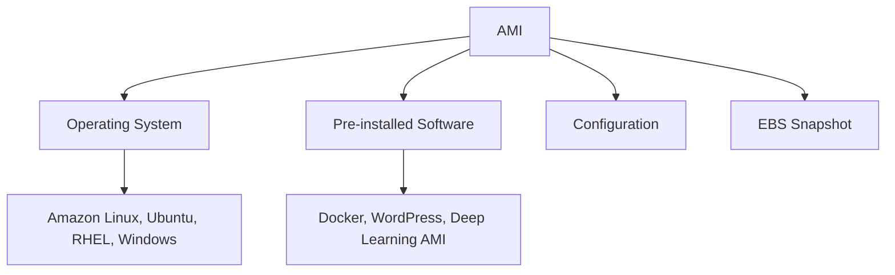
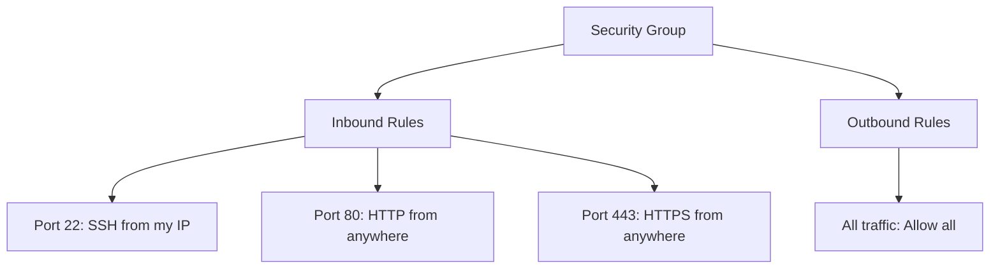
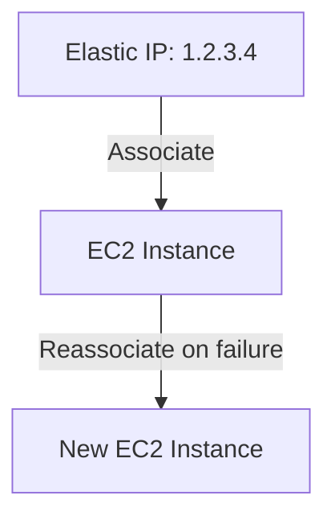
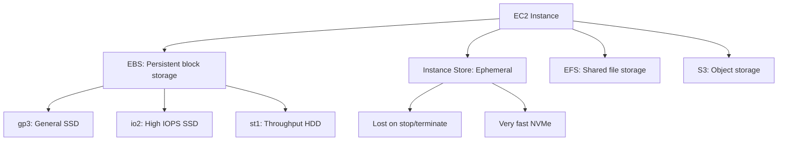
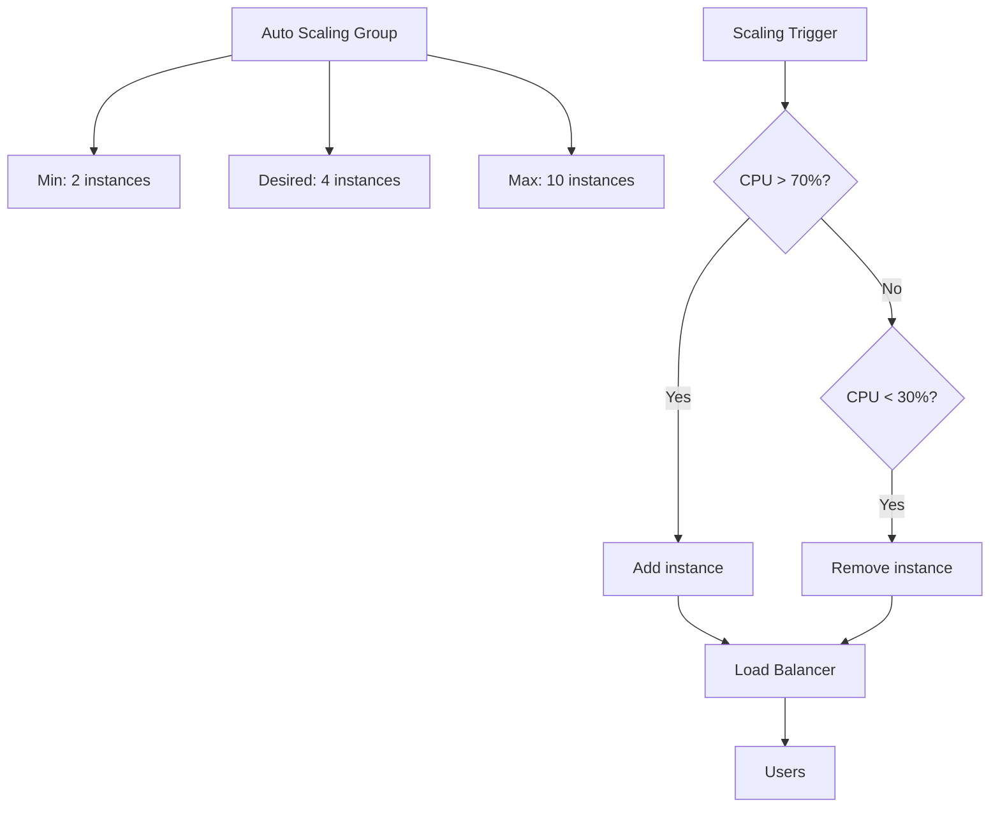
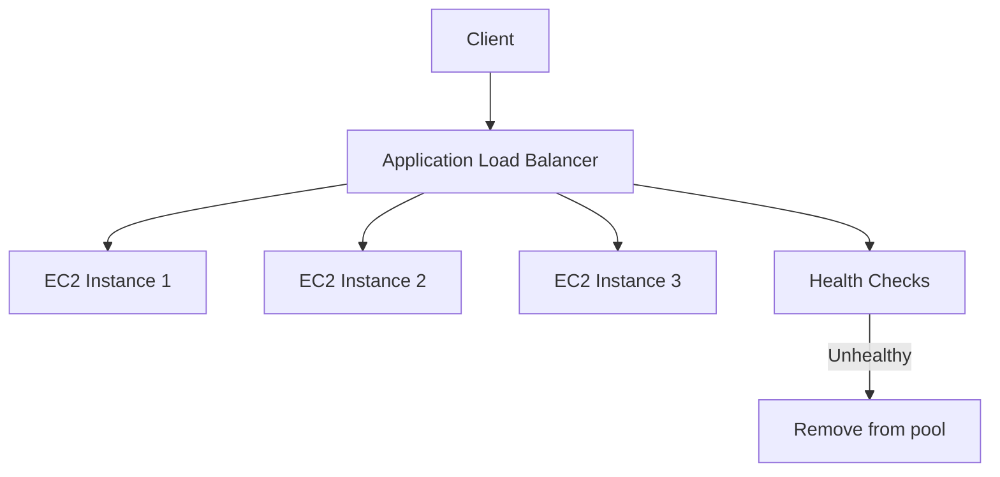

# AWS EC2 (Elastic Compute Cloud)

## Overview

EC2 is AWS's Infrastructure-as-a-Service (IaaS) offering — resizable virtual machines in the cloud. You choose the instance type, AMI (operating system), storage, and networking. EC2 is the backbone of AWS and a fundamental topic for any cloud interview.

## Core Concepts

### EC2 Instance Lifecycle



### Instance Types

```mermaid
graph TD
    TYPES[Instance Types] --> GENERAL[General Purpose]
    TYPES --> COMPUTE[Compute Optimized]
    TYPES --> MEMORY[Memory Optimized]
    TYPES --> STORAGE[Storage Optimized]
    TYPES --> ACCEL[Accelerated (GPU)]

    GENERAL --> G1[t3, m5, m6i]
    GENERAL --> G1D[Balanced CPU, memory, networking]

    COMPUTE --> C1[c5, c6i]
    COMPUTE --> C1D[Batch processing, scientific modeling]

    MEMORY --> M1[r5, r6i, x1e]
    MEMORY --> M1D[Databases, in-memory caches]

    STORAGE --> S1[i3, d2]
    STORAGE --> S1D[High sequential I/O, data warehousing]

    ACCEL --> A1[p3, g4, inf1]
    ACCEL --> A1D[ML training, graphics, video encoding]
```

| Family | Use Case | Example Specs |
|--------|----------|---------------|
| t3/t3a | Burstable, dev/test | 2 vCPU, 1 GB – 8 vCPU, 32 GB |
| m5/m6i | General purpose | 2-96 vCPU, 8-384 GB |
| c5/c6i | Compute intensive | 2-96 vCPU, 4-192 GB |
| r5/r6i | Memory intensive | 2-96 vCPU, 16-768 GB |
| i3/i4i | Storage intensive | 4-96 vCPU, 30-768 GB + NVMe |
| p3/p4 | GPU (ML training) | 8 GPUs, 32-640 GB GPU memory |
| g4 | GPU (inference, graphics) | 1-8 GPUs |

### AMI (Amazon Machine Image)



An AMI is a template for launching EC2 instances. Includes the OS, software, and configuration.

## Networking

### Security Groups



Security groups are virtual firewalls. They are stateful (return traffic automatically allowed).

### Elastic IP



A static public IP that can be remapped to different instances.

### Placement Groups

```mermaid
graph TD
    PG[Placement Groups] --> CLUSTER[Cluster: Same rack, lowest latency]
    PG --> SPREAD[Spread: Different racks, max availability]
    PG --> PARTITION[Partition: Grouped by rack, large distributed]

    CLUSTER --> USE1[HPC, tightly coupled apps]
    SPREAD --> USE2[Critical instances, max 7 per group]
    PARTITION --> USE3[Large distributed workloads (HDFS, HBase)]
```

## Storage Options



## Auto Scaling



### Launch Templates

```json
{
    "ImageId": "ami-0abcdef1234567890",
    "InstanceType": "t3.medium",
    "KeyName": "my-key",
    "SecurityGroupIds": ["sg-12345"],
    "BlockDeviceMappings": [{
        "DeviceName": "/dev/sda1",
        "Ebs": { "VolumeSize": 50, "VolumeType": "gp3" }
    }],
    "UserData": "#!/bin/bash\nyum install -y nginx"
}
```

## Load Balancing



| Load Balancer | Layer | Use Case |
|---------------|-------|----------|
| ALB (Application) | L7 (HTTP/HTTPS) | Web apps, path-based routing |
| NLB (Network) | L4 (TCP/UDP) | Ultra-low latency, static IP |
| GLB (Gateway) | L3 (IP) | Third-party virtual appliances |
| CLB (Classic) | L4/L7 | Legacy (deprecated) |

## Interview Questions

1. **Q: What is the difference between stopping and terminating an EC2 instance?**
   A: Stopping shuts down the instance but preserves EBS root volume data. The instance can be restarted. Terminating deletes the instance and (by default) its EBS root volume. Stopped instances don't incur compute charges but EBS storage charges continue.

2. **Q: What is the difference between Security Groups and NACLs?**
   A: Security Groups are stateful (return traffic automatically allowed), operate at the instance level, and support allow rules only. NACLs are stateless (must explicitly allow return traffic), operate at the subnet level, and support both allow and deny rules.

3. **Q: How does Auto Scaling work?**
   A: Auto Scaling Groups maintain a desired number of instances. CloudWatch alarms trigger scaling policies based on metrics (CPU, memory, request count). Scale-out adds instances; scale-in removes them. Health checks replace unhealthy instances automatically.

4. **Q: What is a Spot Instance and when would you use it?**
   A: Spot Instances use spare EC2 capacity at up to 90% discount. AWS can reclaim them with 2-minute warning. Use for fault-tolerant workloads: batch processing, CI/CD, data analysis, ML training. Don't use for databases or critical services.

5. **Q: What is EC2 Instance Store vs EBS?**
   A: Instance Store is ephemeral NVMe storage physically attached to the host. Data is lost when the instance stops or terminates. Very fast (direct NVMe). EBS is persistent network-attached block storage that survives instance stops. Use Instance Store for caches/temp data; EBS for persistent data.

## Common Mistakes

- Not using Auto Scaling — paying for peak capacity all the time.
- Using On-Demand for all instances — Reserved/Spot can save 50-90%.
- Not setting up health checks — unhealthy instances stay in the load balancer.
- Opening port 22 to 0.0.0.0/0 — security risk, use VPN or bastion host.
- Not using IAM roles for EC2 — hardcoding AWS credentials in code.

## Summary

EC2 provides resizable virtual machines with flexible instance types, storage options, networking, and auto-scaling. Key concepts: instance types (match workload), security groups (virtual firewall), EBS (persistent storage), Auto Scaling (elastic capacity), and load balancers (distribute traffic). For interviews, understand the instance lifecycle, pricing models, and how to design highly available EC2 architectures.

## Cross-References

- [VPC](./vpc.md) — EC2 networking
- [S3](./s3.md) — Object storage
- [RDS](./rds.md) — Database backend
- [Lambda](./lambda.md) — Serverless alternative
- [AWS Overview](./README.md) — All AWS services
