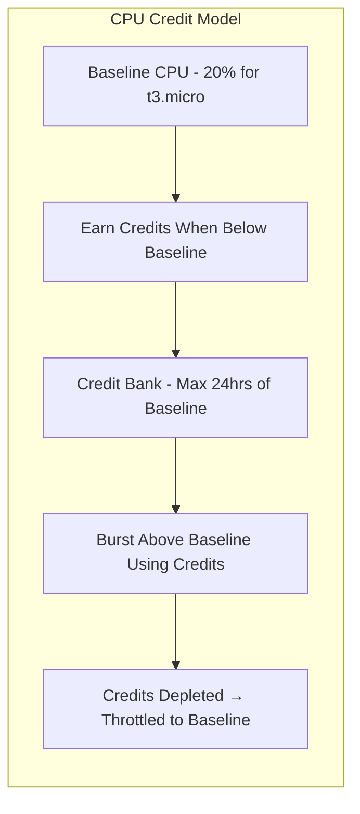
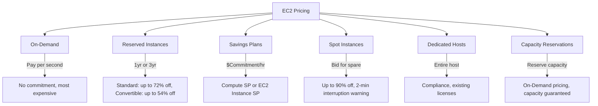
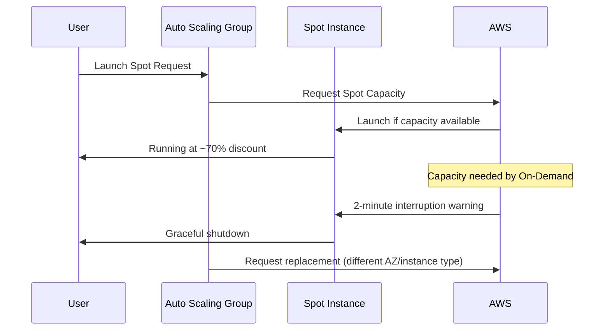
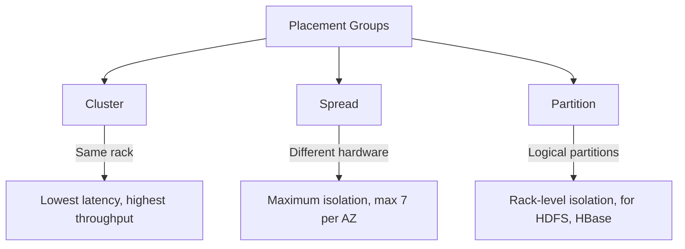
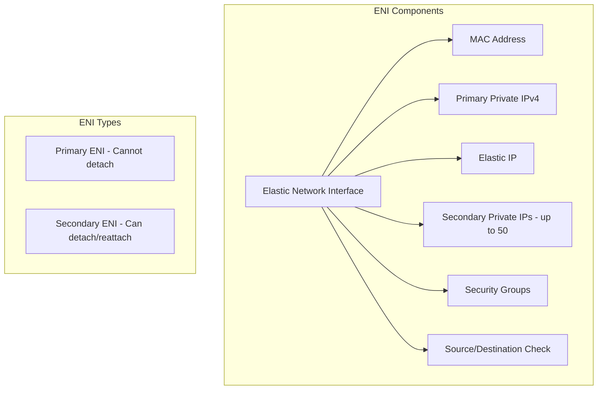
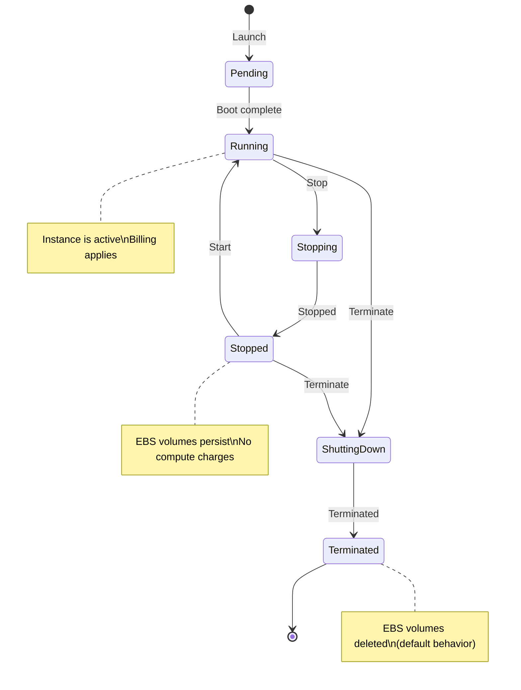
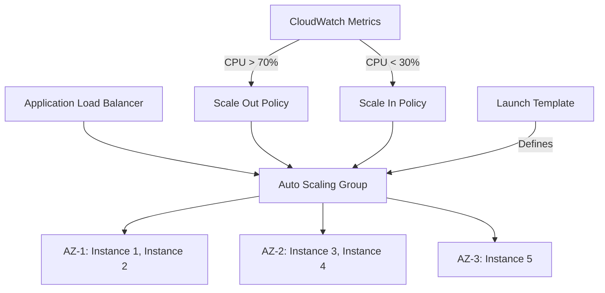

# Amazon EC2 (Elastic Compute Cloud)

## Introduction

Amazon EC2 provides resizable compute capacity in the cloud. It is the backbone of AWS's IaaS offering, allowing you to launch virtual servers (instances) with configurable CPU, memory, storage, and networking.

## EC2 Instance Types

Instance types are organized by family, each optimized for different workloads:

```mermaid
graph TB
    EC2[EC2 Instance Families] --> GENERAL[General Purpose]
    EC2 --> COMPUTE[Compute Optimized]
    EC2 --> MEMORY[Memory Optimized]
    EC2 --> STORAGE[Storage Optimized]
    EC2 --> ACCEL[Accelerated Computing]
    EC2 --> HPC[HPC Optimized]

    GENERAL --> T[T3/T3a - Burstable]
    GENERAL --> M[M5/M6i - Balanced]
    GENERAL --> A[A1 - ARM-based]

    COMPUTE --> C[C5/C6i - CPU Intensive]
    COMPUTE --> HPC2[Hpc6a - High Performance]

    MEMORY --> R[R5/R6i - Memory Intensive]
    MEMORY --> X[X1/X2 - SAP HANA]
    MEMORY --> Z[Z1d - High Memory + GHz]

    STORAGE --> I[I3/I4i - NVMe SSD]
    STORAGE --> D[D2/D3 - Dense HDD]

    ACCEL --> P[P4/P5 - GPU - ML Training]
    ACCEL --> G[G4/G5 - GPU - ML Inference]
    ACCEL --> INF[Inf1/Inf2 - AWS Inferentia]
    ACCEL --> TRN[Trn1 - AWS Trainium]
```



### Instance Type Naming Convention

```
m6i.2xlarge
│ │  │
│ │  └── Size (nano, micro, small, medium, large, xlarge, 2xlarge, ...)
│ └──── Generation (6 = 6th gen)
└────── Family (m = general purpose)
```

| Family | Use Case | Examples |
|--------|----------|----------|
| **T3/T3a** | Burstable workloads (web servers, dev/test) | t3.micro, t3.medium |
| **M5/M6i** | General purpose (web apps, small databases) | m5.large, m6i.xlarge |
| **C5/C6i** | Compute-intensive (batch processing, gaming) | c5.2xlarge, c6i.4xlarge |
| **R5/R6i** | Memory-intensive (caching, in-memory DBs) | r5.xlarge, r6i.2xlarge |
| **I3/I4i** | Storage-intensive (high sequential I/O) | i3.large, i4i.xlarge |
| **P4/P5** | GPU workloads (ML training, HPC) | p4d.24xlarge |
| **G4/G5** | GPU inference, graphics rendering | g4dn.xlarge |
| **Inf1/Inf2** | ML inference (AWS Inferentia chips) | inf1.xlarge |

### Burstable Instances (T3/T3a)



| Instance | vCPUs | Memory | Baseline CPU | Credits/Hour |
|----------|-------|--------|-------------|-------------|
| t3.micro | 2 | 1 GB | 20% | 24 |
| t3.small | 2 | 2 GB | 20% | 24 |
| t3.medium | 2 | 4 GB | 20% | 24 |
| t3.large | 2 | 8 GB | 30% | 36 |
| t3.xlarge | 4 | 16 GB | 40% | 96 |

**T3 Unlimited Mode**: Pay for extra credits when the bank is exhausted—prevents throttling but incurs charges.

## EC2 Pricing



### Spot Instances Deep Dive



**Spot Best Practices:**
- Use Spot Fleet with multiple instance types and AZs
- Implement graceful shutdown handlers (catch SIGTERM)
- Use Spot for stateless, fault-tolerant workloads (batch, CI/CD, ML training)
- Combine with On-Demand for baseline capacity

## EC2 Placement Groups

Control how instances are placed on underlying hardware:



| Strategy | Placement | Latency | Fault Tolerance | Max Instances |
|----------|-----------|---------|-----------------|---------------|
| **Cluster** | Same AZ, same rack | Lowest | Low (rack failure affects all) | No hard limit |
| **Spread** | Different physical hardware | Higher | High (hardware isolation) | 7 per AZ per group |
| **Partition** | Logical partitions (racks) | Moderate | Partition-level isolation | 100s per partition |

**When to use:**
- **Cluster**: HPC, ML training, tightly coupled applications requiring low latency
- **Spread**: Critical instances that must be on different hardware (domain controllers, ZooKeeper)
- **Partition**: Large distributed systems (HDFS, HBase, Kafka) where partition awareness matters

## Elastic Network Interfaces (ENIs)



**ENI Use Cases:**
1. **Dual-homed instances**: Instance in two subnets (management + production)
2. **Failover**: Move ENI from failed instance to standby instance
3. **MAC-based licensing**: Software licensed to specific MAC address
4. **Low-budget HA**: Create standby instance, attach ENI on failure

```bash
# Create an ENI
aws ec2 create-network-interface \
    --subnet-id subnet-0123456789abcdef0 \
    --description "Secondary ENI" \
    --groups sg-0123456789abcdef0

# Attach ENI to instance
aws ec2 attach-network-interface \
    --network-interface-id eni-0123456789abcdef0 \
    --instance-id i-0123456789abcdef0 \
    --device-index 1
```

## EC2 Instance Lifecycle



| State | Compute Charges | EBS Volumes | Public IP |
|-------|----------------|-------------|-----------|
| **Running** | Yes | Attached | Retained (if Elastic IP) |
| **Stopped** | No | Attached | Released (unless Elastic IP) |
| **Terminated** | No | Deleted (default) | Released |

## EC2 Purchase Options Comparison

| Feature | On-Demand | Reserved | Spot | Dedicated Host |
|---------|-----------|----------|------|----------------|
| **Discount** | None | Up to 72% | Up to 90% | Varies |
| **Commitment** | None | 1-3 years | None | None |
| **Interruption** | No | No | Yes (2-min warning) | No |
| **Predictability** | High | Highest | Low | Highest |
| **Use Case** | Short-term, variable | Steady-state | Fault-tolerant batch | Compliance, licensing |

## Auto Scaling Groups (ASG)



**ASG Configuration:**
- **Min Size**: Minimum number of instances
- **Desired Capacity**: Target number (between min and max)
- **Max Size**: Maximum number of instances
- **Scaling Policies**: Target tracking, step scaling, simple scaling
- **Health Checks**: EC2 status checks, ELB health checks, custom checks

**Scaling Policies:**

| Policy Type | How It Works | Best For |
|------------|--------------|----------|
| **Target Tracking** | Maintain a target metric (e.g., CPU at 50%) | Simple, most common |
| **Step Scaling** | Scale based on CloudWatch alarm thresholds | Fine-grained control |
| **Simple Scaling** | Single adjustment per alarm | Legacy, less flexible |
| **Scheduled Scaling** | Scale at specific times | Predictable traffic patterns |
| **Predictive Scaling** | ML-based forecast of traffic | Recurring patterns |

## EC2 Best Practices

1. **Right-size instances**: Use AWS Compute Optimizer to find optimal instance types
2. **Use Spot for stateless workloads**: Combine with On-Demand for baseline
3. **Enable termination protection**: Prevent accidental termination of critical instances
4. **Use IMDSv2**: Prevent SSRF attacks on instance metadata service
5. **Encrypt EBS volumes**: Default encryption at rest
6. **Use placement groups strategically**: Cluster for latency, spread for isolation
7. **Tag everything**: Cost allocation, automation, access control

## Interview Questions

### Q1: What are the different EC2 instance types and when would you use each?
**Answer**: EC2 families are optimized for different workloads: T3 (burstable, web servers), M5 (general purpose, balanced), C5 (compute-intensive, batch processing), R5 (memory-intensive, caching), I3 (storage-intensive, databases), P4/G5 (GPU, ML training/inference). Choose based on your bottleneck: CPU-bound → C5, memory-bound → R5, I/O-bound → I3, cost-sensitive → T3 for variable workloads.

### Q2: Explain EC2 Spot Instances and how to handle interruptions.
**Answer**: Spot Instances use spare EC2 capacity at up to 90% discount but can be interrupted with a 2-minute warning when AWS needs the capacity. To handle interruptions: (1) Use Spot Fleet with diversified instance types/AZs, (2) Implement graceful shutdown handlers (catch SIGTERM), (3) Check for interruption notices via instance metadata, (4) Use checkpointing for long-running jobs, (5) Combine with On-Demand for baseline. Best for stateless, fault-tolerant workloads.

### Q3: What are EC2 Placement Groups and when would you use each type?
**Answer**: Placement groups control instance placement: Cluster places instances close together (same rack) for lowest latency—use for HPC, tightly coupled apps. Spread places instances on distinct hardware for maximum isolation—use for critical instances (max 7 per AZ). Partition groups instances into logical partitions on separate racks—use for distributed systems (HDFS, HBase) that need partition awareness.

### Q4: What is an ENI and what are its use cases?
**Answer**: An Elastic Network Interface is a virtual network card with a MAC address, private IP, security groups, and source/dest check setting. Use cases: (1) Dual-homed instances in multiple subnets, (2) Failover—detach from failed instance, attach to standby, (3) MAC-based licensing, (4) Management network separate from production. Each instance has a primary ENI (cannot detach) and can have secondary ENIs.

### Q5: How does Auto Scaling work in EC2?
**Answer**: Auto Scaling Groups (ASGs) maintain desired instance count across AZs. Scaling policies adjust capacity: Target Tracking maintains a metric target (e.g., CPU at 50%), Step Scaling adjusts based on alarm thresholds, Scheduled Scaling changes at predetermined times. ASGs use Launch Templates to define instance configuration. Health checks (EC2 status or ELB) replace unhealthy instances automatically. Always span multiple AZs for HA.

## Common Mistakes

1. **Choosing instances by vCPU count alone**: Consider memory, network, and storage requirements too
2. **Not using Spot for batch workloads**: Missing 70-90% cost savings
3. **Single-AZ Auto Scaling Groups**: Defeats the purpose of high availability
4. **Ignoring instance metadata security**: Not enforcing IMDSv2 allows SSRF attacks
5. **Not monitoring credit balance on T3 instances**: Unexpected throttling when credits run out
6. **Forgetting to terminate instances**: Especially in dev/test environments—use auto-scaling with min=0
7. **Using public IPs for inter-instance communication**: Use private IPs and VPC peering instead

## Summary

| Concept | Key Takeaway |
|---------|-------------|
| **Instance Types** | Match workload to instance family (compute, memory, storage, GPU) |
| **Pricing** | Mix On-Demand + Reserved/Savings + Spot for optimal cost |
| **Placement Groups** | Cluster (latency), Spread (isolation), Partition (distributed systems) |
| **ENIs** | Virtual network cards for failover, multi-subnet, and MAC licensing |
| **Auto Scaling** | Maintain desired capacity, scale with demand, span AZs |
| **Spot** | Up to 90% off, 2-min warning, use for fault-tolerant workloads |

## Cross-References

- **VPC**: [Networking](./vpc.md) — Where EC2 instances live
- **EBS**: Block storage attached to EC2
- **S3**: [Object Storage](./s3.md) — Store and retrieve data
- **Lambda**: [Serverless](./lambda.md) — Alternative to always-on EC2
- **Kubernetes**: [EKS](../kubernetes/README.md) — EC2 as Kubernetes nodes
- **Cloud Overview**: [Pricing Models](../overview.md) — AWS pricing in context
